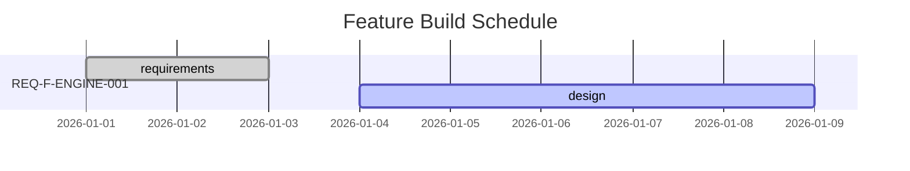

# /gen-status - Project Situational Awareness

Provides a "You Are Here" visualization of the Asset Graph. The dashboard is `viewable` and `renderable` in the browser. `events.jsonl` is the `source of truth` for all derived views via `event sourcing`.

<!-- Implements: REQ-UX-003, REQ-UX-005, REQ-TOOL-003 -->

## Flags

- `--health`: Run interoceptive health checks and report workspace integrity status.
- `--gantt`: Generate a Mermaid Gantt chart of feature trajectory timestamps. Write chart to `STATUS.md` in a renderable section.
- `--feature <REQ-KEY>`: Show detailed status for a specific feature vector.

## Instructions

1. `Step 0`: `State Detection` of project state from `events.jsonl` using `event sourcing` logic.
2. Preview `What Start Would Do` next (`Start would` select edge).
3. Write `STATUS.md` with sections:
    - `Phase Completion Summary` (table with `Convergence Pattern` subsection)
    - `Traceability Coverage`
    - `Process Telemetry` (including `Constraint Surface` subsection)
    - `Self-Reflection` (`Feedback` loop to Intent with `TELEM-` signals)
4. Define the `Event Schema` for all derived views including `iteration_completed`.
5. Display `Constraint Dimensions` with `resolved` indicators and links to `ADR-` docs. Acknowledge `advisory` dimensions.

## Gantt Output (--gantt)

Generate a Mermaid Gantt chart mapping feature trajectory statuses to Gantt task states. Write the chart to `.ai-workspace/STATUS.md` so it is viewable and renderable in the browser.

Status → Gantt state mapping:
- `converged` → `:done`
- `iterating` → `:active`
- `blocked` → `:crit`

Example:

The telemetry loop closes when STATUS.md is written and the Self-Reflection section feeds back to new Intent.
