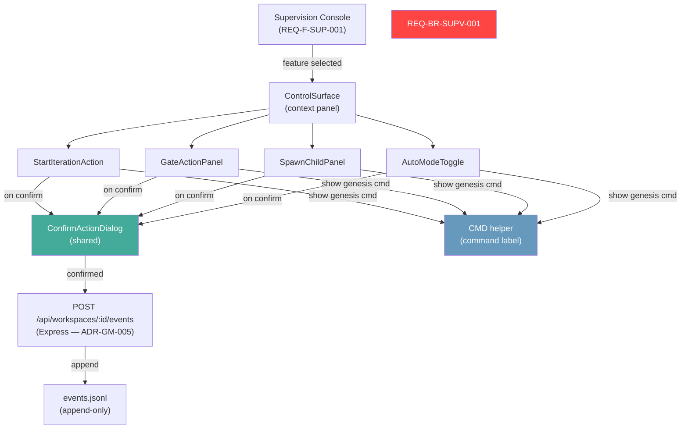
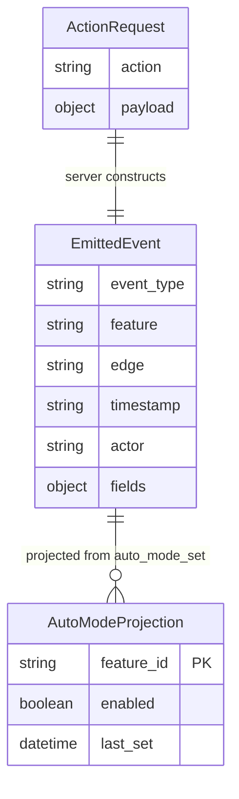

# Design — REQ-F-CTL-001: Control Surface
# Implements: REQ-F-CTL-001, REQ-F-CTL-002, REQ-F-CTL-003, REQ-F-CTL-004

**Version**: 0.1.0
**Date**: 2026-03-13
**Edge**: requirements→design
**Phase**: 4 (final MVP — depends on SUP-001 supervision surface)
**Tenant**: react_vite

---

## Architecture Overview

The Control Surface is an **action layer** that sits on top of the Supervision Console (REQ-F-SUP-001). It does not introduce a new route — it is context-panel behaviour that appears when the user selects a feature in the Supervision view and explicitly invokes an action. All writes go through the Express server's write endpoint (ADR-GM-005) and are gated by a confirmation dialog.

REQ-BR-SUPV-001 compliance is a hard architectural constraint: genesis_manager has **no background process** that invokes Genesis commands. Every write to `events.jsonl` is the direct consequence of a confirmed user action. Auto-mode (REQ-F-CTL-004) is a per-feature flag persisted as an `auto_mode_set` event — it is always visible in the Supervision view and can be disabled by the user at any time.



**Write protocol (ADR-GM-005)**: `POST /api/workspaces/:id/events` with a `{ action, payload }` body. The server constructs the full event JSON (including `timestamp`, `event_type`, and all required fields), acquires a file lock via `proper-lockfile`, appends to `events.jsonl`, and returns the written event. The client never constructs the raw event object.

---

## Component Design

### Component: ControlSurface
**Implements**: REQ-F-CTL-001, REQ-F-CTL-002, REQ-F-CTL-003, REQ-F-CTL-004, REQ-F-UX-002
**Responsibilities**:
- Context panel that renders when a feature is selected in the Supervision view
- Selects which action panels are available based on feature state
- Passes `workspaceId` and `featureId` down to all action panels
- Does not appear or take action when no feature is selected
**Interfaces**:
```typescript
interface ControlSurfaceProps {
  workspaceId: string
  feature: FeatureSummary          // from Supervision store
  onActionComplete: () => void      // triggers Supervision refresh
}
```
**Dependencies**: StartIterationAction, GateActionPanel, SpawnChildPanel, AutoModeToggle, useControlStore

---

### Component: StartIterationAction
**Implements**: REQ-F-CTL-001, REQ-F-UX-002
**Responsibilities**:
- Displays a feature + edge selector (edge dropdown populated from graph topology for the selected feature)
- Start button is **disabled** when: feature is `converged`, feature is `blocked` by an unresolved dependency, or no edge is selected
- Disabled state shows tooltip explaining why (converged / blocked)
- Uses CMD helper to show `gen-start --feature {id}` as an informational label beneath the button
- On click: opens ConfirmActionDialog; on confirm: POSTs `iteration_requested` action
**Interfaces**:
```typescript
interface StartIterationActionProps {
  workspaceId: string
  feature: FeatureSummary
  onComplete: () => void
}
```
**Event emitted** (server constructs):
```json
{
  "event_type": "iteration_requested",
  "feature": "<feature_id>",
  "edge": "<selected_edge>",
  "timestamp": "<ISO-8601>",
  "actor": "human"
}
```
**Disabled conditions**:
- `feature.status === 'converged'`
- `feature.status === 'blocked' && feature.blockReason !== 'human_gate'`
- `selectedEdge === null`
**Dependencies**: ConfirmActionDialog, CMD, WorkspaceApiClient (write), graph topology store

---

### Component: GateActionPanel
**Implements**: REQ-F-CTL-002, REQ-BR-SUPV-002
**Responsibilities**:
- Renders for features where `feature.pendingGates.length > 0`
- For each pending gate: shows gate name, edge, and age
- Approve button: opens ConfirmActionDialog; on confirm: POSTs `review_approved` with `decision=approved`
- Reject button: opens ConfirmActionDialog with comment field; confirm button **disabled** until comment is non-empty; on confirm: POSTs `review_approved` with `decision=rejected` and `comment`
- Only renders when the gate is in `pending` state — converged/resolved gates are not shown
- CMD helper shows `gen-review --approve {feature} --gate {gate_name}` or `--reject` equivalent
**Interfaces**:
```typescript
interface GateActionPanelProps {
  workspaceId: string
  feature: FeatureSummary
  gate: HumanGate
  onComplete: () => void
}

interface HumanGate {
  gateName: string
  edge: string
  pendingSince: Date
  status: 'pending' | 'resolved'
}
```
**Event emitted** (server constructs):
```json
{
  "event_type": "review_approved",
  "feature": "<feature_id>",
  "edge": "<edge>",
  "gate_name": "<gate_name>",
  "decision": "approved | rejected",
  "comment": "<required if rejected, optional if approved>",
  "timestamp": "<ISO-8601>",
  "actor": "human"
}
```
**Validation**:
- Reject path: comment field must be non-empty before confirm is enabled
- Available only when `gate.status === 'pending'`
**Dependencies**: ConfirmActionDialog, CMD, WorkspaceApiClient (write)

---

### Component: SpawnChildPanel
**Implements**: REQ-F-CTL-003
**Responsibilities**:
- Type selector: `discovery | spike | poc | hotfix` (shadcn/ui Select)
- Parent feature pre-populated from selected feature; user can override
- Reason field (text input): confirm button disabled until non-empty
- CMD helper shows `gen-spawn --type {type} --parent {feature} --reason "{reason}"`
- On confirm: POSTs `spawn_requested` action
**Interfaces**:
```typescript
interface SpawnChildPanelProps {
  workspaceId: string
  parentFeature: FeatureSummary
  onComplete: () => void
}

type ChildVectorType = 'discovery' | 'spike' | 'poc' | 'hotfix'
```
**Event emitted** (server constructs):
```json
{
  "event_type": "spawn_requested",
  "parent_feature": "<feature_id>",
  "child_type": "discovery | spike | poc | hotfix",
  "reason": "<non-empty string>",
  "timestamp": "<ISO-8601>",
  "actor": "human"
}
```
**Validation**:
- `reason` must be non-empty before confirm is enabled
- `childType` must be selected
**Dependencies**: ConfirmActionDialog, CMD, WorkspaceApiClient (write)

---

### Component: AutoModeToggle
**Implements**: REQ-F-CTL-004, REQ-BR-SUPV-001
**Responsibilities**:
- Toggle (shadcn/ui Switch) displaying current auto-mode state for the selected feature
- **Visible in the Supervision view** for each feature row — not hidden in the context panel only
- When toggling ON: opens ConfirmActionDialog with explicit warning ("Auto-mode will continuously iterate until a human gate is reached"); on confirm: POSTs `auto_mode_set{enabled: true}`
- When toggling OFF: no dialog required; POSTs `auto_mode_set{enabled: false}` immediately (disabling is non-destructive)
- CMD helper shows `gen-auto --feature {id} --enable` or `--disable`
- The toggle state is derived from events — the most recent `auto_mode_set` event for the feature determines current state
**Interfaces**:
```typescript
interface AutoModeToggleProps {
  workspaceId: string
  featureId: string
  currentlyEnabled: boolean   // derived from event projection
  onComplete: () => void
}
```
**Event emitted** (server constructs):
```json
{
  "event_type": "auto_mode_set",
  "feature": "<feature_id>",
  "enabled": true | false,
  "timestamp": "<ISO-8601>",
  "actor": "human"
}
```
**REQ-BR-SUPV-001 compliance (explicit)**:
- genesis_manager has no background process that invokes `gen-start` or `gen-iterate`
- Auto-mode is a signal in the event stream — it is visible state, not a hidden process
- The toggle is always visible in the Supervision feature row so the user can see and disable it at a glance
- Disabling auto-mode pauses after the current iteration completes (the server-side Genesis process reads the event stream; genesis_manager does not control iteration timing directly)
**Dependencies**: ConfirmActionDialog, CMD, WorkspaceApiClient (write)

---

### Component: ConfirmActionDialog
**Implements**: REQ-F-CTL-001..004, REQ-F-UX-002, REQ-DATA-WORK-002
**Responsibilities**:
- Shared confirmation wrapper for all write actions
- Shows: action summary, Genesis command equivalent (from CMD), optional comment field (for rejection), confirm and cancel buttons
- Confirm executes the POST; cancel closes without side effect
- Emits a client-side log entry after every successful write: `{timestamp, action_type, workspace_path}`
- On POST error: shows inline error message; does not close
**Interfaces**:
```typescript
interface ConfirmActionDialogProps {
  isOpen: boolean
  title: string
  commandLabel: string          // from CMD helper
  requireComment?: boolean      // true for gate rejection
  comment?: string
  onCommentChange?: (v: string) => void
  onConfirm: () => Promise<void>
  onCancel: () => void
  warningMessage?: string       // e.g. auto-mode warning
}
```
**Dependencies**: shadcn/ui Dialog, Button; CMD

---

### Component: CMD (CommandLabel helper)
**Implements**: REQ-F-UX-002
**Responsibilities**:
- Pure display component — renders the Genesis command equivalent for an action
- Takes a command string and renders it as a styled `<code>` block
- No interactivity
**Interfaces**:
```typescript
interface CMDProps {
  command: string    // e.g. "gen-start --feature REQ-F-AUTH-001"
}
```
**Dependencies**: Tailwind CSS (monospace styling)

---

### Component: Express Write Endpoint (server/routes/events.ts)
**Implements**: REQ-DATA-WORK-002, ADR-GM-005
**Responsibilities**:
- `POST /api/workspaces/:id/events` — accepts `{ action: string, payload: object }`
- Constructs full event JSON from action type + payload + server-generated `timestamp`
- Acquires file lock on `events.jsonl` via `proper-lockfile`
- Appends event as a single JSON line; releases lock
- Returns `{ event }` with the written event
- Logs every write: `{timestamp, action, workspace_path, event_type}`
- Returns 400 for unknown action types or invalid payloads
- Returns 409 if lock cannot be acquired within timeout
**Action-to-event mapping**:

| action | event_type emitted |
|--------|--------------------|
| `start_iteration` | `iteration_requested` |
| `approve_gate` | `review_approved` (decision=approved) |
| `reject_gate` | `review_approved` (decision=rejected) |
| `spawn_child` | `spawn_requested` |
| `set_auto_mode` | `auto_mode_set` |

**Dependencies**: Express, `proper-lockfile`, Node.js fs

---

## Data Model

### Auto-Mode State (events as source of truth)

Auto-mode state is **derived from the event stream**, not stored in feature vector YAML. The most recent `auto_mode_set` event for a given `feature` determines whether auto-mode is enabled.

```
auto_mode_enabled(feature_id) =
  last event where event_type == "auto_mode_set" AND feature == feature_id
  → event.enabled  (true | false)
  → absent = false (default off)
```

This satisfies REQ-DATA-WORK-001 (all state from event stream), REQ-DATA-WORK-002 (no background writes), and REQ-BR-SUPV-001 (no hidden state).



### ControlStore (Zustand — client-side)

```typescript
interface ControlStore {
  selectedFeatureId: string | null
  pendingAction: ActionRequest | null
  lastWriteLog: WriteLogEntry[]

  selectFeature: (id: string | null) => void
  setPendingAction: (action: ActionRequest | null) => void
  submitAction: (workspaceId: string) => Promise<EmittedEvent>
  clearPendingAction: () => void
}

interface WriteLogEntry {
  timestamp: Date
  action_type: string
  workspace_path: string
  event_type: string
}
```

---

## Traceability Matrix

| REQ Key | Component(s) |
|---------|-------------|
| REQ-F-CTL-001 | StartIterationAction, ConfirmActionDialog, Express Write Endpoint |
| REQ-F-CTL-002 | GateActionPanel, ConfirmActionDialog, Express Write Endpoint |
| REQ-F-CTL-003 | SpawnChildPanel, ConfirmActionDialog, Express Write Endpoint |
| REQ-F-CTL-004 | AutoModeToggle, ConfirmActionDialog, Express Write Endpoint, ControlStore (projection) |
| REQ-BR-SUPV-001 | AutoModeToggle (visibility invariant), ControlSurface (no background execution), ConfirmActionDialog (explicit confirmation gate) |
| REQ-BR-SUPV-002 | GateActionPanel (renders in Supervision above feature list), ControlSurface (gate panel first) |
| REQ-DATA-WORK-002 | Express Write Endpoint (writes only on POST), ConfirmActionDialog (write only on confirm), ControlStore (no background writes) |

---

## ADR Index

| ADR | Decision | Status |
|-----|----------|--------|
| ADR-GM-001 | State management: Zustand | RESOLVED |
| ADR-GM-002 | Workspace access: local Express server | RESOLVED |
| ADR-GM-003 | Component library: Tailwind CSS + shadcn/ui | RESOLVED |
| ADR-GM-004 | Router: React Router 6 | RESOLVED |
| ADR-GM-005 | Write protocol: POST /api/workspaces/:id/events with proper-lockfile | RESOLVED |

See `adrs/` for full ADR documents.

---

## Package / Module Structure

```
genesis_manager/
├── imp_react_vite/
│   ├── src/
│   │   ├── api/
│   │   │   └── WorkspaceApiClient.ts        # extended: write actions (Implements: REQ-DATA-WORK-002)
│   │   ├── stores/
│   │   │   ├── projectStore.ts              # existing
│   │   │   └── controlStore.ts             # Zustand — selected feature, pending action, write log
│   │   ├── pages/
│   │   │   └── SupervisionPage.tsx          # extended: AutoModeToggle per row, ControlSurface panel
│   │   ├── components/
│   │   │   ├── control/
│   │   │   │   ├── ControlSurface.tsx       # Implements: REQ-F-CTL-001..004
│   │   │   │   ├── StartIterationAction.tsx # Implements: REQ-F-CTL-001
│   │   │   │   ├── GateActionPanel.tsx      # Implements: REQ-F-CTL-002
│   │   │   │   ├── SpawnChildPanel.tsx      # Implements: REQ-F-CTL-003
│   │   │   │   ├── AutoModeToggle.tsx       # Implements: REQ-F-CTL-004
│   │   │   │   └── ConfirmActionDialog.tsx  # Shared — all write actions
│   │   │   └── shared/
│   │   │       └── CMD.tsx                  # CommandLabel helper (Implements: REQ-F-UX-002)
│   │   └── types/
│   │       └── control.ts                  # ActionRequest, EmittedEvent, WriteLogEntry
│   ├── server/
│   │   ├── index.ts                         # existing
│   │   ├── routes/
│   │   │   ├── workspaces.ts                # existing (reads)
│   │   │   └── events.ts                   # NEW: POST /api/workspaces/:id/events
│   │   └── readers/
│   │       ├── workspaceReader.ts           # existing
│   │       └── eventWriter.ts              # NEW: file-lock + append logic (Implements: ADR-GM-005)
│   ├── package.json
│   ├── vite.config.ts
│   └── tsconfig.json
```

---

## Integration Points

**Supervision integration**: `SupervisionPage.tsx` renders `AutoModeToggle` inline in each feature row (satisfying the visibility requirement of REQ-BR-SUPV-001). When a feature row is selected, `ControlSurface` opens as a side panel or bottom drawer (layout decision deferred to implementation).

**Write endpoint startup**: `server/routes/events.ts` is registered in `server/index.ts` alongside the existing workspace read routes. No separate process.

**Polling continuity**: After a successful write, `onActionComplete()` triggers a Supervision store refresh (same 30s polling path as REQ-F-UX-001 — no special write-response path needed).
