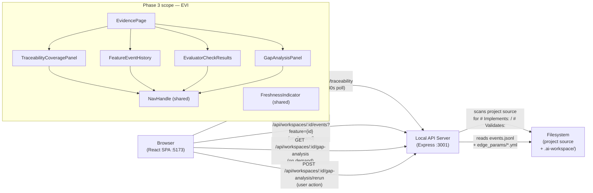
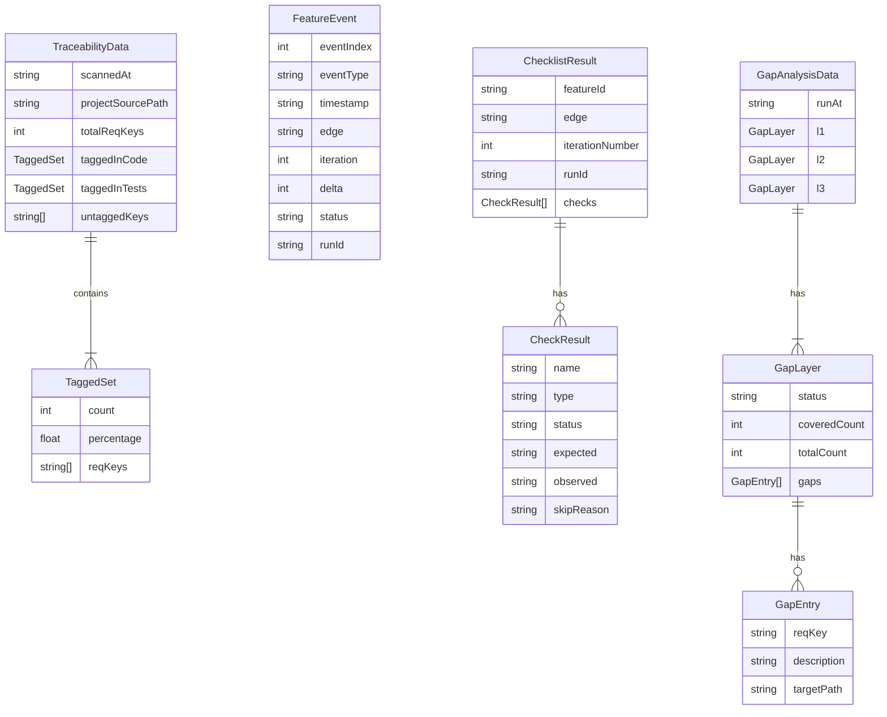

# Design — REQ-F-EVI-001: Evidence Work Area
# Implements: REQ-F-EVI-001, REQ-F-EVI-002, REQ-F-EVI-003, REQ-F-EVI-004

**Version**: 0.1.0
**Date**: 2026-03-13
**Edge**: requirements→design
**Phase**: 3 (no dependencies on Phase 2 deliverables beyond shared patterns)
**Tenant**: react_vite

---

## Architecture Overview

The Evidence page answers "Why should I trust the current status?" It presents four panels: traceability coverage (source code scan), feature event history, evaluator check results, and gap analysis. The traceability coverage panel requires a dedicated server-side scan endpoint because the browser cannot directly scan source files for `# Implements:` / `# Validates:` tags.



**Panel layout**: The Evidence page uses a two-column layout. Left column: TraceabilityCoveragePanel (top) + GapAnalysisPanel (below). Right column: FeatureEventHistory (top, requires feature selection) + EvaluatorCheckResults (below, shows results for the selected feature's most recent iteration). A feature selector at the top of the right column drives both right-column panels.

---

## Component Design

### Component: EvidencePage
**Implements**: REQ-F-EVI-001, REQ-F-EVI-002, REQ-F-EVI-003, REQ-F-EVI-004
**Responsibilities**:
- Two-column layout
- Manage `selectedFeatureId` state (drives FEH + ECR panels)
- Show FreshnessIndicator in header
- Load traceability data and gap analysis on mount + 30s poll
- Feature selector dropdown: lists all active features
**Interfaces**:
```typescript
export function EvidencePage(): JSX.Element
// Internal state: selectedFeatureId: string | null
```
**Dependencies**: useProjectStore, TraceabilityCoveragePanel, FeatureEventHistory, EvaluatorCheckResults, GapAnalysisPanel, FreshnessIndicator

---

### Component: TraceabilityCoveragePanel
**Implements**: REQ-F-EVI-001
**Responsibilities**:
- Display traceability coverage summary from `GET /api/workspaces/:id/traceability`
- Show: total REQ keys, tagged in code (count + %), tagged in tests (count + %), untagged REQ keys list
- Each untagged REQ key rendered as NavHandle → `/req/{reqKey}` (REQ-F-EVI-001 AC3)
- Progress bars for code and test coverage percentages
- FreshnessIndicator showing when the scan was last run
**Interfaces**:
```typescript
interface TraceabilityCoveragePanelProps {
  data: TraceabilityData | null
  loading: boolean
  error: string | null
}

interface TraceabilityData {
  scannedAt: string               // ISO 8601
  projectSourcePath: string       // absolute path that was scanned
  totalReqKeys: number
  taggedInCode: TaggedSet
  taggedInTests: TaggedSet
  untaggedKeys: string[]          // REQ-* keys with no Implements or Validates tag
}

interface TaggedSet {
  count: number
  percentage: number
  reqKeys: string[]
}
```
**Dependencies**: NavHandle, shadcn/ui Progress, Card, Badge, FreshnessIndicator

---

### Component: FeatureEventHistory
**Implements**: REQ-F-EVI-002
**Responsibilities**:
- Show all events where `feature === selectedFeatureId`, chronological order
- Each row: event_type, timestamp, edge, iteration, δ, status
- Each row is NavHandle → `/event/{eventIndex}` (REQ-F-EVI-002 AC3)
- "Select a feature to view its history" placeholder when no feature selected
- Updates within 30s via useWorkspacePoller (REQ-F-EVI-002 AC4)
- Virtual list rendering for large event histories (>100 events)
**Interfaces**:
```typescript
interface FeatureEventHistoryProps {
  featureId: string | null
  events: FeatureEvent[]
  loading: boolean
}

interface FeatureEvent {
  eventIndex: number       // line index in events.jsonl — stable identifier
  eventType: string
  timestamp: string        // ISO 8601
  edge: string | null
  iteration: number | null
  delta: number | null
  status: string | null
  runId: string | null
}
```
**Dependencies**: NavHandle, shadcn/ui Table, dayjs

---

### Component: EvaluatorCheckResults
**Implements**: REQ-F-EVI-003
**Responsibilities**:
- Show pass/fail/skip for every check in the effective checklist for the most recent `iteration_completed` event of `selectedFeatureId`
- Failed checks: check name, type (F_D/F_P/F_H), expected behaviour, observed behaviour (REQ-F-EVI-003 AC2)
- Skipped checks: check name + reason (REQ-F-EVI-003 AC3)
- Passed checks: check name + type badge (green)
- Source: `iteration_completed.checks` field of the most recent event for this feature+edge
- "No iteration data yet" placeholder when no iteration_completed events exist
**Interfaces**:
```typescript
interface EvaluatorCheckResultsProps {
  featureId: string | null
  results: ChecklistResult | null
  loading: boolean
}

interface ChecklistResult {
  featureId: string
  edge: string
  iterationNumber: number
  runId: string | null
  checks: CheckResult[]
}

interface CheckResult {
  name: string
  type: 'F_D' | 'F_P' | 'F_H'
  status: 'pass' | 'fail' | 'skip'
  expected?: string
  observed?: string
  skipReason?: string
}
```
**Dependencies**: NavHandle, shadcn/ui Table, Badge (colour-coded by type + status)

---

### Component: GapAnalysisPanel
**Implements**: REQ-F-EVI-004
**Responsibilities**:
- Show most recent gap analysis results: L1 coverage (Implements tags), L2 coverage (spec key coverage), L3 advisory (telemetry)
- Each gap entry is NavHandle → relevant source file or requirements section (REQ-F-EVI-004 AC2)
- Display timestamp of last gap analysis run; "Re-run" button triggers `POST /api/workspaces/:id/gap-analysis/rerun`
- CommandLabel showing `gen-gaps` on the Re-run button (REQ-F-UX-002)
- Loading state during re-run; error display if re-run fails
**Interfaces**:
```typescript
interface GapAnalysisPanelProps {
  data: GapAnalysisData | null
  loading: boolean
  onRerun: () => Promise<void>
}

interface GapAnalysisData {
  runAt: string               // ISO 8601
  l1: GapLayer                // Implements: tag coverage
  l2: GapLayer                // spec key coverage
  l3: GapLayer                // telemetry (advisory)
}

interface GapLayer {
  status: 'PASS' | 'ADVISORY' | 'FAIL'
  coveredCount: number
  totalCount: number
  gaps: GapEntry[]
}

interface GapEntry {
  reqKey: string
  description: string
  targetPath: string | null   // source file or requirements section path
}
```
**Dependencies**: NavHandle, CommandLabel, shadcn/ui Card, Button, Badge

---

### API: GET /api/workspaces/:id/traceability
**Implements**: REQ-F-EVI-001 AC1 — **new endpoint**
**Responsibilities** (server-side, `server/readers/traceabilityReader.ts`):
- Determine the project source path from the workspace configuration (registered workspace's parent directory or a configured `source_path` field)
- Recursively scan `*.py`, `*.ts`, `*.tsx`, `*.js` files for:
  - `# Implements: REQ-*` patterns (Python / shell comment style)
  - `// Implements: REQ-*` patterns (TypeScript / JS comment style)
  - `# Validates: REQ-*` patterns
  - `// Validates: REQ-*` patterns
- Extract all defined REQ keys from the workspace's requirements document (`.ai-workspace/spec/requirements.md` or scanned from feature vectors)
- Compute tagged-in-code and tagged-in-tests sets
- Return `TraceabilityData`
- **Scan is not streamed** — returns when complete. For large codebases, the scan is cached with a file-mtime-based invalidation key; result is served from cache until any source file's mtime changes.

**Response type**: `TraceabilityData` (see above)

**Scan exclusions**: `.git/`, `node_modules/`, `dist/`, `build/`, `*.min.js`, `*.d.ts`

---

### API: GET /api/workspaces/:id/events
**Implements**: REQ-F-EVI-002
**Query params**: `feature={featureId}` (required)
**Responsibilities**:
- Read `events.jsonl`, parse each line
- Filter to events where `feature === featureId` (or events with no `feature` field are excluded)
- Return events in chronological order with `eventIndex` (line number in file, 0-based)
- Malformed lines: skip and include in `malformedCount` field (REQ-NFR-REL-001)

---

### API: GET /api/workspaces/:id/checklist-results
**Implements**: REQ-F-EVI-003
**Query params**: `feature={featureId}`
**Responsibilities**:
- Find the most recent `iteration_completed` event for the given feature
- Extract `checks` array from that event
- Return `ChecklistResult`

---

### API: GET /api/workspaces/:id/gap-analysis
**Implements**: REQ-F-EVI-004
**Responsibilities**:
- Read most recent `gaps_validated` event from `events.jsonl`
- Parse gap analysis results from that event's payload
- Return `GapAnalysisData`
- If no `gaps_validated` event exists: return `{ runAt: null, l1: null, l2: null, l3: null }`

---

### API: POST /api/workspaces/:id/gap-analysis/rerun
**Implements**: REQ-F-EVI-004 AC3
**Responsibilities**:
- Execute `gen-gaps` as a child process in the workspace directory
- Stream stdout/stderr; on completion parse output and append `gaps_validated` event to `events.jsonl`
- Return new `GapAnalysisData` on success; 500 with error message on failure
- **Write path**: only invoked by explicit user action (REQ-DATA-WORK-002 compliant)

---

## Data Model



**Traceability scan implementation** (`server/readers/traceabilityReader.ts`):

```typescript
const IMPLEMENTS_PATTERN = /(?:#|\/\/)\s*Implements:\s*(REQ-[A-Z][A-Z0-9-]*-\d+)/g
const VALIDATES_PATTERN  = /(?:#|\/\/)\s*Validates:\s*(REQ-[A-Z][A-Z0-9-]*-\d+)/g
const SCAN_EXTENSIONS    = ['.py', '.ts', '.tsx', '.js', '.sh']
const SCAN_EXCLUDE       = ['node_modules', '.git', 'dist', 'build', '__pycache__']

async function scanTraceability(sourcePath: string): Promise<TraceabilityData> {
  const codeKeys = new Set<string>()
  const testKeys = new Set<string>()

  await walkDir(sourcePath, SCAN_EXTENSIONS, SCAN_EXCLUDE, async (filePath, content) => {
    const isTestFile = /test|spec/i.test(filePath)
    for (const match of content.matchAll(IMPLEMENTS_PATTERN)) {
      codeKeys.add(match[1])
    }
    for (const match of content.matchAll(VALIDATES_PATTERN)) {
      testKeys.add(match[1])
    }
  })

  // allReqKeys derived from feature vectors or requirements document
  const allReqKeys = await getAllReqKeys(sourcePath)
  const untagged = allReqKeys.filter(k => !codeKeys.has(k) && !testKeys.has(k))

  return {
    scannedAt: new Date().toISOString(),
    projectSourcePath: sourcePath,
    totalReqKeys: allReqKeys.length,
    taggedInCode: { count: codeKeys.size, percentage: codeKeys.size / allReqKeys.length * 100, reqKeys: [...codeKeys] },
    taggedInTests: { count: testKeys.size, percentage: testKeys.size / allReqKeys.length * 100, reqKeys: [...testKeys] },
    untaggedKeys: untagged
  }
}
```

**Caching**: scan result is stored in memory with a cache key = max(mtime of all scanned files). On each request, re-stat files; if max mtime unchanged, return cached result. Cold scan for a 50-feature project (~500 source files) should complete in < 500ms on a local filesystem.

---

## Traceability Matrix

| REQ Key | Component |
|---------|-----------|
| REQ-F-EVI-001 | TraceabilityCoveragePanel, GET /api/workspaces/:id/traceability, traceabilityReader |
| REQ-F-EVI-001 AC1 | traceabilityReader (scans `# Implements:` + `# Validates:` tags in source) |
| REQ-F-EVI-001 AC3 | TraceabilityCoveragePanel — untagged REQ keys as NavHandle → `/req/{reqKey}` |
| REQ-F-EVI-002 | FeatureEventHistory, GET /api/workspaces/:id/events?feature={id} |
| REQ-F-EVI-002 AC3 | FeatureEventHistory — each row as NavHandle → `/event/{eventIndex}` |
| REQ-F-EVI-002 AC4 | useWorkspacePoller (30s) drives event history refresh |
| REQ-F-EVI-003 | EvaluatorCheckResults, GET /api/workspaces/:id/checklist-results |
| REQ-F-EVI-003 AC2 | EvaluatorCheckResults — failed checks show expected/observed |
| REQ-F-EVI-003 AC3 | EvaluatorCheckResults — skipped checks show skipReason |
| REQ-F-EVI-004 | GapAnalysisPanel, GET /api/workspaces/:id/gap-analysis, POST .../rerun |
| REQ-F-EVI-004 AC3 | GapAnalysisPanel Re-run button → POST .../rerun |
| REQ-F-NAV-001 | NavHandle on REQ keys in TraceabilityCoveragePanel (untagged list) and GapAnalysisPanel |
| REQ-F-NAV-002 | NavHandle on feature IDs in FeatureEventHistory feature selector |
| REQ-F-NAV-003 | NavHandle on run IDs in EvaluatorCheckResults |
| REQ-F-NAV-004 | NavHandle on event entries in FeatureEventHistory → `/event/{eventIndex}` |
| REQ-F-UX-001 | useWorkspacePoller (30s), FreshnessIndicator in each panel |
| REQ-F-UX-002 | CommandLabel `gen-gaps` on GapAnalysisPanel Re-run button |
| REQ-DATA-WORK-001 | All GET endpoints read from filesystem only |
| REQ-DATA-WORK-002 | POST /api/workspaces/:id/gap-analysis/rerun only on explicit user action |
| REQ-NFR-REL-001 | events reader skips malformed JSON lines; reports malformedCount |

---

## Package / Module Structure

```
imp_react_vite/
├── src/
│   ├── api/
│   │   └── WorkspaceApiClient.ts          # extended: getTraceability(), getEvents(), getChecklistResults(), getGapAnalysis(), rerunGapAnalysis()
│   ├── pages/
│   │   └── EvidencePage.tsx               # Implements: REQ-F-EVI-001..004 (root layout + feature selector)
│   ├── components/
│   │   ├── TraceabilityCoveragePanel.tsx  # Implements: REQ-F-EVI-001
│   │   ├── FeatureEventHistory.tsx        # Implements: REQ-F-EVI-002
│   │   ├── EvaluatorCheckResults.tsx      # Implements: REQ-F-EVI-003
│   │   └── GapAnalysisPanel.tsx           # Implements: REQ-F-EVI-004
│   └── types/
│       └── evidence.ts                    # TraceabilityData, FeatureEvent, ChecklistResult, GapAnalysisData, etc.
├── server/
│   ├── routes/
│   │   └── evidence.ts                    # GET /api/workspaces/:id/traceability, /events, /checklist-results, /gap-analysis + POST /gap-analysis/rerun
│   └── readers/
│       ├── traceabilityReader.ts          # file scanner: # Implements: / # Validates: tags
│       ├── eventReader.ts                 # events.jsonl reader with feature filter
│       └── gapAnalysisReader.ts           # reads gaps_validated event payload
```

---

## Integration Notes

**Traceability source path resolution**: The server needs to know what directory to scan for source tags. This is resolved as follows:
1. The registered workspace record (`~/.genesis_manager/workspaces.json`) stores the `.ai-workspace/` path
2. The source path is the **parent** of `.ai-workspace/` — i.e., the Genesis-managed project root
3. This is consistent with how gen-gaps works: it scans the project root relative to the `.ai-workspace/` directory

**Event index stability**: `eventIndex` is the 0-based line number in `events.jsonl`. Since the file is append-only (REQ-DATA-WORK-002), line indices are stable — a line once written never moves. This makes `eventIndex` a safe stable identifier for NavHandle URLs (`/event/{eventIndex}`).

**Gap analysis re-run timeout**: `gen-gaps` on a 50-feature workspace with ~1000 events completes in < 30 seconds on a local machine. The POST endpoint has a 60-second timeout with a progress indicator in the client (indeterminate spinner on the Re-run button while awaiting response).
