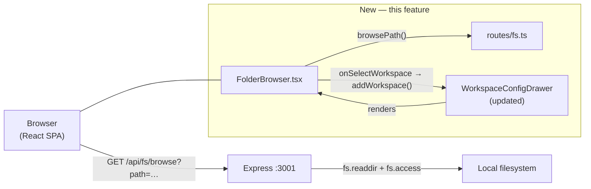

# Design — REQ-F-FSNAV-001: Filesystem Workspace Navigator
# Implements: REQ-F-FSNAV-001, REQ-F-FSNAV-002, REQ-F-FSNAV-003

**Version**: 0.1.0
**Date**: 2026-03-13
**Edge**: design_recommendations→design
**Tenant**: react_vite

---

## Architecture Overview

The navigator bridges the same browser-filesystem gap as the rest of genesis_manager: the browser cannot read the local filesystem, so a new Express route does the directory enumeration and workspace detection. The client renders the result as a browsable tree inside the existing `WorkspaceConfigDrawer`.



---

## Component 1 — `server/routes/fs.ts`
**Implements**: REQ-F-FSNAV-001 (AC-1, AC-2, AC-3, AC-8)

### Route
```
GET /api/fs/browse?path=<absolute-dir>
```

### Response type
```typescript
interface FsBrowseResult {
  path:      string       // resolved absolute path
  parent:    string | null  // parent dir; null at filesystem root
  entries:   FsEntry[]
  truncated: boolean      // true if > 500 subdirs
}

interface FsEntry {
  name:         string
  absolutePath: string
  isDir:        true
  hasWorkspace: boolean   // .ai-workspace/events/events.jsonl accessible
}
```

### Implementation
```typescript
// server/routes/fs.ts
import { Router, Request, Response } from 'express'
import fs from 'node:fs/promises'
import path from 'node:path'

const router = Router()
const MAX_ENTRIES = 500

router.get('/browse', async (req: Request, res: Response): Promise<void> => {
  const rawPath = typeof req.query['path'] === 'string'
    ? req.query['path']
    : process.cwd()                                    // AC-2: default to CWD

  const resolved = path.resolve(rawPath)               // AC-3: normalises ".."

  try {
    const stat = await fs.stat(resolved)
    if (!stat.isDirectory()) {
      res.status(400).json({ message: 'path is not a directory' })
      return
    }
  } catch {
    res.status(400).json({ message: `path not found: ${resolved}` })
    return
  }

  let dirents
  try {
    dirents = await fs.readdir(resolved, { withFileTypes: true })
  } catch {
    res.status(500).json({ message: 'Failed to read directory' })
    return
  }

  // AC-8: exclude hidden entries; keep only directories
  const dirs = dirents
    .filter(d => d.isDirectory() && !d.name.startsWith('.'))
    .sort((a, b) => a.name.localeCompare(b.name))

  const truncated = dirs.length > MAX_ENTRIES
  const limited = dirs.slice(0, MAX_ENTRIES)

  // AC-1: hasWorkspace check — parallel, non-throwing
  const entries: FsEntry[] = await Promise.all(
    limited.map(async (d) => {
      const absPath = path.join(resolved, d.name)
      const eventsFile = path.join(absPath, '.ai-workspace', 'events', 'events.jsonl')
      let hasWorkspace = false
      try {
        await fs.access(eventsFile)
        hasWorkspace = true
      } catch { /* not a workspace */ }
      return { name: d.name, absolutePath: absPath, isDir: true as const, hasWorkspace }
    })
  )

  // Workspace dirs first, then alpha
  entries.sort((a, b) => {
    if (a.hasWorkspace !== b.hasWorkspace) return a.hasWorkspace ? -1 : 1
    return a.name.localeCompare(b.name)
  })

  const parsed = path.parse(resolved)
  const parent = parsed.dir !== resolved ? parsed.dir : null  // null at root

  res.json({ path: resolved, parent, entries, truncated })
})

export default router
```

Mount in `server/index.ts`:
```typescript
import fsRouter from './routes/fs.js'
app.use('/api/fs', fsRouter)
```

---

## Component 2 — `src/features/project-nav/FolderBrowser.tsx`
**Implements**: REQ-F-FSNAV-002 (AC-4, AC-5, AC-6, AC-7)

### Props
```typescript
interface FolderBrowserProps {
  onSelectWorkspace: (absolutePath: string) => void
  initialPath?: string   // defaults to CWD (server-side)
}
```

### Local state
```typescript
interface BrowserState {
  currentPath: string
  parent: string | null
  entries: FsEntry[]
  loading: boolean
  error: string | null
}
```

### Layout
```
┌─────────────────────────────────────────────────┐
│ /Users/jim/src/apps          [↑ Parent]         │  ← breadcrumb + up button (AC-7)
├─────────────────────────────────────────────────┤
│ 🟢 genesis_manager    [Genesis workspace]  [+]  │  ← workspace badge + add (AC-6)
│ 📁 ai_init                                      │  ← regular dir (AC-5)
│ 📁 c4h                                          │
│ ...                                             │
│ ⚠ 500 entries shown — refine path to see more  │  ← truncation notice
└─────────────────────────────────────────────────┘
```

### Breadcrumb algorithm (AC-7)
Split `currentPath` on `/`. Each segment becomes a clickable button that
navigates to `/` + all segments up to and including that index joined with `/`.
Example: `/Users/jim/src` → segments `["", "Users", "jim", "src"]` → clicking
"jim" fetches `/Users/jim`.

### Skeleton
```typescript
// src/features/project-nav/FolderBrowser.tsx
// Implements: REQ-F-FSNAV-002, REQ-F-FSNAV-003

import React, { useState, useEffect, useCallback } from 'react'
import { apiClient } from '../../api/WorkspaceApiClient'
import type { FsEntry } from '../../api/types'

interface FolderBrowserProps {
  onSelectWorkspace: (absolutePath: string) => void
  initialPath?: string
}

export function FolderBrowser({ onSelectWorkspace, initialPath }: FolderBrowserProps) {
  const [currentPath, setCurrentPath] = useState<string>('')
  const [parent, setParent] = useState<string | null>(null)
  const [entries, setEntries] = useState<FsEntry[]>([])
  const [truncated, setTruncated] = useState(false)
  const [loading, setLoading] = useState(true)
  const [error, setError] = useState<string | null>(null)

  const navigate = useCallback(async (targetPath?: string) => {
    setLoading(true)
    setError(null)
    try {
      const result = await apiClient.browsePath(targetPath)
      setCurrentPath(result.path)
      setParent(result.parent)
      setEntries(result.entries)
      setTruncated(result.truncated ?? false)
    } catch (err) {
      setError(err instanceof Error ? err.message : 'Failed to browse')
    } finally {
      setLoading(false)
    }
  }, [])

  useEffect(() => { void navigate(initialPath) }, [initialPath, navigate])

  const breadcrumbSegments = currentPath.split('/').filter(Boolean)

  return (
    <div className="flex flex-col gap-2 text-sm">
      {/* Breadcrumb */}
      <div className="flex items-center gap-1 text-xs font-mono flex-wrap">
        <button onClick={() => void navigate('/')} className="hover:underline">/</button>
        {breadcrumbSegments.map((seg, i) => {
          const segPath = '/' + breadcrumbSegments.slice(0, i + 1).join('/')
          return (
            <React.Fragment key={segPath}>
              <span className="text-muted-foreground">/</span>
              <button onClick={() => void navigate(segPath)} className="hover:underline">
                {seg}
              </button>
            </React.Fragment>
          )
        })}
        {parent && (
          <button
            onClick={() => void navigate(parent)}
            className="ml-auto text-muted-foreground hover:text-foreground"
          >
            ↑ Up
          </button>
        )}
      </div>

      {/* Entry list */}
      {loading && <p className="text-muted-foreground italic">Loading…</p>}
      {error && <p className="text-destructive text-xs">{error}</p>}
      {!loading && !error && (
        <ul className="divide-y divide-border max-h-64 overflow-y-auto rounded border">
          {entries.map((entry) => (
            <li key={entry.absolutePath} className="flex items-center justify-between px-3 py-2 hover:bg-accent">
              <button
                onClick={() => void navigate(entry.absolutePath)}
                className="flex items-center gap-2 min-w-0 text-left"
              >
                <span>{entry.hasWorkspace ? '🟢' : '📁'}</span>
                <span className="truncate">{entry.name}</span>
                {entry.hasWorkspace && (
                  <span className="text-xs text-primary font-medium shrink-0">Genesis</span>
                )}
              </button>
              {entry.hasWorkspace && (
                <button
                  onClick={() => onSelectWorkspace(entry.absolutePath)}
                  className="shrink-0 ml-2 text-xs bg-primary text-primary-foreground px-2 py-0.5 rounded hover:opacity-90"
                >
                  Add
                </button>
              )}
            </li>
          ))}
          {truncated && (
            <li className="px-3 py-2 text-xs text-muted-foreground italic">
              ⚠ 500 entries shown — navigate into a subfolder to see more
            </li>
          )}
        </ul>
      )}
    </div>
  )
}
```

---

## Component 3 — `WorkspaceConfigDrawer` integration
**Implements**: REQ-F-FSNAV-003 (AC-6)

Add a `Browse` / `Manual` tab toggle above the existing input. `Browse` renders
`FolderBrowser`; `Manual` shows the existing text input unchanged.

```typescript
// Inside WorkspaceConfigDrawer, replace the add-by-path section:

type InputMode = 'browse' | 'manual'
const [inputMode, setInputMode] = useState<InputMode>('browse')

const handleSelectWorkspace = async (absolutePath: string) => {
  setAdding(true)
  setAddError(null)
  try {
    await addWorkspace(absolutePath)   // POST /api/workspaces
  } catch (err) {
    setAddError(err instanceof Error ? err.message : 'Failed to add workspace')
  } finally {
    setAdding(false)
  }
}

// JSX additions:
<div className="flex gap-1 mb-3">
  <button
    onClick={() => setInputMode('browse')}
    className={`text-xs px-3 py-1 rounded ${inputMode === 'browse' ? 'bg-primary text-primary-foreground' : 'border'}`}
  >
    Browse
  </button>
  <button
    onClick={() => setInputMode('manual')}
    className={`text-xs px-3 py-1 rounded ${inputMode === 'manual' ? 'bg-primary text-primary-foreground' : 'border'}`}
  >
    Manual path
  </button>
</div>

{inputMode === 'browse'
  ? <FolderBrowser onSelectWorkspace={(p) => void handleSelectWorkspace(p)} />
  : <>{/* existing text input + Add button */}</>
}
```

---

## New API client method — `browsePath`

Add to `WorkspaceApiClient`:
```typescript
// Implements: REQ-F-FSNAV-001
async browsePath(path?: string): Promise<FsBrowseResult> {
  const url = new URL(`${this.baseUrl}/api/fs/browse`)
  if (path) url.searchParams.set('path', path)
  const res = await fetch(url.toString())
  return handleResponse<FsBrowseResult>(res)
}
```

Add to `src/api/types.ts`:
```typescript
export interface FsBrowseResult {
  path: string
  parent: string | null
  entries: FsEntry[]
  truncated?: boolean
}

export interface FsEntry {
  name: string
  absolutePath: string
  isDir: true
  hasWorkspace: boolean
}
```

---

## Files changed / created

| File | Change |
|------|--------|
| `server/routes/fs.ts` | **New** — browse API route |
| `server/index.ts` | Mount `fsRouter` at `/api/fs` |
| `src/api/types.ts` | Add `FsBrowseResult`, `FsEntry` |
| `src/api/WorkspaceApiClient.ts` | Add `browsePath()` method |
| `src/features/project-nav/FolderBrowser.tsx` | **New** — browser component |
| `src/features/project-nav/WorkspaceConfigDrawer.tsx` | Add Browse/Manual toggle |

No new npm dependencies. No Zustand store changes.

---

## AC coverage

| AC | Covered by |
|----|-----------|
| AC-1 | `routes/fs.ts` — entries with `hasWorkspace`, 500 cap |
| AC-2 | `process.cwd()` default when `path` absent |
| AC-3 | `path.resolve(rawPath)` normalises `..` |
| AC-4 | `FolderBrowser` — breadcrumb + list + badge |
| AC-5 | `navigate(entry.absolutePath)` on dir click |
| AC-6 | `onSelectWorkspace` → `addWorkspace()` → drawer auto-dismiss |
| AC-7 | Breadcrumb segment buttons + ↑ Up button |
| AC-8 | `!d.name.startsWith('.')` filter in `readdir` |
