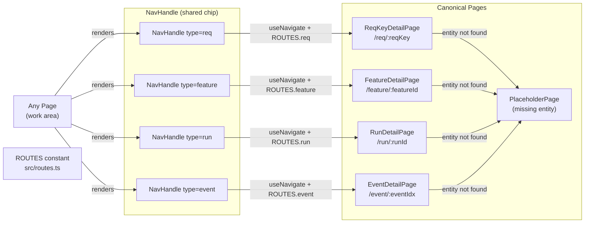
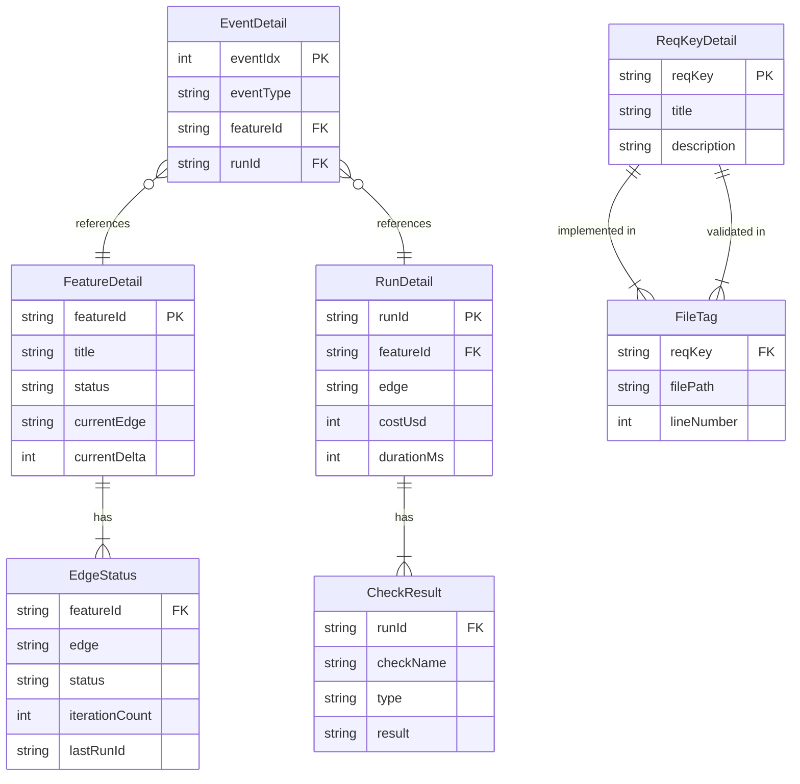

# Design — REQ-F-NAV-001: Navigation Invariant
# Implements: REQ-F-NAV-001, REQ-F-NAV-002, REQ-F-NAV-003, REQ-F-NAV-004, REQ-F-NAV-005

**Version**: 0.1.0
**Date**: 2026-03-13
**Edge**: requirements→design
**Phase**: 2 (Foundation — depends on REQ-F-PROJ-001)
**Tenant**: react_vite

---

## Architecture Overview

Every technical identifier rendered in genesis_manager — REQ key, feature ID, run ID, event entry — is a navigation handle. Clicking it navigates to a canonical detail page at a stable, bookmarkable URL. Dead links never appear: missing entities resolve to typed placeholder pages with context.



**Key invariant**: every canonical page resolves its entity from the workspace API before rendering. A 404 from the API renders a `PlaceholderPage` — never an unhandled error. This satisfies REQ-NFR-ACC-001 (no dead links).

---

## ROUTES Constant

The single authoritative source of all canonical URL patterns. All `NavHandle` components and all page components reference this — never string literals.

**File**: `src/routes.ts`

```typescript
// Implements: REQ-F-NAV-005

export const ROUTES = {
  // Work areas
  projects:    '/',
  overview:    '/overview',
  supervision: '/supervision',
  evidence:    '/evidence',
  control:     '/control',
  release:     '/release',

  // Canonical detail pages
  feature: (featureId: string) => `/feature/${encodeURIComponent(featureId)}`,
  run:     (runId: string)     => `/run/${encodeURIComponent(runId)}`,
  req:     (reqKey: string)    => `/req/${encodeURIComponent(reqKey)}`,
  event:   (eventIdx: number)  => `/event/${eventIdx}`,

  // Wildcard catch-all (registered last in router)
  notFound: '*',
} as const

// Route pattern strings for React Router <Route path=...>
export const ROUTE_PATTERNS = {
  feature: '/feature/:featureId',
  run:     '/run/:runId',
  req:     '/req/:reqKey',
  event:   '/event/:eventIdx',
} as const
```

Every feature in genesis_manager (PROJ, OVR, SUP, EVI, CTL, REL, NAV) builds links through this constant. Adding a new entity type requires one entry here.

---

## Component Design

### Component: NavHandle
**Implements**: REQ-F-NAV-001, REQ-F-NAV-002, REQ-F-NAV-003, REQ-F-NAV-004
**Responsibilities**:
- Render a clickable chip for any navigable identifier (REQ key, feature ID, run ID, event entry)
- Navigate to the canonical page on click using React Router `useNavigate`
- Apply consistent visual style (chip/badge) regardless of context
- Never render as a dead anchor — always navigates to a valid route (dead entity → placeholder page)

**Interfaces**:
```typescript
type NavHandleType = 'req' | 'feature' | 'run' | 'event'

interface NavHandleProps {
  type: NavHandleType
  id: string | number        // REQ key string, feature ID string, run ID string, or event index
  label?: string             // override display text (defaults to id)
  className?: string
}

const NavHandle: React.FC<NavHandleProps>
```

**Implementation sketch**:
```typescript
// Implements: REQ-F-NAV-001, REQ-F-NAV-002, REQ-F-NAV-003, REQ-F-NAV-004
function NavHandle({ type, id, label, className }: NavHandleProps) {
  const navigate = useNavigate()

  const href = match(type)
    .with('req',     () => ROUTES.req(String(id)))
    .with('feature', () => ROUTES.feature(String(id)))
    .with('run',     () => ROUTES.run(String(id)))
    .with('event',   () => ROUTES.event(Number(id)))
    .exhaustive()

  return (
    <button
      className={cn('nav-handle', `nav-handle--${type}`, className)}
      onClick={(e) => { e.stopPropagation(); navigate(href) }}
    >
      {label ?? String(id)}
    </button>
  )
}
```

**Visual conventions** (Tailwind + shadcn/ui Badge):
- `req`: monospace, blue tint — `font-mono text-blue-700 bg-blue-50`
- `feature`: monospace, indigo tint — `font-mono text-indigo-700 bg-indigo-50`
- `run`: monospace, gray tint — `font-mono text-gray-600 bg-gray-100`
- `event`: no background, underline — `underline text-gray-500 text-sm`

**Dependencies**: React Router `useNavigate`, ROUTES, shadcn/ui Badge, Tailwind, ts-pattern

---

### Component: FeatureDetailPage
**Implements**: REQ-F-NAV-002, REQ-F-NAV-005
**Route**: `/feature/:featureId`
**Responsibilities**:
- Resolve the feature vector YAML for the given featureId via `GET /api/features/:featureId`
- If not found: render `PlaceholderPage` with context
- Show: feature title, status badge, current edge, current δ, all edges with status/iteration/δ
- Show: complete event history for this feature (filtered from events.jsonl)
- Show: child vectors if any (each child feature ID is a `NavHandle type=feature`)
- Show: REQ keys in `satisfies:` field (each as `NavHandle type=req`)

**Interfaces**:
```typescript
interface FeatureDetailPageProps {} // params from useParams

// Data shape resolved from API
interface FeatureDetail {
  featureId: string
  title: string
  status: 'converged' | 'in_progress' | 'blocked' | 'pending'
  currentEdge: string | null
  currentDelta: number | null
  edges: EdgeStatus[]
  events: WorkspaceEvent[]
  childVectors: string[]
  satisfies: string[]
}

interface EdgeStatus {
  edge: string
  status: 'converged' | 'in_progress' | 'pending' | 'not_started'
  iterationCount: number
  delta: number | null
  lastRunId: string | null
}
```

**API dependency**: `GET /api/features/:featureId` → `FeatureDetail | null`

**Dependencies**: NavHandle, WorkspaceApiClient, PlaceholderPage, useParams, React Router

---

### Component: RunDetailPage
**Implements**: REQ-F-NAV-003, REQ-F-NAV-005
**Route**: `/run/:runId`
**Responsibilities**:
- Resolve all events with matching `run_id` via `GET /api/runs/:runId`
- If not found: render `PlaceholderPage` with context
- Show: run metadata (feature, edge, start/end time, cost_usd, duration_ms)
- Show: all events in run, chronological, each as `NavHandle type=event`
- Show: evaluator check results for the run's last `iteration_completed` event
- Show: artifacts produced (file paths)

**Interfaces**:
```typescript
interface RunDetail {
  runId: string
  featureId: string
  edge: string
  startedAt: string
  completedAt: string | null
  costUsd: number | null
  durationMs: number | null
  events: WorkspaceEvent[]
  checkResults: CheckResult[]
  artifacts: string[]
}

interface CheckResult {
  checkName: string
  type: 'F_D' | 'F_P' | 'F_H'
  result: 'pass' | 'fail' | 'skip'
  expected?: string
  observed?: string
  skipReason?: string
}
```

**API dependency**: `GET /api/runs/:runId` → `RunDetail | null`

**Dependencies**: NavHandle, WorkspaceApiClient, PlaceholderPage, useParams

---

### Component: ReqKeyDetailPage
**Implements**: REQ-F-NAV-001, REQ-F-NAV-005
**Route**: `/req/:reqKey`
**Responsibilities**:
- Resolve the requirement definition from the requirements document via `GET /api/req/:reqKey`
- If not found: render `PlaceholderPage` with message "Requirements not yet written for this key"
- Show: key definition, acceptance criteria, traces-to intent
- Show: features that satisfy this key (each as `NavHandle type=feature`)
- Show: code files tagged with `# Implements: {reqKey}` (paths, line numbers)
- Show: test files tagged with `# Validates: {reqKey}` (paths, line numbers)

**Interfaces**:
```typescript
interface ReqKeyDetail {
  reqKey: string
  title: string
  description: string
  acceptanceCriteria: string[]
  tracesTo: string
  satisfiedBy: string[]       // feature IDs
  implementedIn: FileTag[]
  validatedIn: FileTag[]
}

interface FileTag {
  filePath: string
  lineNumber: number
}
```

**API dependency**: `GET /api/req/:reqKey` → `ReqKeyDetail | null`

**Dependencies**: NavHandle, WorkspaceApiClient, PlaceholderPage, useParams

---

### Component: EventDetailPage
**Implements**: REQ-F-NAV-004, REQ-F-NAV-005
**Route**: `/event/:eventIdx`
**Responsibilities**:
- Resolve the raw event at line index `eventIdx` in events.jsonl via `GET /api/events/:eventIdx`
- If not found: render `PlaceholderPage` with context
- Show: raw event JSON (syntax-highlighted, read-only)
- Show: human-readable interpretation (event_type label, feature, edge, delta, timestamp)
- Show: navigation handles for all identifiers present in the event payload
- Provide back-navigation to the previous page (browser back, not a fixed link)

**Interfaces**:
```typescript
interface EventDetail {
  eventIdx: number
  raw: Record<string, unknown>        // raw parsed JSON
  eventType: string
  featureId: string | null
  runId: string | null
  edge: string | null
  delta: number | null
  timestamp: string
}
```

**API dependency**: `GET /api/events/:eventIdx` → `EventDetail | null`

**Dependencies**: NavHandle, WorkspaceApiClient, PlaceholderPage, useParams, syntax highlighter (Prism or shiki)

---

### Component: PlaceholderPage
**Implements**: REQ-F-NAV-001, REQ-F-NAV-002, REQ-F-NAV-003, REQ-F-NAV-004, REQ-F-NAV-005, REQ-NFR-ACC-001
**Responsibilities**:
- Render when any canonical page cannot resolve its entity
- Show: entity type, entity ID, reason (not found / workspace unavailable / data missing)
- Show: a "Return" button using React Router `useNavigate(-1)` (back navigation)
- Never render as an error crash — always a clean, readable state

**Interfaces**:
```typescript
type EntityType = 'feature' | 'run' | 'req' | 'event'

interface PlaceholderPageProps {
  entityType: EntityType
  entityId: string
  reason: 'not_found' | 'workspace_unavailable' | 'data_missing'
  customMessage?: string
}
```

**Reason→message map**:
- `not_found` + `req`: "Requirements not yet written for this key"
- `not_found` + `feature`: "Feature not found in workspace"
- `not_found` + `run`: "Run not found — may have been from a previous workspace state"
- `not_found` + `event`: "Event index out of range"
- `workspace_unavailable`: "Workspace is currently unavailable — last known state shown"
- `data_missing`: "Entity exists but required data files are missing"

---

## Dead-Link Handling

The invariant is: **no navigation handle ever produces an unhandled error or empty page**.

Implementation mechanism:

```
NavHandle click → navigate(ROUTES.x(id))
→ canonical page loads
→ GET /api/{entity}/{id}
→ [200] render entity data
→ [404 or error] render PlaceholderPage with typed reason
```

The API server returns structured 404 responses (not empty body):

```typescript
// server error shape
interface ApiNotFound {
  error: 'not_found'
  entityType: EntityType
  entityId: string
  message: string
}
```

The canonical page component catches this and renders `PlaceholderPage` — it never rethrows. This satisfies REQ-NFR-ACC-001 (verifiable by automated link-checker).

---

## Data Model: How Canonical Pages Resolve Entity Data

Each canonical page queries the Express server, which reads the workspace:

| Page | API endpoint | Workspace source |
|------|-------------|-----------------|
| FeatureDetailPage | `GET /api/features/:id` | `features/active/{id}.yml` + filtered `events.jsonl` |
| RunDetailPage | `GET /api/runs/:runId` | `events.jsonl` filtered by `run_id` |
| ReqKeyDetailPage | `GET /api/req/:reqKey` | `specification/requirements/REQUIREMENTS.md` (parsed) + source scan |
| EventDetailPage | `GET /api/events/:idx` | `events.jsonl` line at index |

All data derives exclusively from the workspace filesystem (REQ-DATA-WORK-001). No secondary database.



---

## Traceability Matrix

| REQ Key | Component(s) |
|---------|-------------|
| REQ-F-NAV-001 | NavHandle (type=req), ReqKeyDetailPage, PlaceholderPage |
| REQ-F-NAV-002 | NavHandle (type=feature), FeatureDetailPage, PlaceholderPage |
| REQ-F-NAV-003 | NavHandle (type=run), RunDetailPage, PlaceholderPage |
| REQ-F-NAV-004 | NavHandle (type=event), EventDetailPage, PlaceholderPage |
| REQ-F-NAV-005 | ROUTES constant, all canonical pages (stable bookmarkable URLs), PlaceholderPage |
| REQ-NFR-ACC-001 | PlaceholderPage (never dead links), dead-link handling protocol |

---

## Package / Module Structure

```
genesis_manager/
└── imp_react_vite/
    └── src/
        ├── routes.ts                          # ROUTES constant + ROUTE_PATTERNS (Implements: REQ-F-NAV-005)
        ├── components/
        │   ├── NavHandle.tsx                  # Implements: REQ-F-NAV-001..004
        │   └── PlaceholderPage.tsx            # Implements: REQ-F-NAV-001..005, REQ-NFR-ACC-001
        ├── pages/
        │   ├── FeatureDetailPage.tsx          # Implements: REQ-F-NAV-002, REQ-F-NAV-005
        │   ├── RunDetailPage.tsx              # Implements: REQ-F-NAV-003, REQ-F-NAV-005
        │   ├── ReqKeyDetailPage.tsx           # Implements: REQ-F-NAV-001, REQ-F-NAV-005
        │   └── EventDetailPage.tsx            # Implements: REQ-F-NAV-004, REQ-F-NAV-005
        ├── api/
        │   └── WorkspaceApiClient.ts          # extended with feature/run/req/event endpoints
        └── types/
            └── navigation.ts                  # NavHandleType, FeatureDetail, RunDetail, ReqKeyDetail, EventDetail
```

**Server additions**:
```
genesis_manager/
└── imp_react_vite/
    └── server/
        └── routes/
            ├── features.ts    # GET /api/features/:featureId
            ├── runs.ts        # GET /api/runs/:runId
            ├── req.ts         # GET /api/req/:reqKey (parses REQUIREMENTS.md + scans source)
            └── events.ts      # GET /api/events/:eventIdx
```

---

## ADR Index

| ADR | Decision | Status |
|-----|----------|--------|
| ADR-GM-001 | State management: Zustand | RESOLVED |
| ADR-GM-002 | Workspace access: local Express server | RESOLVED |
| ADR-GM-003 | Component library: Tailwind CSS + shadcn/ui | RESOLVED |
| ADR-GM-004 | Router: React Router 6 | RESOLVED |

No new ADRs required — the navigation invariant is fully derivable from ADR-GM-004 (React Router 6) + existing constraints.
