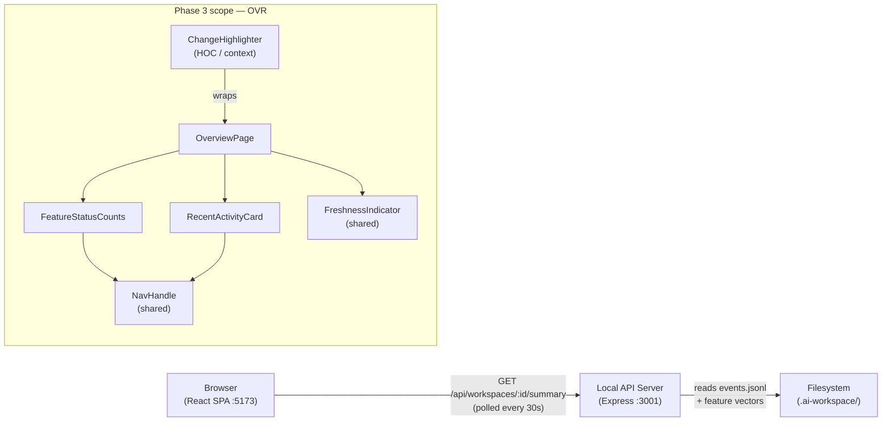
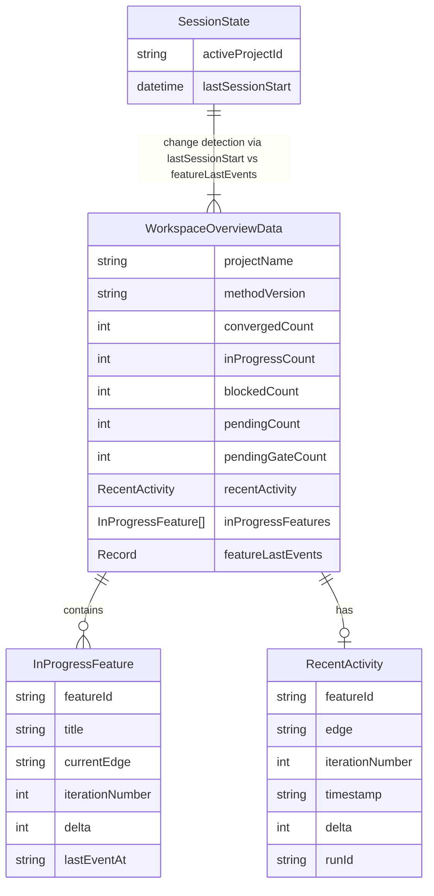

# Design — REQ-F-OVR-001: Overview Work Area
# Implements: REQ-F-OVR-001, REQ-F-OVR-002, REQ-F-OVR-003, REQ-F-OVR-004

**Version**: 0.1.0
**Date**: 2026-03-13
**Edge**: requirements→design
**Phase**: 3 (no dependencies on Phase 2 deliverables beyond shared patterns)
**Tenant**: react_vite

---

## Architecture Overview

The Overview page is a read-only single-screen dashboard that must fit in a 1440×900 viewport without vertical scrolling (REQ-F-OVR-001 AC3). All data derives from the active workspace via `WorkspaceApiClient` and the shared `useWorkspacePoller` hook (30s interval). Change detection is computed client-side by comparing event timestamps against `lastSessionStart` stored in `localStorage`.



**Layout strategy for 1440×900 no-scroll constraint (REQ-F-OVR-001 AC3)**:

The page uses a fixed-height CSS grid layout (`height: 100vh`, `overflow: hidden`) with three rows:
- **Row 1 (header, ~64px)**: project name + method version + FreshnessIndicator
- **Row 2 (counts bar, ~120px)**: FeatureStatusCounts — four count tiles + human gate prominence
- **Row 3 (body, remaining height)**: two columns — left: in-progress feature table; right: RecentActivityCard + change summary

At 1440px wide and 900px tall this layout consumes ~900px with standard Tailwind spacing. No scrollable region exists at the page level; the in-progress feature table uses `overflow-y: auto` internally if it exceeds its allocated height.

---

## Component Design

### Component: OverviewPage
**Implements**: REQ-F-OVR-001, REQ-F-OVR-004
**Responsibilities**:
- Root layout: fixed-height CSS grid (3 rows, 2 cols in body)
- Read `workspaceSummary` from `useProjectStore`
- Read `lastSessionStart` from `localStorage` via `useSessionState` hook
- Pass `lastSessionStart` to `ChangeHighlighter` context
- Show spinner while loading; show error banner if workspace unavailable
**Interfaces**:
```typescript
// No props — reads from useProjectStore + useSessionState
export function OverviewPage(): JSX.Element
```
**Dependencies**: useProjectStore, useSessionState, ChangeHighlighter, FeatureStatusCounts, RecentActivityCard, FreshnessIndicator

---

### Component: FeatureStatusCounts
**Implements**: REQ-F-OVR-002, REQ-BR-SUPV-002
**Responsibilities**:
- Display four status tiles: converged, in_progress, blocked, pending
- Highlight pending gate count with larger font + accent colour (REQ-BR-SUPV-002: gates visually prominent)
- Each tile is a `NavHandle` navigating to `/supervision?status={state}` (filtered feature list)
- Counts update reactively from `useProjectStore` (polled every 30s, REQ-F-OVR-002 AC2)
**Interfaces**:
```typescript
interface FeatureStatusCountsProps {
  counts: FeatureStatusSummary
}

interface FeatureStatusSummary {
  converged: number
  in_progress: number
  blocked: number
  pending: number
  pendingGates: number   // subset of blocked — gates specifically
}
```
**Dependencies**: NavHandle, useProjectStore, shadcn/ui Card, Badge

---

### Component: RecentActivityCard
**Implements**: REQ-F-OVR-003
**Responsibilities**:
- Show the most recent `iteration_completed` event across all features in the active workspace
- Display: feature ID (NavHandle → `/feature/{id}`), edge, iteration number, timestamp, δ result
- Show run ID if present as NavHandle → `/run/{run_id}`
- "No activity yet" placeholder when event log is empty
**Interfaces**:
```typescript
interface RecentActivityCardProps {
  activity: RecentActivity | null
}

interface RecentActivity {
  featureId: string
  edge: string
  iterationNumber: number
  timestamp: string        // ISO 8601
  delta: number
  runId: string | null
}
```
**Dependencies**: NavHandle, shadcn/ui Card, dayjs (relative time)

---

### Component: ChangeHighlighter (React Context + HOC)
**Implements**: REQ-F-OVR-004
**Responsibilities**:
- Provides `ChangeContext` to the page tree carrying `lastSessionStart: Date | null`
- Exposes `useIsChanged(featureId: string): boolean` hook — returns true when the feature has any event with `timestamp > lastSessionStart`
- Wraps changed items with a visual indicator (left border accent, "NEW" badge)
- `dismissChanges()` action: writes current timestamp to `localStorage` as new `lastSessionStart`, clears all highlights (REQ-F-OVR-004 AC3)
- A "Dismiss all changes" button rendered in OverviewPage header triggers `dismissChanges()`
**Interfaces**:
```typescript
interface ChangeContextValue {
  lastSessionStart: Date | null
  useIsChanged: (featureId: string) => boolean
  dismissChanges: () => void
}

const ChangeContext: React.Context<ChangeContextValue>
```
**Data flow**: `lastSessionStart` is read from `localStorage` on page load. Feature event timestamps come from `WorkspaceOverviewData.featureLastEvents` (a `Map<featureId, Date>` returned by `GET /api/workspaces/:id/overview`).

---

### Component: InProgressFeatureTable (sub-component of OverviewPage)
**Implements**: REQ-F-OVR-001 AC2 (current graph stage for in-progress features)
**Responsibilities**:
- Table of all in-progress features with columns: Feature (NavHandle), Current Edge, Iteration, δ, Changed
- `overflow-y: auto` within its allocated grid cell — internal scroll only, does not affect page scroll
- Changed column shows ChangeHighlighter indicator for features with events after `lastSessionStart`
**Interfaces**:
```typescript
interface InProgressFeatureTableProps {
  features: InProgressFeature[]
}

interface InProgressFeature {
  featureId: string
  title: string
  currentEdge: string
  iterationNumber: number
  delta: number
  lastEventAt: string    // ISO 8601
}
```
**Dependencies**: NavHandle, ChangeHighlighter context, shadcn/ui Table

---

### API Extension: GET /api/workspaces/:id/overview
**Implements**: REQ-F-OVR-001, REQ-F-OVR-002, REQ-F-OVR-003, REQ-F-OVR-004
**Responsibilities** (server-side, `server/routes/workspaces.ts`):
- Read all feature vectors from `.ai-workspace/features/active/`
- Compute status counts (converged/in_progress/blocked/pending) from `status` field in each vector
- Find most recent `iteration_completed` event in `events.jsonl`
- Return `featureLastEvents`: map of featureId → timestamp of most recent event
- Return `pendingGateCount` from `iteration_completed` events where checklist has unresolved `human` type checks
**Response type**:
```typescript
interface WorkspaceOverviewData {
  projectName: string
  methodVersion: string
  statusCounts: FeatureStatusSummary
  inProgressFeatures: InProgressFeature[]
  recentActivity: RecentActivity | null
  featureLastEvents: Record<string, string>   // featureId → ISO timestamp
  pendingGateCount: number
}
```

---

## Data Model



**Change detection algorithm** (client-side, in `useIsChanged`):
```typescript
// lastSessionStart from localStorage key "gm:lastSessionStart"
function useIsChanged(featureId: string): boolean {
  const { lastSessionStart } = useContext(ChangeContext)
  const featureLastEvents = useProjectStore(s => s.overviewData?.featureLastEvents)
  if (!lastSessionStart || !featureLastEvents) return false
  const lastEvent = featureLastEvents[featureId]
  if (!lastEvent) return false
  return new Date(lastEvent) > lastSessionStart
}
```

**Session start tracking**:
- On app mount, if `gm:lastSessionStart` is absent, write `Date.now()` and treat all as unchanged
- On `dismissChanges()`, write `Date.now()` to `gm:lastSessionStart`
- Previous session start = the value from localStorage before the current session wrote it
  (Implementation: on mount, read existing value → that IS `lastSessionStart`; then write new timestamp for next session)

---

## Layout Specification (1440×900)

```
┌─────────────────────────────────────────────────── 1440px ──────────────────────────────────────────────┐
│  [Project Name]   v3.0.1   [FreshnessIndicator]          [Dismiss Changes]               64px header     │
├──────────────────────────────────────────────────────────────────────────────────────────────────────────┤
│  ┌─ converged ─┐  ┌─ in_progress ─┐  ┌─ blocked ─┐  ┌──── pending gates (PROMINENT) ────┐  120px bar   │
│  │     12      │  │      5        │  │     2     │  │           3  🔴                    │              │
│  └─────────────┘  └───────────────┘  └───────────┘  └────────────────────────────────────┘              │
├───────────────────────────────────────────────┬──────────────────────────────────────────────────────────┤
│  In-Progress Features                         │  Recent Activity                          716px body     │
│  ┌──────────────────────────────────────────┐ │  ┌────────────────────────────────────┐                 │
│  │ Feature     Edge     Iter  δ   Changed   │ │  │ REQ-F-AUTH-001  design→code  #4   │                 │
│  │ REQ-F-..    design   4     2   ● NEW     │ │  │ δ=1  2026-03-13 14:22            │                 │
│  │ REQ-F-..    code     2     0             │ │  │ Run: abc-123                       │                 │
│  │ (overflow-y: auto within this cell)      │ │  └────────────────────────────────────┘                 │
│  └──────────────────────────────────────────┘ │                                                          │
└───────────────────────────────────────────────┴──────────────────────────────────────────────────────────┘
```

---

## Traceability Matrix

| REQ Key | Component |
|---------|-----------|
| REQ-F-OVR-001 | OverviewPage (fixed layout), InProgressFeatureTable (AC2), WorkspaceApiClient (AC1 data) |
| REQ-F-OVR-001 AC3 | OverviewPage CSS grid — `height: 100vh; overflow: hidden` |
| REQ-F-OVR-002 | FeatureStatusCounts, GET /api/workspaces/:id/overview (statusCounts), useWorkspacePoller (30s) |
| REQ-F-OVR-003 | RecentActivityCard, GET /api/workspaces/:id/overview (recentActivity) |
| REQ-F-OVR-004 | ChangeHighlighter (context + hook), useSessionState (localStorage), "Dismiss all" button |
| REQ-BR-SUPV-002 | FeatureStatusCounts — pendingGates tile visually prominent (larger font, accent colour) |
| REQ-F-NAV-001 | NavHandle on REQ keys in InProgressFeatureTable |
| REQ-F-NAV-002 | NavHandle on feature IDs in InProgressFeatureTable + RecentActivityCard |
| REQ-F-NAV-003 | NavHandle on run ID in RecentActivityCard |
| REQ-F-UX-001 | useWorkspacePoller (30s interval), FreshnessIndicator |
| REQ-DATA-WORK-001 | GET /api/workspaces/:id/overview reads only from filesystem |
| REQ-NFR-PERF-001 | Single API call for all overview data; no waterfall fetches |

---

## Package / Module Structure

```
imp_react_vite/
├── src/
│   ├── api/
│   │   └── WorkspaceApiClient.ts          # extended: getOverviewData()
│   ├── pages/
│   │   └── OverviewPage.tsx               # Implements: REQ-F-OVR-001, REQ-F-OVR-004
│   ├── components/
│   │   ├── FeatureStatusCounts.tsx        # Implements: REQ-F-OVR-002
│   │   ├── RecentActivityCard.tsx         # Implements: REQ-F-OVR-003
│   │   ├── InProgressFeatureTable.tsx     # Implements: REQ-F-OVR-001 AC2
│   │   └── ChangeHighlighter.tsx          # Implements: REQ-F-OVR-004
│   ├── hooks/
│   │   └── useSessionState.ts             # lastSessionStart localStorage read/write
│   └── types/
│       └── overview.ts                    # WorkspaceOverviewData, InProgressFeature, RecentActivity
├── server/
│   └── routes/
│       └── workspaces.ts                  # extended: GET /api/workspaces/:id/overview
```
