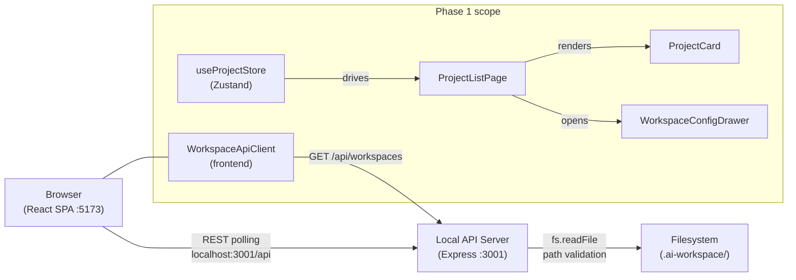
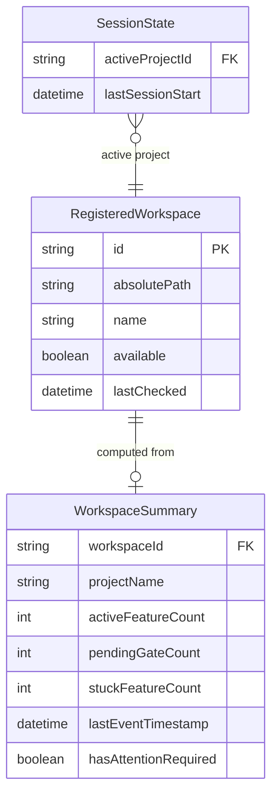

# Design — REQ-F-PROJ-001: Project Navigator
# Implements: REQ-F-PROJ-001, REQ-F-PROJ-002, REQ-F-PROJ-003, REQ-F-PROJ-004

**Version**: 0.1.0
**Date**: 2026-03-13
**Edge**: requirements→design
**Phase**: 1 (Foundation — no dependencies)
**Tenant**: react_vite

---

## Architecture Overview

genesis_manager is a browser SPA that cannot directly access the local filesystem. It communicates with a co-located Node.js API server (started alongside Vite dev) that reads the Genesis workspace directories on the machine.



**Key architectural decision (ADR-GM-002)**: a local Express server bridges the browser-filesystem gap. This also provides the write path for CTL features (Phase 4) — one server handles both reads and writes to `events.jsonl`.

---

## Component Design

### Component: WorkspaceApiClient
**Implements**: REQ-DATA-WORK-001, REQ-F-PROJ-004, REQ-F-UX-001
**Responsibilities**:
- `GET /api/workspaces` — returns workspace summaries for all registered paths
- `POST /api/workspaces` — register a new workspace path (validates on server)
- `DELETE /api/workspaces/:id` — remove a registered workspace
- `GET /api/workspaces/:id/summary` — project name, feature counts, gate counts from workspace
**Interfaces**:
```typescript
class WorkspaceApiClient {
  getWorkspaces(): Promise<WorkspaceSummary[]>
  addWorkspace(path: string): Promise<WorkspaceSummary>
  removeWorkspace(id: string): Promise<void>
  getWorkspaceSummary(id: string): Promise<WorkspaceSummary>
}
```
**Dependencies**: fetch API, `VITE_API_URL` env var (default: `http://localhost:3001`)

---

### Component: useProjectStore (Zustand)
**Implements**: REQ-F-PROJ-001, REQ-F-PROJ-002, REQ-F-PROJ-003, REQ-F-PROJ-004
**Responsibilities**:
- Hold registered workspace paths (persisted to localStorage via Zustand persist middleware)
- Hold active project ID
- Hold loaded workspace summaries (polled every 30s)
- Compute attention signals from workspace summaries (pending gates > 0 OR stuck > 0)
**Interfaces**:
```typescript
interface ProjectStore {
  registeredPaths: string[]           // persisted
  activeProjectId: string | null      // persisted
  workspaceSummaries: Map<string, WorkspaceSummary>
  lastRefreshed: Date | null

  addWorkspace(path: string): Promise<void>
  removeWorkspace(id: string): void
  setActiveProject(id: string): void
  refresh(): Promise<void>            // polls all registered paths
}
```
**Dependencies**: WorkspaceApiClient, Zustand, Zustand persist middleware

---

### Component: ProjectListPage
**Implements**: REQ-F-PROJ-001, REQ-F-PROJ-002, REQ-BR-SUPV-002
**Responsibilities**:
- Render list of registered projects sorted by: attention-required first, then most recently active
- Show "Add workspace" button → opens WorkspaceConfigDrawer
- Show empty state when no workspaces registered
**Interfaces**: React component — reads from useProjectStore
**Dependencies**: useProjectStore, ProjectCard, WorkspaceConfigDrawer

---

### Component: ProjectCard
**Implements**: REQ-F-PROJ-001, REQ-F-PROJ-002, REQ-F-PROJ-003
**Responsibilities**:
- Show project name, active feature count, pending gate count
- Show attention signal badge (pending gates OR stuck features)
- Show "workspace unavailable" state (REQ-F-PROJ-004 — path gone)
- On click: setActiveProject + navigate to overview
**Interfaces**:
```typescript
interface ProjectCardProps {
  summary: WorkspaceSummary
  isActive: boolean
  onSelect: (id: string) => void
}
```
**Dependencies**: WorkspaceSummary type, shadcn/ui Badge, Button

---

### Component: WorkspaceConfigDrawer
**Implements**: REQ-F-PROJ-004
**Responsibilities**:
- Form to add a workspace by absolute path
- Validates on submit: calls POST /api/workspaces (server validates path + events.jsonl)
- Shows validation error inline (e.g., "path not found", "not a valid Genesis workspace")
- Lists registered workspaces with remove button
**Interfaces**: React component — reads/writes useProjectStore
**Dependencies**: useProjectStore, shadcn/ui Drawer, Form, Input

---

### Component: Express API Server (server/index.ts)
**Implements**: REQ-DATA-WORK-001, REQ-DATA-WORK-002, REQ-F-PROJ-004
**Responsibilities**:
- `GET /api/workspaces` — scan all registered paths, read project_constraints.yml + events.jsonl summaries
- `POST /api/workspaces` — validate that path exists and contains events.jsonl; return 400 with reason if not
- `GET /api/workspaces/:id/summary` — return WorkspaceSummary for a single workspace
- Path registration stored in `~/.genesis_manager/workspaces.json` (server-side persistence, not browser)
**Dependencies**: Express, Node.js fs, yaml parser

---

## Data Model



**Storage split**:
- `RegisteredWorkspace` paths: `~/.genesis_manager/workspaces.json` (server-side, survives browser clear)
- `activeProjectId` + `lastSessionStart`: browser `localStorage` (session tracking)

---

## Traceability Matrix

| REQ Key | Component |
|---------|-----------|
| REQ-F-PROJ-001 | ProjectListPage, ProjectCard, useProjectStore |
| REQ-F-PROJ-002 | ProjectCard (attention badge), useProjectStore (hasAttentionRequired) |
| REQ-F-PROJ-003 | ProjectCard (onSelect), useProjectStore (setActiveProject) |
| REQ-F-PROJ-004 | WorkspaceConfigDrawer, Express API Server (validation), ProjectCard (unavailable state) |
| REQ-DATA-WORK-001 | WorkspaceApiClient, Express API Server (reads only from filesystem) |
| REQ-DATA-WORK-002 | Express API Server (write-only on explicit action) |
| REQ-NFR-REL-001 | Express API Server (graceful handling of missing/malformed files) |

---

## ADR Index

| ADR | Decision | Status |
|-----|----------|--------|
| ADR-GM-001 | State management: Zustand | RESOLVED |
| ADR-GM-002 | Workspace access: local Express server | RESOLVED |
| ADR-GM-003 | Component library: Tailwind CSS + shadcn/ui | RESOLVED |
| ADR-GM-004 | Router: React Router 6 | RESOLVED |

See `adrs/` for full ADR documents.

---

## Package / Module Structure

```
genesis_manager/
├── imp_react_vite/
│   ├── src/
│   │   ├── main.tsx                    # App entry point
│   │   ├── App.tsx                     # Router setup
│   │   ├── api/
│   │   │   └── WorkspaceApiClient.ts   # REST client (Implements: REQ-DATA-WORK-001)
│   │   ├── stores/
│   │   │   └── projectStore.ts         # Zustand store (Implements: REQ-F-PROJ-001..004)
│   │   ├── pages/
│   │   │   └── ProjectListPage.tsx     # Projects work area
│   │   ├── components/
│   │   │   ├── ProjectCard.tsx
│   │   │   └── WorkspaceConfigDrawer.tsx
│   │   └── types/
│   │       └── workspace.ts            # WorkspaceSummary, RegisteredWorkspace
│   ├── server/
│   │   ├── index.ts                    # Express server entry
│   │   ├── routes/workspaces.ts        # GET/POST/DELETE /api/workspaces
│   │   └── readers/workspaceReader.ts  # fs reads for workspace data
│   ├── package.json
│   ├── vite.config.ts                  # proxy /api → localhost:3001 in dev
│   └── tsconfig.json
```

---

## Integration Points

**Vite proxy**: in dev, `vite.config.ts` proxies `/api/*` → `localhost:3001`. In production build, the Express server serves the static SPA at root and `/api/*` routes alongside it.

**Startup**: `npm run dev` starts both `vite` and `tsx watch server/index.ts` concurrently (via `concurrently` package).
