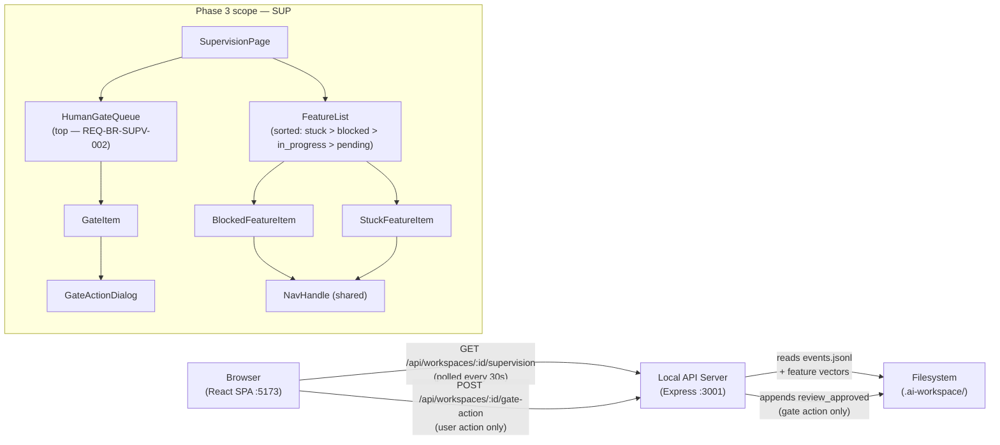
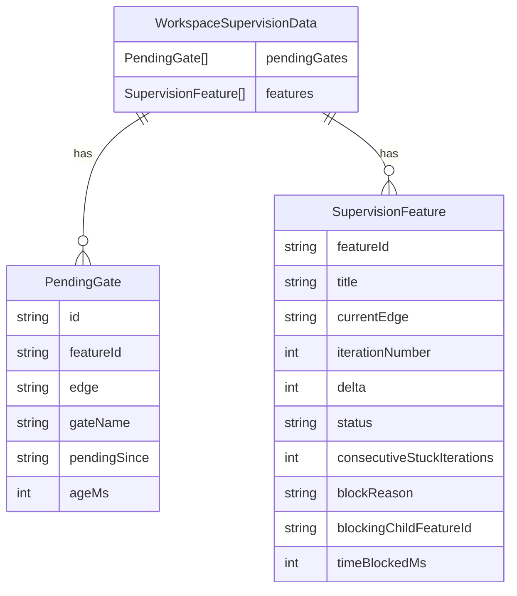

# Design — REQ-F-SUP-001: Supervision Work Area
# Implements: REQ-F-SUP-001, REQ-F-SUP-002, REQ-F-SUP-003, REQ-F-SUP-004

**Version**: 0.1.0
**Date**: 2026-03-13
**Edge**: requirements→design
**Phase**: 3 (no dependencies on Phase 2 deliverables beyond shared patterns)
**Tenant**: react_vite

---

## Architecture Overview

The Supervision page answers "What does Genesis need from me right now?" It surfaces three categories of items that require human attention or visibility: human gates awaiting action, blocked features, and stuck features. Per REQ-BR-SUPV-002, the human gate queue appears at the top of the page above all other content.

Gate approval/rejection is the only write path in this work area — it calls `POST /api/workspaces/:id/gate-action` which appends a `review_approved` event to `events.jsonl`.



**Data flow**: All supervision state is derived from `events.jsonl` and feature vector YAML files. The server computes derived state (stuck detection, gate queue, block reason) and returns it as `WorkspaceSupervisionData`. The client renders this data reactively. Gate actions POST to the server which appends to `events.jsonl` — the next 30s poll will reflect the updated state (REQ-F-SUP-002 AC4: gate removed within 5 seconds requires either a targeted re-fetch after action or an optimistic update; design uses optimistic removal + background revalidation).

---

## Component Design

### Component: SupervisionPage
**Implements**: REQ-F-SUP-001, REQ-BR-SUPV-002
**Responsibilities**:
- Layout: `HumanGateQueue` at top (sticky), `FeatureList` below
- Poll via `useWorkspacePoller` for `supervisionData` every 30s
- Show FreshnessIndicator in page header
- Empty state: "All features running smoothly — no attention required"
**Interfaces**:
```typescript
// No props — reads from useProjectStore
export function SupervisionPage(): JSX.Element
```
**Dependencies**: useProjectStore, HumanGateQueue, FeatureList, FreshnessIndicator

---

### Component: HumanGateQueue
**Implements**: REQ-F-SUP-002, REQ-BR-SUPV-002
**Responsibilities**:
- Render ordered list of pending human gates (oldest first, REQ-F-SUP-002 AC1)
- Each gate rendered as `GateItem`
- "No pending gates" empty state with green indicator when queue is empty
- Sticky positioning at top of page so it remains visible while scrolling the feature list
**Interfaces**:
```typescript
interface HumanGateQueueProps {
  gates: PendingGate[]
  onGateAction: (gateId: string, decision: GateDecision) => Promise<void>
}

interface PendingGate {
  id: string                // composite: featureId:edge:gateName
  featureId: string
  edge: string
  gateName: string
  pendingSince: string      // ISO 8601 — timestamp of gate becoming pending
  ageMs: number             // computed: Date.now() - pendingSince
}
```
**Dependencies**: GateItem, shadcn/ui Card, Badge

---

### Component: GateItem
**Implements**: REQ-F-SUP-002 AC1, AC2
**Responsibilities**:
- Show: feature ID (NavHandle), edge, gate name, age (relative: "2 hours ago")
- Approve / Reject buttons → opens GateActionDialog
- Optimistic removal on action: remove from local list immediately, revalidate on next poll
**Interfaces**:
```typescript
interface GateItemProps {
  gate: PendingGate
  onAction: (gateId: string, decision: GateDecision) => Promise<void>
}
```
**Dependencies**: NavHandle, GateActionDialog, shadcn/ui Button, dayjs

---

### Component: GateActionDialog
**Implements**: REQ-F-SUP-002 AC2, REQ-F-CTL-002
**Responsibilities**:
- Modal dialog: confirm approve OR provide rejection comment (required for rejection, REQ-F-CTL-002 AC3)
- On confirm: calls `POST /api/workspaces/:id/gate-action`
- Shows loading state while request in flight
- Shows error if write fails
**Interfaces**:
```typescript
interface GateActionDialogProps {
  gate: PendingGate
  open: boolean
  onClose: () => void
  onConfirm: (decision: GateDecision) => Promise<void>
}

interface GateDecision {
  featureId: string
  edge: string
  gateName: string
  decision: 'approved' | 'rejected'
  comment?: string    // required when decision === 'rejected'
}
```
**Dependencies**: shadcn/ui Dialog, Form, Textarea, Button

---

### Component: FeatureList
**Implements**: REQ-F-SUP-001, REQ-F-SUP-003, REQ-F-SUP-004
**Responsibilities**:
- Render features sorted by priority: stuck → blocked → in_progress → pending (REQ-F-SUP-001 AC2)
- Stuck features rendered as `StuckFeatureItem`
- Blocked features rendered as `BlockedFeatureItem`
- In-progress and pending features rendered as `ActiveFeatureItem`
- Section headers separate each priority group
**Interfaces**:
```typescript
interface FeatureListProps {
  features: SupervisionFeature[]
  onGateAction: (gateId: string, decision: GateDecision) => Promise<void>
}

interface SupervisionFeature {
  featureId: string
  title: string
  currentEdge: string
  iterationNumber: number
  delta: number
  status: 'stuck' | 'blocked' | 'in_progress' | 'pending'
  // stuck-specific
  consecutiveStuckIterations?: number
  // blocked-specific
  blockReason?: 'human_gate' | 'spawn_dependency' | 'other'
  blockingChildFeatureId?: string   // when blockReason === 'spawn_dependency'
  blockingGate?: PendingGate        // when blockReason === 'human_gate'
  timeBlockedMs?: number
}
```
**Dependencies**: StuckFeatureItem, BlockedFeatureItem, ActiveFeatureItem, NavHandle

---

### Component: BlockedFeatureItem
**Implements**: REQ-F-SUP-003
**Responsibilities**:
- Show: feature ID (NavHandle), edge where blocked, blocking reason, time blocked
- Spawn dependency: show blocking child feature ID as NavHandle → `/feature/{childId}`
- Human gate block: show gate name + inline Approve/Reject buttons (re-uses GateItem inline variant)
**Interfaces**:
```typescript
interface BlockedFeatureItemProps {
  feature: SupervisionFeature   // status === 'blocked'
  onGateAction?: (gateId: string, decision: GateDecision) => Promise<void>
}
```
**Dependencies**: NavHandle, GateItem (inline variant), shadcn/ui Card, Badge

---

### Component: StuckFeatureItem
**Implements**: REQ-F-SUP-004
**Responsibilities**:
- Show: feature ID (NavHandle), edge, δ value, consecutive stuck iterations
- Visual treatment: amber/warning colour scheme distinct from blocked (red) and in-progress (neutral)
- Tooltip: "δ has not decreased for N consecutive iterations on edge X"
**Interfaces**:
```typescript
interface StuckFeatureItemProps {
  feature: SupervisionFeature   // status === 'stuck'
}
```
**Dependencies**: NavHandle, shadcn/ui Card, Badge, Tooltip

---

### API: GET /api/workspaces/:id/supervision
**Implements**: REQ-F-SUP-001, REQ-F-SUP-002, REQ-F-SUP-003, REQ-F-SUP-004
**Server-side derivation from events.jsonl + feature vectors**:
```typescript
interface WorkspaceSupervisionData {
  pendingGates: PendingGate[]           // sorted oldest first
  features: SupervisionFeature[]        // sorted: stuck > blocked > in_progress > pending
}
```

---

### API: POST /api/workspaces/:id/gate-action
**Implements**: REQ-F-SUP-002 AC3, REQ-F-CTL-002, REQ-DATA-WORK-002
**Responsibilities**:
- Validate request body: featureId, edge, gateName, decision, optional comment
- Append `review_approved` event to `events.jsonl`:
  ```json
  {
    "event_type": "review_approved",
    "feature": "{featureId}",
    "edge": "{edge}",
    "gate_name": "{gateName}",
    "decision": "approved|rejected",
    "comment": "{comment}",
    "actor": "human",
    "timestamp": "{ISO 8601}"
  }
  ```
- Return 200 on success, 400 on validation failure, 500 on write failure

---

## Data Model: Deriving Supervision State from events.jsonl



**Stuck detection algorithm** (server-side, `server/readers/supervisionReader.ts`):

A feature is `stuck` when the most recent 3 `iteration_completed` events for the same `feature + edge` all carry the same `delta` value (REQ-F-SUP-004 AC1):

```typescript
function isStuck(events: Event[], featureId: string, edge: string): boolean {
  const relevant = events
    .filter(e => e.event_type === 'iteration_completed'
              && e.feature === featureId
              && e.edge === edge)
    .slice(-3)  // most recent 3
  if (relevant.length < 3) return false
  const deltas = relevant.map(e => e.delta)
  return deltas.every(d => d === deltas[0])
}
```

**Gate queue derivation** (server-side):

A gate is pending when there exists a `checklist_item_raised` event (or equivalent) for a `human`-type check on a feature+edge that has no corresponding `review_approved` event:

```typescript
// Simplified: scan feature vectors for checklist items with type === 'human' and no resolved event
function getPendingGates(featureVectors: FeatureVector[], events: Event[]): PendingGate[] {
  const resolved = new Set(
    events
      .filter(e => e.event_type === 'review_approved')
      .map(e => `${e.feature}:${e.edge}:${e.gate_name}`)
  )
  return featureVectors.flatMap(fv =>
    (fv.pendingHumanChecks ?? [])
      .filter(check => !resolved.has(`${fv.feature}:${fv.current_edge}:${check.name}`))
      .map(check => ({
        id: `${fv.feature}:${fv.current_edge}:${check.name}`,
        featureId: fv.feature,
        edge: fv.current_edge,
        gateName: check.name,
        pendingSince: check.raised_at,
        ageMs: Date.now() - new Date(check.raised_at).getTime()
      }))
  ).sort((a, b) => a.ageMs - b.ageMs)   // oldest first
}
```

**Block reason derivation**:
- `human_gate`: feature vector `status === 'iterating'` AND pending gate exists for this feature
- `spawn_dependency`: feature vector has `blocked_by` field referencing a child feature not yet converged
- `other`: feature vector `status === 'blocked'` with no matching gate or spawn dependency

---

## Traceability Matrix

| REQ Key | Component |
|---------|-----------|
| REQ-F-SUP-001 | SupervisionPage, FeatureList (all features), GET /api/workspaces/:id/supervision |
| REQ-F-SUP-001 AC2 | FeatureList (sort order: stuck > blocked > in_progress > pending) |
| REQ-F-SUP-002 | HumanGateQueue, GateItem, GateActionDialog, POST /api/workspaces/:id/gate-action |
| REQ-F-SUP-002 AC4 | GateItem optimistic removal on action |
| REQ-F-SUP-003 | BlockedFeatureItem, supervisionReader (block reason derivation) |
| REQ-F-SUP-004 | StuckFeatureItem, supervisionReader (isStuck algorithm) |
| REQ-BR-SUPV-001 | No autonomous writes — POST only on explicit user button click |
| REQ-BR-SUPV-002 | HumanGateQueue sticky at top of SupervisionPage |
| REQ-F-CTL-002 | GateActionDialog (approve/reject + required comment on reject) |
| REQ-F-NAV-001 | NavHandle on REQ keys in FeatureList rows |
| REQ-F-NAV-002 | NavHandle on feature IDs in all feature item components |
| REQ-F-UX-001 | useWorkspacePoller (30s), FreshnessIndicator |
| REQ-F-UX-002 | CommandLabel showing `gen-vote --approve` / `gen-vote --reject` on gate actions |
| REQ-DATA-WORK-001 | GET /api/workspaces/:id/supervision reads only from filesystem |
| REQ-DATA-WORK-002 | POST /api/workspaces/:id/gate-action is the only write path, on explicit action |
| REQ-NFR-REL-001 | supervisionReader: malformed events.jsonl lines skipped; missing feature vectors show "data missing" |

---

## Package / Module Structure

```
imp_react_vite/
├── src/
│   ├── api/
│   │   └── WorkspaceApiClient.ts          # extended: getSupervisionData(), postGateAction()
│   ├── pages/
│   │   └── SupervisionPage.tsx            # Implements: REQ-F-SUP-001, REQ-BR-SUPV-002
│   ├── components/
│   │   ├── HumanGateQueue.tsx             # Implements: REQ-F-SUP-002, REQ-BR-SUPV-002
│   │   ├── GateItem.tsx                   # Implements: REQ-F-SUP-002 AC1/AC2
│   │   ├── GateActionDialog.tsx           # Implements: REQ-F-SUP-002 AC2, REQ-F-CTL-002
│   │   ├── FeatureList.tsx                # Implements: REQ-F-SUP-001, REQ-F-SUP-003, REQ-F-SUP-004
│   │   ├── BlockedFeatureItem.tsx         # Implements: REQ-F-SUP-003
│   │   ├── StuckFeatureItem.tsx           # Implements: REQ-F-SUP-004
│   │   └── ActiveFeatureItem.tsx          # in_progress / pending rows
│   └── types/
│       └── supervision.ts                 # PendingGate, SupervisionFeature, WorkspaceSupervisionData, GateDecision
├── server/
│   ├── routes/
│   │   └── workspaces.ts                  # extended: GET /api/workspaces/:id/supervision
│   │   └── gateActions.ts                 # POST /api/workspaces/:id/gate-action
│   └── readers/
│       └── supervisionReader.ts           # isStuck(), getPendingGates(), getBlockReason()
```
