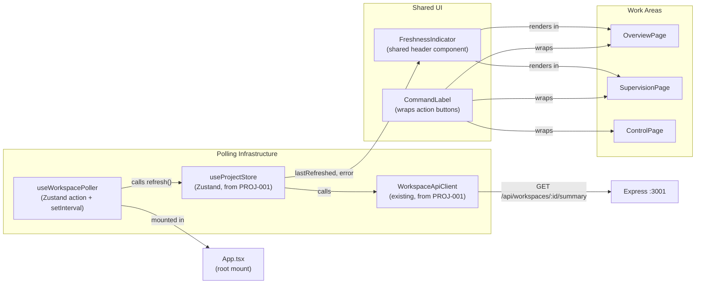

# Design — REQ-F-UX-001: UX Infrastructure
# Implements: REQ-F-UX-001, REQ-F-UX-002

**Version**: 0.1.0
**Date**: 2026-03-13
**Edge**: requirements→design
**Phase**: 2 (Foundation — depends on REQ-F-PROJ-001)
**Tenant**: react_vite

---

## Architecture Overview

Two independent UX concerns are addressed here:

1. **Live workspace state** (REQ-F-UX-001): a single polling hook (`useWorkspacePoller`) drives all work areas from fresh data on a ≤30s interval. A `FreshnessIndicator` component shows staleness visibly and escalates to error state when the workspace is unavailable.

2. **No syntax requirement** (REQ-F-UX-002): a `CommandLabel` component wraps every action button, surfacing the equivalent Genesis command as informational text. The user never needs to type it.



**Key decision**: `useWorkspacePoller` is mounted once at the app root (`App.tsx`), not per-page. This ensures polling runs continuously regardless of which work area the user is viewing. A single `setInterval` drives all data freshness.

---

## Component Design

### Component: useWorkspacePoller
**Implements**: REQ-F-UX-001
**Responsibilities**:
- Mount a `setInterval` at 30s that calls `useProjectStore.refresh()`
- Expose `startPolling()` and `stopPolling()` (for testing and cleanup)
- Propagate errors from `refresh()` into Zustand store as `pollingError`
- Clear `pollingError` on next successful poll

**Interfaces**:
```typescript
// Implements: REQ-F-UX-001

// Hook — mounted once at App root
function useWorkspacePoller(intervalMs: number = 30_000): void

// Additions to useProjectStore (Zustand)
interface ProjectStore {
  // ... existing fields from PROJ-001 ...
  lastRefreshed: Date | null       // set on every successful refresh()
  pollingError: string | null      // set on refresh() failure, cleared on success
  isRefreshing: boolean            // true during active refresh() call
}
```

**Implementation sketch**:
```typescript
// Implements: REQ-F-UX-001
function useWorkspacePoller(intervalMs = 30_000) {
  const refresh = useProjectStore((s) => s.refresh)

  useEffect(() => {
    // Fire immediately on mount — don't wait for first interval
    refresh()
    const id = setInterval(refresh, intervalMs)
    return () => clearInterval(id)
  }, [refresh, intervalMs])
}
```

**Mount location** (`App.tsx`):
```typescript
function App() {
  useWorkspacePoller()   // single instance, always running
  return <RouterProvider router={router} />
}
```

**Error propagation into Zustand** (`useProjectStore.refresh()`):
```typescript
refresh: async () => {
  const store = get()
  set({ isRefreshing: true })
  try {
    const summaries = await client.getWorkspaces()
    set({
      workspaceSummaries: new Map(summaries.map(s => [s.workspaceId, s])),
      lastRefreshed: new Date(),
      pollingError: null,
      isRefreshing: false,
    })
  } catch (err) {
    set({
      pollingError: err instanceof Error ? err.message : 'Workspace unavailable',
      isRefreshing: false,
      // lastRefreshed intentionally NOT updated — stale timestamp signals the problem
    })
  }
}
```

**Polling interval contract**: `intervalMs` defaults to 30,000ms (30s). In tests, pass a shorter value. The hook does not expose a manual trigger in production — `refresh()` from the store is available for immediate refresh on user action (e.g., after a gate approval).

**Dependencies**: Zustand `useProjectStore`, WorkspaceApiClient

---

### Component: FreshnessIndicator
**Implements**: REQ-F-UX-001
**Responsibilities**:
- Display "Last refreshed X seconds ago" using `lastRefreshed` from Zustand
- Update the displayed age every 5 seconds (local `setInterval` inside the component)
- Turn red and display error text when `pollingError` is set OR when `lastRefreshed` is older than 60 seconds
- Show a spinner while `isRefreshing` is true
- Never show stale data without indication

**Interfaces**:
```typescript
// Implements: REQ-F-UX-001
interface FreshnessIndicatorProps {
  className?: string
}

const FreshnessIndicator: React.FC<FreshnessIndicatorProps>
```

**State machine**:

| Condition | Display |
|-----------|---------|
| `isRefreshing === true` | Spinner + "Refreshing…" |
| `pollingError !== null` | Red badge — "Workspace unavailable: {error}" |
| `lastRefreshed` > 60s ago | Red badge — "Last refreshed {N}s ago — stale" |
| `lastRefreshed` ≤ 60s ago | Green/gray — "Last refreshed {N}s ago" |
| `lastRefreshed === null` | Gray — "Loading…" |

**Implementation sketch**:
```typescript
// Implements: REQ-F-UX-001
function FreshnessIndicator({ className }: FreshnessIndicatorProps) {
  const { lastRefreshed, pollingError, isRefreshing } = useProjectStore()
  const [now, setNow] = useState(() => Date.now())

  useEffect(() => {
    const id = setInterval(() => setNow(Date.now()), 5_000)
    return () => clearInterval(id)
  }, [])

  if (isRefreshing) return <Badge variant="outline"><Spinner /> Refreshing…</Badge>
  if (pollingError) return <Badge variant="destructive">Workspace unavailable: {pollingError}</Badge>
  if (!lastRefreshed) return <Badge variant="outline">Loading…</Badge>

  const ageMs = now - lastRefreshed.getTime()
  const ageSec = Math.round(ageMs / 1000)
  const stale = ageMs > 60_000

  return (
    <Badge variant={stale ? 'destructive' : 'secondary'}>
      Last refreshed {ageSec}s ago{stale ? ' — stale' : ''}
    </Badge>
  )
}
```

**Placement**: rendered in the application shell header, visible on every work area page. Individual pages do not need to render their own freshness indicator.

**Dependencies**: Zustand `useProjectStore`, shadcn/ui Badge, Tailwind

---

### Component: CommandLabel
**Implements**: REQ-F-UX-002
**Responsibilities**:
- Wrap any action button with an informational label showing the equivalent Genesis command
- The label is read-only — not a text input, not copyable input, just visible text beneath the button
- Rendered in muted monospace style so it is recognisably informational, not interactive
- The command string is derived from action parameters (feature ID, edge, gate name) — never hardcoded

**Interfaces**:
```typescript
// Implements: REQ-F-UX-002
interface CommandLabelProps {
  command: string          // the genesis command equivalent, e.g. "gen-start --feature REQ-F-AUTH-001"
  children: React.ReactNode  // the action button(s)
  className?: string
}

const CommandLabel: React.FC<CommandLabelProps>
```

**Usage pattern**:
```typescript
// In ControlPage — start iteration action
<CommandLabel command={`gen-start --feature ${featureId}`}>
  <Button onClick={handleStartIteration}>Start Iteration</Button>
</CommandLabel>

// In SupervisionPage — gate approval action
<CommandLabel command={`gen-review --feature ${featureId} --gate ${gateName} --decision approved`}>
  <Button onClick={handleApprove}>Approve</Button>
  <Button variant="destructive" onClick={handleReject}>Reject</Button>
</CommandLabel>

// In ControlPage — spawn child
<CommandLabel command={`gen-spawn --type ${childType} --parent ${featureId} --reason "${reason}"`}>
  <Button onClick={handleSpawn}>Spawn Child Vector</Button>
</CommandLabel>

// In ReleaseArea — initiate release
<CommandLabel command="gen-release">
  <Button onClick={handleRelease}>Initiate Release</Button>
</CommandLabel>
```

**Implementation sketch**:
```typescript
// Implements: REQ-F-UX-002
function CommandLabel({ command, children, className }: CommandLabelProps) {
  return (
    <div className={cn('flex flex-col gap-1', className)}>
      {children}
      <span className="text-xs font-mono text-muted-foreground pl-0.5">
        {command}
      </span>
    </div>
  )
}
```

**Design note**: the label sits below the button, not in a tooltip, so it is visible without interaction. This satisfies the "informational label" requirement in REQ-F-UX-002 without requiring the user to hover to discover it.

**Command string construction** — helper functions:
```typescript
// src/lib/commandStrings.ts
// Implements: REQ-F-UX-002

export const CMD = {
  startIteration: (featureId: string) =>
    `gen-start --feature ${featureId}`,

  approveGate: (featureId: string, edge: string, gateName: string) =>
    `gen-review --feature ${featureId} --gate ${gateName} --decision approved`,

  rejectGate: (featureId: string, edge: string, gateName: string, comment: string) =>
    `gen-review --feature ${featureId} --gate ${gateName} --decision rejected --comment "${comment}"`,

  spawnChild: (parentId: string, type: string, reason: string) =>
    `gen-spawn --type ${type} --parent ${parentId} --reason "${reason}"`,

  release: () => 'gen-release',
} as const
```

**Dependencies**: shadcn/ui, Tailwind, cn utility

---

## Integration with WorkspaceApiClient

`useWorkspacePoller` does not call `WorkspaceApiClient` directly — it calls `useProjectStore.refresh()`, which is already defined in the PROJ-001 design and calls `WorkspaceApiClient.getWorkspaces()` (and `getWorkspaceSummary()` per workspace).

No new API endpoints are required for UX-001 or UX-002. The polling mechanism reuses the existing data path.

**Polling sequence**:

```
setInterval fires (30s)
  → useProjectStore.refresh()
    → WorkspaceApiClient.getWorkspaces()
      → GET /api/workspaces (Express)
        → reads each registered workspace
        → returns WorkspaceSummary[]
    → store updates: workspaceSummaries, lastRefreshed
    → FreshnessIndicator re-renders with new age
    → all work area pages re-render from updated store
```

---

## Error State Handling

REQ-F-UX-001 AC3: "If the workspace is unavailable, the UI displays a clear error state rather than stale data without indication."

Three distinct error conditions and their handling:

| Condition | Detection | UI Response |
|-----------|-----------|-------------|
| Express server unreachable | `fetch()` throws NetworkError | `pollingError = "Cannot connect to local server"`, FreshnessIndicator red |
| Workspace path unavailable | API returns `{ available: false }` in WorkspaceSummary | ProjectCard shows "workspace unavailable" indicator (from PROJ-001 design) |
| events.jsonl malformed | API returns `malformedCount > 0` in WorkspaceSummary | Work area shows "N malformed events — some data may be missing" inline warning |

The last-refreshed timestamp is intentionally not updated on failure. This means FreshnessIndicator will show an increasing stale age alongside the error — double-reinforcing that something is wrong.

On recovery (next successful poll): `pollingError` is cleared, `lastRefreshed` is updated, and all indicators return to normal state automatically.

---

## Traceability Matrix

| REQ Key | Component(s) |
|---------|-------------|
| REQ-F-UX-001 | useWorkspacePoller (30s polling), FreshnessIndicator (staleness display, error state) |
| REQ-F-UX-002 | CommandLabel, CMD helper (commandStrings.ts) |

---

## Package / Module Structure

```
genesis_manager/
└── imp_react_vite/
    └── src/
        ├── hooks/
        │   └── useWorkspacePoller.ts        # Implements: REQ-F-UX-001
        ├── components/
        │   ├── FreshnessIndicator.tsx       # Implements: REQ-F-UX-001
        │   └── CommandLabel.tsx             # Implements: REQ-F-UX-002
        ├── lib/
        │   └── commandStrings.ts            # Implements: REQ-F-UX-002
        └── stores/
            └── projectStore.ts              # extended: lastRefreshed, pollingError, isRefreshing
```

**Changes to existing files**:
- `src/stores/projectStore.ts` — add `lastRefreshed`, `pollingError`, `isRefreshing` fields and error handling in `refresh()`
- `src/App.tsx` — add single `useWorkspacePoller()` call at root

No new server routes required.

---

## ADR Index

| ADR | Decision | Status |
|-----|----------|--------|
| ADR-GM-001 | State management: Zustand | RESOLVED |
| ADR-GM-002 | Workspace access: local Express server | RESOLVED |
| ADR-GM-003 | Component library: Tailwind CSS + shadcn/ui | RESOLVED |
| ADR-GM-004 | Router: React Router 6 | RESOLVED |

No new ADRs required — polling interval (30s) is a spec constraint from REQ-F-UX-001, not an architectural decision. CommandLabel is a display component, not a new pattern.
