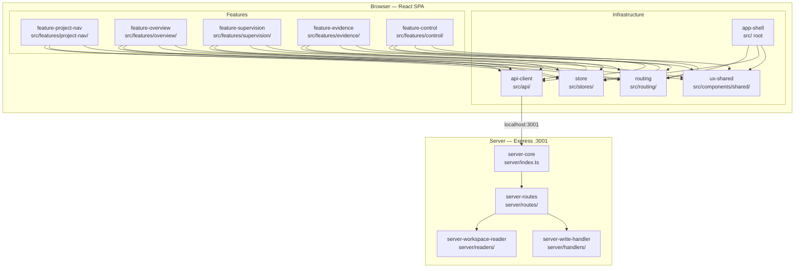

# Module Decomposition — genesis_manager
# Implements: REQ-F-PROJ-001, REQ-F-NAV-001, REQ-F-UX-001, REQ-F-OVR-001, REQ-F-SUP-001, REQ-F-EVI-001, REQ-F-CTL-001

**Version**: 0.1.0
**Date**: 2026-03-13
**Edge**: design→module_decomposition
**Tenant**: react_vite
**Source**: All 7 feature design documents + ADR-GM-001..005

---

## 1. Module Map

genesis_manager is decomposed into **5 infrastructure modules** (shared across all features) and **5 feature modules** (each owning one page area), plus **4 server modules** (Express server internals).



---

### Module: api-client
**Path**: `imp_react_vite/src/api/`
**Implements**: WorkspaceApiClient (ADR-GM-002), all REST request/response types

**Responsibilities**:
- Issue all HTTP requests to the local Express server
- Hold all shared TypeScript types: `WorkspaceSummary`, `RegisteredWorkspace`, `FeatureVector`, `GateItem`, `TraceabilityEntry`, `WorkspaceEvent`
- Handle base URL (`VITE_API_URL`, default `http://localhost:3001`)
- Typed error handling: network failure → `ApiError`; server 4xx/5xx → typed `ApiError` with `status` + `message`

**Exposes**:
```typescript
// src/api/WorkspaceApiClient.ts
class WorkspaceApiClient {
  getWorkspaces(): Promise<WorkspaceSummary[]>
  addWorkspace(path: string): Promise<WorkspaceSummary>
  removeWorkspace(id: string): Promise<void>
  getWorkspaceSummary(id: string): Promise<WorkspaceSummary>
  getOverview(id: string): Promise<WorkspaceOverview>
  getGates(id: string): Promise<GateItem[]>
  getFeatures(id: string): Promise<FeatureVector[]>
  getTraceability(id: string): Promise<TraceabilityEntry[]>
  postEvent(id: string, event: EventPayload): Promise<void>
  rerunGapAnalysis(id: string): Promise<void>
  setAutoMode(id: string, featureId: string, enabled: boolean): Promise<void>
}

// src/api/types.ts — all shared domain types
```

**Depends On**: None (leaf module — browser fetch API only)

---

### Module: store
**Path**: `imp_react_vite/src/stores/`
**Implements**: REQ-F-PROJ-001..004, REQ-F-UX-001 (ADR-GM-001)

**Responsibilities**:
- `projectStore.ts` — registered workspace paths (persisted localStorage), active project ID, workspace summaries map, polling error state
- `workspaceStore.ts` — active workspace detail data (overview, gates, features, traceability); cleared on workspace switch

**Exposes**:
```typescript
// projectStore.ts
interface ProjectStore {
  registeredPaths: string[]          // persisted
  activeProjectId: string | null     // persisted
  workspaceSummaries: Record<string, WorkspaceSummary>
  pollingError: string | null
  lastRefreshed: Date | null
  addWorkspace(path: string): Promise<void>
  removeWorkspace(id: string): void
  setActiveProject(id: string): void
  refreshAll(): Promise<void>
}

// workspaceStore.ts
interface WorkspaceStore {
  overview: WorkspaceOverview | null
  gates: GateItem[]
  features: FeatureVector[]
  traceability: TraceabilityEntry[]
  loadWorkspace(id: string): Promise<void>
  clearWorkspace(): void
}
```

**Depends On**: `api-client` (WorkspaceApiClient)

---

### Module: routing
**Path**: `imp_react_vite/src/routing/`
**Implements**: REQ-F-NAV-001..005 (ADR-GM-004)

**Responsibilities**:
- `routes.ts` — ROUTES constant: typed map of all canonical paths
- `navHandle.ts` — `NavHandle` discriminated union type (req/feature/run/event variants) + `buildNavPath()` helper
- Route configuration for `createBrowserRouter` (imported by `app-shell`)

**Exposes**:
```typescript
// routes.ts
const ROUTES = {
  ROOT: '/',
  PROJECT: '/project/:workspaceId',
  OVERVIEW: '/project/:workspaceId/overview',
  SUPERVISION: '/project/:workspaceId/supervision',
  EVIDENCE: '/project/:workspaceId/evidence',
  FEATURE_DETAIL: '/project/:workspaceId/feature/:featureId',
  RUN_DETAIL: '/project/:workspaceId/run/:runId',
  REQ_DETAIL: '/project/:workspaceId/req/:reqKey',
  EVENT_DETAIL: '/project/:workspaceId/event/:eventIndex',
} as const

// navHandle.ts
type NavHandle =
  | { kind: 'feature'; featureId: string }
  | { kind: 'run'; runId: string }
  | { kind: 'req'; reqKey: string }
  | { kind: 'event'; eventIndex: number }

function buildNavPath(workspaceId: string, handle: NavHandle): string
```

**Depends On**: None (leaf module — React Router 6 types only)

---

### Module: ux-shared
**Path**: `imp_react_vite/src/components/shared/`
**Implements**: REQ-F-UX-001, REQ-F-UX-002

**Responsibilities**:
- `FreshnessIndicator.tsx` — 5-state machine: refreshing / error / stale>60s / fresh / loading
- `CommandLabel.tsx` — displays genesis command equivalent for an action
- `commandStrings.ts` — `CMD` helper: maps action type → genesis command string
- `ConfirmActionDialog.tsx` — shared confirmation dialog with command display (REQ-F-UX-002, REQ-F-CTL-001)

**Exposes**:
```typescript
// FreshnessIndicator.tsx
interface FreshnessIndicatorProps {
  lastRefreshed: Date | null
  isRefreshing: boolean
  error: string | null
}
function FreshnessIndicator(props: FreshnessIndicatorProps): JSX.Element

// CommandLabel.tsx
interface CommandLabelProps { command: string }
function CommandLabel(props: CommandLabelProps): JSX.Element

// commandStrings.ts
const CMD = {
  approveGate: (feature: string, edge: string) => string
  rejectGate: (feature: string, edge: string) => string
  spawnFeature: (type: string) => string
  setAutoMode: (feature: string, enabled: boolean) => string
  rerunGaps: (workspaceId: string) => string
}

// ConfirmActionDialog.tsx
interface ConfirmActionDialogProps {
  open: boolean
  title: string
  description: string
  command: string          // shown as CommandLabel
  onConfirm: () => void
  onCancel: () => void
}
function ConfirmActionDialog(props: ConfirmActionDialogProps): JSX.Element
```

**Depends On**: `routing` (for NavHandle — used in CommandLabel only), shadcn/ui Dialog

---

### Module: app-shell
**Path**: `imp_react_vite/src/` (root files)
**Implements**: REQ-F-UX-001 (useWorkspacePoller), App entry, router setup

**Responsibilities**:
- `main.tsx` — React root mount
- `App.tsx` — creates router with `createBrowserRouter`, mounts `useWorkspacePoller` once at root
- `hooks/useWorkspacePoller.ts` — fires immediately, then every 30s; calls `store.refreshAll()`; propagates error to `pollingError`

**Exposes**:
```typescript
// hooks/useWorkspacePoller.ts
function useWorkspacePoller(): void  // mounted once at App root, no return value
```

**Depends On**: `store` (projectStore.refreshAll), `routing` (router config)

---

### Module: feature-project-nav
**Path**: `imp_react_vite/src/features/project-nav/`
**Implements**: REQ-F-PROJ-001, REQ-F-PROJ-002, REQ-F-PROJ-003, REQ-F-PROJ-004

**Responsibilities**:
- `ProjectListPage.tsx` — root page (route: `/`)
- `ProjectCard.tsx` — single project summary card with attention badge
- `WorkspaceConfigDrawer.tsx` — add/remove workspace paths

**Exposes**: React route components (consumed by `routing` module via router config)

**Depends On**: `store` (projectStore), `api-client` (addWorkspace, removeWorkspace), `routing` (ROUTES, navigate)

---

### Module: feature-overview
**Path**: `imp_react_vite/src/features/overview/`
**Implements**: REQ-F-OVR-001, REQ-F-OVR-002, REQ-F-OVR-003, REQ-F-OVR-004

**Responsibilities**:
- `ProjectOverviewPage.tsx` — fixed-height CSS grid layout (REQ-F-OVR-001 AC3: 1440×900 no-scroll)
- `FeatureStatusBar.tsx` — horizontal status bar with progress indicators
- `FeatureStatusCounts.tsx` — pending gates count prominently (REQ-BR-SUPV-002)
- `ChangeHighlighter.tsx` — wraps content, highlights items with events newer than `lastSessionStart`

**Exposes**: React route component `ProjectOverviewPage`

**Depends On**: `store` (workspaceStore.overview), `api-client` (getOverview), `ux-shared` (FreshnessIndicator), `routing` (ROUTES)

---

### Module: feature-supervision
**Path**: `imp_react_vite/src/features/supervision/`
**Implements**: REQ-F-SUP-001, REQ-F-SUP-002, REQ-F-SUP-003, REQ-F-SUP-004

**Responsibilities**:
- `SupervisionConsolePage.tsx` — two-panel layout: sticky HumanGateQueue + scrollable FeatureList
- `HumanGateQueue.tsx` — pending gates sorted by urgency; collapses to badge when queue empty
- `FeatureList.tsx` — all features sorted: stuck > blocked > in_progress > pending
- `GateActionPanel.tsx` — per-gate approve/reject form with required comment for rejection
- `AutoModeToggle.tsx` — derives auto-mode from last `auto_mode_set` event; toggle emits new event

**Exposes**: React route component `SupervisionConsolePage`

**Depends On**: `store` (workspaceStore.gates, workspaceStore.features), `api-client` (postEvent, setAutoMode), `ux-shared` (ConfirmActionDialog, FreshnessIndicator, CMD), `routing` (ROUTES, NavHandle)

---

### Module: feature-evidence
**Path**: `imp_react_vite/src/features/evidence/`
**Implements**: REQ-F-EVI-001, REQ-F-EVI-002, REQ-F-EVI-003, REQ-F-EVI-004

**Responsibilities**:
- `EvidenceBrowserPage.tsx` — two-column layout: TraceabilityTable + EventDetailPanel
- `TraceabilityTable.tsx` — sortable table of REQ key → code → tests coverage
- `EventDetailPanel.tsx` — shows event detail when row selected; event identified by line index
- `GapAnalysisPanel.tsx` — shows gap analysis results; "Re-run" button triggers gen-gaps subprocess

**Exposes**: React route component `EvidenceBrowserPage`

**Depends On**: `store` (workspaceStore.traceability), `api-client` (getTraceability, rerunGapAnalysis), `ux-shared` (FreshnessIndicator, CMD), `routing` (ROUTES, NavHandle)

---

### Module: feature-control
**Path**: `imp_react_vite/src/features/control/`
**Implements**: REQ-F-CTL-001, REQ-F-CTL-002, REQ-F-CTL-003, REQ-F-CTL-004
**Note**: ControlSurface renders as a context panel **within** SupervisionConsolePage (not a separate route)

**Responsibilities**:
- `ControlSurface.tsx` — panel wrapper: gate actions + spawn + auto-mode in one place
- All actual action panels are shared with `feature-supervision`:
  - `GateActionPanel` (owned by feature-supervision, imported by ControlSurface)
  - `AutoModeToggle` (owned by feature-supervision, imported by ControlSurface)
- `SpawnFeaturePanel.tsx` — form to spawn new feature vector; emits `spawn_created` event

**Exposes**: `ControlSurface` component (imported by SupervisionConsolePage)

**Depends On**: `feature-supervision` (GateActionPanel, AutoModeToggle), `api-client` (postEvent), `ux-shared` (ConfirmActionDialog, CMD)

---

### Module: server-core
**Path**: `imp_react_vite/server/index.ts`
**Implements**: ADR-GM-002 (Express server bridge)

**Responsibilities**:
- Start Express on `:3001`
- Mount middleware (JSON body, CORS for localhost:5173 in dev)
- Mount `server-routes`
- In production: serve static SPA build at root

**Exposes**: `startServer(port: number): void`

**Depends On**: `server-routes`, `server-workspace-reader`, `server-write-handler`

---

### Module: server-workspace-reader
**Path**: `imp_react_vite/server/readers/`
**Implements**: REQ-DATA-WORK-001

**Responsibilities**:
- `WorkspaceReader.ts` — reads `events.jsonl`, `project_constraints.yml`, feature vector YAMLs
- `TraceabilityScanner.ts` — walks project source files, extracts `# Implements:` / `# Validates:` tags, mtime-cached
- `EventLogReader.ts` — parses `events.jsonl` into typed events, computes derived values (isStuck, pendingGates, auto_mode)

**Exposes**:
```typescript
class WorkspaceReader {
  getWorkspaceSummary(workspacePath: string): Promise<WorkspaceSummary>
  getOverview(workspacePath: string): Promise<WorkspaceOverview>
  getGates(workspacePath: string): Promise<GateItem[]>
  getFeatures(workspacePath: string): Promise<FeatureVector[]>
}

class TraceabilityScanner {
  scan(projectRoot: string): Promise<TraceabilityEntry[]>
}

class EventLogReader {
  readAll(eventsPath: string): Promise<WorkspaceEvent[]>
  computeAutoMode(events: WorkspaceEvent[], featureId: string): boolean
  computeIsStuck(events: WorkspaceEvent[], featureId: string, edge: string): boolean
}
```

**Depends On**: Node.js `fs/promises`, `yaml`, `proper-lockfile` (read only — lockfile checked before read)

---

### Module: server-routes
**Path**: `imp_react_vite/server/routes/`
**Implements**: ADR-GM-002, ADR-GM-005

**Responsibilities**:
- `workspaces.ts` — GET/POST/DELETE `/api/workspaces`, GET `/api/workspaces/:id/summary`
- `workspace.ts` — GET `/api/workspaces/:id/overview`, `/gates`, `/features`, `/traceability`
- `events.ts` — POST `/api/workspaces/:id/events` (write path — delegates to server-write-handler)
- `gapAnalysis.ts` — POST `/api/workspaces/:id/gap-analysis/rerun` (spawns gen-gaps as child process)
- `nav.ts` — GET `/api/features/:id`, `/api/runs/:id`, `/api/req/:key`, `/api/events/:index`

**Exposes**: Express Router (mounted by server-core)

**Depends On**: `server-workspace-reader`, `server-write-handler`

---

### Module: server-write-handler
**Path**: `imp_react_vite/server/handlers/`
**Implements**: REQ-DATA-WORK-002, ADR-GM-005

**Responsibilities**:
- `EventEmitHandler.ts` — acquires `proper-lockfile` lock on `events.jsonl`, constructs full event JSON (adds `timestamp`, `project`), appends single JSONL line, releases lock
- `WriteLog.ts` — appends write log entry to `~/.genesis_manager/write_log.jsonl` per write (REQ-DATA-WORK-002 AC3)

**Exposes**:
```typescript
async function emitEvent(
  workspacePath: string,
  payload: EventPayload
): Promise<void>  // throws WriteError on lock failure
```

**Depends On**: Node.js `fs/promises`, `proper-lockfile`

---

## 2. Module Dependency DAG

| Module | Depends On | Reason |
|--------|-----------|--------|
| `api-client` | — | Leaf; uses browser fetch only |
| `routing` | — | Leaf; uses React Router 6 types only |
| `ux-shared` | `routing` | NavHandle type in CommandLabel |
| `store` | `api-client` | WorkspaceApiClient for refresh |
| `app-shell` | `store`, `routing` | useWorkspacePoller + router setup |
| `feature-project-nav` | `store`, `api-client`, `routing` | ProjectListPage reads store, writes via api-client |
| `feature-overview` | `store`, `api-client`, `ux-shared`, `routing` | Reads overview data, shows freshness |
| `feature-supervision` | `store`, `api-client`, `ux-shared`, `routing` | Gate queue + feature list |
| `feature-evidence` | `store`, `api-client`, `ux-shared`, `routing` | Traceability + events |
| `feature-control` | `feature-supervision`, `api-client`, `ux-shared` | ControlSurface panel imports gate/auto-mode from supervision |
| `server-core` | `server-routes` | Mounts routes |
| `server-workspace-reader` | — | Leaf; uses Node.js fs only |
| `server-routes` | `server-workspace-reader`, `server-write-handler` | Delegates reads/writes |
| `server-write-handler` | — | Leaf; uses Node.js fs + proper-lockfile |

**Topological order** (build/test):
1. `api-client`, `routing`, `server-workspace-reader`, `server-write-handler` (leaves — build first)
2. `ux-shared`, `store`, `server-routes`
3. `app-shell`, `feature-project-nav`, `feature-overview`, `feature-supervision`, `feature-evidence`
4. `feature-control` (depends on `feature-supervision`)
5. `server-core`

**Cycle check**: DAG is acyclic. `feature-control` imports from `feature-supervision` (single direction: control → supervision, never back). No circular deps.

---

## 3. Interface Contracts

### api-client → server-routes

```typescript
// GET /api/workspaces
getWorkspaces(): Promise<WorkspaceSummary[]>
// POST /api/workspaces  { path: string }
addWorkspace(path: string): Promise<WorkspaceSummary>
// DELETE /api/workspaces/:id
removeWorkspace(id: string): Promise<void>
// GET /api/workspaces/:id/summary
getWorkspaceSummary(id: string): Promise<WorkspaceSummary>
// GET /api/workspaces/:id/overview
getOverview(id: string): Promise<WorkspaceOverview>
// GET /api/workspaces/:id/gates
getGates(id: string): Promise<GateItem[]>
// GET /api/workspaces/:id/features
getFeatures(id: string): Promise<FeatureVector[]>
// GET /api/workspaces/:id/traceability
getTraceability(id: string): Promise<TraceabilityEntry[]>
// POST /api/workspaces/:id/events
postEvent(id: string, event: EventPayload): Promise<void>
// POST /api/workspaces/:id/gap-analysis/rerun
rerunGapAnalysis(id: string): Promise<void>
```

Error contract: 400 → `ApiError { status: 400, message: string }`, 404 → `ApiError { status: 404 }`, 500 → `ApiError { status: 500, message: string }`

### store → api-client

```typescript
// projectStore uses:
WorkspaceApiClient.getWorkspaces(): Promise<WorkspaceSummary[]>
WorkspaceApiClient.addWorkspace(path: string): Promise<WorkspaceSummary>
WorkspaceApiClient.removeWorkspace(id: string): Promise<void>
```

### feature-supervision → api-client (write path)

```typescript
// Gate action (emits review_approved or review_rejected)
WorkspaceApiClient.postEvent(workspaceId, {
  event_type: 'review_approved' | 'review_rejected',
  feature: string,
  edge: string,
  actor: 'human',
  comment?: string    // required for reject
}): Promise<void>

// Auto-mode toggle (emits auto_mode_set)
WorkspaceApiClient.setAutoMode(workspaceId, featureId, enabled): Promise<void>
// internally: POST /api/workspaces/:id/events { event_type: 'auto_mode_set', feature, data: { enabled } }
```

### server-routes → server-write-handler

```typescript
emitEvent(workspacePath: string, payload: EventPayload): Promise<void>
// payload: { event_type, feature?, edge?, actor?, comment?, data? }
// server adds: timestamp (ISO), project (from project_constraints.yml)
// WriteError thrown if lock acquisition fails (caller returns 503)
```

### server-routes → server-workspace-reader

```typescript
WorkspaceReader.getWorkspaceSummary(path): Promise<WorkspaceSummary>
WorkspaceReader.getOverview(path): Promise<WorkspaceOverview>
WorkspaceReader.getGates(path): Promise<GateItem[]>
WorkspaceReader.getFeatures(path): Promise<FeatureVector[]>
TraceabilityScanner.scan(projectRoot): Promise<TraceabilityEntry[]>
EventLogReader.readAll(eventsPath): Promise<WorkspaceEvent[]>
EventLogReader.computeAutoMode(events, featureId): boolean
EventLogReader.computeIsStuck(events, featureId, edge): boolean
```

### feature-control → feature-supervision

```typescript
// ControlSurface imports these components (not function calls — React component imports)
import { GateActionPanel } from '../supervision/GateActionPanel'
import { AutoModeToggle } from '../supervision/AutoModeToggle'
// No function-level contract — component prop types serve as contract
interface GateActionPanelProps {
  gate: GateItem
  onApprove: (comment: string) => Promise<void>
  onReject: (comment: string) => Promise<void>   // comment required — enforced by form validation
}
interface AutoModeToggleProps {
  featureId: string
  enabled: boolean
  onToggle: (enabled: boolean) => Promise<void>
}
```

---

## 4. Parallelism Analysis

Given the module dependency DAG, these construction tasks can run in parallel:

**Wave 1** (fully independent — no deps):
- `api-client` type definitions + client class
- `routing` ROUTES constant + NavHandle type
- `server-workspace-reader` WorkspaceReader + EventLogReader
- `server-write-handler` EventEmitHandler + WriteLog

**Wave 2** (after Wave 1):
- `store` (needs api-client)
- `ux-shared` (needs routing for NavHandle)
- `server-routes` (needs reader + write-handler)

**Wave 3** (after Wave 2):
- `app-shell` (needs store + routing)
- `feature-project-nav` (needs store + api-client + routing)
- `feature-overview` (needs store + api-client + ux-shared + routing)
- `feature-supervision` (needs store + api-client + ux-shared + routing) ← must complete before feature-control
- `feature-evidence` (needs store + api-client + ux-shared + routing)
- `server-core` (needs server-routes)

**Wave 4** (after Wave 3):
- `feature-control` (needs feature-supervision + api-client + ux-shared)

**Max parallelism**: 4 agents in Wave 1, 3 in Wave 2, 6 in Wave 3 (including server-core), 1 in Wave 4.

---

## 5. Feature → Module Coverage

| Feature | Modules Touched | Notes |
|---------|----------------|-------|
| REQ-F-PROJ-001 | api-client, store, routing, feature-project-nav, server-core, server-workspace-reader, server-routes | Foundation — defines shared infra |
| REQ-F-NAV-001 | routing, app-shell, server-routes | routing module IS the nav feature |
| REQ-F-UX-001 | ux-shared, app-shell | FreshnessIndicator + polling live here |
| REQ-F-OVR-001 | feature-overview, api-client, server-workspace-reader, server-routes | Single page feature |
| REQ-F-SUP-001 | feature-supervision, api-client, server-workspace-reader, server-routes, server-write-handler | Reads + gate write path |
| REQ-F-EVI-001 | feature-evidence, api-client, server-workspace-reader, server-routes | Traceability scan + gap rerun |
| REQ-F-CTL-001 | feature-control, feature-supervision (shared components), api-client, server-write-handler | CTL is a panel on SUP |

---

## 6. Source Findings (Backward Analysis)

**SOURCE_AMBIGUITY-001**: `ControlSurface` (REQ-F-CTL-001) is documented as a "context panel on top of Supervision" — does it live in `feature-supervision` or `feature-control`?
- **Resolution**: `feature-control` owns `ControlSurface.tsx`. It imports `GateActionPanel` and `AutoModeToggle` from `feature-supervision`. This is a cross-module React component import — valid, acyclic, explicit contract via prop types.

**SOURCE_AMBIGUITY-002**: `FreshnessIndicator` appears in multiple feature designs.
- **Resolution**: Defined once in `ux-shared`. All features import from there. No duplication.

**SOURCE_AMBIGUITY-003**: `EventLogReader.computeAutoMode()` — should auto-mode state be held in `store` or derived on each render?
- **Resolution**: Auto-mode is derived fresh from the event log on each workspace load (REQ-DATA-WORK-001: workspace as sole data source). `EventLogReader` computes it; `workspaceStore` holds the derived value for the current session. Not persisted across refreshes — re-derived on each poll.

---

*All 7 MVP features are mapped. No unmapped components. DAG is acyclic. Topological order defined. Construction waves enable 4-agent parallelism in Wave 3.*
