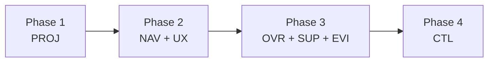

# Design Recommendations — genesis_manager

**Version**: 0.1.0
**Date**: 2026-03-13
**Status**: Candidate
**Edge**: feature_decomposition → design_recommendations
**Implements**: REQ-F-PROJ-001, REQ-F-NAV-001, REQ-F-UX-001, REQ-F-OVR-001,
               REQ-F-SUP-001, REQ-F-EVI-001, REQ-F-CTL-001

---

## Design Order

Derived from the dependency DAG (FEATURE_VECTORS.md §Build Order). Features at the
same phase have no dependencies between them and can be designed in parallel.

### Design Phase 1: Foundation
**Features**: REQ-F-PROJ-001 (Project Navigator)
**Rationale**: The entry point. Workspace registration and project switching are required
by every other feature. Nothing can be designed for OVR/SUP/EVI/CTL until the workspace
model (how a project is loaded, what its state surface looks like) is defined.
**Blocks**: All other phases.

### Design Phase 2: Infrastructure (parallel)
**Features**: REQ-F-NAV-001 (Navigation Infrastructure), REQ-F-UX-001 (UX Infrastructure)
**Rationale**: Both depend only on Phase 1 (PROJ) and have no dependency on each other.
NAV defines the URL schema and canonical page contracts — all other features link into it.
UX defines the live-polling mechanism and freshness indicator — all other features consume it.
Designing these in parallel after Phase 1 allows Phase 3 features to start immediately once
both are done.
**Blocks**: Phase 3 (OVR, SUP, EVI), Phase 4 (CTL).

### Design Phase 3: Work Areas (parallel)
**Features**: REQ-F-OVR-001 (Project Overview), REQ-F-SUP-001 (Supervision Console), REQ-F-EVI-001 (Evidence Browser)
**Rationale**: All three depend on NAV (canonical page contracts) and UX (live polling) but
have no dependencies on each other. Designing all three in parallel maximises throughput.
**Blocks**: Phase 4 (CTL depends on SUP being defined so the supervision surface exists to act on).

### Design Phase 4: Control
**Features**: REQ-F-CTL-001 (Control Surface)
**Rationale**: CTL acts on what supervision surfaces (pending gates, stuck features, iteration
actions). The SUP design must define the supervision surface before CTL can specify what actions
to bind to it. CTL also requires the workspace write protocol (event emission) to be resolved —
that ADR area must be settled in Phase 2/3 design.
**Blocks**: Nothing (CTL is the final MVP phase).

**Critical path**: PROJ → NAV → SUP → CTL (4 sequential levels, 4 design iterations minimum on critical path).

---

## Cross-Cutting Concerns

Five concerns span 3+ features and must be designed once, not re-invented per-feature.

### Cross-Cutting: Workspace I/O Layer

**Appears in**: PROJ (registration + loading), NAV (data resolution for canonical pages),
UX (polling), OVR (build status), SUP (gate queue), EVI (event history, coverage scan), CTL (event emission)
**Design implication**: A single `WorkspaceReader` service must be designed in Phase 1/2.
All features access workspace data through it — no direct filesystem calls from components.
This centralises the read serialisation, caching, and error surface.

### Cross-Cutting: Canonical URL Schema

**Appears in**: NAV (defines it), OVR (status counts link to filtered feature list), SUP (feature
IDs are navigation handles), EVI (REQ keys, run IDs, events all link out), CTL (approves gates
surfaced by SUP with stable links)
**Design implication**: NAV must publish a `ROUTES` constant — a typed map of all canonical URLs.
Every other feature imports from `ROUTES` rather than constructing URLs inline. This prevents
link drift and ensures dead-link detection is centralised.

### Cross-Cutting: Live Polling / Data Freshness

**Appears in**: UX (defines the ≤30s polling contract), OVR (build status must be fresh), SUP
(gate queue must be fresh), EVI (coverage and event history must be fresh)
**Design implication**: A single `useWorkspaceData()` hook (or equivalent Zustand store) must
supply all workspace state. All data-consuming components subscribe to it — they do not each
implement their own polling. The freshness indicator is a shared UI element.

### Cross-Cutting: Event Emission Write Serialisation

**Appears in**: CTL (approve/reject gate emits `review_approved`; start iteration emits `edge_started`;
spawn emits `spawn_created`; auto-mode toggle emits `auto_mode_set`)
**Design implication**: Writing to `events.jsonl` requires append-only, crash-safe serialisation
(REQ-DATA-WORK-002 from requirements). A `WorkspaceWriter` service must be designed — events
written sequentially, never concurrently. This is a hard ADR decision (see ADR Areas §Workspace Write Protocol).

### Cross-Cutting: Component Design System

**Appears in**: All features — status badges (converged/iterating/blocked/stuck), navigation
handles (REQ-key chips, feature-ID pills, run-ID badges), freshness indicators, gate queue items
**Design implication**: A shared `components/` directory must be designed with these primitives
before feature-specific work begins. Otherwise each feature re-invents the badge colour scheme.
Minimum: `StatusBadge`, `NavHandle`, `FreshnessIndicator`, `GateQueueItem`.

---

## ADR Areas

All mandatory constraint dimensions (from project_constraints.yml) plus architecture decisions
that must be made before design can proceed.

| ADR Area | Status | Note |
|----------|--------|------|
| **Ecosystem compatibility** (TypeScript 5 + React 18 + Vite 5) | RESOLVED | Set in project_constraints.yml |
| **Deployment target** (local SPA, no cloud) | RESOLVED | Set in project_constraints.yml |
| **Security model** (no auth, single-user) | RESOLVED | Set in project_constraints.yml |
| **Build system** (Vite + npm) | RESOLVED | Set in project_constraints.yml |
| **State management** (Zustand vs Context API vs Jotai) | TBD — decide in Phase 1 design | Zustand is tentatively chosen; ADR must document alternatives and consequences |
| **Workspace read protocol** (polling vs filesystem watch) | TBD — spike recommended | FEATURE_VECTORS.md flags this as a risk; filesystem watch APIs are platform-dependent in browser context; polling is safer |
| **Workspace write protocol** (event emission serialisation) | TBD — decide before CTL design | Required before Phase 4 (CTL); may need a backend shim if direct fs write is not available in browser |
| **Router** (React Router 6 vs TanStack Router) | TBD — decide in Phase 2 design | Canonical URL schema is NAV's primary output; router choice constrains it |
| **Component library** (Tailwind + shadcn/ui vs MUI vs custom) | TBD — decide in Phase 1 design | Affects design system cross-cutting concern; decide early to unblock all phases |
| **Advisory: performance envelope** (UI transitions < 200ms) | Acknowledged — no ADR needed | Single-user local SPA; performance budget is unlikely to bind unless workspace scans are slow |
| **Advisory: observability** | Acknowledged — console logging only initially | No ADR needed; revisit post-MVP |
| **Advisory: error handling** | Acknowledged — React Error Boundaries | Settled in project_constraints.yml; ADR not needed |

**ADRs required before Phase 3 begins**:
- ADR-001: State management selection (Zustand vs alternatives)
- ADR-002: Workspace read protocol (polling vs filesystem watch — may require spike)
- ADR-003: Component library / design system foundation
- ADR-004: Router choice and canonical URL schema

**ADR required before Phase 4 (CTL) begins**:
- ADR-005: Workspace write protocol (event emission serialisation + crash safety)

---

## Deferred Features

**REQ-F-REL-001 Release Dashboard** — explicitly out of scope for MVP.

- Functionality available via CLI (`gen-release`); no GUI required for launch
- Depends on REQ-F-EVI-001 (Evidence Browser) converging first
- Design does NOT include any Release Dashboard components, routing, or data fetching
- No REQ-F-REL-* keys appear in Phase 1–4 design

---

## Feature-Implied Constraints

Patterns across the feature set that signal design directions (not decisions):

- **All 5 data-displaying features** (OVR, SUP, EVI, NAV, CTL) require workspace data → strong
  signal for a central workspace data store (not distributed per-component state)
- **4 features require navigation handles** (SUP, EVI, OVR, NAV) → canonical URL schema must be
  defined first; routing is a hard dependency for display fidelity
- **CTL writes to events.jsonl in the browser context** → may require a local backend process
  (e.g. a small Express or Fastify server co-launched with Vite dev server) if direct filesystem
  write is not available in browser. This is the highest-risk architectural unknown and should be
  resolved by ADR-005 before Phase 4 design begins
- **UX polling at ≤30s** → workspace data is eventually-consistent, not live. All components
  must display "as-of" timestamps, not claim real-time accuracy
