# Domain Model — genesis_manager

**Version**: 0.1.0
**Date**: 2026-03-14
**Status**: Draft — awaiting human approval
**Traces To**: INT-001
**Feeds Into**: specification/design_recommendations/DESIGN_RECOMMENDATIONS.md

---

## Purpose

This document defines the domain entities that genesis_manager reads, presents, and acts on.
It is the shared vocabulary between the server (readers), the API layer, and every page component.

**Source of truth**: The Genesis workspace filesystem — `.ai-workspace/` — which contains:
- `events/events.jsonl` — append-only event stream
- `features/active/*.yml` — feature vector state projections
- `features/completed/*.yml` — completed feature archives
- `graph/graph_topology.yml` — admissible edge transitions
- `context/project_constraints.yml` — constraint surface

All entities presented in genesis_manager are **projections of the event stream** or **projections
of feature vector YAML files** which are themselves projections. Nothing is invented by the UI.

---

## Part 1 — Core Domain Entities

These are the raw entities read from the Genesis workspace filesystem.

```mermaid
classDiagram
    %% ─── Workspace ────────────────────────────────────────────────────────

    class Workspace {
        +id: string
        +name: string
        +absolutePath: string
        +available: boolean
        +lastChecked: ISO8601
    }
    note for Workspace "Registered Genesis project root.\nid is a hash of absolutePath.\nStored in genesis_manager's own registry\n(not in the Genesis workspace itself)."

    %% ─── Feature Vector ───────────────────────────────────────────────────

    class FeatureVector {
        +featureId: REQKey
        +title: string
        +description: string
        +intent: IntentId
        +profile: ProfileName
        +vectorType: VectorType
        +status: FeatureStatus
        +currentEdge: EdgeName
        +currentDelta: int
        +autoModeEnabled: boolean
        +satisfies: REQKey[]
        +childVectors: REQKey[]
    }
    note for FeatureVector "Source: .ai-workspace/features/active/*.yml\nEach file is a state projection of events.jsonl\nfor one REQ-F-* feature."

    class VectorType {
        <<enumeration>>
        feature
        discovery
        spike
        poc
        hotfix
    }

    class FeatureStatus {
        <<enumeration>>
        converged
        in_progress
        iterating
        blocked
        pending
        stuck
    }

    %% ─── Edge Trajectory ──────────────────────────────────────────────────

    class EdgeTrajectory {
        +edge: EdgeName
        +status: EdgeStatus
        +iterationCount: int
        +delta: int
        +startedAt: ISO8601
        +convergedAt: ISO8601
        +producedAsset: FilePath
    }
    note for EdgeTrajectory "One entry per graph edge in the feature's profile.\nStored in feature YAML under trajectory:"

    class EdgeStatus {
        <<enumeration>>
        converged
        iterating
        in_progress
        pending
        blocked
    }

    class Iteration {
        +iteration: int
        +timestamp: ISO8601
        +delta: int
        +status: string
        +evaluatorsPassed: int
        +evaluatorsFailed: int
        +evaluatorsSkipped: int
        +evaluatorsTotal: int
    }
    note for Iteration "Derived from iteration_completed events\nfiltered to this feature + edge.\nNot stored in YAML — projected from events."

    class EvaluatorCheck {
        +checkName: string
        +type: F_D|F_P|F_H
        +result: pass|fail|skip
        +required: boolean
        +expected: string
        +observed: string
    }
    note for EvaluatorCheck "Stored in evaluator_detail events.\nRequired for REQ-F-EVI-003."

    %% ─── Event ────────────────────────────────────────────────────────────

    class Event {
        +eventIndex: int
        +eventType: EventType
        +timestamp: ISO8601
        +feature: REQKey
        +edge: EdgeName
        +iteration: int
        +delta: int
        +runId: RunId
        +raw: JSON
    }
    note for Event "Source: events/events.jsonl\nAppend-only. eventIndex = line number.\nraw contains the full original JSON."

    class EventType {
        <<enumeration>>
        project_initialized
        edge_started
        iteration_completed
        edge_converged
        review_approved
        spawn_created
        spawn_folded_back
        intent_raised
        gaps_validated
        health_checked
        evaluator_detail
        encoding_escalated
        bug_fixed
        intent_routed
    }

    %% ─── Human Gate ───────────────────────────────────────────────────────

    class Gate {
        +id: string
        +featureId: REQKey
        +edge: EdgeName
        +gateName: string
        +pendingSince: ISO8601
        +ageMs: int
    }
    note for Gate "A gate exists when an edge has a\nhuman-type evaluator check that has\nnot yet received review_approved.\nDerived from events — not stored."

    class GateDecision {
        +decision: approved|rejected
        +comment: string
        +actor: human|human-proxy
    }

    %% ─── Artifact ─────────────────────────────────────────────────────────

    class Artifact {
        +path: FilePath
        +content: string
        +extension: string
        +sizeBytes: int
    }
    note for Artifact "A file produced by an edge traversal.\nPath is relative to project root (parent of .ai-workspace/).\nRead on demand — not cached."

    %% ─── Relationships ────────────────────────────────────────────────────

    Workspace "1" *-- "many" FeatureVector : contains
    Workspace "1" *-- "many" Event : event log
    Workspace "1" --> "many" Gate : pending gates

    FeatureVector "1" *-- "many" EdgeTrajectory : trajectory
    FeatureVector "1" --> "many" FeatureVector : childVectors
    FeatureVector ..> FeatureStatus
    FeatureVector ..> VectorType

    EdgeTrajectory "1" *-- "many" Iteration : history (from events)
    EdgeTrajectory "1" --> "0..1" Artifact : producedAsset
    EdgeTrajectory ..> EdgeStatus

    Iteration "1" *-- "many" EvaluatorCheck : details (from evaluator_detail events)

    Event ..> EventType
    Event --> FeatureVector : about
    Event --> EdgeTrajectory : records

    Gate --> FeatureVector : blocks
    Gate --> EdgeTrajectory : at edge
    Gate "1" --> "0..1" GateDecision : resolved by
```

---

## Part 2 — View Models

View models are server-side projections computed for specific pages. They aggregate and
denormalise the core entities to minimise client round-trips.

```mermaid
classDiagram
    %% ─── WorkspaceListPage ────────────────────────────────────────────────

    class WorkspaceSummary {
        +workspaceId: string
        +projectName: string
        +methodVersion: string
        +activeFeatureCount: int
        +pendingGateCount: int
        +stuckFeatureCount: int
        +lastEventTimestamp: ISO8601
        +hasAttentionRequired: boolean
        +available: boolean
    }
    note for WorkspaceSummary "Served to: WorkspaceListPage\nComputed from: feature vectors + event log tail\nRefreshed: on page load + every 30s"

    %% ─── WorkspaceOverviewPage ────────────────────────────────────────────

    class WorkspaceOverview {
        +projectName: string
        +methodVersion: string
        +statusCounts: FeatureStatusSummary
        +inProgressFeatures: InProgressFeature[]
        +recentActivity: RecentActivity
        +pendingGateCount: int
        +featureLastEvents: Map~REQKey, ISO8601~
    }

    class FeatureStatusSummary {
        +converged: int
        +in_progress: int
        +blocked: int
        +pending: int
        +pendingGates: int
    }

    class InProgressFeature {
        +featureId: REQKey
        +title: string
        +currentEdge: EdgeName
        +iterationNumber: int
        +delta: int
        +lastEventAt: ISO8601
    }

    class RecentActivity {
        +featureId: REQKey
        +edge: EdgeName
        +iterationNumber: int
        +timestamp: ISO8601
        +delta: int
        +runId: RunId
    }
    note for WorkspaceOverview "Served to: WorkspaceOverviewPage\nAggregates feature vectors + last events"

    %% ─── SupervisionConsolePage ───────────────────────────────────────────

    class SupervisionFeature {
        +featureId: REQKey
        +title: string
        +currentEdge: EdgeName
        +iterationNumber: int
        +delta: int
        +status: FeatureStatus
        +consecutiveStuckIterations: int
        +blockReason: BlockReason
        +blockingChildFeatureId: REQKey
        +blockingGate: Gate
        +timeBlockedMs: int
        +autoModeEnabled: boolean
    }

    class BlockReason {
        <<enumeration>>
        human_gate
        spawn_dependency
        other
    }
    note for SupervisionFeature "Served to: SupervisionConsolePage\nOne entry per active feature vector.\nIncludes computed fields: stuck detection,\nblock reason classification."

    %% ─── FeatureDetailPage ────────────────────────────────────────────────

    class FeatureDetail {
        +featureId: REQKey
        +title: string
        +description: string
        +intent: IntentId
        +profile: ProfileName
        +vectorType: VectorType
        +status: FeatureStatus
        +currentEdge: EdgeName
        +currentDelta: int
        +satisfies: REQKey[]
        +childVectors: REQKey[]
        +edges: FeatureEdgeStatus[]
        +events: FeatureEventSummary[]
    }

    class FeatureEdgeStatus {
        +edge: EdgeName
        +status: EdgeStatus
        +iterationCount: int
        +delta: int
        +lastRunId: RunId
        +convergedAt: ISO8601
        +producedAsset: FilePath
        +iterations: IterationSummary[]
    }

    class IterationSummary {
        +iteration: int
        +timestamp: ISO8601
        +delta: int
        +status: string
        +evaluatorsPassed: int
        +evaluatorsFailed: int
        +evaluatorsSkipped: int
        +evaluatorsTotal: int
    }

    class FeatureEventSummary {
        +eventIndex: int
        +eventType: string
        +timestamp: ISO8601
        +edge: EdgeName
        +iteration: int
        +delta: int
        +runId: RunId
    }
    note for FeatureDetail "Served to: FeatureDetailPage\nFull trajectory with per-edge iteration history.\nArtifact content loaded separately on demand."

    %% ─── EvidenceBrowserPage ──────────────────────────────────────────────

    class TraceabilityEntry {
        +reqKey: REQKey
        +taggedInCode: boolean
        +taggedInTests: boolean
        +codeFiles: FilePath[]
        +testFiles: FilePath[]
    }

    class GapAnalysisData {
        +runAt: ISO8601
        +l1: GapLayer
        +l2: GapLayer
        +l3: GapLayer
    }

    class GapLayer {
        +status: PASS|ADVISORY|FAIL
        +coveredCount: int
        +totalCount: int
        +gaps: GapEntry[]
    }

    class GapEntry {
        +reqKey: REQKey
        +description: string
        +targetPath: FilePath
    }
    note for GapAnalysisData "Served to: EvidenceBrowserPage\nL1 = REQ tag coverage\nL2 = test gap analysis\nL3 = telemetry gap analysis"

    %% ─── FolderBrowser ────────────────────────────────────────────────────

    class FsEntry {
        +name: string
        +absolutePath: string
        +isDir: boolean
        +hasWorkspace: boolean
    }

    class FsBrowseResult {
        +path: string
        +parent: string
        +entries: FsEntry[]
        +truncated: boolean
    }
    note for FsBrowseResult "Served to: FolderBrowser (modal)\nhasWorkspace = true means .ai-workspace/ exists here"

    %% ─── View model relationships ─────────────────────────────────────────

    WorkspaceOverview *-- FeatureStatusSummary
    WorkspaceOverview *-- "many" InProgressFeature
    WorkspaceOverview --> "0..1" RecentActivity

    SupervisionFeature ..> BlockReason
    SupervisionFeature --> "0..1" Gate : blockingGate

    FeatureDetail *-- "many" FeatureEdgeStatus
    FeatureDetail *-- "many" FeatureEventSummary
    FeatureEdgeStatus *-- "many" IterationSummary

    GapAnalysisData *-- "3" GapLayer : l1·l2·l3
    GapLayer *-- "many" GapEntry
```

---

## Part 3 — Page to Domain Binding

Each page receives specific view models and may trigger specific actions.

| Page | URL | Primary View Model | Secondary | Actions |
|------|-----|--------------------|-----------|---------|
| **WorkspaceListPage** | `/` | `WorkspaceSummary[]` | — | addWorkspace, removeWorkspace |
| **WorkspaceOverviewPage** | `/workspace/:id` | `WorkspaceOverview` | `Gate[]` | navigate → feature, navigate → supervision |
| **SupervisionConsolePage** | `/workspace/:id/supervision` | `SupervisionFeature[]` | `Gate[]` | toggleAutoMode, approveGate, rejectGate, startIteration |
| **FeatureDetailPage** | `/workspace/:id/feature/:fid` | `FeatureDetail` | `Artifact` (on demand) | openArtifact |
| **EvidenceBrowserPage** | `/workspace/:id/evidence` | `Event[]` | `TraceabilityEntry[]`, `GapAnalysisData` | filterByFeature, rerunGapAnalysis |
| **FolderBrowser** | modal | `FsBrowseResult` | — | browseUp, browseInto, selectPath |

---

## Part 4 — Operations (Write Actions)

These are the mutations genesis_manager can perform. All write by appending an event
to `events.jsonl` — consistent with the Genesis event stream invariant.

| Operation | HTTP | Event emitted | Who calls it |
|-----------|------|--------------|--------------|
| Approve gate | POST `/events` | `review_approved` | SupervisionConsolePage, FeatureDetailPage |
| Reject gate | POST `/events` | `review_rejected` | SupervisionConsolePage |
| Set auto-mode | POST `/events` | `auto_mode_set` | SupervisionConsolePage |
| Start iteration | POST `/events` | `edge_started` | SupervisionConsolePage (Control) |
| Register workspace | POST `/workspaces` | — (registry only) | WorkspaceListPage, FolderBrowser |
| Remove workspace | DELETE `/workspaces/:id` | — (registry only) | WorkspaceListPage |
| Rerun gap analysis | POST `/gap-analysis/rerun` | `gaps_validated` | EvidenceBrowserPage |

---

## Part 5 — Missing Entities (gaps from current implementation)

The following entities are defined in requirements but not yet modelled or served:

| REQ | Entity needed | Gap |
|-----|--------------|-----|
| REQ-F-NAV-003 | `RunDetail` — a run identified by `runId`, with its edge, feature, all iterations, and evaluator check results | Server has no `/runs/:runId` endpoint. `runId` appears in events but is not aggregatable today. |
| REQ-F-EVI-003 | `EvaluatorCheck` detail per iteration | `evaluator_detail` events exist in the log but are not exposed by any API endpoint. |
| REQ-F-OVR-004 | `Session` — `lastVisit: ISO8601` to compute "changed since you last looked" | No session tracking. Requires either localStorage or a server-side session cookie. |
| REQ-F-CTL-001 | `IterationAction` — a command the user can dispatch (start edge, force-iterate) | POST `/events` exists but the Supervision page has no UI to compose it. |
| REQ-F-REL-001..003 | `ReleaseReadiness` — traceability score, ship/no-ship verdict, release action | No release endpoint or page implemented. |

---

## Derivation Notes

- Every entity in Parts 1–2 can be derived from `events.jsonl` alone (event sourcing invariant).
- Feature YAML files are caches of that derivation — not the source of truth.
- The server reads YAML for performance; it must never write YAML except as a consequence
  of an event emission (which is the genesis CLI's job, not genesis_manager's).
- genesis_manager is a **read-mostly** system: 6 read endpoints, 2 write endpoints.
