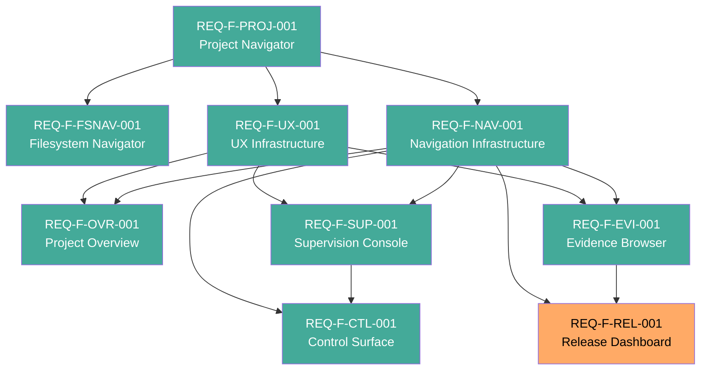

# Feature Vectors — genesis_manager

**Version**: 0.2.0
**Date**: 2026-03-13
**Status**: Candidate — awaiting human approval
**Traces To**: INT-001, REQ-F-SYSTEM-001
**Source**: Derived from specification/requirements/REQUIREMENTS.md (v0.1.0)

---

## Feature Inventory

Nine buildable features derived from the 26 REQ-F-* keys in the requirements.
Each feature is a coherent user-facing capability.

---

### Feature: REQ-F-PROJ-001 — Project Navigator

**Satisfies**: REQ-F-PROJ-001, REQ-F-PROJ-002, REQ-F-PROJ-003, REQ-F-PROJ-004

**What converges**:
- A user can register one or more Genesis workspace paths and have them persist across sessions
- A user can view the list of all registered projects with attention signals (pending gates, stuck features)
- A user can switch the active project — all other work areas update to reflect the selected project
- An unavailable workspace path shows a clear indicator rather than crashing

**Dependencies**: None

**MVP**: Yes — foundational. All other features require a registered workspace and selected project.

---

### Feature: REQ-F-FSNAV-001 — Filesystem Workspace Navigator

**Satisfies**: REQ-F-FSNAV-001, REQ-F-FSNAV-002, REQ-F-FSNAV-003

**What converges**:
- A server-side `GET /api/fs/browse` endpoint lists subdirectories of any filesystem path, identifies Genesis workspaces by presence of `.ai-workspace/events/events.jsonl`, and returns entries sorted with workspace directories first
- A `FolderBrowser` React component renders the directory listing with breadcrumb navigation, Up button, Genesis badges, and "Add" actions for discovered workspaces
- The `FolderBrowser` is embedded in the workspace configuration panel as the default input mode; the user can point-and-click to register a workspace without typing a path

**Dependencies**: REQ-F-PROJ-001 (workspace registration target — FSNAV is the discovery mechanism for PROJ-004)

**MVP**: Yes — workspace registration is the entry point for the product; browse mode lowers the barrier to correct path entry and eliminates manual path typing errors.

---

### Feature: REQ-F-NAV-001 — Navigation Infrastructure

**Satisfies**: REQ-F-NAV-001, REQ-F-NAV-002, REQ-F-NAV-003, REQ-F-NAV-004, REQ-F-NAV-005

**What converges**:
- Every REQ key rendered in the application is a clickable link to a canonical REQ detail page
- Every feature ID rendered is a clickable link to a canonical feature detail page
- Every run ID rendered is a clickable link to a canonical run detail page
- Every event entry is a clickable link to the full event payload view
- Canonical pages for features, runs, REQ keys, and decisions are accessible by stable, bookmarkable URLs
- Dead links never appear — missing entities show a placeholder page

**Dependencies**: REQ-F-PROJ-001 (projects must be loaded for canonical pages to resolve)

**MVP**: Yes — the core product invariant ("every identifier is a navigation handle") is a hard requirement from the intent. Without this, the product is not the product.

---

### Feature: REQ-F-UX-001 — UX Infrastructure

**Satisfies**: REQ-F-UX-001, REQ-F-UX-002

**What converges**:
- The application polls the active workspace for changes at ≤30 second intervals; all displayed data is at most 30 seconds stale
- A visible data-freshness indicator shows when data was last refreshed
- Common operations (start iteration, approve gate, spawn child, release) are available as GUI actions with no command syntax required
- The underlying Genesis command equivalent is shown as an informational label on each action

**Dependencies**: REQ-F-PROJ-001 (polling requires a registered workspace)

**MVP**: Yes — staleness tolerance and no-syntax requirement are foundational UX constraints.

---

### Feature: REQ-F-OVR-001 — Project Overview

**Satisfies**: REQ-F-OVR-001, REQ-F-OVR-002, REQ-F-OVR-003, REQ-F-OVR-004

**What converges**:
- A single screen shows the active project's build status without scrolling (1440×900 viewport)
- Feature status counts (converged, in_progress, blocked, pending) are visible and each is a navigation handle to a filtered feature list
- The most recent completed iteration is visible with feature ID, edge, iteration number, and δ
- Items changed since the user's last session are visually highlighted; the user can dismiss highlights

**Dependencies**: REQ-F-PROJ-001, REQ-F-NAV-001, REQ-F-UX-001

**MVP**: Yes — answers "what is Genesis building?" and "what changed?" — two of the core questions.

---

### Feature: REQ-F-SUP-001 — Supervision Console

**Satisfies**: REQ-F-SUP-001, REQ-F-SUP-002, REQ-F-SUP-003, REQ-F-SUP-004

**What converges**:
- All active feature vectors are listed with current edge, iteration count, and δ, sorted by priority (stuck > blocked > in_progress > pending)
- All pending human gates are displayed in a queue at the top of the page, sorted by age
- Blocked features show their blocking reason (spawn dependency or human gate) with inline navigation
- Stuck features (δ unchanged for 3+ consecutive iterations) are visually distinguished with stuck iteration count

**Dependencies**: REQ-F-PROJ-001, REQ-F-NAV-001, REQ-F-UX-001

**MVP**: Yes — answers "what is blocked?", "what does Genesis need from me?" — core questions 3 and 5.

---

### Feature: REQ-F-EVI-001 — Evidence Browser

**Satisfies**: REQ-F-EVI-001, REQ-F-EVI-002, REQ-F-EVI-003, REQ-F-EVI-004

**What converges**:
- Traceability coverage is computed and displayed: total REQ keys, tagged in code, tagged in tests, untagged list (each key is a navigation handle)
- Complete event history for any selected feature is visible in chronological order; each event is a navigation handle to its full payload
- Evaluator check results for the most recent iteration of each active edge are visible, with failed/skipped checks showing expected vs observed
- Most recent gap analysis results are displayed with a re-run action

**Dependencies**: REQ-F-PROJ-001, REQ-F-NAV-001, REQ-F-UX-001

**MVP**: Yes — answers "why should I trust this?" — core question 6. Required for the product to meet its trust contract.

---

### Feature: REQ-F-CTL-001 — Control Surface

**Satisfies**: REQ-F-CTL-001, REQ-F-CTL-002, REQ-F-CTL-003, REQ-F-CTL-004

**What converges**:
- A user can start an iteration on a selected feature/edge through a GUI action (no command syntax)
- A user can approve or reject a human gate with a required comment on rejection; the appropriate event is emitted to the workspace
- A user can initiate spawning a child vector by selecting type, parent, and reason
- A user can enable or disable auto-mode for a feature; auto-mode state is visible in the supervision view

**Dependencies**: REQ-F-PROJ-001, REQ-F-NAV-001, REQ-F-SUP-001 (control surface operates on items surfaced by supervision)

**MVP**: Yes — answers "what does Genesis need from me?" — core question 5. Without the ability to approve gates and start iterations, the product is read-only and incomplete.

---

### Feature: REQ-F-REL-001 — Release Dashboard

**Satisfies**: REQ-F-REL-001, REQ-F-REL-002, REQ-F-REL-003

**What converges**:
- Ship/no-ship readiness is computed and displayed: overall verdict plus which specific conditions are unmet, each linking to the relevant work area
- The release scope (converged vs pending features with traceability coverage) is visible
- When ready, the user can initiate the release process with a confirmation dialog showing the release scope; the result (version, artifacts) is displayed

**Dependencies**: REQ-F-PROJ-001, REQ-F-NAV-001, REQ-F-EVI-001 (release readiness uses gap analysis)

**MVP**: No — deferred. Users can run `gen-release` from the command line for the initial release. The Release Dashboard adds value but is not required for the product to answer the core questions. Defer to post-MVP iteration.

---

## Dependency Graph

Green = MVP. Orange = Deferred.

---

## Build Order

Topological sort of the dependency DAG. Features at the same level can be built in parallel.

| Level | Feature | Depends On | Rationale |
|-------|---------|-----------|-----------|
| 1 | REQ-F-PROJ-001 Project Navigator | None | Entry point — workspace registration and project switching |
| 2 | REQ-F-FSNAV-001 Filesystem Navigator | PROJ | Browse-mode workspace discovery — supports PROJ-004 registration |
| 2 | REQ-F-NAV-001 Navigation Infrastructure | PROJ | Navigation handles used by all other features |
| 2 | REQ-F-UX-001 UX Infrastructure | PROJ | Live polling used by all other features — build in parallel with NAV and FSNAV |
| 3 | REQ-F-OVR-001 Project Overview | NAV, UX | First meaningful view after foundation |
| 3 | REQ-F-SUP-001 Supervision Console | NAV, UX | Human gate queue — parallel with OVR |
| 3 | REQ-F-EVI-001 Evidence Browser | NAV, UX | Evidence display — parallel with OVR and SUP |
| 4 | REQ-F-CTL-001 Control Surface | SUP, NAV | Acts on what supervision surfaces |
| 5 | REQ-F-REL-001 Release Dashboard | EVI, NAV | Deferred — post-MVP |

**Critical path**: PROJ → NAV → SUP → CTL (4 sequential levels, minimum path to a working supervision+control loop)

---

## MVP Scope

**MVP includes** (8 of 9 features — minimum connected set delivering real value):

| Feature | Why MVP |
|---------|--------|
| REQ-F-PROJ-001 Project Navigator | Without workspace registration there is nothing to display |
| REQ-F-FSNAV-001 Filesystem Navigator | Lowers barrier to correct workspace registration — eliminates manual path entry errors |
| REQ-F-NAV-001 Navigation Infrastructure | Core product invariant — every identifier navigable |
| REQ-F-UX-001 UX Infrastructure | Live state + no-syntax requirement — foundational |
| REQ-F-OVR-001 Project Overview | Answers "what is Genesis building?" and "what changed?" |
| REQ-F-SUP-001 Supervision Console | Answers "what is blocked?" and "what does Genesis need?" |
| REQ-F-EVI-001 Evidence Browser | Answers "why should I trust?" — required for the trust contract |
| REQ-F-CTL-001 Control Surface | Answers "what does Genesis need from me right now?" |

**Deferred** (1 feature — explicitly not MVP):

| Feature | Deferral Rationale |
|---------|--------------------|
| REQ-F-REL-001 Release Dashboard | `gen-release` is callable from CLI; the dashboard adds convenience, not capability. Defer until post-MVP to reduce scope. |

---

## REQ Key Coverage

Every REQ-F-* key from REQUIREMENTS.md assigned to exactly one feature:

| REQ Key | Feature Vector | Domain |
|---------|----------------|--------|
| REQ-F-PROJ-001 | REQ-F-PROJ-001 | Projects |
| REQ-F-PROJ-002 | REQ-F-PROJ-001 | Projects |
| REQ-F-PROJ-003 | REQ-F-PROJ-001 | Projects |
| REQ-F-PROJ-004 | REQ-F-PROJ-001 | Projects |
| REQ-F-FSNAV-001 | REQ-F-FSNAV-001 | Filesystem Navigation |
| REQ-F-FSNAV-002 | REQ-F-FSNAV-001 | Filesystem Navigation |
| REQ-F-FSNAV-003 | REQ-F-FSNAV-001 | Filesystem Navigation |
| REQ-F-OVR-001 | REQ-F-OVR-001 | Overview |
| REQ-F-OVR-002 | REQ-F-OVR-001 | Overview |
| REQ-F-OVR-003 | REQ-F-OVR-001 | Overview |
| REQ-F-OVR-004 | REQ-F-OVR-001 | Overview |
| REQ-F-SUP-001 | REQ-F-SUP-001 | Supervision |
| REQ-F-SUP-002 | REQ-F-SUP-001 | Supervision |
| REQ-F-SUP-003 | REQ-F-SUP-001 | Supervision |
| REQ-F-SUP-004 | REQ-F-SUP-001 | Supervision |
| REQ-F-EVI-001 | REQ-F-EVI-001 | Evidence |
| REQ-F-EVI-002 | REQ-F-EVI-001 | Evidence |
| REQ-F-EVI-003 | REQ-F-EVI-001 | Evidence |
| REQ-F-EVI-004 | REQ-F-EVI-001 | Evidence |
| REQ-F-CTL-001 | REQ-F-CTL-001 | Control |
| REQ-F-CTL-002 | REQ-F-CTL-001 | Control |
| REQ-F-CTL-003 | REQ-F-CTL-001 | Control |
| REQ-F-CTL-004 | REQ-F-CTL-001 | Control |
| REQ-F-REL-001 | REQ-F-REL-001 | Release |
| REQ-F-REL-002 | REQ-F-REL-001 | Release |
| REQ-F-REL-003 | REQ-F-REL-001 | Release |
| REQ-F-NAV-001 | REQ-F-NAV-001 | Navigation |
| REQ-F-NAV-002 | REQ-F-NAV-001 | Navigation |
| REQ-F-NAV-003 | REQ-F-NAV-001 | Navigation |
| REQ-F-NAV-004 | REQ-F-NAV-001 | Navigation |
| REQ-F-NAV-005 | REQ-F-NAV-001 | Navigation |
| REQ-F-UX-001 | REQ-F-UX-001 | UX Infrastructure |
| REQ-F-UX-002 | REQ-F-UX-001 | UX Infrastructure |

**Coverage**: 33/33 REQ-F-* keys assigned. No gaps. No duplicates.

---

## Risk Assessment

| Feature | Risk | Mitigation |
|---------|------|-----------|
| REQ-F-NAV-001 Navigation Infrastructure | Canonical page routing must be defined before other features can link into it — risks blocking parallel work | Build routing stubs first; populate page content incrementally |
| REQ-F-UX-001 UX Infrastructure | Live filesystem polling behaviour is platform-dependent | Spike filesystem watch API before committing to implementation approach |
| REQ-F-EVI-001 Evidence Browser | Traceability coverage requires scanning source code — may be slow for large projects | Measure scan time on a representative workspace during design |
| REQ-F-CTL-001 Control Surface | Emitting events to events.jsonl requires careful write serialisation (REQ-DATA-WORK-002) | Write protocol must be defined in design before CTL is coded |

---

## Parallel Opportunities

Once Level 1 (PROJ) and Level 2 (NAV + UX) converge:

- **OVR + SUP + EVI** can all be built in parallel (no dependencies between them)
- **CTL** depends only on SUP converging, not on OVR or EVI
- **REL** is deferred; no parallel opportunity needed

Maximum parallelism after Level 2: 3 features simultaneously (OVR, SUP, EVI).

---

## REQ-F-VIS-001: Professional Dark Theme and Visual Hierarchy

**Title**: Application Visual Design
**Priority**: High
**Profile**: standard
**Depends On**: REQ-F-PROJ-001, REQ-F-OVR-001, REQ-F-SUP-001, REQ-F-EVI-001, REQ-F-CTL-001

**Satisfies**:
- REQ-F-VIS-001

**Description**: Retheme all production components to use the semantic CSS token system. The CSS variables already define a professional dark blue-gray theme; the components must be wired to it. Adds semantic status colors and consistent visual hierarchy across all pages.

**Scope**:
- 17 TSX files: replace hardcoded `bg-white`/`bg-gray-*`/`text-gray-*` with `bg-background`/`bg-secondary`/`text-foreground`/`border-border` tokens
- `index.css`: ensure `body` uses token background/foreground
- Status color semantics: converged=emerald-400, iterating=blue-400, blocked=amber-400, stuck=red-400
- Persistent navigation sidebar on workspace-level pages
