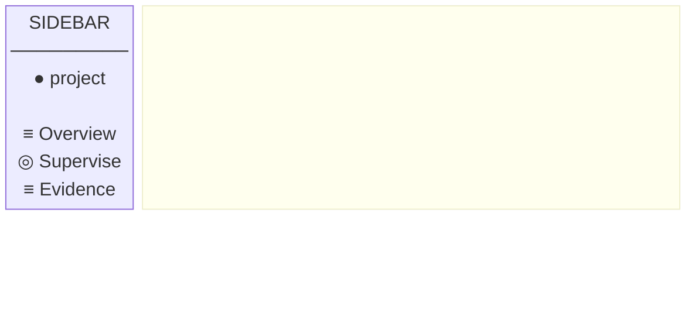

# Page Specification — Overview

**Version**: 0.1.0
**Date**: 2026-03-14
**Status**: Draft — awaiting human approval
**Satisfies**: REQ-F-OVR-001, REQ-F-OVR-002, REQ-F-OVR-003, REQ-F-OVR-004
**Route**: `/workspace/:workspaceId`
**Domain Model Source**: `specification/domain/DOMAIN_MODEL.md` — `WorkspaceOverview` view model

---

## Purpose

The Overview page is the daily landing page for a person supervising an autonomous Genesis
build. It must answer six questions **without scrolling and within 30 seconds of opening**:

1. What is Genesis building for me?
2. How far has it gotten?
3. What is blocked or stuck right now?
4. What does Genesis need from me?
5. What just happened?
6. What changed since I last looked?

It does **not** show the full feature list (Supervision), raw events (Evidence), or command
surfaces (Control). It is a glance page that routes to deeper context.

---

## Domain Data

### Primary view model: `WorkspaceOverview`

Served by `GET /api/workspaces/:id/overview`. Refreshed every 30 seconds.

```
WorkspaceOverview {
  projectName:       string          — displayed in header
  methodVersion:     string          — displayed in header (e.g. "v2.9")
  statusCounts:      FeatureStatusSummary
  inProgressFeatures: InProgressFeature[]
  recentActivity:    RecentActivity | null
  pendingGateCount:  int             — count only; full list in Supervision
  featureLastEvents: Map<featureId, ISO8601>  — for change detection
}

FeatureStatusSummary {
  converged:     int    — completed features
  in_progress:   int    — actively iterating
  blocked:       int    — waiting on gate or spawn
  pending:       int    — not yet started
  pendingGates:  int    — human gates awaiting decision
}

InProgressFeature {
  featureId:       REQKey    — navigation handle → FeatureDetailPage
  title:           string
  currentEdge:     EdgeName
  iterationNumber: int
  delta:           int       — 0 = converged this edge, >0 = work remaining
  lastEventAt:     ISO8601   — for change highlight comparison
}

RecentActivity {
  featureId:       REQKey    — navigation handle → FeatureDetailPage
  edge:            EdgeName
  iterationNumber: int
  timestamp:       ISO8601
  delta:           int
  runId:           RunId | null   — navigation handle → RunDetailPage (future)
}
```

### Secondary: `Session.lastVisit`

Stored in `localStorage` as an ISO8601 timestamp. Used to compute "changed since last
session" for REQ-F-OVR-004. Set to `now()` when the page is first rendered each session.

---

## Screen Layout

Fixed-height, no vertical scroll (REQ-F-OVR-001 AC3). Target viewport 1440×900.

```
┌─────────────────────────────────────────────────────────────────────────────┐
│ SIDEBAR                │ HEADER                                              │
│                        │  [project name]  [v2.9]       [freshness] [dismiss]│
│  [●] project badge     ├─────────────────────────────────────────────────────┤
│      name              │ STATUS COUNTS BAR                                   │
│                        │  ┌──────────┐ ┌──────────┐ ┌──────────┐ ┌────────┐│
│  [≡] Overview ←        │  │ converged│ │in_progress│ │  blocked │ │pending ││
│  [◎] Supervise         │  │    7     │ │     3     │ │    1     │ │   4    ││
│  [≡] Evidence          │  └──────────┘ └──────────┘ └──────────┘ └────────┘│
│                        │  [████████████████████░░░░░░░░░░░] progress bar    │
│                        ├──────────────────────┬──────────────────────────────┤
│                        │ IN-PROGRESS FEATURES │ ATTENTION                   │
│                        │                      │                              │
│                        │ Feature  Edge  # δ ↑ │ ┌── Pending Gates (n) ────┐ │
│                        │ REQ-F-*  code  4  2  │ │  REQ-F-AUTH-001         │ │
│                        │ REQ-F-*  req   1  0  │ │  design edge · 2h ago   │ │
│                        │ REQ-F-*  tests 2  1  │ │  [Approve] [Reject]     │ │
│                        │                      │ └─────────────────────────┘ │
│                        │                      │                              │
│                        │                      │ ┌── Blocked (n) ───────────┐ │
│                        │                      │ │  REQ-F-DB-001            │ │
│                        │                      │ │  waiting on REQ-F-AUTH   │ │
│                        │                      │ └─────────────────────────┘ │
│                        ├──────────────────────┴──────────────────────────────┤
│                        │ RECENT ACTIVITY                                      │
│                        │  REQ-F-AUTH-001 → code↔unit_tests #4  δ=2  14:23   │
└────────────────────────┴─────────────────────────────────────────────────────┘
```

---

## Screen Layout (Mermaid block diagram)



---

## Component Breakdown

### Header strip (h-12)
| Element | Data field | Behaviour |
|---------|-----------|-----------|
| Project name | `overview.projectName` | Static label |
| Method version badge | `overview.methodVersion` | Static badge |
| Freshness indicator | `lastRefreshed`, `isRefreshing`, `error` | Shows staleness age |
| Dismiss button | visible if any `isChanged()` is true | Clears session change baseline |

### Status counts bar (h-20)
| Element | Data field | Behaviour |
|---------|-----------|-----------|
| Converged tile | `statusCounts.converged` | Click → Supervision filtered to `converged` |
| In-progress tile | `statusCounts.in_progress` | Click → Supervision filtered to `in_progress` |
| Blocked tile | `statusCounts.blocked` | Click → Supervision filtered to `blocked`; visually prominent if >0 |
| Pending tile | `statusCounts.pending` | Click → Supervision filtered to `pending` |
| Progress bar | all counts | Visual proportion of converged vs total |

**Pending gates** are NOT a fifth tile. They appear in the Attention panel (right column).
The count in `statusCounts.pendingGates` feeds the Attention panel header, not the counts bar.

### In-progress features table (left column, flex-1)
| Column | Data field | Behaviour |
|--------|-----------|-----------|
| Feature ID | `f.featureId` | Navigation handle → FeatureDetailPage |
| Title | `f.title` | Truncated label |
| Edge | `f.currentEdge` | Plain text |
| Iter | `f.iterationNumber` | Plain number |
| δ | `f.delta` | `0` = emerald, `>0` = amber |
| Changed | `isChanged(f.featureId, featureLastEvents[f.featureId])` | Dot or left border |

Sorted by: delta descending (highest δ first — most work remaining at top).

### Attention panel (right column, flex-1)
Two sections, shown only if non-empty:

**Pending Gates** — derived from `pendingGateCount` + `featureLastEvents`
- If `pendingGateCount > 0`: shows compact gate cards with Approve/Reject actions
- Each card: feature ID (nav handle), edge name, age
- Data gap: full gate list needs `GET /gates` endpoint (currently only count in overview)

**Blocked features** — derived from `inProgressFeatures` where `delta` context suggests block
- Data gap: `WorkspaceOverview` does not currently carry a `blockedFeatures` field
- Fix: server must include `blockedFeatures: BlockedFeatureSummary[]` in overview response

### Recent activity strip (h-12, bottom)
| Element | Data field | Behaviour |
|---------|-----------|-----------|
| Feature ID | `recentActivity.featureId` | Navigation handle → FeatureDetailPage |
| Edge | `recentActivity.edge` | Plain text |
| Iteration | `recentActivity.iterationNumber` | `#n` format |
| δ | `recentActivity.delta` | Coloured number |
| Timestamp | `recentActivity.timestamp` | `toLocaleTimeString()` |
| Run ID | `recentActivity.runId` | Navigation handle → RunDetailPage (unimplemented; show plain if no route) |

---

## Gaps vs Current Implementation

| # | Gap | Requirement | Current state | Fix needed |
|---|-----|-------------|--------------|-----------|
| 1 | **No Attention panel** | REQ-F-OVR-001 ("what needs attention"), UX intent Q3/Q5 | Right column shows only "Recent Activity" | Add Attention panel with gates + blocked |
| 2 | **Pending gates not on overview** | REQ-F-OVR-001 Q5, REQ-F-SUP-002 | `pendingGateCount` in overview but no cards shown | Fetch `GET /gates` and render compact cards |
| 3 | **Blocked features not shown** | REQ-F-OVR-001 Q3 | No blocked section anywhere on page | Add `blockedFeatures` to `WorkspaceOverview` server response |
| 4 | **Feature titles missing from table** | ADR-GM-001 Rule 1, UX: "plain language leads" | Table shows only `featureId` (REQ key) | Add `title` field to `InProgressFeature` server response + render in table |
| 5 | **Run ID is plain text** | REQ-F-OVR-003, REQ-F-NAV-003 | `runId` shown but not a navigation handle | Requires `RunDetailPage` — missing entirely |
| 6 | **Change detection per-feature incomplete** | REQ-F-OVR-004 | Dismiss checks only `recentActivity.featureId` | Should check all `featureLastEvents` entries |
| 7 | **No "next action" signal** | UX intent Q4 | Not present | Could be derived: if gates pending → "Approve gate"; if all idle → "Run /gen-start" |
| 8 | **"Pending Gates" appears as 5th status tile** | This spec §Status counts bar | Implementation renders 5 tiles (converged, in_progress, blocked, pending, pending_gates) | Remove pending_gates from tile bar — it belongs ONLY in the Attention panel header |

---

## Delta vs Spec

```
REQ-F-OVR-001  Single-Screen Build Status  PARTIAL — missing attention signals (gaps 1–3, 8)
REQ-F-OVR-002  Feature Status Counts       PARTIAL — 5th tile violation (gap 8)
REQ-F-OVR-003  Most Recent Activity        PARTIAL — run ID shown but not navigable (gap 5); feature title absent (gap 4)
REQ-F-OVR-004  Change Highlighting         PARTIAL — implemented but dismiss scope is wrong (gap 6)
```

**Playwright evaluation result (2026-03-14)**: DELTA = 4 failing required checks.

**Priority order for REQ-F-OVR-002 (corrections feature)**:
1. Gap 8 — remove Pending Gates from status tile bar (5→4 tiles)
2. Gap 4 — add `title` to `InProgressFeature` server response + render in table (ADR-GM-001)
3. Gap 1+2 — add Attention panel with pending gates section (requires `GET /gates` or inline from overview data)
4. Gap 3 — add `blockedFeatures` to `WorkspaceOverview` server response + render in Attention panel
5. Gap 6 — fix dismiss scope to cover all `featureLastEvents` entries

---

## Acceptance Criteria (from requirements, restated for implementation)

- [ ] Page fits 1440×900 without vertical scroll
- [ ] Status bar shows exactly 4 tiles: converged, in_progress, blocked, pending (no "Pending Gates" tile)
- [ ] Status tiles (converged, in_progress, blocked, pending) each navigate to Supervision filtered
- [ ] In-progress table shows feature ID (nav handle), title, edge, iteration, δ, changed indicator
- [ ] Pending gates count is visually prominent when > 0 — shown in Attention panel header, not tile bar
- [ ] At least one pending gate card is shown in the Attention panel when gates are waiting
- [ ] Blocked features are surfaced in the Attention panel (non-zero blocked count shows feature IDs)
- [ ] Most recent activity shows feature ID (nav), edge, iter, δ, timestamp
- [ ] Recent activity feature ID is accompanied by feature title (ADR-GM-001)
- [ ] Changed features are highlighted (new event since session start)
- [ ] Dismiss clears all change highlights, not just the most recent feature
- [ ] Page loads within 2 seconds (REQ-NFR-PERF-001)
