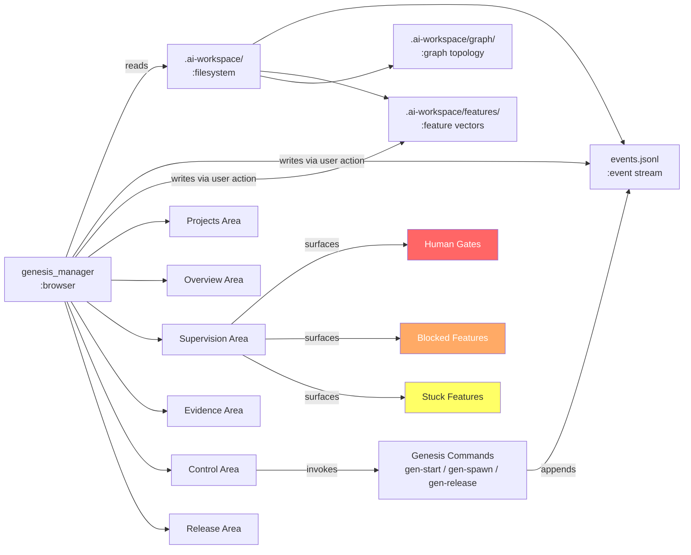

# Requirements — genesis_manager

**Version**: 0.1.0
**Date**: 2026-03-13
**Status**: Candidate — awaiting human approval
**Traces To**: INT-001
**Feature Vector**: REQ-F-SYSTEM-001

---

## Overview

genesis_manager is a **builder supervision console** for a person using Genesis to create software projects. It answers a single persistent question: *"What is Genesis doing for me, and what does it need from me right now?"*

**Scope**: A single-user web application that reads Genesis workspace state from the local filesystem and presents it as a navigable, actionable surface. The user can monitor autonomous work, resolve human gates, drill into evidence, and initiate commands — all without needing to know Genesis command syntax.

**Scope boundary**: genesis_manager does not execute autonomous Genesis operations. It surfaces state and routes user decisions to Genesis commands. It does not write to the Genesis event log or feature vectors except as a consequence of explicit user action.

**Relationship to intent**: The product answers the 8 questions from the intent document:

| # | Question | Primary Work Area |
|---|----------|------------------|
| 1 | What is Genesis building for me? | Overview |
| 2 | How far has it gotten? | Overview + Supervision |
| 3 | What is blocked, wrong, or uncertain? | Supervision |
| 4 | What does Genesis want to do next? | Supervision + Control |
| 5 | What does Genesis need from me right now? | Supervision + Control |
| 6 | Why should I trust its current status? | Evidence |
| 7 | What changed since I last looked? | Overview + UX |
| 8 | Is this ready to accept, review, or ship? | Release |

---

## Terminology

| Term | Definition |
|------|-----------|
| **Active project** | The Genesis-managed project currently displayed in genesis_manager. The user switches active project via the Projects work area. |
| **Feature vector** | A YAML file in `.ai-workspace/features/active/` tracking one REQ-F-* key's trajectory through the asset graph. |
| **Edge** | A directed transition between two asset types in the Genesis graph topology (e.g., `requirements → feature_decomposition`). |
| **Human gate** | A convergence check of type `human` in an edge checklist that requires explicit user approval before the edge converges. |
| **Iteration** | One invocation of `iterate(Asset, Context[], Evaluators)` on a specific edge for a specific feature. |
| **delta (δ)** | Count of failing required evaluator checks for a feature+edge. δ=0 means converged. |
| **Run** | One complete edge traversal attempt, identified by a `run_id`. A run may contain multiple iterations. |
| **Stuck** | A feature where δ has not decreased for 3+ consecutive iterations on the same edge. |
| **Navigation handle** | A clickable identifier that routes the user to a canonical detail page for the referenced entity. |
| **Workspace** | The `.ai-workspace/` directory of a Genesis-managed project. Contains `events.jsonl`, feature vectors, and graph configuration. |
| **Session** | A user's browser visit to genesis_manager. Session start time is recorded to support "what changed since I last looked?" |
| **REQ key** | A unique immutable requirement identifier of the form `REQ-{TYPE}-{DOMAIN}-{SEQ}`. |
| **Canonical detail page** | A dedicated URL path for a specific entity (feature, run, REQ key, decision) that shows all available information about it. |
| **Convergence** | The state where all required evaluator checks for a feature+edge pass (δ=0). |
| **Traceability coverage** | The percentage of REQ keys that have `# Implements:` or `# Validates:` tags in code and test files. |

---

## Functional Requirements

### Projects Work Area

#### REQ-F-PROJ-001: Project List Display

**Priority**: High
**Type**: Functional

**Description**: The system must display a list of all Genesis-managed projects configured for the user.

**Acceptance Criteria**:
- Each project entry shows: project name, active feature count, pending human gate count
- Projects with pending human gates are visually distinguished from those without
- The list is sorted by: pending human gates first, then by most recently active

**Traces To**: INT-001

---

#### REQ-F-PROJ-002: Attention Signal

**Priority**: High
**Type**: Functional

**Description**: The system must indicate which projects have items requiring immediate user attention, distinct from items that are merely in progress.

**Acceptance Criteria**:
- A project has an "attention required" state when it has one or more pending human gates OR one or more stuck features
- The attention signal is visible on the project list without opening the project
- The signal is cleared automatically when the attention condition resolves

**Traces To**: INT-001

---

#### REQ-F-PROJ-003: Active Project Switch

**Priority**: High
**Type**: Functional

**Description**: The system must allow the user to switch the active project context to any project in the project list.

**Acceptance Criteria**:
- Switching active project updates all work areas to show data for the selected project
- The previously active project is visually indicated in the project list
- Switching does not require a full page reload

**Traces To**: INT-001

---

#### REQ-F-PROJ-004: Workspace Path Configuration

**Priority**: High
**Type**: Functional

**Description**: The system must allow the user to register and manage the filesystem paths of Genesis workspaces that genesis_manager monitors.

**Acceptance Criteria**:
- The user must be able to add a workspace path by providing an absolute filesystem path to a Genesis `.ai-workspace/` directory
- The user must be able to remove a registered workspace path
- Each registered path is validated on entry: the path must exist and contain a valid `events.jsonl` file
- Registered paths persist across browser sessions (stored in application configuration)
- If a registered path becomes unavailable (directory deleted or moved), the system shows a "workspace unavailable" indicator rather than an error crash

**Traces To**: INT-001

---

### Overview Work Area

#### REQ-F-OVR-001: Single-Screen Build Status

**Priority**: Critical
**Type**: Functional

**Description**: The system must present a single-screen overview that answers "what is Genesis building?" for the active project without scrolling.

**Acceptance Criteria**:
- The overview displays: project name, method version, total features, and a breakdown by status (converged, in progress, blocked, pending)
- The overview displays the current graph stage for each in-progress feature
- The overview fits within a 1440×900 viewport without vertical scrolling

**Traces To**: INT-001

---

#### REQ-F-OVR-002: Feature Status Counts

**Priority**: High
**Type**: Functional

**Description**: The system must display the count of features in each status state for the active project.

**Acceptance Criteria**:
- Status states displayed: converged, in_progress, blocked, pending
- Counts update within 30 seconds of a change to the workspace
- Each count is a navigation handle to a filtered feature list showing only features in that state

**Traces To**: INT-001

---

#### REQ-F-OVR-003: Most Recent Activity

**Priority**: Medium
**Type**: Functional

**Description**: The system must display the most recent completed iteration for the active project.

**Acceptance Criteria**:
- Shows: feature ID, edge, iteration number, timestamp, and δ result
- The feature ID is a navigation handle to the feature detail page
- The run ID (if present) is a navigation handle to the run detail page

**Traces To**: INT-001

---

#### REQ-F-OVR-004: Change Highlighting

**Priority**: High
**Type**: Functional

**Description**: The system must highlight features and edges that have changed since the user's last session.

**Acceptance Criteria**:
- "Changed" means: a new event was appended to `events.jsonl` for that feature after the session start time of the previous session
- Changed items are visually distinguished from unchanged items on the overview
- The user must be able to dismiss change highlights explicitly

**Traces To**: INT-001

---

### Supervision Work Area

#### REQ-F-SUP-001: Active Feature List

**Priority**: Critical
**Type**: Functional

**Description**: The system must display all active feature vectors with their current edge and iteration state.

**Acceptance Criteria**:
- Each entry shows: feature ID, feature title, current edge, current iteration number, current δ, status
- Entries are sorted by: stuck features first, then blocked, then in_progress, then pending
- The feature ID is a navigation handle to the feature detail page

**Traces To**: INT-001

---

#### REQ-F-SUP-002: Human Gate Queue

**Priority**: Critical
**Type**: Functional

**Description**: The system must display all human gates currently awaiting user action, ordered by age (oldest first).

**Acceptance Criteria**:
- Each entry shows: feature ID, edge, gate name, age (time since the gate became pending)
- The system provides an action surface for each gate: approve or reject with optional comment
- Approving or rejecting a gate emits the appropriate event to `events.jsonl`
- After acting on a gate, the gate is removed from the queue within 5 seconds

**Traces To**: INT-001

---

#### REQ-F-SUP-003: Blocked Features

**Priority**: High
**Type**: Functional

**Description**: The system must display all blocked features with their blocking reason.

**Acceptance Criteria**:
- Each entry shows: feature ID, edge where blocked, blocking reason (spawn dependency / human gate / other), time blocked
- Spawn dependencies show the blocking child feature ID as a navigation handle
- Human gate blocks surface the gate name and provide an inline action surface

**Traces To**: INT-001

---

#### REQ-F-SUP-004: Stuck Feature Detection

**Priority**: High
**Type**: Functional

**Description**: The system must display features where δ has not decreased for 3 or more consecutive iterations on the same edge.

**Acceptance Criteria**:
- A stuck feature is one where the most recent 3 `iteration_completed` events for the same feature+edge all have the same δ value
- Each stuck entry shows: feature ID, edge, δ value, number of consecutive stuck iterations
- Stuck features appear in the supervision view with a distinct visual treatment

**Traces To**: INT-001

---

### Evidence Work Area

#### REQ-F-EVI-001: Traceability Coverage Display

**Priority**: High
**Type**: Functional

**Description**: The system must display the current traceability coverage for the active project — what percentage of REQ keys are tagged in code and tests.

**Acceptance Criteria**:
- Coverage is computed by scanning for `# Implements: REQ-*` and `# Validates: REQ-*` tags in the project source
- Display shows: total REQ keys defined, tagged in code (count and percentage), tagged in tests (count and percentage), untagged REQ keys list
- Each untagged REQ key is a navigation handle to the requirements document section for that key

**Traces To**: INT-001

---

#### REQ-F-EVI-002: Feature Event History

**Priority**: High
**Type**: Functional

**Description**: The system must display the complete event history for a selected feature vector, derived from `events.jsonl`.

**Acceptance Criteria**:
- Shows all events where `feature == selected_feature_id`, in chronological order
- Each event entry shows: event_type, timestamp, edge, iteration, δ, status
- Each event entry is a navigation handle to the full event payload detail view
- The history updates within 30 seconds of new events being appended

**Traces To**: INT-001

---

#### REQ-F-EVI-003: Evaluator Check Results

**Priority**: High
**Type**: Functional

**Description**: The system must display the evaluator check results for the most recent iteration of each active edge.

**Acceptance Criteria**:
- For each active feature+edge, shows the pass/fail/skip result for every check in the effective checklist
- Failed checks show: check name, type (F_D/F_P/F_H), expected behaviour, observed behaviour
- Skipped checks show: check name and reason skipped
- Results are sourced from the most recent `iteration_completed` event for that feature+edge

**Traces To**: INT-001

---

#### REQ-F-EVI-004: Gap Analysis Results

**Priority**: Medium
**Type**: Functional

**Description**: The system must display the most recent gap analysis results (equivalent to gen-gaps output) for the active project.

**Acceptance Criteria**:
- Shows: L1 coverage (Implements tags), L2 coverage (spec key coverage), L3 advisory (telemetry)
- Each gap entry is a navigation handle to the relevant source file or requirements section
- The gap analysis timestamp is displayed; a "re-run" action triggers a fresh gen-gaps computation

**Traces To**: INT-001

---

### Control Work Area

#### REQ-F-CTL-001: Start Iteration

**Priority**: Critical
**Type**: Functional

**Description**: The system must allow the user to start a Genesis iteration on a selected feature and edge.

**Acceptance Criteria**:
- The user must select both a feature ID and an edge before the start action is available
- Initiating the action is equivalent to running `gen-start --feature {id}` for the selected feature
- The supervision view updates within 30 seconds to show the new iteration in progress
- The action is unavailable for features that are converged or blocked by an unresolved dependency

**Traces To**: INT-001

---

#### REQ-F-CTL-002: Human Gate Action

**Priority**: Critical
**Type**: Functional

**Description**: The system must allow the user to approve or reject a human gate for a selected feature and edge.

**Acceptance Criteria**:
- Approval emits a `review_approved` event to the workspace `events.jsonl` with: feature, edge, gate_name, decision=approved, timestamp
- Rejection emits a `review_approved` event with decision=rejected and a required comment field
- The user must provide a non-empty comment when rejecting
- Acting on a gate is only available when the gate is in pending state

**Traces To**: INT-001

---

#### REQ-F-CTL-003: Spawn Child Vector

**Priority**: Medium
**Type**: Functional

**Description**: The system must allow the user to initiate spawning a child vector from an active feature.

**Acceptance Criteria**:
- The user must select: parent feature, child type (discovery/spike/poc/hotfix), and a reason string
- Initiating the action is equivalent to running `gen-spawn --type {type} --parent {feature} --reason "{reason}"`
- The feature list updates within 30 seconds to show the new child vector
- The reason field must be non-empty

**Traces To**: INT-001

---

#### REQ-F-CTL-004: Auto-Mode Toggle

**Priority**: Medium
**Type**: Functional

**Description**: The system must allow the user to enable or disable auto-mode for a selected feature.

**Acceptance Criteria**:
- When auto-mode is enabled for a feature, the system continuously iterates on that feature until a human gate is reached or the feature converges
- Auto-mode state is displayed clearly in the supervision view for each feature
- The user must be able to disable auto-mode at any time, which pauses after the current iteration completes

**Traces To**: INT-001

---

### Release Work Area

#### REQ-F-REL-001: Ship/No-Ship Readiness

**Priority**: High
**Type**: Functional

**Description**: The system must display the current ship/no-ship readiness status for the active project.

**Acceptance Criteria**:
- Readiness is computed as: all active features converged AND gen-gaps L1/L2 pass AND no pending human gates
- The readiness display shows: overall verdict (ready/not-ready), and which specific conditions are unmet
- Each unmet condition links to the relevant work area

**Traces To**: INT-001

---

#### REQ-F-REL-002: Release Scope Display

**Priority**: Medium
**Type**: Functional

**Description**: The system must display the list of converged and pending features in context of the next release.

**Acceptance Criteria**:
- Shows converged features (eligible for release) and in-progress features (not yet eligible)
- Each feature entry shows: feature ID, title, converged edges, pending edges, traceability coverage
- The display matches the scope that `gen-release` would include

**Traces To**: INT-001

---

#### REQ-F-REL-003: Initiate Release

**Priority**: Medium
**Type**: Functional

**Description**: The system must allow the user to initiate the release process for a project that is release-ready.

**Acceptance Criteria**:
- The initiate release action is only available when REQ-F-REL-001 readiness verdict is "ready"
- Initiating the action is equivalent to running `gen-release`
- The user must confirm the action before it executes (confirmation dialog with release scope summary)
- The release result (version tag, artifact paths) is displayed after completion

**Traces To**: INT-001

---

### Navigation Invariant

#### REQ-F-NAV-001: REQ Key Navigation

**Priority**: Critical
**Type**: Functional

**Description**: Every REQ key displayed anywhere in the system must function as a navigation handle to the canonical REQ key detail page.

**Acceptance Criteria**:
- Clicking any REQ-* identifier navigates to a page showing: key definition, acceptance criteria, traces-to intent, all features that satisfy this key, code files tagged with this key, test files that validate this key
- This behaviour applies in all work areas without exception
- Dead links (REQ keys with no canonical page) must never appear; missing pages show a "requirements not yet written" placeholder

**Traces To**: INT-001

---

#### REQ-F-NAV-002: Feature ID Navigation

**Priority**: Critical
**Type**: Functional

**Description**: Every feature ID displayed anywhere in the system must function as a navigation handle to the canonical feature detail page.

**Acceptance Criteria**:
- Clicking any REQ-F-* identifier navigates to a page showing: feature title, current trajectory state, all edges with status/iteration/δ, complete event history for this feature, child vectors (if any)
- This behaviour applies in all work areas without exception

**Traces To**: INT-001

---

#### REQ-F-NAV-003: Run ID Navigation

**Priority**: High
**Type**: Functional

**Description**: Every run ID displayed anywhere in the system must function as a navigation handle to the canonical run detail page.

**Acceptance Criteria**:
- Clicking any run_id value navigates to a page showing: run metadata, all events in that run, evaluator check results, artifacts produced, cost and duration
- This behaviour applies in all work areas without exception

**Traces To**: INT-001

---

#### REQ-F-NAV-004: Event Navigation

**Priority**: Medium
**Type**: Functional

**Description**: Every event entry in the system must function as a navigation handle to the full event payload.

**Acceptance Criteria**:
- Clicking any event navigates to a view showing the raw event JSON and a human-readable interpretation
- The navigation preserves context (the user can return to the previous view)

**Traces To**: INT-001

---

#### REQ-F-NAV-005: Canonical Detail Pages

**Priority**: Critical
**Type**: Functional

**Description**: The system must maintain canonical detail pages for: features, runs, REQ keys, and decisions.

**Acceptance Criteria**:
- Each entity type has a unique, stable URL path: `/feature/{id}`, `/run/{run_id}`, `/req/{req_key}`, `/decision/{id}`
- Canonical pages are accessible by direct URL navigation (bookmarkable)
- Each canonical page shows all available information for the entity from the workspace event stream

**Traces To**: INT-001

---

### UX Infrastructure

#### REQ-F-UX-001: Live Workspace State

**Priority**: High
**Type**: Functional

**Description**: The system must display workspace state that is at most 30 seconds stale without requiring a manual refresh.

**Acceptance Criteria**:
- The UI polls or subscribes to workspace changes on a ≤30 second interval
- A visible indicator shows when data was last refreshed
- If the workspace is unavailable (e.g., filesystem error), the UI displays a clear error state rather than stale data without indication

**Traces To**: INT-001

---

#### REQ-F-UX-002: No Syntax Requirement

**Priority**: High
**Type**: Functional

**Description**: The system must not require the user to know Genesis command syntax to perform common operations.

**Acceptance Criteria**:
- Starting an iteration, approving a gate, spawning a child, and initiating release are all achievable through GUI actions with no command line
- The underlying Genesis command equivalent is displayed to the user as an informational label (not a required input)

**Traces To**: INT-001

---

## Non-Functional Requirements

### REQ-NFR-PERF-001: Overview Page Load Time

**Priority**: High
**Type**: Non-Functional

**Description**: The overview page must load its initial content within 2 seconds for a project workspace with up to 50 active feature vectors.

**Acceptance Criteria**:
- Time-to-interactive ≤ 2000ms measured from navigation to first meaningful paint on a local filesystem workspace
- Measured with a workspace containing 50 feature vectors and 1000 events in events.jsonl

**Traces To**: INT-001

---

### REQ-NFR-REL-001: Resilience to Workspace Inconsistency

**Priority**: High
**Type**: Non-Functional

**Description**: The system must remain available and navigable when the Genesis workspace is in an inconsistent state.

**Acceptance Criteria**:
- If `events.jsonl` contains malformed JSON lines, the system displays valid events and flags the malformed count
- If a feature vector references a non-existent file, the system shows the feature with a "data missing" indicator rather than an error page
- No workspace inconsistency must cause an unhandled exception that crashes the application

**Traces To**: INT-001

---

### REQ-NFR-ACC-001: Navigation Handle Integrity

**Priority**: Critical
**Type**: Non-Functional

**Description**: All navigation handles in the system must resolve to valid pages.

**Acceptance Criteria**:
- No navigation handle in any rendered page results in a 404 or unhandled error
- If the target entity does not exist in the workspace, the canonical page shows a "not found in workspace" placeholder with context
- This requirement is verifiable by automated link-checking across all rendered pages

**Traces To**: INT-001

---

## Data Requirements

### REQ-DATA-WORK-001: Workspace as Sole Data Source

**Priority**: Critical
**Type**: Data Quality

**Description**: The system must derive all displayed state exclusively from the Genesis workspace filesystem — `events.jsonl`, feature vector YAML files, and graph topology YAML — with no separate database.

**Acceptance Criteria**:
- The application has no persistent storage beyond the workspace filesystem and session state (last-viewed timestamp)
- All displayed values must be traceable to a specific line in `events.jsonl` or a specific YAML file
- The system must produce identical output for identical workspace filesystem content across restarts

**Traces To**: INT-001

---

### REQ-DATA-WORK-002: Read-Only Default Workspace Access

**Priority**: Critical
**Type**: Data Quality

**Description**: The system must not write to `events.jsonl` or feature vector YAML files except as a direct consequence of an explicit user action in the Control work area.

**Acceptance Criteria**:
- Background polling and UI rendering must not produce filesystem writes to the workspace
- Writes only occur from: human gate approval/rejection (CTL-002), spawn initiation (CTL-003), iteration start (CTL-001), release initiation (REL-003)
- Each write is accompanied by a log entry showing: timestamp, action type, and workspace path written

**Traces To**: INT-001

---

## Business Rules

### REQ-BR-SUPV-001: No Autonomous Execution

**Priority**: Critical
**Type**: Business Rule

**Description**: genesis_manager must not execute Genesis commands autonomously on behalf of the user — all command executions must be explicitly initiated by the user.

**Acceptance Criteria**:
- The system has no background process that invokes `gen-start`, `gen-iterate`, or any other Genesis command without user action
- Auto-mode (REQ-F-CTL-004) is a user-enabled mode that remains visible in the UI while active — it is not a hidden background process
- The user must be able to disable auto-mode at any time

**Traces To**: INT-001

---

### REQ-BR-SUPV-002: Human Gate Priority

**Priority**: Critical
**Type**: Business Rule

**Description**: The system must surface pending human gates before surfacing other work items, in every work area where both are visible.

**Acceptance Criteria**:
- In the Supervision work area, the human gate queue is displayed at the top of the page, above the feature list
- In the Overview work area, pending human gate count is visually prominent (larger or highlighted) relative to other status counts
- In the Projects work area, projects with pending human gates are sorted above projects without

**Traces To**: INT-001

---

## Success Criteria

The following outcomes, tied to specific REQ keys, define a successful genesis_manager:

| Outcome | Measurable Test | REQ Keys |
|---------|----------------|---------|
| A user opens genesis_manager and understands what Genesis is doing within 30 seconds | Time-to-understanding measured in user testing ≤ 30 seconds | REQ-F-OVR-001, REQ-F-OVR-002 |
| A user resolves all pending human gates without leaving the browser tab | Human gate queue is complete and actionable in-UI | REQ-F-SUP-002, REQ-F-CTL-002 |
| A user drills from a REQ key on the overview to its full event history in 2 clicks | Click count measured: REQ key → feature detail → event history | REQ-F-NAV-001, REQ-F-NAV-002 |
| All navigation handles resolve (0 dead links) | Automated link checker passes on rendered pages | REQ-F-NAV-005, REQ-NFR-ACC-001 |
| Workspace reads and UI renders produce no false data | Identical workspace = identical output across restarts | REQ-DATA-WORK-001 |

---

## Assumptions and Dependencies

### Assumptions

| ID | Assumption | Risk if Wrong |
|----|-----------|---------------|
| ASS-001 | The user runs genesis_manager on the same machine as the Genesis workspace | Cross-machine access requires a different data access architecture |
| ASS-002 | The user is a single person (not a team sharing one genesis_manager instance) | Multi-user requires authentication, conflict resolution, and notification routing |
| ASS-003 | The Genesis workspace follows the standard `.ai-workspace/` structure installed by gen-setup.py | Custom workspace layouts may break data reading |
| ASS-004 | `events.jsonl` is the authoritative source of truth for all workspace state | If Genesis implementations write state elsewhere, coverage will be incomplete |
| ASS-005 | The user's browser supports modern JavaScript (ES2022+) | Older browsers may require a polyfill or degraded mode |

### External Dependencies

| Dependency | Purpose | Required By |
|------------|---------|------------|
| Genesis workspace (`events.jsonl`, feature vectors) | Source of all displayed data | All functional requirements |
| `gen-start` / `gen-iterate` / `gen-spawn` / `gen-release` commands | Execution of Genesis operations from Control work area | REQ-F-CTL-001, REQ-F-CTL-003, REQ-F-REL-003 |
| Graph topology YAML (`.ai-workspace/graph/graph_topology.yml`) | Understanding asset types and transitions for evidence display | REQ-F-EVI-003, REQ-F-EVI-004 |

---

## Domain Model

---

*Source Ambiguities Resolved*:
- **SA-001** (single vs multi-project): Default to one active project at a time; switcher for multi-project navigation.
- **SA-002** (auth/deployment): Single-user local web app; no authentication in initial scope.
- **SA-003** (session tracking): Last-session timestamp stored in browser localStorage.
- **SA-004** (navigation scope): Technical identifiers = REQ keys, feature IDs, run IDs, decision IDs — as enumerated in the intent.

*Source Gaps Addressed*:
- **SG-001** (tech stack): Web application reading local filesystem via a local server process. Stack to be determined in design.
- **SG-002** (notification mechanism): Polling-based refresh (REQ-F-UX-001). Push notifications deferred.
