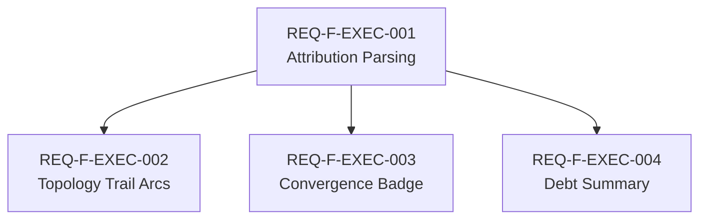

# Feature Decomposition: Executor Attribution & Observability Debt
<!-- Traces-To: REQ-F-EXEC-001, REQ-F-EXEC-002, REQ-F-EXEC-003, REQ-F-EXEC-004 -->
<!-- Edge: requirements→feature_decomposition -->
<!-- Iteration: 1 | Status: converged (pending human approval) -->
<!-- Parent spec: AISDLC_IMPLEMENTATION_REQUIREMENTS.md REQ-EVENT-005 -->

---

## Feature Inventory

### Feature: REQ-F-EXEC-001 — Executor Attribution Parsing

**Satisfies**: REQ-F-EXEC-001

**What converges**:
- Events loaded from `.ai-workspace/events/events.jsonl` carry `executor` and `emission` field values where present
- When fields are absent, inference rules derive values: presence of `eventType` (OL-format) → `executor: engine`; flat format without `eventType` → `executor: claude`; missing `emission` → default `emission: live`
- Parsed executor/emission values are present in the event model used by all downstream views

**Dependencies**: None (foundational data layer)

**MVP**: Yes — all display features depend on this; ship together as a unit

---

### Feature: REQ-F-EXEC-002 — Topology Trail Executor Rendering

**Satisfies**: REQ-F-EXEC-002

**What converges**:
- Topology Trail arcs are rendered with visually distinct styles per executor attribution:
  - Solid arc = engine-executed (F_D, deterministic)
  - Dashed arc = Claude-executed (F_P, live emission)
  - Dotted amber arc = retroactive (observability debt filled post-hoc)
- Unknown attribution falls back to solid (treat as engine; conservative)
- Arc legend is present on the Topology Trail view

**Dependencies**: REQ-F-EXEC-001 (executor values must be parsed before arcs can be styled)

**MVP**: Yes — primary user value: instantly see which edges are monitored vs debt

---

### Feature: REQ-F-EXEC-003 — Executor Badge in Edge Convergence Table

**Satisfies**: REQ-F-EXEC-003

**What converges**:
- Edge Convergence table includes an "Executor" column showing a badge per converged edge
- Badge values: `engine`, `claude`, `retroactive` — styled to match Topology Trail visual language
- Rows without attribution show a neutral "unknown" badge (no false confidence)

**Dependencies**: REQ-F-EXEC-001 (executor values must be parsed)

**MVP**: Yes — reinforces the visual language established by REQ-F-EXEC-002; builds together

---

### Feature: REQ-F-EXEC-004 — Observability Debt Summary

**Satisfies**: REQ-F-EXEC-004

**What converges**:
- Project dashboard surfaces a summary card: "Observability Debt"
- Counts: N edges without attribution (dark), M edges retroactive (debt filled), K edges engine-live (clean)
- Debt percentage shown as a ratio and trend (improving/worsening) if history available
- Clicking the summary navigates to a filtered view of debt edges

**Dependencies**: REQ-F-EXEC-001 (executor values must be parsed)

**MVP**: No — deferred. MVP delivers attribution visibility (EXEC-002/003); debt analytics extend it. Depends on accumulating enough history to make trends meaningful.

---

## Dependency Graph

REQ-F-EXEC-002 and REQ-F-EXEC-003 are independent of each other (parallel build). REQ-F-EXEC-004 is also independent of EXEC-002/003 but deferred.

---

## Build Order

1. **REQ-F-EXEC-001** — Executor Attribution Parsing (no dependencies; all others blocked on this)
2. **REQ-F-EXEC-002 + REQ-F-EXEC-003** — Topology Trail Arcs + Convergence Badge (parallel; both depend only on EXEC-001)
3. **REQ-F-EXEC-004** — Observability Debt Summary (deferred; depends on EXEC-001 but not MVP)

---

## MVP Scope

**Included in MVP**: REQ-F-EXEC-001, REQ-F-EXEC-002, REQ-F-EXEC-003

**Rationale**: These three form a complete, user-observable loop — the monitor parses attribution and shows it in both graphical (Topology Trail) and tabular (Edge Convergence) views. The user immediately sees which edges are engine-monitored vs debt.

**Deferred**: REQ-F-EXEC-004

**Deferral rationale**: Observability debt summary requires trend data to be useful. With only this session's events, the "improving/worsening" signal is not yet meaningful. Deliver after the monitor has accumulated at least one week of multi-session history.

---

## REQ Key Coverage

| REQ Key | Feature | MVP |
|---------|---------|-----|
| REQ-F-EXEC-001 | REQ-F-EXEC-001 (Attribution Parsing) | Yes |
| REQ-F-EXEC-002 | REQ-F-EXEC-002 (Topology Trail Arcs) | Yes |
| REQ-F-EXEC-003 | REQ-F-EXEC-003 (Convergence Badge) | Yes |
| REQ-F-EXEC-004 | REQ-F-EXEC-004 (Debt Summary) | No |

All 4 REQ-F-EXEC keys assigned. No key assigned to more than one feature.

---

## Risk Assessment

- **REQ-F-EXEC-001** (Attribution Parsing): Low risk. Inference rules are deterministic — `eventType` field presence is reliable. Main uncertainty: events emitted before this feature may have neither field; inference from format is the fallback.
- **REQ-F-EXEC-002** (Topology Trail Arcs): Medium risk. D3 arc rendering is already in place; adding style variation is low-complexity. Risk is in edge cases: events with `emission: retroactive` but no `executor` field.
- **REQ-F-EXEC-003** (Convergence Badge): Low risk. Table column addition; straightforward.
- **REQ-F-EXEC-004** (Debt Summary): Low risk (deferred). Deferred precisely because trend analytics require more data — this removes the pressure to build prematurely.

---

## Parallel Opportunities

| Features | Can Build In Parallel? | Condition |
|----------|----------------------|-----------|
| EXEC-001 | No (first, blocks all) | — |
| EXEC-002 + EXEC-003 | Yes | After EXEC-001 converges |
| EXEC-004 | Yes (with EXEC-002/003) | After EXEC-001 converges; but deferred |

---

## Source Findings

| Finding | Classification | Disposition |
|---------|---------------|-------------|
| No fourth category exists beyond {engine, claude, human} | SOURCE_CONFIRMED | Resolved — exhaustive by design (§IV bootloader) |
| Inference rules may misclassify OL events from old engine versions | SOURCE_AMBIGUITY | Resolved with assumption: OL-format = engine. If wrong, a corrective attribution field can be added; inference is best-effort only. |
| REQ-F-EXEC-004 lacks explicit priority signal for deferral | SOURCE_GAP | Resolved — priority Medium + no history yet = defer. Human to confirm in review. |
