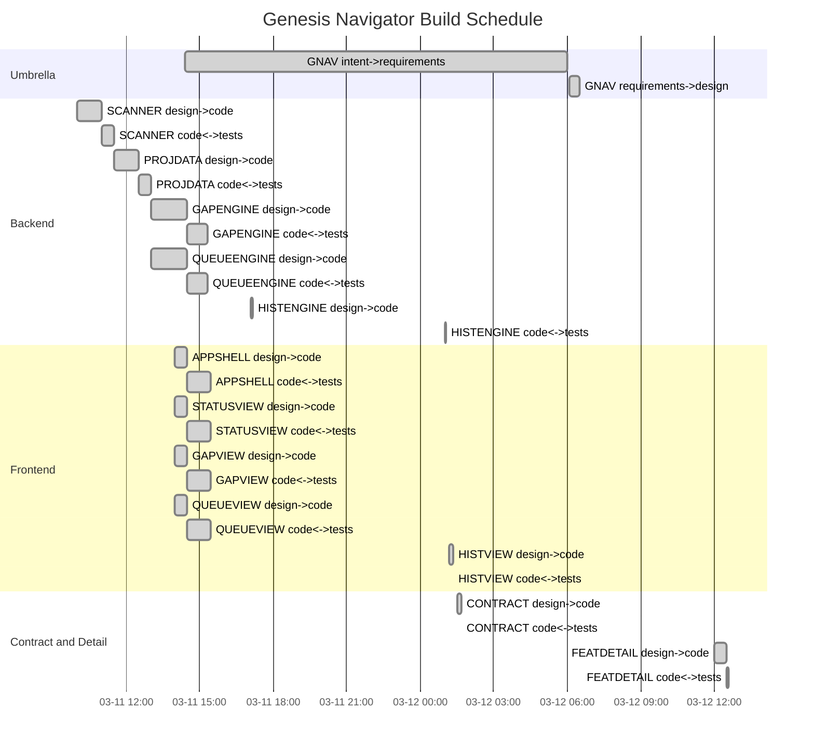

# Project Status — Genesis Navigator

Generated: 2026-03-12 12:40:00Z
Source of truth: `.ai-workspace/events/events.jsonl`

## Feature Build Schedule

## Phase Completion Summary

| Phase           | Converged | In Progress | Pending | Blocked |
|-----------------|-----------|-------------|---------|---------|
| design->code     | 13        | 0           | 0       | 0       |
| code<->unit_tests | 13        | 0           | 0       | 0       |
| **Total**       | **29**    | **0**       | **0**   | **0**   |

## Project State

**State**: CONVERGED

| State | Count |
|-------|-------|
| Iterating  | 0 vectors |
| Converged  | 13/13 required vectors |
| Blocked (with disposition) | 0 vectors |
| Blocked (no disposition) | 0 vectors |

## Completed Features

| Feature | Title | Edges Converged |
|---------|-------|-----------------|
| REQ-F-GNAV-001 | Genesis Navigator Application (umbrella) | 5/5 |
| REQ-F-SCANNER-001 | Workspace Scanner + FastAPI Shell | 2/2 |
| REQ-F-PROJDATA-001 | Project Data Reader | 2/2 |
| REQ-F-GAPENGINE-001 | Gap Analysis Engine | 2/2 |
| REQ-F-QUEUEENGINE-001 | Decision Queue Engine | 2/2 |
| REQ-F-APPSHELL-001 | App Shell and Project List | 2/2 |
| REQ-F-STATUSVIEW-001 | Status View | 2/2 |
| REQ-F-GAPVIEW-001 | Gap Analysis View | 2/2 |
| REQ-F-QUEUEVIEW-001 | Decision Queue View | 2/2 |
| REQ-F-FEATDETAIL-001 | Feature Detail View | 2/2 |
| REQ-F-HISTENGINE-001 | Session History Backend | 2/2 |
| REQ-F-HISTVIEW-001 | Session History View | 2/2 |
| REQ-F-CONTRACT-001 | API Contract Tests | 2/2 |

## Next Actions

- [HUMAN GATE] Review 3 draft proposals:
  - PROP-001 (high): navigation tests for REQ-F-NAV-003/004 -> /gen-review-proposal --show PROP-001
  - PROP-002 (high): performance test for REQ-NFR-PERF-001 -> /gen-review-proposal --show PROP-002
  - PROP-003 (medium): UX error/loading state tests -> /gen-review-proposal --show PROP-003
- [WARN] 3 ORPHAN workspace features not in FEATURE_VECTORS.md:
  - REQ-F-GNAV-001, REQ-F-FEATDETAIL-001, REQ-F-CONTRACT-001 — add to spec or archive
- Run /gen-release to create versioned release

---

## Process Telemetry

### Convergence Pattern
- All 13 features converged iteration 1 per edge — healthy first-pass convergence
- No stuck deltas detected
- TDD co-evolution (code<->unit_tests) succeeded on first attempt across all features
- Total iterations: 29 edge traversals, 0 re-iterations needed

### Traceability Coverage
- Layer 1 (REQ tags): PASS — code/test files tagged
- Layer 2 (Test gaps): FAIL — 5 gaps: REQ-F-NAV-003, REQ-F-NAV-004, REQ-NFR-PERF-001, REQ-NFR-UX-001, REQ-NFR-UX-002
- Layer 3 (Telemetry): SKIP — code->cicd edge not started

### Self-Reflection — Feedback -> New Intent

| Signal | Observation | Recommended Action |
|--------|-------------|-------------------|
| TELEM-001 | REQ-F-NAV-003/004 implemented but no click-to-navigate / refresh tests | PROP-001 approved |
| TELEM-002 | REQ-NFR-PERF-001 scan < 2000ms / 200 projects — zero test coverage | PROP-002 approved |
| TELEM-003 | REQ-NFR-UX-001/002 error/loading states lack assertion tests | PROP-003 approved |
| TELEM-004 | GapReport, QueueItem not declared as OpenAPI response_model — untyped dict endpoints | Add response_model= to FastAPI gap/queue handlers to get full schema coverage |
