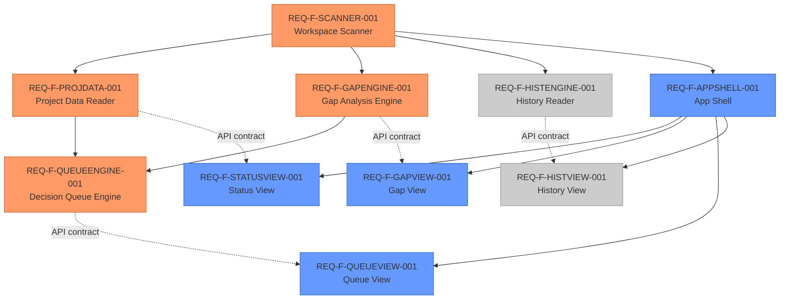

# Genesis Navigator — Feature Vectors

**Version**: 1.0.0 | **Date**: 2026-03-12 | **Status**: Draft
**Traces To**: specification/requirements/REQUIREMENTS.md

---

## Overview

This document decomposes the 31 REQ keys from REQUIREMENTS.md into 10 buildable
feature vectors. The decomposition follows the spec/design boundary: feature vectors
are tech-agnostic (WHAT to build), not implementation plans (HOW to build it).

### Coverage Summary

| Total REQ keys | Vectors | Coverage |
|---------------|---------|----------|
| 31 | 10 | 100% (31/31) |

### MVP Boundary

**MVP (v1.0 — must ship)**: SCANNER-001, PROJDATA-001, GAPENGINE-001,
QUEUEENGINE-001, APPSHELL-001, STATUSVIEW-001, GAPVIEW-001, QUEUEVIEW-001

**Post-MVP (v1.1)**: HISTENGINE-001, HISTVIEW-001

---

## Dependency DAG

Legend: orange = MVP backend · blue = MVP frontend · grey = post-MVP

---

## Backend Feature Vectors

### REQ-F-SCANNER-001: Workspace Scanner

**Priority**: Critical | **MVP**: Yes | **Layer**: Backend

**What**: A standalone scanner module that discovers Genesis projects under a root
directory and exposes the scan result via `GET /api/projects`. Includes the FastAPI
application shell and the `genesis-nav` CLI entry point.

**Satisfies**:
- `REQ-F-NAV-001` — workspace scanning (recursive, pruned)
- `REQ-F-API-001` — GET /api/projects endpoint (< 2s for 200 projects)
- `REQ-NFR-PERF-001` — scan performance bound
- `REQ-NFR-ARCH-002` — backend never writes
- `REQ-BR-001` — project_id stability (derived from directory name)
- `REQ-BR-002` — event log immutability (read-only access)

**Acceptance Criteria**:
- Given a root dir, scan recursively, prune `.git/node_modules/__pycache__/.venv`
- Return all subdirs containing `.ai-workspace/events/events.jsonl`
- A dir with `.ai-workspace/` but no events.jsonl returns `state: uninitialized`
- `GET /api/projects` responds < 2000ms for 200 projects
- `project_id` = directory name; disambiguated by relative path if duplicate
- Zero `open(..., 'w')` calls in scanner or API handler

**Dependencies**: None

---

### REQ-F-PROJDATA-001: Project Data Reader

**Priority**: Critical | **MVP**: Yes | **Layer**: Backend

**What**: Reads feature vectors, event log, and derives project state for a single
project. Exposes `GET /api/projects/{project_id}` with full project detail including
feature trajectories, Hamiltonian values, and project state badge.

**Satisfies**:
- `REQ-F-STAT-001` — feature vector list (id, title, status, edge, delta)
- `REQ-F-STAT-002` — project state badge (ITERATING/QUIESCENT/CONVERGED/BOUNDED algorithm)
- `REQ-F-STAT-003` — feature trajectory (per-edge status, iteration count, timestamps)
- `REQ-F-STAT-004` — Hamiltonian H = T + V per feature
- `REQ-F-API-002` — GET /api/projects/{id} endpoint (< 1s)
- `REQ-NFR-PERF-002` — project detail performance (50 features, 10k events)

**Acceptance Criteria**:
- Reads `.ai-workspace/features/active/` and `completed/` YAML files
- Computes project state per three-state algorithm from REQUIREMENTS §REQ-F-STAT-002
- H = T (iteration_completed events) + V (last delta from events.jsonl)
- Malformed YAML returns feature with `status: error` and parse error message
- Malformed JSON lines in events.jsonl are skipped; project still loads
- Response < 1000ms for project with 50 features, 10k events

**Dependencies**: REQ-F-SCANNER-001

---

### REQ-F-GAPENGINE-001: Gap Analysis Engine

**Priority**: Critical | **MVP**: Yes | **Layer**: Backend

**What**: Computes three-layer gap analysis for a project by scanning specification
files and source/test code for REQ key tags. Exposes `GET /api/projects/{id}/gaps`.

**Satisfies**:
- `REQ-F-GAP-001` — Layer 1: `# Implements:` tags in code, `# Validates:` tags in tests
- `REQ-F-GAP-002` — Layer 2: test gap analysis (REQ key without test)
- `REQ-F-GAP-003` — Layer 3: telemetry gap analysis (advisory)
- `REQ-F-GAP-004` — gap summary header (counts per layer, GREEN/AMBER/RED signal)
- `REQ-F-API-003` — GET /api/projects/{id}/gaps endpoint (< 3s)

**Acceptance Criteria**:
- Layer 1: scan `specification/requirements/REQUIREMENTS.md` for REQ keys; scan
  source for `# Implements: REQ-*`; scan tests for `# Validates: REQ-*`
- Layer 2: for each spec REQ key, verify at least one test has `# Validates:` tag
- Layer 3: scan for `req="REQ-*"` in logging/metrics calls (advisory)
- Gap signal: GREEN (0 L1+L2 gaps), AMBER (1–5), RED (>5)
- Zero write operations; response < 3000ms

**Dependencies**: REQ-F-SCANNER-001

---

### REQ-F-QUEUEENGINE-001: Decision Queue Engine

**Priority**: Critical | **MVP**: Yes | **Layer**: Backend

**What**: Derives and ranks next actionable items from project state and gap analysis.
Generates the correct `gen-iterate` / `gen-start` command for each item. Exposes
`GET /api/projects/{id}/queue`.

**Satisfies**:
- `REQ-F-QUEUE-001` — ranked next actions list (stuck > blocked > gaps > gates > intents > in-progress)
- `REQ-F-QUEUE-002` — command surface (correct gen-* commands with feature ID and edge)
- `REQ-F-QUEUE-003` — queue item detail (reason, delta, failing checks, expected outcome)
- `REQ-F-API-004` — GET /api/projects/{id}/queue endpoint (< 1s)

**Acceptance Criteria**:
- STUCK: features with delta unchanged for 3+ consecutive iterations (from events.jsonl)
- BLOCKED: features with `status: blocked` in their feature vector
- GAP clusters: L1/L2 gaps from gap engine grouped by domain
- Commands: `/gen-iterate --edge "{edge}" --feature "{id}"` for stuck/blocked;
  `/gen-gaps` for gap clusters; `/gen-review` for human gates
- Items ranked: critical > high > medium > low; within severity, by delta magnitude
- Response < 1000ms

**Dependencies**: REQ-F-PROJDATA-001, REQ-F-GAPENGINE-001

---

### REQ-F-HISTENGINE-001: Session History Reader

**Priority**: High | **MVP**: No (v1.1) | **Layer**: Backend

**What**: Discovers and parses archived e2e run directories, constructs event
timelines per run, and exposes run listing and detail endpoints.

**Satisfies**:
- `REQ-F-HIST-001` — run list (archived runs + current workspace as "Current Session")
- `REQ-F-HIST-002` — run timeline (events grouped by feature + edge)
- `REQ-F-HIST-003` — run comparison (two runs aligned by edge name)
- `REQ-F-API-005` — GET /api/projects/{id}/runs and /runs/{run_id}
- `REQ-BR-003` — archived run isolation (not included in live state)

**Acceptance Criteria**:
- Discovers runs in `tests/e2e/runs/e2e_*/` and `.ai-workspace/runs/` (if present)
- Current workspace always appears as run_id `current`
- Timeline groups events: feature → edge → iteration
- Archived events never influence `GET /api/projects/{id}` state
- Comparison: two timelines aligned vertically by edge name, delta/timing highlighted

**Dependencies**: REQ-F-SCANNER-001

---

## Frontend Feature Vectors

### REQ-F-APPSHELL-001: App Shell and Project List

**Priority**: Critical | **MVP**: Yes | **Layer**: Frontend

**What**: The React + Vite application skeleton including routing, API client layer,
the project list view, project selection navigation, and manual refresh. Establishes
the frontend architecture and the API contract dependency.

**Satisfies**:
- `REQ-F-NAV-002` — project list view (sortable, filterable cards with state badge)
- `REQ-F-NAV-003` — project selection (navigate to `/projects/{id}`, back navigation, deep linking)
- `REQ-F-NAV-004` — manual refresh (on-demand re-fetch, loading indicator, last-refresh timestamp)
- `REQ-NFR-UX-001` — graceful error handling (corrupted workspace, parse errors)
- `REQ-NFR-UX-002` — loading and empty states (spinner < 100ms, meaningful empty messages)
- `REQ-NFR-ARCH-001` — API contract independence (frontend depends only on REST contract)

**Acceptance Criteria**:
- React Router v7 routes: `/` (project list), `/projects/:id` (project detail)
- TanStack Query for all data fetching
- Project card: name, state badge (ITERATING/QUIESCENT/CONVERGED/BOUNDED), active/converged counts, last-event timestamp
- Sort by: name, state, last-modified (default); filter by state
- Deep link to `/projects/:id` works on direct URL access
- Loading spinner appears within 100ms of fetch initiation
- Empty list: "No Genesis projects found under {root}. Run the Genesis installer."
- Error states: per-project, not full-page crash

**Dependencies**: REQ-F-SCANNER-001 (API contract)

---

### REQ-F-STATUSVIEW-001: Status View

**Priority**: Critical | **MVP**: Yes | **Layer**: Frontend

**What**: The project detail status panel displaying all feature vectors with their
current trajectory, project state badge, Hamiltonian values, and stuck/flat indicators.

**Satisfies**:
- `REQ-F-STAT-001` — feature vector list (id, title, edge, status, iterations, delta)
- `REQ-F-STAT-002` — project state badge (with tooltip explaining state)
- `REQ-F-STAT-003` — inline trajectory view (edges as nodes, current edge highlighted)
- `REQ-F-STAT-004` — Hamiltonian display (H, T, V per feature; flat-H flag)

**Acceptance Criteria**:
- Default sort: stuck > blocked > iterating > converged
- Trajectory nodes: ✓ converged, ● iterating, ○ pending, ✗ blocked
- Co-evolution edges (code↔unit_tests) shown as single combined node
- H tooltip: "H = total work cost. T = iterations. V = remaining delta. H flat = high friction."
- Features with H flat (V unchanged, T growing) visually flagged (e.g., amber border)

**Dependencies**: REQ-F-APPSHELL-001, REQ-F-PROJDATA-001 (API contract)

---

### REQ-F-GAPVIEW-001: Gap Analysis View

**Priority**: Critical | **MVP**: Yes | **Layer**: Frontend

**What**: The gap analysis panel displaying all three traceability layers with
coverage percentages, gap tables, and aggregate health signal.

**Satisfies**:
- `REQ-F-GAP-001` — Layer 1 display: REQ key → code/test coverage table
- `REQ-F-GAP-002` — Layer 2 display: test gap items with suggested commands
- `REQ-F-GAP-003` — Layer 3 display: telemetry gap items (advisory label)
- `REQ-F-GAP-004` — gap summary header: counts per layer, GREEN/AMBER/RED signal, timestamp

**Acceptance Criteria**:
- Summary header: L1 gaps (n), L2 gaps (n), L3 gaps (n advisory), health signal badge
- L1 table: REQ key | In Code | In Tests | Status (COMPLETE / CODE GAP / TEST GAP)
- Orphan keys (in code but not in spec) explicitly listed
- Layer 3 labelled "advisory — applies at code→cicd edge"
- Each gap item shows suggested command

**Dependencies**: REQ-F-APPSHELL-001, REQ-F-GAPENGINE-001 (API contract)

---

### REQ-F-QUEUEVIEW-001: Decision Queue View

**Priority**: Critical | **MVP**: Yes | **Layer**: Frontend

**What**: The decision queue panel displaying ranked next-action items with
expandable detail and one-click command copy.

**Satisfies**:
- `REQ-F-QUEUE-001` — ranked items list with type, severity badge, description
- `REQ-F-QUEUE-002` — command copy (monospace code block, "Copy" button)
- `REQ-F-QUEUE-003` — expanded detail (reason queued, delta, failing checks, expected outcome)

**Acceptance Criteria**:
- Each item: type icon, severity badge (critical/high/medium/low), feature ID (if applicable), description
- Command shown in `<code>` block; Copy button uses Clipboard API
- Expand/collapse for detail panel
- Empty queue: "No blockers detected — project is healthy."
- For stuck items: show last 3 iteration deltas in expanded detail

**Dependencies**: REQ-F-APPSHELL-001, REQ-F-QUEUEENGINE-001 (API contract)

---

### REQ-F-HISTVIEW-001: Session History View

**Priority**: High | **MVP**: No (v1.1) | **Layer**: Frontend

**What**: The session history panel listing archived runs, displaying event
timelines, and enabling side-by-side run comparison.

**Satisfies**:
- `REQ-F-HIST-001` — run list (sorted newest-first, "Current Session" first item)
- `REQ-F-HIST-002` — run timeline (events grouped feature→edge, horizontally scrollable)
- `REQ-F-HIST-003` — run comparison (two timelines aligned by edge name, diffs highlighted)

**Acceptance Criteria**:
- Run card: run ID, timestamp, event count, edges traversed, final state
- Timeline: feature sections → edge blocks → event markers (started/iterating/converged)
- Compare mode: select two runs → aligned view, delta/timing differences highlighted
- Edges in one run but not the other indicated with "not present" placeholder

**Dependencies**: REQ-F-APPSHELL-001, REQ-F-HISTENGINE-001 (API contract)

---

## REQ Key Coverage Map

| REQ Key | Feature Vector |
|---------|---------------|
| REQ-F-NAV-001 | REQ-F-SCANNER-001 |
| REQ-F-NAV-002 | REQ-F-APPSHELL-001 |
| REQ-F-NAV-003 | REQ-F-APPSHELL-001 |
| REQ-F-NAV-004 | REQ-F-APPSHELL-001 |
| REQ-F-STAT-001 | REQ-F-PROJDATA-001, REQ-F-STATUSVIEW-001 |
| REQ-F-STAT-002 | REQ-F-PROJDATA-001, REQ-F-STATUSVIEW-001 |
| REQ-F-STAT-003 | REQ-F-PROJDATA-001, REQ-F-STATUSVIEW-001 |
| REQ-F-STAT-004 | REQ-F-PROJDATA-001, REQ-F-STATUSVIEW-001 |
| REQ-F-GAP-001 | REQ-F-GAPENGINE-001, REQ-F-GAPVIEW-001 |
| REQ-F-GAP-002 | REQ-F-GAPENGINE-001, REQ-F-GAPVIEW-001 |
| REQ-F-GAP-003 | REQ-F-GAPENGINE-001, REQ-F-GAPVIEW-001 |
| REQ-F-GAP-004 | REQ-F-GAPENGINE-001, REQ-F-GAPVIEW-001 |
| REQ-F-QUEUE-001 | REQ-F-QUEUEENGINE-001, REQ-F-QUEUEVIEW-001 |
| REQ-F-QUEUE-002 | REQ-F-QUEUEENGINE-001, REQ-F-QUEUEVIEW-001 |
| REQ-F-QUEUE-003 | REQ-F-QUEUEENGINE-001, REQ-F-QUEUEVIEW-001 |
| REQ-F-HIST-001 | REQ-F-HISTENGINE-001, REQ-F-HISTVIEW-001 |
| REQ-F-HIST-002 | REQ-F-HISTENGINE-001, REQ-F-HISTVIEW-001 |
| REQ-F-HIST-003 | REQ-F-HISTENGINE-001, REQ-F-HISTVIEW-001 |
| REQ-F-API-001 | REQ-F-SCANNER-001 |
| REQ-F-API-002 | REQ-F-PROJDATA-001 |
| REQ-F-API-003 | REQ-F-GAPENGINE-001 |
| REQ-F-API-004 | REQ-F-QUEUEENGINE-001 |
| REQ-F-API-005 | REQ-F-HISTENGINE-001 |
| REQ-NFR-PERF-001 | REQ-F-SCANNER-001 |
| REQ-NFR-PERF-002 | REQ-F-PROJDATA-001 |
| REQ-NFR-UX-001 | REQ-F-APPSHELL-001 |
| REQ-NFR-UX-002 | REQ-F-APPSHELL-001 |
| REQ-NFR-ARCH-001 | REQ-F-APPSHELL-001 |
| REQ-NFR-ARCH-002 | REQ-F-SCANNER-001 |
| REQ-BR-001 | REQ-F-SCANNER-001 |
| REQ-BR-002 | REQ-F-SCANNER-001 |
| REQ-BR-003 | REQ-F-HISTENGINE-001 |

**Coverage**: 31/31 REQ keys covered (100%)

---

## Build Order (Recommended)

Given the dependency DAG, the recommended build sequence is:

1. **REQ-F-SCANNER-001** — foundation; all backend depends on this
2. **REQ-F-PROJDATA-001** — needed by queue engine and status view
3. **REQ-F-GAPENGINE-001** — needed by queue engine and gap view
4. **REQ-F-QUEUEENGINE-001** — depends on proj data + gap engine
5. **REQ-F-APPSHELL-001** — frontend skeleton; all frontend views depend on this
6. **REQ-F-STATUSVIEW-001**, **REQ-F-GAPVIEW-001**, **REQ-F-QUEUEVIEW-001** — can be built in parallel
7. **REQ-F-HISTENGINE-001** — post-MVP, independent of queue engine
8. **REQ-F-HISTVIEW-001** — post-MVP, depends on hist engine + app shell
