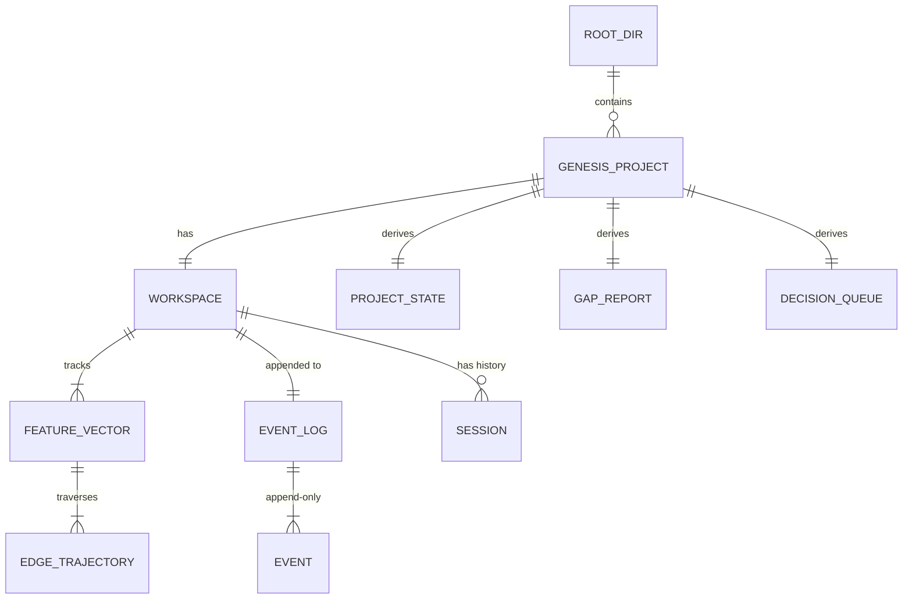
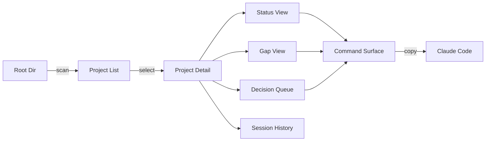

# Genesis Navigator — Requirements

**Version**: 1.0.0 | **Date**: 2026-03-12 | **Status**: Draft
**Traces To**: specification/INTENT.md

---

## Overview

Genesis Navigator is a local web application for practitioners managing one or more
Genesis-managed software projects. It answers three questions at the start of every
work session without opening a Claude Code session:

1. **Where am I?** — State of all feature vectors across all my projects
2. **What's missing?** — Gap analysis: REQ coverage, test coverage, telemetry
3. **What should I do next?** — Prioritised list of next actions with commands

The system is a **point-in-time reader**. It scans `.ai-workspace/` directories on
demand, presents structured views of project state, and surfaces the Genesis commands
that would address current gaps. It does not execute those commands — the practitioner
runs them in Claude Code.

### Scope Boundary

**In scope (v1)**:
- Local filesystem scanning and reading
- Project list, status, gap analysis, decision queue, session history views
- REST API backend (Python/FastAPI) + React/Vite frontend
- Read-only access — never writes to any workspace

**Out of scope (v1)**:
- Live filesystem watching (no SSE, no WebSockets)
- Executing Genesis commands on behalf of the user
- Authentication / multi-user
- VS Code extension, Electron, or cloud deployment
- Editing feature vectors or event logs

---

## Terminology

| Term | Definition |
|------|-----------|
| **Genesis project** | A directory containing `.ai-workspace/events/events.jsonl` |
| **Workspace** | The `.ai-workspace/` directory — source of truth for project state |
| **Feature vector** | A YAML file in `.ai-workspace/features/active/` or `completed/` describing one capability's trajectory through the graph |
| **Edge** | A transition between two asset types (e.g., `intent→requirements`, `code↔unit_tests`) |
| **Convergence** | An edge where all required evaluators pass (delta = 0) |
| **Delta** | Count of failing required evaluator checks on the current edge |
| **Project state** | Derived state of the whole project: ITERATING, QUIESCENT, CONVERGED, or BOUNDED |
| **Gap** | A REQ key present in the spec but missing from code (Layer 1), tests (Layer 2), or telemetry (Layer 3) |
| **Decision queue** | Ranked list of next actionable items derived from project state and gaps |
| **Session / run** | An archived e2e run directory (`e2e_VERSION_TIMESTAMP_SEQ/`) or a time-bounded block of events from a single work session |
| **Root directory** | The filesystem directory passed to `genesis-nav` — all Genesis projects are discovered under this root |
| **API contract** | The set of REST endpoints the frontend depends on — must be satisfiable by any compliant backend adapter |

---

## Domain Model

---

## Functional Requirements

### Navigation and Discovery

#### REQ-F-NAV-001: Workspace Scanning
**Priority**: Critical
**Type**: Functional

**Description**: The system must scan a root directory recursively and identify all
Genesis projects. A directory is a Genesis project if it contains
`.ai-workspace/events/events.jsonl`.

**Acceptance Criteria**:
- Given a root directory, the system must return all subdirectories at any depth
  containing `.ai-workspace/events/events.jsonl`
- Directories named `.git`, `node_modules`, `__pycache__`, `.venv` must be pruned
  (not descended into)
- Scan must complete in under 2 seconds for up to 200 projects under the root
- A directory with `.ai-workspace/` but no `events.jsonl` must be returned with
  `state: uninitialized`

**Traces To**: INT-001 (primary journey step 1)

---

#### REQ-F-NAV-002: Project List View
**Priority**: Critical
**Type**: Functional

**Description**: The system must present all discovered projects as a sortable,
filterable list. Each project card must display: project name, project state badge,
feature count (active / converged), and last-modified timestamp.

**Acceptance Criteria**:
- Each project card must show: name, state badge (ITERATING/QUIESCENT/CONVERGED/BOUNDED),
  count of active features, count of converged features, timestamp of most recent event
- List must be sortable by: name (alphabetical), state, last-modified (default)
- List must be filterable by: state badge
- An empty state (no projects found) must display an instructional message

**Traces To**: INT-001 (primary journey step 2)

---

#### REQ-F-NAV-003: Project Selection
**Priority**: Critical
**Type**: Functional

**Description**: Selecting a project from the list must navigate to the project detail
view, which renders all five views (Status, Gaps, Decision Queue, Session History,
and an Overview header).

**Acceptance Criteria**:
- Clicking a project card must navigate to `/projects/{project_id}`
- The project detail view must render within 1 second of selection
- A back-navigation control must return to the project list
- Deep-linking to `/projects/{project_id}` must work (direct URL access)

**Traces To**: INT-001 (primary journey step 3)

---

#### REQ-F-NAV-004: Manual Refresh
**Priority**: High
**Type**: Functional

**Description**: The user must be able to trigger a full re-read of a project's
workspace on demand. The navigator does not watch the filesystem — all data is
fetched at explicit user request.

**Acceptance Criteria**:
- A "Refresh" control must be visible on the project detail view
- Activating Refresh must re-fetch all project data from the API
- A loading indicator must be displayed during refresh
- The timestamp of the last refresh must be visible

**Traces To**: INT-001 (primary journey step 2, "refresh status")

---

### Status View

#### REQ-F-STAT-001: Feature Vector List
**Priority**: Critical
**Type**: Functional

**Description**: The status view must list all feature vectors (active and completed)
for the selected project, showing each vector's current state in the graph.

**Acceptance Criteria**:
- Each feature vector must show: feature ID (REQ-F-*), title, current edge, status
  (iterating/converged/blocked/stuck), iteration count, current delta
- Converged features must be visually distinguished from in-progress features
- The list must be sorted by: status priority (stuck > blocked > iterating > converged)
  as default; user may sort by feature ID or last-modified

**Traces To**: INT-001 (primary journey step 3 — "all feature vectors and their convergence status")

---

#### REQ-F-STAT-002: Project State Badge
**Priority**: Critical
**Type**: Functional

**Description**: The project detail header must display the derived project-level
state and a brief explanation of what it means.

**Acceptance Criteria**:
- State must be one of: ITERATING, QUIESCENT, CONVERGED, BOUNDED
- State must be computed per the three-state algorithm:
  - ITERATING: at least one vector with status iterating or in_progress
  - CONVERGED: all required vectors (not blocked_deferred/abandoned) have status converged
  - QUIESCENT: nothing iterating; at least one blocked vector with no disposition
  - BOUNDED: quiescent and all blocked vectors have explicit disposition
- State badge must include a tooltip explaining the state in plain language

**Traces To**: INT-001 (primary journey step 3 — "project-level state")

---

#### REQ-F-STAT-003: Feature Trajectory View
**Priority**: High
**Type**: Functional

**Description**: Selecting a feature vector must expand an inline trajectory view
showing each edge in the active profile as a node, with convergence status and
iteration count per edge.

**Acceptance Criteria**:
- The trajectory must show edges in topological order from the feature's active profile
- Each edge node must show: status (✓ converged / ● iterating / ○ pending / ✗ blocked),
  iteration count (if > 0), delta (if iterating)
- The "current" edge must be visually highlighted
- Co-evolution edges (code↔unit_tests) must appear as a single combined node

**Traces To**: INT-001 (primary journey step 3)

---

#### REQ-F-STAT-004: Hamiltonian Display
**Priority**: Medium
**Type**: Functional

**Description**: The status view must display the Hamiltonian H = T + V for each
feature vector, where T = total iterations completed and V = current delta.

**Acceptance Criteria**:
- H, T, and V must be displayed per feature in the feature vector list
- A tooltip must explain: "H = total work cost. T = iterations completed. V = remaining delta. H decreasing = healthy convergence."
- Features where H is flat (T growing, V unchanged) must be visually flagged

**Traces To**: INT-001 (status view)

---

### Gap Analysis View

#### REQ-F-GAP-001: Layer 1 — REQ Tag Coverage
**Priority**: Critical
**Type**: Functional

**Description**: The gap view must display Layer 1 traceability: which REQ keys
defined in the specification have `# Implements:` tags in code files and
`# Validates:` tags in test files.

**Acceptance Criteria**:
- The view must show a table: REQ key | In Code | In Tests | Status (COMPLETE / GAP)
- REQ keys present in spec but absent from code must be flagged as CODE GAP
- REQ keys present in code but absent from tests must be flagged as TEST GAP
- Coverage percentage (keys fully covered / total spec keys) must be displayed
- The view must distinguish between "spec keys" (from REQUIREMENTS.md) and
  "orphan keys" (in code but not in spec)

**Traces To**: INT-001 (primary journey step 3 — "gap summary")

---

#### REQ-F-GAP-002: Layer 2 — Test Gap Analysis
**Priority**: Critical
**Type**: Functional

**Description**: The gap view must display Layer 2: which REQ keys defined in the
specification have at least one test that validates them.

**Acceptance Criteria**:
- The view must show: total spec keys, keys with tests, keys without tests (TEST GAPS)
- Each TEST GAP must show the REQ key, its title (if available), and the suggested
  command to address it
- Coverage percentage must be displayed

**Traces To**: INT-001 (primary journey step 3 — "gap summary")

---

#### REQ-F-GAP-003: Layer 3 — Telemetry Gap Analysis
**Priority**: Medium
**Type**: Functional

**Description**: The gap view must display Layer 3 (advisory): which REQ keys in
code files have `req="REQ-*"` telemetry tags in logging/metrics calls.

**Acceptance Criteria**:
- Layer 3 must be clearly labelled as "advisory — applies at code→cicd edge"
- The view must show: keys in code, keys with telemetry tags, keys without (TELEMETRY GAPS)
- TELEMETRY GAP items must show the REQ key and file location

**Traces To**: INT-001 (primary journey step 3 — "gap summary")

---

#### REQ-F-GAP-004: Gap Summary Header
**Priority**: High
**Type**: Functional

**Description**: The gap view must display an aggregate summary at the top showing
gap counts per layer and an overall health signal.

**Acceptance Criteria**:
- Summary must show: Layer 1 gaps (n), Layer 2 gaps (n), Layer 3 gaps (n, advisory)
- An overall signal: GREEN (0 critical gaps), AMBER (1–5 gaps), RED (>5 gaps)
- Summary must include the timestamp of the last gap computation

**Traces To**: INT-001 (primary journey step 3)

---

### Decision Queue

#### REQ-F-QUEUE-001: Next Actions List
**Priority**: Critical
**Type**: Functional

**Description**: The decision queue must display a ranked list of actionable next
items for the selected project. Items are ranked by severity and type.

**Acceptance Criteria**:
- Queue must include items from these sources (in priority order):
  1. STUCK features (delta unchanged 3+ iterations) — severity: critical
  2. BLOCKED features (unresolved dependency or human gate) — severity: high
  3. Layer 1/2 gap clusters (untagged REQ keys) — severity: high
  4. Pending human gates (F_H evaluators waiting) — severity: high
  5. Unactioned `intent_raised` events — severity: medium
  6. In-progress features closest to converging (fewest remaining edges) — severity: low
- Each item must show: type, feature ID (if applicable), description, severity badge
- Empty queue must display a positive signal: "No blockers — project is healthy"

**Traces To**: INT-001 (primary journey steps 3–4)

---

#### REQ-F-QUEUE-002: Command Surface
**Priority**: Critical
**Type**: Functional

**Description**: Each decision queue item must show the Genesis command that would
address it, formatted as a copyable shell string.

**Acceptance Criteria**:
- Each queue item must show the recommended command (e.g.,
  `/gen-iterate --edge "code↔unit_tests" --feature "REQ-F-AUTH-001"`)
- Commands must use the correct feature ID and edge for the item
- Commands must be displayed in a monospace code block
- A "Copy" button must copy the command to the clipboard

**Traces To**: INT-001 (primary journey step 4)

---

#### REQ-F-QUEUE-003: Queue Item Detail
**Priority**: Medium
**Type**: Functional

**Description**: Expanding a queue item must show the full context: why this item
is in the queue, what the current state is, and what the expected outcome of the
command is.

**Acceptance Criteria**:
- Expanded item must show: reason queued, current delta (if applicable), failing
  checks (if applicable), expected outcome after running the command
- For gap items: list the specific REQ keys in the gap cluster
- For stuck items: show the iteration history (last 3 iterations, delta unchanged)

**Traces To**: INT-001 (primary journey step 4)

---

### Session History

#### REQ-F-HIST-001: Run List
**Priority**: High
**Type**: Functional

**Description**: The session history view must list all discoverable past runs for
the selected project. A run is an archived e2e directory at
`tests/e2e/runs/e2e_VERSION_TIMESTAMP_SEQ/` or a time-bounded block of events.

**Acceptance Criteria**:
- Each run must show: run ID / timestamp, version (if available), number of events,
  edges traversed, final convergence status
- Runs must be sorted newest-first by default
- The current workspace (live, not archived) must appear as the first item labelled
  "Current Session"

**Traces To**: INT-001 (primary journey step 5)

---

#### REQ-F-HIST-002: Run Timeline
**Priority**: High
**Type**: Functional

**Description**: Selecting a run must display a chronological timeline of events,
showing the convergence progression for each feature and edge in that run.

**Acceptance Criteria**:
- Timeline must show events grouped by feature, then by edge, in chronological order
- Each edge block must show: start time, end time (if converged), iteration count,
  final delta, evaluator results summary
- `edge_started`, `iteration_completed`, `edge_converged` events must be visually
  distinguished
- The timeline must be horizontally scrollable if the run spans many edges

**Traces To**: INT-001 (primary journey step 5)

---

#### REQ-F-HIST-003: Run Comparison
**Priority**: Medium
**Type**: Functional

**Description**: The user must be able to select two runs and compare their
convergence timelines side by side.

**Acceptance Criteria**:
- A "Compare" mode must allow selecting two runs from the run list
- The comparison view must show the two timelines vertically aligned by edge name
- Differences in iteration count, delta, and timing must be visually highlighted
- Edges that appear in one run but not the other must be indicated

**Traces To**: INT-001 (primary journey step 5)

---

### API Contract

#### REQ-F-API-001: Project Scan Endpoint
**Priority**: Critical
**Type**: Functional

**Description**: The backend must expose an endpoint that returns all Genesis
projects discovered under the configured root directory.

**Acceptance Criteria**:
- `GET /api/projects` must return a JSON array of project summaries
- Each summary must include: `project_id`, `name`, `path`, `state`,
  `active_feature_count`, `converged_feature_count`, `last_event_at`
- Response must include `scan_duration_ms`
- Endpoint must respond in under 2 seconds for up to 200 projects

**Traces To**: REQ-F-NAV-001, REQ-F-NAV-002

---

#### REQ-F-API-002: Project Detail Endpoint
**Priority**: Critical
**Type**: Functional

**Description**: The backend must expose an endpoint returning full project state
for a single project including all feature vectors and their trajectories.

**Acceptance Criteria**:
- `GET /api/projects/{project_id}` must return: project summary, all feature vectors
  (id, title, status, current_edge, delta, trajectory, hamiltonian), project state
- Feature vectors must include trajectory: list of edges with status, iteration
  count, started_at, converged_at
- Response must arrive within 1 second

**Traces To**: REQ-F-STAT-001, REQ-F-STAT-002, REQ-F-STAT-003, REQ-F-STAT-004

---

#### REQ-F-API-003: Gap Analysis Endpoint
**Priority**: Critical
**Type**: Functional

**Description**: The backend must expose an endpoint that computes and returns the
three-layer gap analysis for a project.

**Acceptance Criteria**:
- `GET /api/projects/{project_id}/gaps` must return layers 1, 2, and 3
- Each layer: list of gaps (req_key, type, files_affected), coverage percentage,
  gap_count
- Response must arrive within 3 seconds
- Computation must be pure read — no writes to workspace

**Traces To**: REQ-F-GAP-001, REQ-F-GAP-002, REQ-F-GAP-003, REQ-F-GAP-004

---

#### REQ-F-API-004: Decision Queue Endpoint
**Priority**: Critical
**Type**: Functional

**Description**: The backend must expose an endpoint returning the ranked decision
queue for a project.

**Acceptance Criteria**:
- `GET /api/projects/{project_id}/queue` must return a ranked array of queue items
- Each item: `type`, `severity`, `feature_id` (if applicable), `description`,
  `command`, `detail`
- Items must be ranked: critical > high > medium > low; within same severity, by
  delta magnitude
- Response must arrive within 1 second

**Traces To**: REQ-F-QUEUE-001, REQ-F-QUEUE-002, REQ-F-QUEUE-003

---

#### REQ-F-API-005: Session History Endpoint
**Priority**: High
**Type**: Functional

**Description**: The backend must expose endpoints for listing runs and fetching
run event timelines.

**Acceptance Criteria**:
- `GET /api/projects/{project_id}/runs` must return a list of run summaries
  (run_id, timestamp, event_count, edges_traversed, final_state)
- `GET /api/projects/{project_id}/runs/{run_id}` must return the full event
  timeline for a run (all events, grouped by feature+edge)
- Current workspace must appear as run_id `current`

**Traces To**: REQ-F-HIST-001, REQ-F-HIST-002, REQ-F-HIST-003

---

## Non-Functional Requirements

#### REQ-NFR-PERF-001: Project Scan Performance
**Priority**: Critical
**Type**: Non-Functional

**Description**: The system must scan up to 200 projects under a root directory
and return the project list within 2 seconds on a developer laptop (Apple M-series
or equivalent).

**Acceptance Criteria**:
- `GET /api/projects` must return within 2000ms for a root containing 200 projects
- Scan must prune standard non-project directories to avoid unnecessary traversal

**Traces To**: INT-001 (success criteria — "scan in under 2 seconds")

---

#### REQ-NFR-PERF-002: Project Detail Performance
**Priority**: High
**Type**: Non-Functional

**Description**: The project detail view must load within 1 second of selection.

**Acceptance Criteria**:
- `GET /api/projects/{project_id}` must respond within 1000ms for a project with
  up to 50 feature vectors and 10,000 events in events.jsonl

**Traces To**: REQ-F-NAV-003

---

#### REQ-NFR-UX-001: Error Handling — Corrupted Workspace
**Priority**: High
**Type**: Non-Functional

**Description**: The system must gracefully handle workspaces that are partially
initialised, have corrupted event logs, or have malformed feature vector files.

**Acceptance Criteria**:
- A project with a missing `events.jsonl` must appear in the list with state
  `uninitialized` and an explanation
- Malformed JSON lines in `events.jsonl` must be skipped; the project must still load
- Missing or malformed feature vector YAML must show the feature as `error` state
  with the parse error surfaced
- No workspace error must crash the API server — errors are per-project

**Traces To**: INT-001 (source gap: error handling)

---

#### REQ-NFR-UX-002: Loading and Empty States
**Priority**: Medium
**Type**: Non-Functional

**Description**: Every async operation must have a visible loading state. Every
list that can be empty must have a meaningful empty state message.

**Acceptance Criteria**:
- Loading spinner or skeleton must appear within 100ms of initiating any fetch
- Empty project list must show: "No Genesis projects found under {root}. Run the
  Genesis installer to initialise a project."
- Empty decision queue must show: "No blockers detected — project is healthy."

**Traces To**: INT-001 (UX quality)

---

#### REQ-NFR-ARCH-001: API Contract Independence
**Priority**: Critical
**Type**: Non-Functional

**Description**: The React frontend must depend only on the defined REST API
contract, not on any implementation detail of the Python backend. The API contract
must be formally defined (OpenAPI schema).

**Acceptance Criteria**:
- All frontend data fetching must go through the API layer (no direct filesystem access)
- An OpenAPI 3.1 schema must be published at `GET /openapi.json`
- The frontend must function with any backend that satisfies the OpenAPI schema

**Traces To**: INT-001 (technology — "API contract decoupled from filesystem adapter")

---

#### REQ-NFR-ARCH-002: Read-Only Backend Contract
**Priority**: Critical
**Type**: Non-Functional

**Description**: The backend must never write to, modify, or delete any file in a
target project's workspace. It is a pure reader.

**Acceptance Criteria**:
- No filesystem write operations in any API handler
- The constraint must be enforced by code review (no `open(..., 'w')` in API handlers)
- Backend tests must verify that no workspace files change after any API call

**Traces To**: INT-001 ("The navigator does not execute those commands")

---

## Business Rules

#### REQ-BR-001: Project Identity
**Priority**: High
**Type**: Business Rule

**Description**: A project's identity (`project_id`) must be stable across rescans.
Renaming the root directory must not change project IDs.

**Acceptance Criteria**:
- `project_id` must be derived from the project directory name (not its absolute path)
- If two projects have the same directory name under the root, they must be
  disambiguated by their relative path from root

**Traces To**: REQ-F-NAV-001

---

#### REQ-BR-002: Event Log Immutability
**Priority**: Critical
**Type**: Business Rule

**Description**: The navigator must treat all events in `events.jsonl` as immutable
facts. It must never interpret absence of an event as a reason to infer state
beyond what the events actually record.

**Acceptance Criteria**:
- Project state must be derived only from events present in the log
- No state must be inferred from file modification timestamps alone
- A project with zero events must show state `uninitialized`

**Traces To**: INT-001 (Genesis event sourcing model)

---

#### REQ-BR-003: Archived Run Isolation
**Priority**: Medium
**Type**: Business Rule

**Description**: Archived e2e runs in `tests/e2e/runs/e2e_*/` are read-only
historical snapshots. They must not contribute to the live project state displayed
in the Status or Decision Queue views.

**Acceptance Criteria**:
- Archived runs must only appear in the Session History view
- The project state badge must be computed from the live workspace only
- The decision queue must be computed from the live workspace only

**Traces To**: REQ-F-HIST-001

---

### Feature Detail

#### REQ-F-FEATDETAIL-001: Feature Detail Page
**Priority**: High
**Type**: Functional

**Description**: Selecting a feature vector (by clicking its REQ key anywhere in the
UI) must navigate to a dedicated feature detail page showing the full feature spec
content: title, status, satisfies list, acceptance criteria, trajectory, and
Hamiltonian metrics.

**Acceptance Criteria**:
- Route `/projects/:id/features/:featureId` must render the feature detail page
- The page must show: feature ID, title, status badge, current edge, delta, Hamiltonian (H/T/V)
- The `satisfies:` list must render each REQ key as a clickable link to its section in
  the requirements specification (or to genesis_monitor's feature page if available)
- Acceptance criteria from the feature vector must be displayed as a checklist
- The trajectory must show all edges with status, iteration count, started_at, and
  converged_at timestamps
- Every REQ key in the UI (feature lists, gap tables, queue items) must be a link to
  the feature detail page for that feature, or to the genesis_monitor feature page
  if the navigator does not own that key
- Deep-linking to `/projects/:id/features/:featureId` must work

**Traces To**: INT-001 (traceability — "every requirement discoverable and clickable")

---

### API Contract Verification

#### REQ-NFR-CONTRACT-001: Frontend Type Safety Against Backend Schema
**Priority**: High
**Type**: Non-Functional

**Description**: The frontend TypeScript types must be validated against the backend's
live OpenAPI schema to prevent blank-page schema-drift bugs at development time.

**Acceptance Criteria**:
- A vitest test suite (`api-contract.test.ts`) must fetch `/openapi.json` from the
  running backend and validate that all TypeScript interfaces in `src/api/types.ts`
  are structurally compatible with the OpenAPI response schemas
- The test must run as part of `npm test` (not only in CI)
- Contract failures must produce human-readable diffs showing which field is
  missing or has the wrong type
- The test must not require a running backend to pass — it must mock the OpenAPI
  schema from a committed `openapi-snapshot.json` file that is regenerated by a
  separate `npm run update-api-snapshot` command

**Traces To**: REQ-NFR-ARCH-001 (API contract independence)

---

## Assumptions and Dependencies

### Assumptions

1. The practitioner runs `genesis-nav` on the same machine where the Genesis projects live
   (no remote filesystem support in v1)
2. All Genesis projects use the standard `.ai-workspace/` structure created by the
   Genesis installer v3.0+
3. Python 3.12+ is available on the developer machine (for the backend)
4. Node 20+ is available (for `genesis-nav` CLI entry point and Vite dev server)
5. The `specification/requirements/REQUIREMENTS.md` file uses the standard REQ-* key format

### Dependencies

| Dependency | Version | Role |
|-----------|---------|------|
| React | 19.x | Frontend framework |
| Vite | 6.x | Build tool and dev server |
| TypeScript | 5.x | Frontend language |
| React Router | 7.x | Client-side routing |
| TanStack Query | 5.x | Server state management + caching |
| FastAPI | 0.115+ | Backend API framework |
| PyYAML | 6.x | Feature vector parsing |
| Python | 3.12+ | Backend runtime |

---

## Success Criteria

| Criterion | REQ Key | Measurable Threshold |
|-----------|---------|---------------------|
| Project scan is fast | REQ-NFR-PERF-001 | < 2000ms for 200 projects |
| Project detail loads quickly | REQ-NFR-PERF-002 | < 1000ms for 50 features, 10k events |
| Scan covers all Genesis projects | REQ-F-NAV-001 | 100% of dirs with events.jsonl discovered |
| Gap analysis is correct | REQ-F-GAP-001/002 | 0 false negatives vs `/gen-gaps` output |
| Decision queue surfaces real actions | REQ-F-QUEUE-001 | Every stuck/blocked feature appears in queue |
| Commands are correct | REQ-F-QUEUE-002 | Generated commands pass `/gen-iterate` argument validation |
| API is decoupled | REQ-NFR-ARCH-001 | Frontend passes tests against mock API backend |
| Backend never writes | REQ-NFR-ARCH-002 | 0 write operations in all API handler tests |
