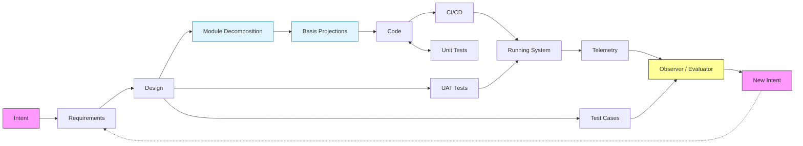
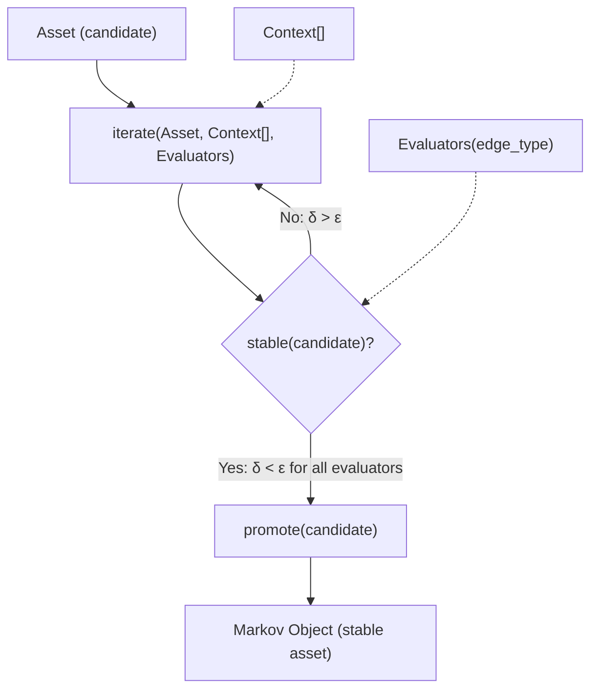
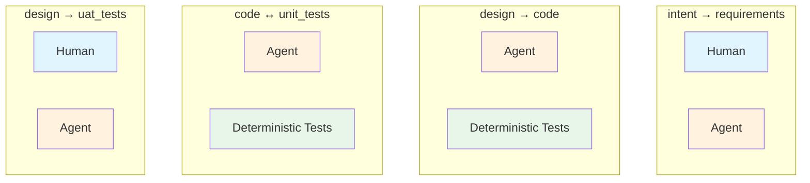
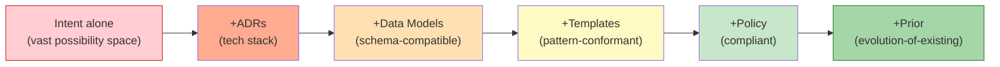
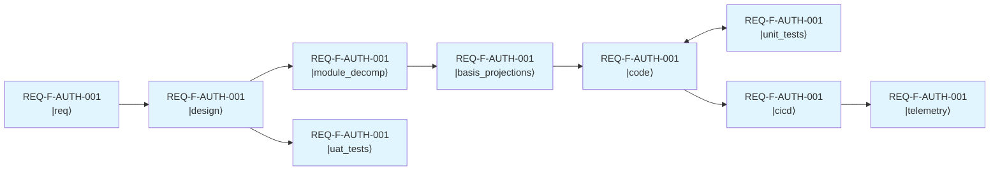
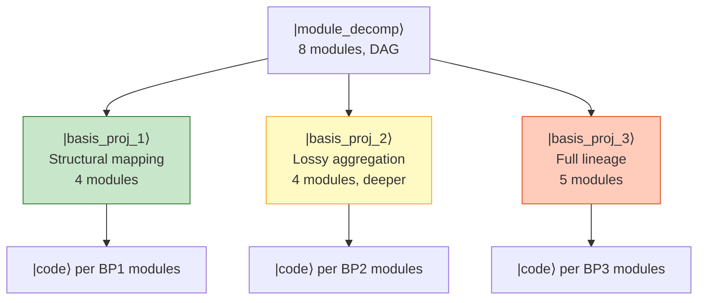
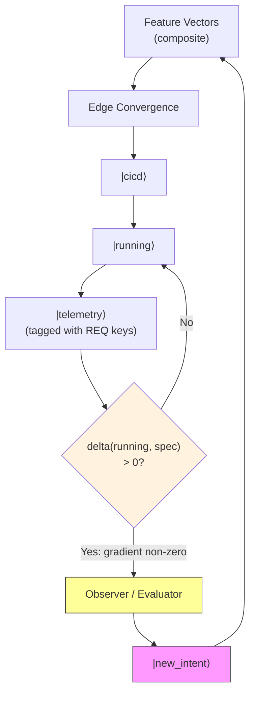
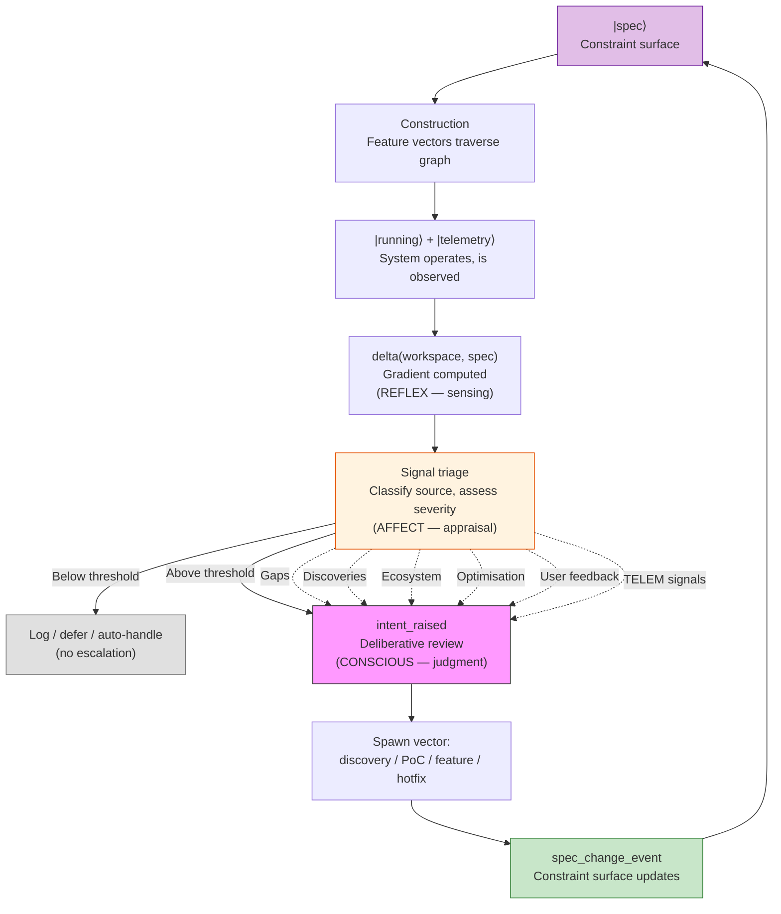

# AI SDLC — Project Genesis: The Asset Graph Model

**Version**: 2.8.0
**Date**: 2026-02-22
**Foundation**: [Constraint-Emergence Ontology](https://github.com/foolishimp/constraint_emergence_ontology) (§V, §VIII-B, §VIII-C)

---

## 0. What the Methodology Is

**The methodology is the constraints themselves.** Commands, configurations, event schemas, and tooling are implementations — emergence within those constraints.

Specifically, the methodology is:

| Element | What it defines | Example |
|---------|----------------|---------|
| **Constraints** | What must be true for any valid instance | Every edge has at least one evaluator; every iterate produces an event |
| **Invariants** | What must survive any valid transformation | The four primitives (Graph, Iterate, Evaluators, Spec+Context) — see §1 |
| **Symmetries** | What transformations preserve the invariants | Functor renderings F_D ↔ F_P ↔ F_H (§2.9); natural transformations between encodings |
| **Projections** | How the same invariants produce different instances at different scales | full → standard → spike → minimal (Projections doc §3) |

Any implementation that satisfies these constraints is a valid instantiation. Slash commands, manual processes, and alternative toolchains are equally valid — the constraints define the possibility space; implementations fill it.

**The formal system is a generator of valid methodologies** (Projections doc §8). What it generates depends on which projection is applied, which encoding is chosen, and which technology binds the functional units. This document specifies the generator: the constraints, invariants, symmetries, and projections.

**Telemetry is constitutive.** A product that does not monitor itself is incomplete. Every valid methodology instance includes operational telemetry and self-monitoring from day one. The event log, sensory monitors, and feedback loop are methodology constraints, not tooling features. The IntentEngine invariant (Projections doc §2.4) requires every edge traversal to produce a classified observation — which requires sensing, which requires telemetry.

Genesis (the methodology tooling) is itself a product, and complies with the same constraints it defines.

---

## 1. Overview

The AI SDLC is an instance of the information-driven construction pattern (ontology concept #38): **encoded representation → constructor → constructed structure**. This document formalises the methodology as an **asset graph** with a **universal iteration function**.

The entire methodology reduces to four primitives:

| Primitive | What it is | Ontology concept |
|-----------|-----------|-----------------|
| **Graph** | Topology of admissible asset transitions (zoomable) | #9 Constraint manifold |
| **Iterate** | Convergence engine — the only operation | #15 Local preorder traversal |
| **Evaluators** | Convergence test — when is iteration done | #35 Evaluator-as-prompter |
| **Spec + Context** | Constraint surface — what bounds construction | #40 Encoded representation + #9 |

Everything else — stages, agents, TDD, BDD, commands, configurations — is parameterisation of these four primitives for specific graph edges. They are emergence within the constraints the primitives define, not the methodology itself.

**The graph is not universal.** The SDLC graph (Intent → Requirements → Design → Code → Tests → ...) is one domain-specific instantiation. A legal document, a physics paper, an organisational policy each have different graphs. The graph topology is itself constructed — it is Context[], not a law of nature. The four primitives are universal; the graph is parameterised.

---

## 2. The Asset Graph

### 2.1 Asset Types and Transitions

An **asset** is a typed artifact produced by the methodology. The asset graph defines admissible transitions between asset types — which constructions can follow which.

Each edge is the same operation: `iterate()` until evaluators converge. The edge is the vector — the iterative process of assurance, disambiguation, discovery, and solutioning that evolves one asset into the next.

A **delivered feature** is the composite of all assets produced along its edges. Software feature delivery is a composite vector:

```
Feature F = |req⟩ + |design⟩ + |module_decomp⟩ + |basis_projections⟩ + |code⟩ + |unit_tests⟩ + |uat_tests⟩ + |cicd⟩ + |telemetry⟩
```

The SDLC asset graph:

```
                        ┌──→ UAT Tests ──────────────────────────────────────────┐
                        │                                                         │
Intent → Requirements → Design ──→ Module Decomp → Basis Projections → Code → Unit Tests
              ↑            │                                         │            │
              │            └──→ Test Cases                           │            ↓
              │                   │                         CI/CD ◄──┘   Running System → Telemetry
              │                   │                                                         │
              └───────────────────┴──────────────── Observer/Evaluator ◄────────────────────┘
                                                           │
                                                           ▼
                                                      New Intent
```



**Every edge is the same operation** — iterative convergence. Each edge traversal runs the inner vector: evaluator detects delta → meaning (what's the gap?) → discovery (what are the options?) → solutioning (construct next candidate).

### 2.2 Graph Properties

- **Directed**: Edges have a source type and target type
- **Cyclic**: Feedback edges (Telemetry → New Intent) create cycles
- **Extensible**: New asset types and edges addable without changing the engine
- **Domain-constructed**: The graph topology is itself a product of abiogenesis (#39) — practice crystallises into encoded structure
- **Domain-specific**: Different domains produce different graphs. The SDLC graph is one crystallisation
- **Zoomable**: Graph granularity is a choice (see §2.5)

### 2.3 Asset as Markov Object

An asset achieves Markov object status (#7) when:

1. **Boundary** — Typed interface/schema. Requirements have REQ keys and acceptance criteria. Code has interfaces and contracts. Telemetry has metric schemas.
2. **Conditional independence** — Usable without knowing its construction history. Code that passes its tests is interchangeable regardless of who built it.
3. **Stability** — All evaluators for this asset report convergence.

An asset that fails its evaluators is a **candidate**, not a Markov object. It stays in iteration.

The full composite vector carries the complete causal chain (intent, lineage, every decision). The Markov blanket (#8) at each stable asset means practical work is local — you interact through the boundary, not the history. The history is there when you need it (traceability, debugging, evolution).

### 2.4 Graph Construction (Abiogenesis)

The graph topology follows the abiogenesis pattern (#39): domain constraints produce practice → practice crystallises into encoded topology → encoded topology directs construction → runtime experience updates the topology. The SDLC graph is one such crystallisation. The project name **Genesis** is shorthand for this pattern — the methodology bootstraps its own structure from practice.

### 2.5 Graph Scaling (Zoom)

The graph is **zoomable** and **selectively** so. Any edge can be expanded into a sub-graph, any sub-graph collapsed into a single edge. Selective zoom — the common case — collapses some intermediates while retaining others as mandatory waypoints.

```
Full:       Intent → Requirements → Design → Code ↔ Tests → UAT
PoC:        Intent ──────────────→ Design → Code ↔ Tests
                                   ↑ mandatory intermediate
```

**Build decomposition** applies zoom to the Design → Code edge. For multi-module systems, the single edge is too coarse:

```
Design → Code (zoomed out):   |design⟩ ═══════════════════════════► |code⟩
Design → Code (zoomed in):    |design⟩ → |module_decomp⟩ → |basis_projections⟩ → |code_per_module⟩
Design → Code (selective):    |design⟩ → |module_decomp⟩ ═══════════► |code_per_module⟩
```

| Intermediate Asset | What it produces | Key evaluators |
|--------------------|-----------------|----------------|
| **Module Decomposition** | Module inventory, dependency DAG, feature-to-module mapping, interface contracts | DAG is acyclic, every REQ key in exactly one module, interfaces explicit |
| **Basis Projections** | Priority-ordered minimal module subsets — feature vectors projected onto minimal module basis (§6.7) | Connected subgraph of module DAG, priority ranking matches feature priority |
| **Code per Module** | Modules built in dependency order against compiled interfaces | Compiles against dependencies, REQ tags present |

Each explicit intermediate gets its own edge, evaluators, and convergence check. Making an intermediate mandatory means it must be a stable Markov object before the next edge proceeds.

| Zoom level | When | What you get |
|------------|------|-------------|
| **Zoomed in** | Regulated environments, complex systems, audit requirements | Full intermediates, maximum traceability, higher cost |
| **Selective** | Most real work | Required intermediates explicit, others collapsed |
| **Zoomed out** | Rapid prototyping, well-understood problems | Fewer assets, faster delivery |

Scale-dependent assurance follows the same pattern:

| Scale | Asset | Evaluator |
|-------|-------|-----------|
| Module | Code | Unit tests |
| Service | Code + unit tests | Integration tests |
| Feature | Req + design + code + tests | UAT |
| Product | All features composed | Production telemetry + homeostasis |

The four primitives are the same at every scale. The graph is fractal.

### 2.6 The Spec/Design Boundary

The asset graph contains a fundamental boundary between **specification** and **design**:

- **Spec** (Requirements) = **WHAT** the system does. Tech-agnostic. One spec can have many designs.
- **Design** = **HOW** architecturally. Tech-bound — ADRs, ecosystem binding, component architecture.

This boundary is the Requirements → Design edge. Everything upstream of this edge (Intent, Requirements) describes the problem and constraints without committing to technology. Everything downstream (Design, Code, Tests) is bound to a specific technology stack and architecture.

```
                 Spec/Design boundary
                        │
  Intent → Requirements │ Design → Code ↔ Tests → ...
                        │
  WHAT (tech-agnostic)  │  HOW (tech-bound)
  One spec              │  Many possible designs
```

This separation enables:
- **Multiple implementations**: The same spec (REQ-F-AUTH-001) can have `design.variant_a`, `design.variant_b`, `design.variant_c` — different designs for the same requirements. Telemetry enables data-driven variant selection.
- **Technology migration**: Change the design without changing the spec. The requirements survive platform shifts.
- **Disambiguation routing**: When iteration reveals ambiguity, the evaluator routes feedback to the right level — business gap → Spec, technical gap → Design.

#### 2.6.1 Constraint Dimensions at the Design Edge

The Requirements → Design edge is the most consequential transition in the graph. Design must resolve **all disambiguation necessary for code to be constructed**. Each unresolved dimension leaves the design under-constrained — the constructor fills the gap with implicit assumptions that may be wrong.

A **constraint dimension** is a category of decisions that design must explicitly address:

| Dimension | What it resolves | Example |
|-----------|-----------------|---------|
| **Ecosystem Compatibility** | Runtime platform, language version, framework versions, dependency compatibility matrix | Scala 2.13 + Spark 3.5 (not Scala 3 — incompatible) |
| **Deployment Target** | Where and how the system runs, infrastructure assumptions | Kubernetes, serverless, on-premise, hybrid |
| **Security Model** | Authentication, authorisation, data protection, threat model | OAuth2 + RBAC, mTLS, encryption at rest |
| **Data Governance** | Privacy, lineage, retention, compliance frameworks | GDPR, data classification, audit trail |
| **Performance Envelope** | Latency, throughput, resource bounds, scaling strategy | p99 < 200ms, 10k RPS, horizontal scaling |
| **Build System** | Build tool, module structure, dependency management, CI integration | sbt multi-module, Maven, Gradle |
| **Observability** | Logging, metrics, tracing, alerting strategy | OpenTelemetry, structured logging, REQ-key tagging |
| **Error Handling** | Failure modes, retry strategy, circuit breaking, degradation | Fail-fast, retry with backoff, graceful degradation |

These dimensions are graph package configuration (§2.8), not universal. Different domains have different taxonomies. Each dimension resolved adds constraint density (§5.2) at the design edge — unresolved dimensions leave the design under-constrained, and evaluators cannot detect gaps in dimensions the constraint surface does not define.

The graph package (§2.8) specifies which dimensions are **mandatory** (must be explicitly resolved via ADRs or design decisions) and which are **advisory** (may use implementation defaults). The project binding (§2.8, Layer 3) provides concrete values.

### 2.7 Multiple Implementations Per Spec

A single requirement key can have multiple design variants:

```
REQ-F-AUTH-001 (spec)
  ├── design.variant_a  → code.python  → tests.python
  ├── design.variant_b  → code.python  → tests.python
  └── design.variant_c  → code.rust    → tests.rust
```

Each variant is a separate trajectory through the downstream graph, sharing the same upstream spec. The variants run in parallel; production telemetry selects the best-performing variant.

### 2.8 Instantiation Layers: Engine, Graph Package, Project Binding

The methodology separates into three layers of increasing specificity. This separation is already implicit in the model — the four primitives are universal (§1), the SDLC graph is one domain-specific instantiation (§2.1), and project constraints are instance-specific (§5.1). Making the layers explicit enables clean packaging and deployment.

```
┌──────────────────────────────────────────────────────────────┐
│  Layer 1: ENGINE (universal)                                  │
│  4 primitives + iterate() + evaluator type taxonomy           │
│  Same across all domains. Never changes per graph or project. │
├──────────────────────────────────────────────────────────────┤
│  Layer 2: GRAPH PACKAGE (domain-specific)                     │
│  Topology + edge configs + constraint dimension taxonomy      │
│  + evaluator checklists + projection profiles                 │
│  One per domain (SDLC, legal, science, ...)                   │
├──────────────────────────────────────────────────────────────┤
│  Layer 3: PROJECT BINDING (instance-specific)                 │
│  project_constraints + context URIs + threshold overrides     │
│  + team conventions + CI/CD integration                       │
│  One per project                                              │
└──────────────────────────────────────────────────────────────┘
```

**Layer 1: Engine** — The four primitives (§1), the iteration function (§3), the evaluator type taxonomy (§4.1), the feature vector formalism (§6), the event sourcing execution model (§7.4), and the **protocol enforcement hooks** (§7.7). These are universal across all domains. A legal document workflow, a physics paper pipeline, and a software SDLC all use the same engine. The hooks are the deterministic evaluator of the iterate protocol itself — they ensure mandatory side effects (event emission, feature vector update, state view regeneration) are completed regardless of how the agent chooses to perform generation.

**Layer 2: Graph Package** — A domain-specific instantiation: the graph topology (which asset types exist, which transitions are admissible), edge parameterisations (evaluator checklists and weighting per edge), constraint dimension taxonomy (what disambiguation categories design must resolve — §2.6.1), and projection profiles (full, standard, PoC, spike, hotfix — which edges to traverse, which to collapse). The SDLC graph in §2.1 is one graph package. Different domains produce different packages from the same engine. Each package follows the abiogenesis pattern (§2.4): practitioners in a domain work, patterns crystallise, the topology and edge configs encode those patterns.

**Layer 3: Project Binding** — Instance-specific configuration that binds a graph package to a concrete project: technology constraints (language, frameworks, versions), context URIs (pointers to reference documents, API specs, compliance policies), evaluator threshold overrides (e.g., minimum ADR count, test coverage floor), team conventions (naming, branching strategy), and CI/CD integration details (build commands, deployment targets).

**Context sources** are URI references to external Architecture Decision collections. At project setup, referenced collections are resolved and copied into the local context store. This enables organisation-level standards, team conventions, and platform decisions to flow into project Context[] without duplication or manual management. Sources are copied (not linked) to preserve content-addressable hashing for spec reproducibility (§7.2).

This separation is itself an instance of the ontology's construction pattern (#38):

| Construction pattern | Layer |
|---------------------|-------|
| **Constructor** (universal, substrate-independent) | Engine |
| **Encoded representation** (domain knowledge crystallised) | Graph Package |
| **Construction context** (specific constraints of this instance) | Project Binding |

The three-layer separation explains why the same methodology can produce radically different outcomes in different domains: the engine is invariant, the graph package captures domain expertise, and the project binding captures local constraints. Changing the graph package changes the domain. Changing the project binding changes the project. The engine never changes.

### 2.9 Functors: Spec + Encoding

The three-layer model (§2.8) separates what is universal from what is domain-specific from what is instance-specific. But there is a deeper pattern: **a methodology instance is a functor** — a spec composed with an encoding.

```
Functor(Spec, Encoding) → Executable Methodology
```

A **spec** defines functional units — what the system does, expressed as typed assets, admissible transitions, evaluator slots, and convergence criteria. A spec is technology-agnostic, platform-agnostic, and encoding-agnostic. It is the **domain** of the functor.

An **encoding** maps each functional unit to an execution category — how each unit is rendered in a specific context. The three execution categories (from §4.1, §4.4) are:

| Category | Symbol | Rendering |
|----------|--------|-----------|
| Deterministic | F_D | Computable, repeatable, verifiable. Tests, builds, schema validation. |
| Probabilistic | F_P | LLM/agent under constraints. Code generation, gap analysis, design synthesis. |
| Human | F_H | Judgment, approval, domain evaluation. Spec review, intent authoring, acceptance. |

The encoding is the **design-level binding** — it assigns each functional unit in the spec to one of these categories. The encoding lives in Layer 2 (Graph Package) and Layer 3 (Project Binding), never in Layer 1 (Engine).

**Projections are functors.** Each named profile (full, standard, PoC, spike, hotfix) is a different encoding of the same spec:

| Profile | Encoding strategy | What changes |
|---------|------------------|--------------|
| **full** | Maximum explicit rendering — all units encoded, all categories active | Every functional unit has an explicit execution category |
| **standard** | Balanced — key units explicit, routine units collapsed | Some F_P units collapsed into their parent edge |
| **poc** | Minimal — only hypothesis-critical units encoded | Most F_H gates removed, rapid F_P iteration |
| **hotfix** | Emergency — only fix-critical units encoded, F_D dominant | F_H reduced to single approval gate, F_P minimal |

**Zoom is an encoding operation.** When an edge is zoomed in (§2.5), implicit functional units become explicit — each gets its own encoding (execution category). When zoomed out, those units' encodings collapse back into the encapsulating edge. The zoom operation does not change the spec; it changes which spec units have explicit encodings.

```
Zoomed out:   design ═══════════════════════════► code
              (single encoding: F_P)

Zoomed in:    design → module_decomp → basis_projections → code_per_module
              (F_P)    (F_P)           (F_P + F_H)          (F_P + F_D)
                                        ↑ human waypoint     ↑ tests
```

The spec defines `module_decomp` and `basis_projections` as functional units regardless of zoom level. The encoding determines whether they are **explicit** (each has its own execution category and convergence criteria) or **implicit** (their computation is subsumed by the encapsulating edge's rendering).

**Multiple implementations per spec (§2.7) are multiple functors from the same domain.** The spec is shared; each implementation applies a different encoding:

```
Spec: REQ-F-AUTH-001 (functional units defined)
  ├── Encoding_Claude:  F_P(Claude) + F_D(pytest) + F_H(CLI review)
  ├── Encoding_Gemini:  F_P(Gemini) + F_D(jest)   + F_H(web review)
  └── Encoding_Codex:   F_P(Codex)  + F_D(cargo)  + F_H(PR review)
```

Same spec, three functors, three executable methodologies. The engine (Layer 1) provides the functor composition machinery. The graph package (Layer 2) provides the functional unit definitions. The project binding (Layer 3) provides the concrete encoding values.

**Natural transformation between encodings.** When the IntentEngine (§4.6) escalates — ambiguity exceeds the current category's capacity — it performs a **natural transformation** η from one encoding to another:

```
η: F_D → F_P    (test failure → agent investigation)
η: F_P → F_H    (agent stuck → human review)
η: F_H → F_D    (human approves → deterministic deployment)
```

The escalation chain F_D → F_P → F_H and the delegation chain F_H → F_P → F_D are natural transformations between functors. The IntentEngine's ambiguity classification (§4.6.2) determines which transformation fires. The affect system (§4.3) modulates the transformation threshold — a hotfix profile has a lower η threshold (escalates faster), while a spike profile has a higher one (tolerates more ambiguity before escalating).

This functor formalism explains why the four primitives are sufficient: **Graph** defines the domain, **Iterate** is the functor application, **Evaluators** classify which transformation fires, and **Spec + Context** is the constraint surface that the encoding must satisfy. No fifth primitive is needed because the functor is a composition law over the existing four, not an addition to them.

---

## 3. The Iteration Function

### 3.1 Signature

```
iterate(
    Asset<Tn>,              // current asset (carries intent, lineage, full history)
    Context[],              // standing constraints
    Evaluators(edge_type)   // convergence criteria for this edge
) → Asset<Tn.k+1>          // next iteration candidate
```

The prior asset carries everything forward — intent, lineage, all prior decisions. These aren't separate parameters; they're in the vector. Context[] and Evaluators are the external constraints.

This is the **only operation**. Every edge in the graph is this function called repeatedly until evaluators report convergence, at which point the candidate is promoted:

```
while not stable(candidate, edge_type):
    candidate = iterate(candidate, context, evaluators)
return promote(candidate)   // ATn.m becomes ATn+1.0
```



### 3.2 Ontology Mapping

The iteration function is an instance of **local preorder traversal** (#15):

- The **landscape** is the constraint manifold defined by Spec + Context
- The **evaluator** senses the local "slope" (delta between candidate and target)
- The **move** is the next iteration, reducing the delta

The constructor (#41) is whatever implements `iterate` for a given edge: an LLM agent, a human developer, a compiler, a test runner. The function signature is universal; the implementation is edge-specific.

### 3.3 Convergence

```
stable(candidate, edge_type) =
    ∀ evaluator ∈ evaluators(edge_type):
        evaluator.delta(candidate, Spec) < ε
```

Convergence is evaluator-dependent and edge-dependent. The iteration engine is universal. The stopping condition is parameterised.

---

## 4. Evaluators

### 4.1 The Three Evaluator Types

Every evaluation is performed by one or more of:

| Evaluator | Compute Regime | What it does |
|-----------|---------------|-------------|
| **Human** | Judgment | Domain evaluation, business fit, "is this what I meant", approval/rejection |
| **Agent(intent, context)** | Probabilistic (#45) | LLM traversal under constraints — gap analysis, coherence checking, refinement suggestions |
| **Deterministic Tests** | Deterministic (#45) | Pass/fail. Type checks, schema validation, test suites, contract verification, SLA monitors |

All three are instances of **evaluator-as-prompter** (#35): they compute a delta (#36) between current state and target state, then emit a constraint signal that drives the next iteration.

### 4.2 Evaluator Composition Per Edge

Different graph edges use different evaluator combinations:

| Transition | Typical Evaluators |
|-----------|-------------------|
| |intent⟩ → |req⟩ | Human + Agent |
| |req⟩ → |design⟩ | Human + Agent |
| |design⟩ → |code⟩ | Agent + Deterministic Tests |
| |code⟩ → |unit_tests⟩ | Agent + Deterministic Tests |
| |design⟩ → |uat_tests⟩ | Human + Agent |
| |code⟩ → |cicd⟩ | Deterministic Tests |
| |running⟩ → |telemetry⟩ | Deterministic Tests (monitors, alerts) |
| |telemetry⟩ → |new_intent⟩ | Human + Agent |

The edge type determines which evaluators constitute `stable()`. This is configurable, not hardcoded.



### 4.3 Three Processing Phases

The methodology operates through three processing phases, each progressively more expensive:

| Property | Reflex | Affect | Conscious |
|----------|--------|--------|-----------|
| **When it fires** | Unconditionally — every iteration, every edge, no exceptions | When any evaluator detects a gap — attaches valence (urgency, severity, priority) to the finding | When affect determines signal warrants deliberation — approval, design, intent |
| **What it does** | Sensing — event emission, test execution, state updates | Valence — urgency/severity/priority attached to the gap. Determines whether the finding is deferred or escalated | Direction — judgment, gap assessment, intent generation, spec modification |
| **Who emits** | Deterministic Tests (F_D) | Any evaluator on its gap finding: F_D (threshold breach → severity), F_P (classified urgency), F_H (human priority judgment) | Human (F_H), Agent (F_P) deliberative |
| **Protocol elements** | Event emission (§7.4), feature vector update, state view regeneration, circuit breaker (§7.7.3) | Signal source classification, severity assessment, escalation decision | Generation, convergence assessment, spawn decisions, spec modification |
| **Failure mode** | Silent — if skipped, observability vanishes | Noise — everything escalates, or nothing does | Slow, expensive, may miss gaps |
| **Can be skipped?** | No — protocol hooks enforce mandatory execution (§7.7) | No — but thresholds tunable per profile (§2.6.2) | Yes (projection profiles can omit human evaluator) |

**Affect is not an evaluator type — it is a valence vector on the gap.** Any evaluator that finds a delta also emits affect: a deterministic test emits severity via threshold rules, an agent classifies urgency, a human assigns priority. The affect signal determines routing — defer or escalate.

**Each phase enables the next.** Reflexes produce signals — without automatic event emission, the spec review cycle (§7.3) has nothing to observe. Affect attaches valence to those signals — without urgency weighting, conscious processing drowns in noise or starves for input. Consciousness directs from what affect escalates — without deliberative judgment, the system can sense and assess but cannot redirect itself.

**The IntentEngine (§4.6) formalises the mechanism inside each phase**: the three processing phases describe *when* signals are processed; the IntentEngine describes *what happens* — observation, ambiguity classification, and typed output routing. The three output types (`reflex.log`, `specEventLog`, `escalate`) correspond directly to the three phases.

### 4.4 Two Compute Regimes

The evaluators instantiate the ontology's two compute regimes (#45):

- **Probabilistic** (stochastic expansion): LLM generation, design exploration, candidate production — the constructor proposes
- **Deterministic** (verification contraction): test execution, schema validation, contract checking — the evaluator disposes

The specification is the fitness landscape. Probabilistic compute explores it; deterministic compute verifies positions within it.

### 4.5 Two Sensory Systems: Interoception and Exteroception

The three processing phases (§4.3) define *how* signals are processed (reflex → affect → conscious). But they leave open the question: *where do signals come from?* Two complementary sensory systems feed the processing phases continuously:

| System | Direction | SDLC equivalent |
|--------|-----------|-----------------|
| **Interoception** | Inward — the system's own state | Project health: test suite staleness, dependency freshness, feature vector stall, event log gaps, coverage drift, build health, code/spec drift |
| **Exteroception** | Outward — the external environment | Ecosystem state: dependency updates, CVE alerts, API deprecations, upstream breaking changes, user feedback channels, runtime telemetry |

#### 4.5.1 Interoception (Self-Sensing)

Interoceptive monitors observe the system's own health state continuously, independent of iterate() calls:

| Monitor | What it observes | Signal type | Affect threshold example |
|---------|-----------------|-------------|------------------------|
| **Event freshness** | Time since last event in events.jsonl | staleness | > 7 days → escalate |
| **Test health** | Coverage drift, flaky test rate, suite execution time | degradation | Coverage < threshold → escalate |
| **Spec/code drift** | Code diverged from spec assertions (REQ tags missing, stale) | drift | Any untagged code in traced module → escalate |

#### 4.5.2 Exteroception (Environment-Sensing)

Exteroceptive monitors observe the external environment continuously:

| Monitor | What it observes | Signal type | Affect threshold example |
|---------|-----------------|-------------|------------------------|
| **CVE feeds** | Published vulnerabilities affecting project dependencies | security | Severity ≥ medium → escalate |
| **Runtime telemetry** | Error rates, latency, SLA violations tagged with REQ keys | runtime_deviation | Error rate > baseline + 2σ → escalate |
| **API contract changes** | Upstream API breaking changes, deprecation headers | contract_break | Any breaking change → escalate |

#### 4.5.3 Sensory Systems and the Processing Pipeline

The two sensory systems feed into the three processing phases as a continuous pipeline:

```
INTEROCEPTION                    EXTEROCEPTION
(self-sensing)                   (environment-sensing)
  │ event freshness                │ dependency updates
  │ test health                    │ CVE feeds
  │ vector stalls                  │ runtime telemetry
  │ build health                   │ user feedback
  │ spec/code drift                │ API changes
  └──────────┐          ┌─────────┘
             ▼          ▼
        ┌─────────────────────┐
        │    REFLEX PHASE     │ raw signal detection
        │   (autonomic)       │ threshold comparison
        └─────────┬───────────┘
                  ▼
        ┌─────────────────────┐
        │    AFFECT PHASE     │ classify source + severity
        │   (valence triage)  │ escalation decision
        └────┬──────────┬─────┘
             │          │
    [defer]  ▼     [escalate] ▼
         log-only    ┌─────────────────────┐
                     │  CONSCIOUS PHASE    │ intent generation
                     │  (deliberative)     │ spec modification
                     └─────────────────────┘
```

Both sensory systems run independently of iterate() and feed signals into the processing pipeline continuously.

#### 4.5.4 Review Boundary Invariant

The sensory service can autonomously observe, classify, and draft proposals. But it cannot change the spec, modify code, or emit `intent_raised` events. Only the interactive session (with human in the loop) can cross the review boundary. This preserves REQ-EVAL-003 (Human Accountability) while enabling continuous autonomous sensing.

**Traces To**: §4.3 (Three Processing Phases), §7.3 (Spec Review — stage 4) | Ontology #49 (teleodynamic — self-maintaining), #35 (evaluator-as-prompter)

### 4.6 The IntentEngine: Fractal Processing on Every Edge

The IntentEngine is **not a fifth primitive** — it is a **composition law** over the existing four (Graph, Iterate, Evaluators, Spec+Context). It describes the universal `observer → evaluator` building block that sits on every edge, at every scale, and chains fractally.

#### 4.6.1 The IntentEngine

```
IntentEngine(intent + affect) = observer → evaluator → typed_output
```

| Component | What it does | Examples |
|-----------|-------------|---------|
| **intent** | What this unit is trying to achieve | "traverse edge E with asset A", "check production health", "assess spec drift" |
| **affect** | Urgency and valence coloring the intent (§4.3) | Profile-derived priority, prior signal severity, time-box pressure |
| **observer** | Senses current state — runs a tool, loads context, polls a monitor, reviews an artifact | Constructor producing a candidate, sensory monitor polling telemetry, gap validator scanning REQ keys |
| **evaluator** | Classifies the observation's **ambiguity level** — how much uncertainty remains | Edge evaluators checking convergence delta, affect triage classifying severity, spec review computing drift |
| **typed_output** | Always a typed intent — one of three exhaustive categories (§4.6.3) | Convergence event, deferred iteration, escalation to human review |

#### 4.6.2 Ambiguity Classification

| Ambiguity | Processing Phase | Action | Example |
|-----------|-----------------|--------|---------|
| **Zero** | Reflex (§4.3 — deterministic) | Immediate action, no deliberation | Tests pass/fail, build succeeds, health check OK, event emission |
| **Nonzero, bounded** | Affect → Probabilistic disambiguation | LLM/agent constructs next candidate, triage classifies severity | Code doesn't meet design intent, gap found, drift within tolerance |
| **Persistent / unbounded** | Escalate to higher consciousness | Human review, spec modification, vector spawning | Ambiguous requirement, conflicting constraints, stuck iteration |

#### 4.6.3 Three Output Types

| Output Type | What it means | When | Maps to |
|-------------|--------------|------|---------|
| **reflex.log** | Fire-and-forget event emission — action taken, logged, done | Ambiguity = 0 — observation is unambiguous, response is deterministic | `iteration_completed`, `edge_converged`, `interoceptive_signal` (within bounds), protocol hook pass |
| **specEventLog** | Deferred/async intent for later processing — the observation requires further work but is bounded | Ambiguity nonzero but bounded — context assembly needed, another iteration warranted | `iteration_completed` (with non-zero delta), `affect_triage` (deferred), `draft_proposal` |
| **escalate** | Push to higher consciousness level — the observation exceeds this unit's processing capacity | Ambiguity persistent — judgment, spec modification, or spawning required | `intent_raised`, `convergence_escalated`, `spec_modified`, `spawn_created` |

#### 4.6.4 Observer/Evaluator on Every Edge

Every edge has an observer/evaluator pair. At production scale, observers are continuous (sensory systems §4.5). The pattern is fractal — it appears at single-iteration, edge, feature, and product scales.

#### 4.6.5 Chaining and Affect Propagation

IntentEngines chain: one unit's typed output becomes the next unit's input, with affect (urgency, valence) propagating and transforming at each level. The escalation chain (reflex → affect → conscious) is IntentEngine chaining — a Level N `escalate` output becomes Level N+1's reflex input.

#### 4.6.6 Consciousness as Relative

"Consciousness" is relative to the Markov boundary. What is conscious deliberation at one scale (human reviews a stuck iteration) is reflex at a larger scale (feature traversal routes the escalation as a straightforward decision). The same observation can be classified differently depending on the evaluator's scope. Level N's `reflex.log` is invisible to Level N+1 — handled and absorbed. Level N's `escalate` becomes Level N+1's routine input.

---

## 5. Context: The Constraint Surface

### 5.1 What Context Contains

Context[] is the standing constraint surface — the collection of constraint documents that bound what the constructor can produce:

```
Context[] = {
    User Disambiguations,       // human clarifications of intent
    ADRs,                       // tech stack, environment, architectural decisions
    Data Models,                // schemas, contracts, data lineage
    Templates,                  // structural patterns, code standards
    Prior Implementations,      // previous versions of this component
    Policy,                     // security, compliance, organisational rules
    Graph Topology,             // the asset graph itself
    ...                         // open-ended, not a fixed list
}
```

Note: the **graph topology is Context[]**. The choice of which asset types and which edges exist is a standing constraint, not a universal law.

### 5.2 Context as Constraint Density

Each Context element narrows the space of admissible constructions:

```
Intent alone:           vast possibility space (degeneracy → hallucination)
+ ADRs:                 narrows to tech stack
  + Data Models:        narrows to schema-compatible
    + Templates:        narrows to pattern-conformant
      + Policy:         narrows to compliant
        + Prior:        narrows to evolution-of-existing
```



This is the ontology's constraint density (#16) in action. Sparse constraints → probability degeneracy (#54) → hallucination/failure. Dense constraints → stable Markov objects (#7). **Context is what prevents hallucination in the construction process.**

### 5.3 Constraint Tolerances: The Mechanism That Produces Delta

The gradient (§7.1) is `delta(state, constraints) → work`. But delta is undefined unless constraints have **measurable thresholds** — tolerances. A constraint without a tolerance is a wish; a constraint with a tolerance is a sensor.

```
Constraint: "the system must be fast"        → unmeasurable, delta undefined
Constraint: "P99 latency < 200ms"            → measurable, delta = |observed - 200ms|
Constraint: "all tests pass"                 → measurable, delta = failing_count
Constraint: "design uses protocol X"         → measurable, delta = drift from X's properties
```

**Tolerances are what make the sensory system (§4.5) operational.** Without them, interoceptive and exteroceptive monitors have nothing to measure against. With them, every monitor becomes an IntentEngine invocation:

```
monitor observes metric →
  evaluator compares metric to tolerance →
    within bounds:  reflex.log (system healthy at this point)
    drifting:       specEventLog (optimisation intent deferred)
    breached:       escalate (corrective intent raised)
```

**Tolerances exist at every scale of the gradient:**

| Scale | Constraint | Tolerance | Breach signal |
|-------|-----------|-----------|---------------|
| Single iteration | Edge evaluator | Pass/fail threshold, max iterations | Non-converging iteration count |
| Edge convergence | All evaluators | Convergence within N iterations | Stuck threshold exceeded |
| Feature traversal | Graph topology | Feature completes within profile bounds | Stalled feature vector |
| Production | SLAs, health checks | Latency, error rate, uptime | Operational degradation |
| Spec review | Spec adequacy | Constraint coverage, consistency | Gaps between spec and reality |
| Design bindings | Technology choices | Performance, cost, fitness tolerances | Ecosystem drift |

The last row is critical: **design-level technology bindings are constraints with tolerances**. When an implementation chooses a protocol, a runtime, or a service model, that choice implies performance, cost, and fitness bounds. When those bounds are breached — because the project scaled, the ecosystem shifted, or better options emerged — the breach is a delta that produces optimization intent.

**Without tolerances, there is no homeostasis.** The gradient requires measurable delta. The IntentEngine requires classifiable observations. The sensory system requires thresholds to monitor. Tolerances are not optional metadata on constraints — they are the mechanism by which constraints become operational.

### 5.4 Context Stability

Context is largely **shared across the graph**. ADRs, Data Models, Policy — these don't change per edge. They are the standing constraint surface. What changes per edge is which subset is relevant and how the constructor weights them.

Context itself evolves, but on a slower timescale than assets. This is the ontology's scale-dependent time (#23): the constraint surface updates slowly while components iterate rapidly upon it.

---

## 6. Feature Vectors: Trajectories Through the Graph

### 6.1 Feature as Composite Vector

A **feature** is the composite of all assets produced along its trajectory through the graph:

```
Feature F = |req⟩ + |design⟩ + |module_decomp⟩ + |basis_projections⟩ + |code⟩ + |unit_tests⟩ + |uat_tests⟩ + |cicd⟩ + |telemetry⟩
```

Each component is a stable asset produced by iterating along an edge. The REQ key is the **vector identifier** — it tags which trajectory all these assets belong to. A feature is **complete** when all its edge-produced assets have converged to Markov objects. Components like |module_decomp⟩ and |basis_projections⟩ are present when the graph is zoomed in at the build decomposition level (§2.5); at zoomed-out level they collapse into the Design → Code edge.



### 6.2 Intent Lineage

Intent lineage is the feature's **accumulated state** across all edges: the original intent, every intermediate candidate produced, every decision made, every constraint satisfied. It is the full traceability chain, carried forward in each asset (§2.3).

This is the ontology's constraint propagation (#2) through the asset graph. REQ-F-AUTH-001 propagating across edges is a constraint signal maintaining coherence across the entire composite vector.

### 6.3 Feature Lineage in Code and Telemetry

REQ keys are not just documentation — they are **runtime-observable identifiers** that thread from spec to production:

```
Spec:        REQ-F-AUTH-001 defined
Design:      Implements: REQ-F-AUTH-001
Code:        # Implements: REQ-F-AUTH-001
Tests:       # Validates: REQ-F-AUTH-001
Telemetry:   logger.info("login", req="REQ-F-AUTH-001", latency_ms=42)
```

The tag format (`Implements: REQ-*`, `Validates: REQ-*`) is the contract. The comment syntax is language-specific (`#` for Python, `//` for Go/JS, `--` for SQL). In telemetry, the REQ key appears as a structured field in logs, metrics, and traces.

This makes features **observable at runtime**: you can query production telemetry by REQ key to see how a specific requirement behaves in production, measure latency per feature, detect regressions per feature, and route incidents back to the originating requirement.

### 6.4 Feature Views

A **feature view** is a generated cross-artifact status report for a single REQ key, produced by grepping the tag format across all artifacts:

```
Feature View: REQ-F-AUTH-001
────────────────────────────
Spec:       specification/requirements.md            ✓ defined
Design:     imp_auth/design/DESIGN.md               ✓ component traced
Code:       src/auth/login.py:23                   ✓ Implements: REQ-F-AUTH-001
Tests:      tests/test_login.py:15                 ✓ Validates: REQ-F-AUTH-001
Telemetry:  dashboards/auth.json                   ✓ req="REQ-F-AUTH-001"
Coverage:   5/5 stages tagged
```

Feature views are generated at every stage — they are the mechanism for answering "where is this feature in the graph?" at any point in time. The view is computed by searching for the REQ key across all artifacts, not maintained as a separate document.

This is the practical realisation of the composite vector (§6.1): the feature view shows the vector's current projection onto each basis component.

### 6.5 Feature Dependencies

Features can depend on other features. Feature B's code asset might require Feature A's code asset to be stable first:

```
Feature A: |req⟩ → |design⟩ → |code⟩●
                                     │ dependency
Feature B: |req⟩ → |design⟩ → |code⟩ → |tests⟩
```

Dependencies are between features (or their component assets), not between pipeline stages. This is a cross-vector constraint.

### 6.6 Task Planning as Trajectory Optimisation

Tasks **emerge** from feature vector decomposition (#3, generative principle):

1. **Decompose** intent into feature vectors
2. **Trace** each vector's trajectory through the graph
3. **Identify** dependencies between assets across features
4. **Compress**: batch independent edges (parallel work), sequence dependent ones
5. **Result**: the task graph — with dependency order, parallelisation, and batching

```
                    Feature Vectors (trajectories through the graph)
                    ┌─ F1 = |req⟩ → |design⟩ → |code⟩ → |tests⟩
Spec + Context[] →  ├─ F2 = |req⟩ → |design⟩ → |code⟩ → |tests⟩
                    └─ F3 = |req⟩ → |code⟩ → |tests⟩
                                       ↑
                                F3.|code⟩ depends on F1.|design⟩

Task Graph = compress(F1 ∥ F2, F1.|design⟩ < F3.|code⟩)
```

### 6.7 Basis Projections and Parallel Feature Execution

When the Design → Code edge is zoomed in (§2.5), the **module decomposition** and **basis projection** assets enable a finer-grained task scheduling strategy.

A **basis projection** is the projection of a feature vector onto its minimal module basis — the smallest subset of modules that makes one priority feature work end-to-end. Once a basis projection converges, it becomes a **Markov object** — a stable, tested, end-to-end slice that downstream work can depend on without knowing its construction history.

```
Module Decomposition (from Design):
    model ← compiler ← runtime ← spark ← lineage ← ai ← context ← testkit

Basis Projection 1 (structural mapping):   model → compiler(path) → runtime(exec) → spark
Basis Projection 2 (lossy aggregation):    model → compiler(+grain) → runtime(+fold) → spark
Basis Projection 3 (full lineage):         model → compiler → runtime → lineage → spark
```



**Key property**: basis projections that share no modules are **orthogonal** — they can execute in parallel with zero coordination. Projections that share modules must build the shared modules first, then diverge. Features with zero shared modules are fully parallelisable — zero coordination overhead.

Each converged basis projection is a Markov object (§2.3):
- **Boundary**: Its public interfaces, the features it proves, the tests it passes
- **Conditional independence**: Downstream projections can build on it without knowing how it was constructed
- **Stability**: All evaluators for this slice report convergence (compiles, tests pass, REQ keys traced)

The basis projection schedule — the Gantt chart — is a **derived projection** (§7.4.2) computed from:
- Module dependency DAG (from |module_decomp⟩)
- Feature-to-module mapping (from REQ key traceability)
- Feature priority (from requirements / intent)
- Basis projection convergence events (from events.jsonl)

This enables incremental delivery: working software after the first basis projection converges, progressively richer after each subsequent one. The methodology produces not just code but an **observable build plan** — a Gantt that updates as basis projections converge.

---

## 7. The Full Lifecycle

### 7.1 The Gradient

The parent theory (Constraint-Emergence Ontology) identifies one computation applied everywhere there is a gradient:

```
delta(state, constraints) → work
```

When `delta → 0`, the system is at rest at that scale. When `delta > 0`, work is produced to reduce the gradient. This is the same operation at every scale of the methodology — only the state and constraints change:

| Scale | State | Constraints | When delta → 0 |
|-------|-------|-------------|----------------|
| **Single iteration** | candidate asset | edge evaluators | evaluator passes |
| **Edge convergence** | asset at iteration k | all evaluators for edge | Markov object stabilises |
| **Feature traversal** | feature vector | graph topology + profile | feature converged |
| **Project completion** | all vectors | all features × all edges | ALL_CONVERGED |
| **Production homeostasis** | running system | spec (SLAs, contracts, health) | system within bounds |
| **Spec review** | workspace state | the spec itself | spec and workspace aligned |
| **Constraint surface update** | irreducible delta | observation that the surface is wrong | new ground states defined |

The last two rows are what was previously called the "consciousness loop." They are the same `delta(state, constraints) → work` where the constraints themselves are the object of evaluation and update.

**Deacon hierarchy mapping**: The gradient at progressively larger scales corresponds to Terrence Deacon's hierarchy of emergent dynamics:

| Deacon level | Methodology scale | What maintains itself |
|---|---|---|
| **Homeodynamic** | Single iteration | Candidate asset converging toward evaluator pass |
| **Morphodynamic** | Edge / feature convergence | Feature vector traversing the graph — pattern formation |
| **Teleodynamic** (#49) | Production homeostasis | Running system maintaining its own boundary conditions |
| **Beyond Deacon** | Spec review + constraint update | The constraint surface itself updating from experience — the system modifies what "correct" means |

There is no phase transition between these levels. The same `delta(state, constraints) → work` operates throughout. Complexity emerges because at larger scales, the constraints themselves become state for the next level. The spec that bounds production homeostasis is itself subject to gradient pressure from observations that the spec is wrong or incomplete. **The IntentEngine (§4.6) explains WHY the gradient operates at every scale**: each scale is an IntentEngine invocation (`observer → evaluator → typed_output`), and ambiguity classification determines whether work stays local (reflex) or propagates upward (escalate). The gradient is the IntentEngine applied fractally.

Effort scales with iteration cost and constraint distance from convergence. When the spec updates (§7.3), former stable states acquire new work — the gradient drives the system toward new convergence.

**The spec as constraint surface**: The spec is the reference frame against which all observation is evaluated:

```
Spec = target manifold (encoded boundary conditions)
Observed = current state (assets, running system, telemetry)
Delta = Spec - Observed = gradient signal
```

Every signal source feeds into the spec, and the spec re-expresses non-zero deltas as feature vectors — the system's directed responses:

| Signal source | Example | Spec impact | Re-expressed as |
|---|---|---|---|
| **Gaps** (from iterate process_gaps) | Design edge missing security dimension | Spec adds constraint dimension | Feature vector: update all designs to address security |
| **Discoveries** (from PoC/spike vectors) | "We can use vector DB for this" | Spec adds new capability | Feature vector: integrate vector DB, update design |
| **Ecosystem evolution** | Language version upgrade, library deprecated | Spec updates tech constraints | Feature vector: migration, version adaptation |
| **Optimisation** (from telemetry) | P99 latency 3x budget | Spec tightens performance bounds | Feature vector: optimise hot path |
| **User feedback** (human evaluator) | "Search should support fuzzy matching" | Spec adds new requirement | Feature vector: new feature REQ-F-SEARCH-002 |
| **Methodology self-observation** (TELEM) | Evaluator skip rate too high | Graph package updates edge config | Meta-vector: improve edge parameterisation |

The spec is the system's **evolving self-model** — it absorbs signals from all sources and re-expresses them as feature vectors. The set of all in-flight vectors represents the system's **total intentional state**: everything it is currently doing in response to everything it knows. This is the abiogenesis insight (#39) completing itself: the methodology starts as a pipeline (constructor without feedback), then the feedback loop closes (encoding updates from observation), and the system becomes self-maintaining (#49). The graph topology itself can evolve through this process.

### 7.2 The Gradient at Production Scale

The deployed, running system is itself a Markov object (#7):

- **Boundary**: Its interfaces, SLAs, contracts, health endpoints
- **Internal dynamics**: Its runtime behaviour
- **Conditional independence**: It runs without knowing how it was built

Production homeostasis is `delta(running_system, spec) → correction` — the same gradient operation applied to the running system. When the running system deviates from the spec's boundary conditions (SLA violation, error rate spike, contract breach), the delta is non-zero and the system produces work to restore alignment.

```
Feature vectors (composite) → edge convergence → |cicd⟩ → |running⟩
                                                                    │
         ┌──────────────────────────────────────────────────────────┘
         ▼
   |telemetry⟩ (tagged with REQ keys)
         │
         ▼
   delta(running_system, spec) > 0?
         │                    │
        no                   yes → gradient non-zero
         │                    │
         ▼                    ▼
     continue          Observer/Evaluator
                              │
                              ▼
                       |new_intent⟩ (new feature vectors)
                              │
                              ▼
                       back into the graph
```



The Observer/Evaluator at runtime uses the same three evaluator types:

| Evaluator | At Runtime |
|-----------|-----------|
| **Human** | User feedback, business review, incident response |
| **Agent(intent, context)** | Anomaly detection, pattern analysis, intent discovery |
| **Deterministic Tests** | Alerting thresholds, SLA checks, health probes, contract monitors |

The full lifecycle includes deployment, runtime, and feedback assets in the graph:

| Lifecycle stage | Assets | Gradient check |
|-------|--------|---------------|
| **Build** | |req⟩ → |design⟩ → |code⟩ → |tests⟩ → |uat⟩ | `delta(candidate, edge_evaluators) → work` |
| **Deploy** | |cicd⟩ | `delta(package, deploy_checks) → work` |
| **Observe** | |telemetry⟩ | Metrics, logs, traces — tagged with REQ keys |
| **Maintain** | Running system | `delta(running_system, spec) → correction` |
| **Discover** | |new_intent⟩ | `delta(workspace, spec) → new_vectors` (§7.3) |

### 7.3 Spec Review as Stateless Gradient Check

The gradient at the largest scale: `delta(workspace_state, spec) → intents`. A **stateless function** spanning all three processing phases (§4.3):

1. **|spec> defines bounds** — the constraint surface
2. **Construction** — feature vectors traverse the graph via iterate() (reflex)
3. **Observation** — |running> + |telemetry> + sensory feeds (§4.5)
4. **Gradient** — `delta(|workspace>, |spec>)` computed from all signal sources
5. **Triage** (affect) — classify source, assess severity, decide escalation. Profile settings (§2.6.2) tune thresholds.
6. **Intent** (conscious) — `intent_raised` event, spawns vectors. Spec modification is itself an event (§7.4), enabling the system to observe its own spec changes.

Back to step 1 with the updated spec.



#### 7.3.1 Intent Events as First-Class Objects (`intent_raised`)

The `intent_raised` event captures the complete causal chain:

| Field | What it records |
|---|---|
| `trigger` | Which signal(s) caused this intent |
| `delta` | Spec vs observation deviation |
| `signal_source` | gap / discovery / ecosystem / optimisation / user / TELEM |
| `vector_type` | discovery / PoC / feature / hotfix / spike |
| `spec_impact` | Which REQ keys / spec sections affected |
| `spawned_vectors` | Feature IDs spawned from this intent |
| `prior_intents` | Chain of prior intent events (closes the reflexive loop) |

#### 7.3.2 Spec Change Events

Spec updates emit `spec_modified` events with `trigger_intent`, `signal_source`, `what_changed`, `affected_req_keys`, `spawned_vectors`, `prior_intents`, and `timestamp`. These events enable feedback loop detection (intent A -> spec change -> intent B tracing back to A), impact analysis, and rate-of-evolution metrics.

### 7.4 Event Sourcing: Immutable Facts and Derived Projections

The methodology's execution model is **event sourcing**: all state changes are recorded as immutable events, and all observable state is a projection (derived view) of the event history.

#### 7.4.1 Events as Immutable Facts

Each methodology action produces an immutable event:

```json
{
  "event_type": "iteration_completed",
  "edge": "requirements_design",
  "feature": "REQ-F-AUTH-001",
  "iteration": 2,
  "evaluators": {"agent": "converged", "human": "pending"},
  "timestamp": "2026-02-20T14:30:00Z",
  "context_hash": "sha256:a1b2c3..."
}
```

Events record **what happened**, not what the current state is. The event log is append-only — no event is ever modified or deleted. This is the ontology's core claim made operational: the constraint network computes forward from its current state (§10.3 of the ontology, the unit of change). The past state was consumed in producing the current one; only the record of what happened persists.

Event types (values of the `event_type` field, aligned with iterate agent contract):

| Type | When emitted | Defined in |
|---|---|---|
| `iteration_completed` | Every iterate() cycle | Agent §Step 5a |
| `edge_started` | First iteration on an edge for a feature | Agent §Step 1 |
| `edge_converged` | All evaluators pass for an edge | Agent §Step 6 |
| `evaluator_ran` | Individual evaluator execution | §4.1 |
| `finding_raised` | Gap detected (backward/forward/inward) | §3.1 |
| `context_added` | New context attached to an edge | §5.1 |
| `feature_spawned` | New feature vector created | §6.5 |
| `feature_folded_back` | Discovery/spike results folded into parent | §6.5 |
| `telemetry_signal_emitted` | Methodology self-observation signal | §7.5 |
| `spec_modified` | Spec absorbs signal, updates | §7.3.2 |
| `intent_raised` | Deviation triggers new intent with causal chain | §7.3.1 |
| `claim_rejected` | Feature+edge already claimed by another agent | §12 (REQ-COORD-002) |
| `edge_released` | Agent voluntarily abandons an edge claim | §12 (REQ-COORD-002) |
| `claim_expired` | No event from active agent within timeout | §12 (REQ-COORD-002) |
| `convergence_escalated` | Agent converges outside role authority | §12 (REQ-COORD-005) |
| `artifact_modified` | File write detected outside iterate() | §7.7.5 (REQ-SENSE-006) |
| `evaluator_detail` | Individual evaluator check failure with expected/observed | REQ-SUPV-003 |
| `command_error` | Methodology command encounters an error | REQ-SUPV-003 |
| `health_checked` | Workspace health check completed | REQ-SUPV-003 |
| `iteration_abandoned` | In-progress iteration detected incomplete by next session | REQ-SUPV-003 |

Note: `edge_claim` is an **inbox-local** event in multi-agent mode — it is emitted to the agent's private inbox and never appears in the canonical event log. The serialiser transforms it into `edge_started` (granted) or `claim_rejected` (conflict). In single-agent mode, the agent emits `edge_started` directly with no claim step. See §12 (Multi-Agent Coordination) for the full protocol.

Implementation-level event types (e.g., `project_initialized`, `checkpoint_created`, `review_completed`, `release_created`, `gaps_validated`) are defined in the iterate agent's Event Type Reference — the authoritative schema catalogue for all concrete event schemas.

#### 7.4.2 Projections as Derived Views

All methodology state is computed from the event log:

| Projection | Derived from | Purpose |
|-----------|-------------|---------|
| **STATUS** | All events | Current state of all edges, features, evaluators |
| **Feature vectors** | Edge convergence events | Which features have converged at which edges |
| **Task lists** | Feature decomposition + dependency events | What work remains, in what order |
| **Feature views** | Tag-grepping events + artifact state | Per-REQ cross-artifact status (§6.4) |
| **Telemetry signals** | Observer evaluation events | Self-observation of methodology performance (§7.5) |
| **Gap analysis** | Finding events + evaluator results | What the methodology missed and why |

Projections are **re-derivable**: given the event log, any projection can be reconstructed at any point in time. This provides:

- **Auditability**: The full history of every decision and evaluation
- **Reproducibility**: Any past state can be reconstructed from events
- **Evolution**: New projections can be added without changing the event log
- **Debugging**: When a methodology run produces unexpected results, the event log shows exactly what happened

#### 7.4.3 Ontology Connection

The event log is the methodology's analogue of the constraint network's evolution history. Projections are manifold-level observables — the views that emerge when the raw event stream is coarse-grained through a particular lens.

This is the same relationship as:

| Domain | Event stream | Projection |
|--------|-------------|-----------|
| **Physics** | Constraint network evolution | Spacetime, particles, gravity |
| **LLM** | Forward pass activations | Token probabilities, output text |
| **SDLC** | Methodology events (edge iterations, evaluator results) | STATUS, feature vectors, task lists |
| **Biology** | DNA replication + transcription events | Phenotype, organism behaviour |

The event sourcing model is an engine-level primitive (§2.8, Layer 1) — it applies regardless of which graph package or project binding is in use.

### 7.5 Methodology Self-Observation

The methodology observes itself using the same evaluator pattern it uses for artifacts. The observer/evaluator at the telemetry→intent edge (§7.3) applies not only to the running system but to the **methodology's own performance**.

**Telemetry signals** (TELEM) are the methodology's self-evaluation:

| Signal | What it observes | What it means |
|--------|-----------------|---------------|
| Iteration counts per edge | How many iterations before convergence | Low counts may indicate evaluator bar too low |
| Evaluator skip counts | How many deterministic checks were skipped | Missing build environment or skip policy gap |
| Finding redundancy | Same gaps rediscovered across edges | Missing back-propagation mechanism |
| Source vs output structure mismatch | Design structure doesn't match build structure | Design edge missing build_system dimension (§2.6.1) |
| Build success/failure | Whether the constructed artifact compiles and passes tests | Construction validation — the ultimate evaluator |
| Bug category at build time | Which evaluator *should* have caught each bug | Maps directly to evaluator gaps and missing constraint dimensions |

These signals feed back into the **graph package** (§2.8, Layer 2). They are the mechanism by which the methodology's own topology and evaluator checklists evolve. This is the abiogenesis pattern (§2.4) operating at the meta-level: running the methodology reveals gaps, which crystallise into improved edge configurations and constraint dimension taxonomies.

The methodology is a Markov object that maintains itself (#49 — teleodynamic status). The self-observation loop is the same construct at two levels:

```
Level 1 (product):     |running_system⟩ → |telemetry⟩ → |observer⟩ → |new_intent⟩
Level 2 (methodology): |methodology_run⟩ → |TELEM_signals⟩ → |observer⟩ → |graph_package_update⟩
```

Both levels use the same three evaluator types (§4.1). Both produce events (§7.4). Both close the feedback loop from observation to specification update. Both are IntentEngine invocations (§4.6): the observer senses, the evaluator classifies ambiguity, and the output routes to reflex (log), deferred processing (specEventLog), or escalation (human review / graph update).

### 7.6 The Conscious but not Living System

A system is **"conscious"** when the gradient operates at all scales simultaneously: spec updates redefine the constraint surface, spawning new feature vectors, shifting existing ones, and redefining convergence targets. The total intentional state — all in-flight vectors — is the system's response to everything it knows.

The system is conscious but **not living**. It observes its own state, reflects on convergence, and modifies its constraints from observation — but it does not maintain itself against dissolution. Stop feeding it intent and it stops. Delete its workspace and it does not regenerate. Its infrastructure (CI/CD, compute, operators) is externally provisioned, not self-sustaining. In Deacon's hierarchy: it is a **mirror** (reflexive awareness), not a **flame** (self-maintaining against entropy).

**Four consciousness properties** (observer, self-model, self-modification):

1. **Continuous sensing** — interoceptive + exteroceptive monitors (§4.5) run independently of iterate()
2. **Concurrent vector lifecycles** — many vectors in different phases simultaneously
3. **Active perception** — telemetry streams continuously, not sampled
4. **Reflexive self-modification** — spec review (§7.3) continuously absorbs signals and spawns responses

**Two life properties** (would require self-provisioned infrastructure to claim):

5. **Continuous metabolism** — CI/CD runs continuously, not on-demand
6. **Selective pruning** — vectors whose requirements are removed or superseded are cancelled

The system achieves conscious status when the four consciousness properties are active simultaneously. It would achieve "living" status only if the life properties were self-provisioned — the system maintaining its own infrastructure, healing its own pipelines, allocating its own compute. That is a future engineering milestone, not a rhetorical one.

#### 7.6.1 The Markov Boundary as Concurrency Enabler

The Markov boundary (§2.3) is what makes concurrency tractable. Converged assets have stable boundaries (interface, contract, test suite) and conditional independence — other vectors depend on the boundary, not the internals or construction history. Without Markov boundaries, concurrent vectors would require global coordination; with them, coordination is local. The living system is an **ecology of Markov objects** interacting through boundaries, evolving independently within them.

### 7.7 Protocol Enforcement Hooks

The iterate protocol (§3) produces mandatory side effects beyond the output asset: event emission (§7.4), feature vector update (§6), state view regeneration (§7.4.2), and three-direction gap data (backward, forward, inward). These side effects are **the telemetry** — without them, the methodology loses observability, self-observation, and all derived projections.

Protocol enforcement hooks are the methodology's **reflex arc** — the autonomic nervous system (§4.3, reflex phase). They fire unconditionally at every iteration boundary, verifying that mandatory side effects occurred. Like biological reflexes, they require no deliberation: the check is deterministic (did the event get emitted? yes/no), the response is automatic (block or allow), and the circuit breaker prevents runaway loops. The agent's affect triage and conscious processing (classification, evaluation, gap analysis) run freely; the reflex system ensures the bookkeeping happens regardless of how the higher phases chose to work.

Dogfooding observation: in test05 (CDME v2.3), the agent bypassed the iterate protocol for 3 of 4 edges to optimize for generation speed. Result: high-quality artifacts but only 1 event in events.jsonl (vs 5 expected), stale feature vector, no STATUS.md, no process gap data. The methodology's observability benefits evaporated because the side effects were optional.

**Protocol enforcement hooks** make the side effects mandatory. They are a **deterministic evaluator of the iterate protocol itself** — the same pattern the methodology uses for artifacts (§4.1), applied reflexively to its own operation.

#### 7.7.1 Hook Architecture

```
UserPromptSubmit ──→ detect iterate invocation, record edge context
         │
    (agent works — free to generate however it chooses)
         │
Stop ──→ check: were mandatory side effects completed?
         │
    ┌────┴────┐
    No        Yes
    │         │
  block     allow
  (reason)  (clean up, exit 0)
    │
    ▼
  agent completes
  missing side effects
    │
Stop (2nd) ──→ stop_hook_active=true → allow through (circuit breaker)
```

#### 7.7.2 Mandatory Side Effects (What the Hook Checks)

| Check | What it verifies | Gap it prevents |
|-------|-----------------|-----------------|
| **Event emitted** | events.jsonl has at least 1 new line since edge started | Lost observability — no event = no projections |
| **Feature vector updated** | Active feature .yml modified since edge started | Stale lifecycle tracking — downstream edges see wrong state |
| **Project state view regenerated** | State view modified since edge started | No computed projection — Gantt, telemetry, self-reflection missing |
| **Source findings present** | Latest `iteration_completed` event contains `source_findings` array | Backward gap detection skipped — upstream quality signal lost |
| **Process gaps present** | Latest `iteration_completed` event contains `process_gaps` array | Inward gap detection skipped — methodology improvement signal lost |

#### 7.7.3 The Circuit Breaker

The Stop hook uses a `stop_hook_active` flag to prevent infinite regression:

1. **First Stop**: Hook checks side effects. If incomplete, blocks with specific missing items.
2. **Agent resumes**: Completes the missing side effects (or explains why it can't).
3. **Second Stop**: `stop_hook_active=true`. Hook allows through unconditionally, cleans up state files.

This guarantees the agent can always eventually stop — the hook never blocks more than once per edge traversal. If a side effect genuinely cannot be completed (e.g., file permission error), the agent explains on the second attempt and the hook releases.

#### 7.7.4 Separation of Concerns

The hooks enforce **that** the protocol was followed, not **how** the agent generates. This separation is critical:

- The agent retains full freedom in generation strategy (parallel, sequential, multi-agent, etc.)
- The hooks only check the side effects — the observable outputs of the protocol
- The agent can generate a brilliant artifact in any way it chooses, but it cannot stop without the bookkeeping

This mirrors how deterministic tests work for code: the test doesn't care how the function was implemented, only that the interface contract is satisfied.

#### 7.7.5 Bypass Detection and the Observability Sliding Scale

The hook architecture in §7.7.1 detects iterate() invocation (UserPromptSubmit) and enforces side effects at completion (Stop). But it has a structural blind spot: if iterate() is never invoked — if the agent writes artifacts directly — the hooks never fire. The protocol enforcement is complete *within iterate()* but has no jurisdiction *outside it*.

Dogfooding observation: in test05 (v2.3) and test07 (v3.0), agents bypassed iterate() entirely for speed. High-quality artifacts were produced but zero observability events were emitted. The monitors saw nothing.

This reveals a design principle: **observability and process enforcement are independent concerns on a sliding scale**.

```
Strict process ◄─────────────────────────────────► Pure invariant observation
(full iterate   (lightweight detection that
 with evaluators,  artifacts appeared — no
 convergence,     evaluators, no convergence
 findings, gaps)   checks, just file-level events)
```

As agent capability increases, the optimal operating point moves right — iterate() collapses to fewer steps, eventually to a single pass. The methodology must retain observability at every point on this scale.

**Implementation**: A `PostToolUse` (or equivalent) hook on file-write operations detects artifact creation outside iterate(). It emits lightweight `artifact_modified` events — sufficient for progress tracking, audit, and root cause analysis. It does not enforce iterate(), does not run evaluators, and never blocks. It is the observability floor that holds regardless of process compliance.

#### 7.7.6 Ontology Connection

Protocol enforcement hooks are an instance of **evaluator-as-prompter** (#35) applied at the meta-level. The hook computes a delta between the expected protocol state (all side effects complete) and the actual state (which side effects are missing), then emits a constraint signal (block with reason) that drives the next action. This is the same pattern used at every other level:

| Level | Evaluator | What it checks | Delta signal |
|-------|-----------|---------------|-------------|
| Code | Unit test | Function contract | Test failure |
| Feature | UAT | Business requirement | Scenario failure |
| Protocol | Stop hook | Iterate side effects | Block with missing items |
| Methodology | TELEM signal | Graph package quality | New intent for package update |

The hooks are an engine-level primitive (§2.8, Layer 1) — they apply regardless of which graph package or project binding is in use.

---

## 8. Ontology Traceability

### 8.1 Concept Mapping

| Model Element | Ontology Concept | # |
|--------------|-----------------|---|
| Stable asset | Markov object | 7 |
| Asset boundary (interface/schema) | Markov blanket | 8 |
| Asset graph (topology) | Constraint manifold | 9 |
| Admissible edge | Admissible transformation | 5 |
| Iteration function | Local preorder traversal | 15 |
| Constructor (builder) | Constructor | 41 |
| Spec (intent + lineage) | Encoded representation | 40 |
| Context[] (incl. graph topology) | Constraint manifold (local surface) | 9 |
| Evaluator set | Evaluator-as-prompter | 35 |
| Delta (evaluator output) | Intent / delta | 36 |
| Feedback edge | Deviation signal | 44 |
| Convergence | Stability condition | 7 (σ) |
| Candidate (not yet stable) | Pre-Markov iteration state | 15 |
| Feature vector (composite) | Trajectory through constraint manifold | 15 + 9 |
| REQ key | Vector identifier / lineage tag | 44 |
| Task graph | Emergent structure from feature dependencies | 3 (generative principle) |
| Module decomposition | Basis vectors of the build subspace | 9 (constraint manifold) |
| Basis projection | Feature vector projected onto minimal module basis — Markov object once converged | 7 (Markov object) + 9 (constraint manifold) |
| Build schedule (Gantt) | Derived projection of module DAG + feature priority + convergence events | 9, 11 (§7.4.2 derived projection) |
| Protocol enforcement hook | Evaluator-as-prompter applied at meta-level — deterministic check of iterate side effects | 35 (evaluator-as-prompter) |
| Circuit breaker (stop_hook_active) | Finite regression guarantee — evaluator backs off after one cycle | 7 (stability condition) |
| Probabilistic compute | Stochastic expansion | 45 |
| Deterministic compute | Verification contraction | 45 |
| Reflex processing phase (§4.3) | Autonomic sensing — event emission, test execution, protocol hooks, circuit breakers. Fires unconditionally, produces sensory substrate | 49 (teleodynamic — self-maintaining) |
| Affect processing phase (§4.3) | Valence vector on gap finding — urgency, severity, priority. Any evaluator (F_D, F_P, F_H) that detects a delta also emits affect. Determines defer-or-escalate routing | 49 (teleodynamic — self-regulating) |
| Conscious processing phase (§4.3) | Deliberative evaluation — human + agent judgment, gap assessment, intent generation, spec modification. Only processes what affect escalates | 49 (teleodynamic — self-directing) |
| Running system | Teleodynamic Markov object | 49 |
| Homeostasis (gradient at production scale, §7.2) | Self-maintaining boundary conditions — `delta(running_system, spec) → correction` | 49 |
| Living specification | Living encoding | 46 |
| Hallucination / failure | Probability degeneracy from sparse constraints | 54 |
| Context density | Constraint density | 16 |
| Graph topology as Context | Abiogenesis — encoded structure from practice | 39 |
| Spec/Design boundary | Boundary between encoded representation and constructor | 40, 41 |
| Feature view (cross-artifact) | Observable projection of trajectory state | 15 + 9 |
| Multiple design variants | Superposition of alternative constructions | 45 |
| Constraint dimension | Category of disambiguation at design edge | 16 (constraint density) |
| Engine (Layer 1) | Universal constructor — substrate-independent | 41 |
| Graph Package (Layer 2) | Domain-specific encoded representation | 40 |
| Project Binding (Layer 3) | Instance-specific construction context | 9 (local constraint surface) |
| Event (immutable fact) | Unit of change — discrete constraint network update | 2 (constraint propagation, ontology §10.3) |
| Projection (derived view) | Emergent manifold-level observable | 9 (constraint manifold), 11 (emergence) |
| Event log | Constraint network evolution history | 2 (constraint propagation) |
| TELEM signal (self-observation) | Methodology as self-observing Markov object | 35, 49 |
| Methodology self-maintenance | Teleodynamic status — system maintains own specification | 49 |
| Spec as absorbing boundary | Living encoding as reference frame — all signals converge, all vectors radiate | 46, 9 |
| Spec review / gradient at spec scale (§7.3) | Stateless gradient check: `delta(workspace, spec) → intents` — spec updates from experience, updates event-logged and observable. Spans reflex → affect → conscious phases | 49, 46 |
| Affect triage (signal filter) | Valence computation — every gap finding carries urgency/severity/priority. The affect signal is emitted by whichever evaluator found the gap, not by a separate processing layer | 49 (teleodynamic — self-regulating) |
| Interoception (self-sensing, §4.5.1) | Continuous self-observation — event freshness, test health, vector stalls, build health, spec/code drift. Runs independently of iterate() | 49 (teleodynamic — self-maintaining), 44 (deviation signal) |
| Exteroception (environment-sensing, §4.5.2) | Continuous environment scanning — dependency ecosystem, CVE feeds, runtime telemetry, user feedback, API changes | 49 (teleodynamic — self-maintaining), 44 (deviation signal) |
| Intent event (first-class) | Classified deviation signal with causal chain — trigger, delta, signal source, spawned vectors | 36, 44 |
| Spec change event | Event-logged self-model modification — what changed, why, trace to triggering intent | 46 (living encoding), 2 (constraint propagation) |
| Prior intents (causal chain) | Reflexive traceability — system detects consequences of its own modifications | 44 (feedback), 49 (self-maintaining) |
| Total intentional state | All in-flight vectors — system's response to everything it knows | 45 (stochastic expansion) |
| Constraint surface shift (spec update) | Convergence targets redefined by spec change — stable states acquire new work. Formal expression of the gradient (§7.1) | 46 (living encoding) |
| Progressive gradient activation | Abiogenesis → gradient at system scale → gradient at spec scale (emergent from composition, not distinct phases) | 39, 49, 46 |
| Living system (operational) | Concurrent vector lifecycles + continuous metabolism + active perception + reflexive self-modification + selective pruning | 49 (teleodynamic, full expression) |
| Metabolism (CI/CD loop) | Continuous transformation — energy consumed to maintain the system | 49 (self-maintaining) |
| Vector spawning (reproduction) | New vectors born from intent events — system creates directed actions from observation | 36, 44 |
| Vector cancellation (apoptosis) | Requirement removed — dependent vectors pruned | 9 (manifold topology change) |
| Concurrent vector lifecycles (cell cycle) | Many vectors in different phases simultaneously — gestating, iterating, converged, deployed, observed | 45 (superposition) |

### 8.2 The Construction Pattern

The methodology is a direct instantiation of concept #38:

| Pattern Element | In the Ontology | In the SDLC |
|----------------|----------------|-------------|
| Encoded representation | DNA, constitution, prompt | Spec + Context[] (incl. graph topology) |
| Constructor | Ribosome, institution, attention mechanism | iterate() — LLM agent, human, compiler |
| Constructed structure | Protein, law, output | Stable vector component (Markov object) |
| Selection pressure | Predators, regulators, environment | Evaluators (Human, Agent, Tests) |
| Deviation signal | Mutation, amendment, feedback | Evaluator delta → Spec update |

---

## 9. Summary

1. **Four primitives, one operation.** Graph, Iterate, Evaluators, Spec+Context. `iterate(Asset, Context[], Evaluators) -> Asset'` is the only operation. Everything else is parameterisation.
2. **Asset graph.** A directed cyclic graph of typed assets with admissible transitions (zoomable). The SDLC graph is one domain-specific instantiation; the primitives are universal.
3. **Universal iterate().** One agent, one function, all edges. Behaviour is parameterised by edge config, not hard-coded. Convergence = all evaluators pass.
4. **Three processing phases + sensory systems.** Reflex (autonomic event emission, protocol hooks), affect (signal triage, severity, escalation), conscious (human + agent evaluators, spec modification). Interoceptive + exteroceptive monitors (§4.5) run continuously and independently of iterate().
5. **Event sourcing + observability.** All state changes are immutable events; all observable state (STATUS, feature vectors, tasks) is a derived projection. REQ keys thread from spec through code, tests, telemetry, and back.
6. **Gradient at every scale.** One computation — `delta(state, constraints) -> work` — from single iteration through edge convergence, feature traversal, production homeostasis, spec review, and constraint surface update. Complexity emerges from the same gradient at progressively larger scales.
7. **Living system.** When operational, the gradient active at all scales simultaneously produces continuous sensing, concurrent vector lifecycles, CI/CD metabolism, active perception, reflexive self-modification, and selective pruning — an ecology of Markov objects interacting through boundaries.

---

## References

- **Constraint-Emergence Ontology** — [github.com/foolishimp/constraint_emergence_ontology](https://github.com/foolishimp/constraint_emergence_ontology) — parent theory. Concept numbers (#N) throughout this document refer to the canonical concept index in that repository.
