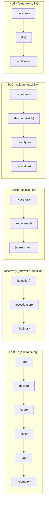
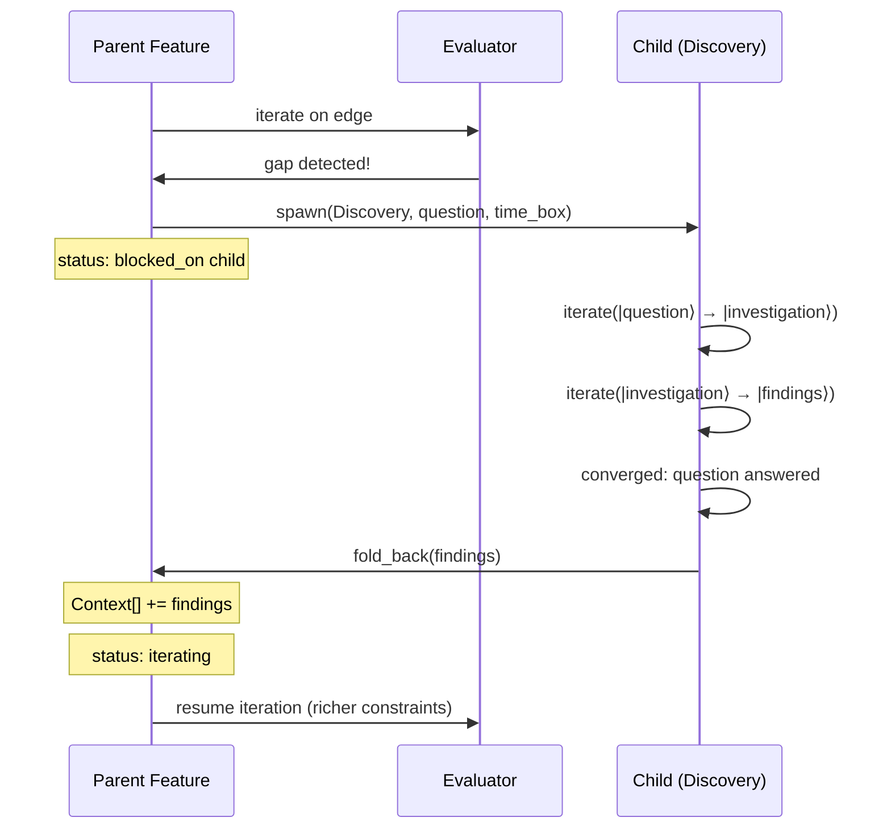
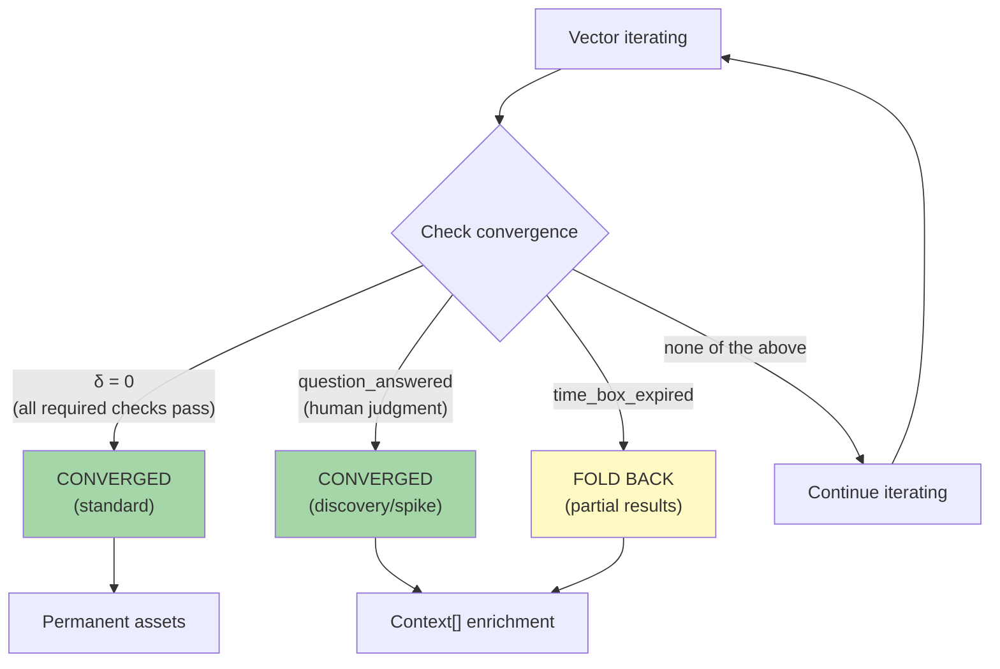
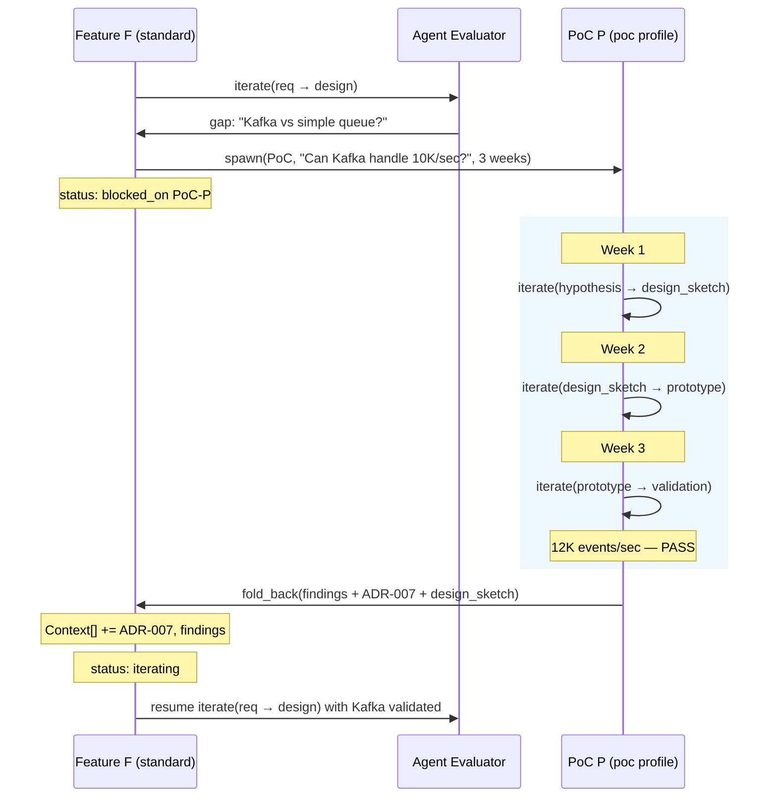

# AI SDLC — Project Genesis: Projections and Invariants

**Version**: 1.1.0
**Date**: 2026-02-20
**Extends**: [AI_SDLC_ASSET_GRAPH_MODEL.md](AI_SDLC_ASSET_GRAPH_MODEL.md) (v2.8.0)
**Foundation**: [Constraint-Emergence Ontology](https://github.com/foolishimp/constraint_emergence_ontology) (§V, §VIII-B)

---

## 1. Motivation

The Asset Graph Model (v2.6) defines four primitives and one operation. It presents one graph instantiation — the full SDLC graph with 10 asset types and 10 edges. But the formal system's purpose is not to prescribe that graph. It is to **generate valid lighter instances** — projections — that preserve what matters while shedding what doesn't.

A 10-minute proof-of-concept and a regulated medical device both use the same four primitives. They differ in which edges exist, what evaluators are active, and when convergence is declared. The formal system is a **generator of valid methodologies**, not a single methodology.

This document defines:
- What must survive any projection (invariants)
- How projections are constructed (projection functions)
- What vector types exist beyond feature vectors (discovery, spike, PoC)
- How vectors spawn children and fold back results
- How time-boxing extends convergence
- Named projection profiles for common use cases

---

## 2. Invariants

### 2.1 Definition

An **invariant** is a property that must hold in every valid projection of the formal system. If a projection violates an invariant, it is not a lighter instance of the methodology — it is a different system entirely.

The four primitives (§1 of the Asset Graph Model) are the invariants:

| Invariant | What it means | What breaks if absent |
|-----------|--------------|----------------------|
| **Graph** | There is a topology of typed assets with admissible transitions | No structure — work is ad hoc, sequence is implicit |
| **Iterate** | There is a convergence loop — produce candidate, evaluate, repeat | No quality signal — work is one-shot, no feedback |
| **Evaluators** | There is at least one evaluator per active edge | No convergence criterion — iteration has no stopping condition |
| **Spec + Context** | There is a constraint surface bounding construction | No constraints — degeneracy, hallucination, unconstrained output |

### 2.2 Invariant Preservation Rules

For a projection P to be valid:

```
valid(P) ⟺
    ∃ G ⊆ G_full          (P has a graph, which is a subgraph of some reference)
    ∧ ∀ edge ∈ G:
        iterate(edge) defined                    (every edge has the iteration function)
        ∧ evaluators(edge) ≠ ∅                   (every edge has at least one evaluator)
        ∧ convergence(edge) defined              (every edge has a stopping condition)
    ∧ context(P) ≠ ∅       (there is some constraint surface)
```

What can vary:
- **Graph size** — from 2 nodes / 1 edge to the full SDLC graph
- **Evaluator composition** — which evaluator types are active per edge
- **Convergence criteria** — what δ < ε means for each edge
- **Context density** — how many constraints bound construction
- **Iteration depth** — how many cycles before declaring convergence or timeout

What cannot vary:
- The existence of a graph (even if it's `A → B`)
- The existence of iteration (even if max_iterations = 1)
- The existence of evaluation (even if it's just "human looks at it")
- The existence of context (even if it's just the intent statement)

### 2.3 Traceability as Cross-Cutting Invariant

Traceability — the ability to trace any asset back to the intent that spawned it — is not a fifth invariant. It is an **emergent property** of the four invariants working together:

- **Graph** provides the path (which edges were traversed)
- **Iterate** provides the history (which candidates were produced)
- **Evaluators** provide the decisions (why this candidate was accepted)
- **Spec + Context** provides the constraints (what bounded the construction)

If all four invariants hold, traceability is recoverable. If any one is absent, traceability degrades. The REQ key system is the **encoding** of this emergent property — a practical mechanism for maintaining traceability without requiring full history replay.

In lighter projections, traceability may be coarser (e.g., "this code came from that intent" without intermediate design documents), but the causal chain from intent to artifact is never fully severed.

**Feature views** (Asset Graph Model §6.4) are the observable manifestation of traceability: grepping for a REQ key across all artifacts produces a per-feature status report. In a full projection, the feature view shows all stages. In a lighter projection, the view shows fewer stages — but the REQ key still threads through whatever assets exist. Feature views degrade gracefully with projection: fewer stages, same key.

### 2.4 IntentEngine as Projection-Invariant

The IntentEngine (Asset Graph Model §4.6) — `observer → evaluator → typed_output(reflex.log | specEventLog | escalate)` — is **projection-invariant**: the same structure operates in every valid projection. It is not a fifth invariant but a composition law over the existing four: given any graph with iterate and evaluators bounded by spec+context, the IntentEngine pattern necessarily emerges at every edge.

What projections tune:
- **Ambiguity thresholds**: A hotfix profile has aggressive escalation (low tolerance for nonzero ambiguity). A spike profile tolerates more ambiguity before escalating to conscious review.
- **Affect weights**: A full profile weights all signal sources equally. A minimal profile may suppress ecosystem signals entirely.
- **Observer depth**: A full projection runs all interoceptive + exteroceptive monitors. A spike runs only the monitors relevant to the experiment.

What projections cannot change:
- **The observer/evaluator structure**: Every edge traversal is an IntentEngine invocation. No unobserved computation.
- **The three output types**: Every IntentEngine produces exactly one of `reflex.log`, `specEventLog`, or `escalate`. There is no fourth category.
- **Ambiguity as routing criterion**: Zero → reflex, bounded → iterate, persistent → escalate. The classification may be coarser in lighter projections (e.g., binary pass/fail instead of multi-evaluator delta), but the three-way routing survives.

**Candidate invariant**: *Every edge traversal is an IntentEngine invocation. No unobserved computation.*

This strengthens the existing invariant that "every edge has at least one evaluator" (§2.2): not only must every edge have an evaluator, but every edge traversal must produce a classified observation (observer) with a typed output (evaluator), and the output must route through the ambiguity classification. This is what it means for the four primitives to compose into a universal processing unit.

### 2.5 Projections as Functors

A projection is a functor: `Functor(Spec, Encoding) → Executable Methodology` (Asset Graph Model §2.9).

The spec defines the functional units (typed assets, admissible transitions, evaluator slots). The encoding maps each unit to an execution category (F_D deterministic, F_P probabilistic, F_H human). Different encodings of the same spec produce different projections — each a valid methodology instance.

This explains why the five things that can vary (§2.2) are precisely the encoding parameters:

| Varies | Encoding dimension |
|--------|-------------------|
| Graph size | Which functional units have explicit encodings (zoom level) |
| Evaluator composition | Which execution category renders each evaluator slot |
| Convergence criteria | What δ < ε means in each category |
| Context density | How many constraints the encoding must satisfy |
| Iteration depth | How many functor applications before timeout |

And why the four things that cannot vary are the functor's preconditions — without a graph there is no domain, without iteration there is no application, without evaluation there is no classification, without context there is no constraint surface. Remove any one and the functor is undefined.

Named profiles (§3.2) are named encodings. Zoom operations (Asset Graph Model §2.5) are encoding refinements — making implicit functional units explicit. The natural transformation η between categories (F_D → F_P → F_H) is the IntentEngine's escalation mechanism — the functor adapts its encoding when ambiguity exceeds the current category's capacity.

---

## 3. Projections

### 3.1 Definition

A **projection** is a valid instance of the formal system with a specific:
- **Graph subset** — which asset types and edges are active
- **Evaluator profile** — which evaluator types are active per edge, what convergence means
- **Context density** — how many constraints bound construction
- **Iteration budget** — how many cycles are permitted before timeout

```
projection(G_full, profile) → G_projected
    where valid(G_projected) = true
```

This generalises §2.5 (Zoom) of the Asset Graph Model. Zoom addresses graph granularity — collapsing sub-graphs into single edges. Projection is broader: it also adjusts evaluator strictness, convergence criteria, and iteration budgets. Zoom is a special case of projection where only the graph dimension changes.

### 3.2 Projection Dimensions

A projection is specified along four dimensions:

| Dimension | Full | Light | Minimal |
|-----------|------|-------|---------|
| **Graph** | All asset types, all edges | Subset of edges, some collapsed | 2 nodes, 1 edge |
| **Evaluators** | Human + Agent + Deterministic per edge | Agent + Deterministic, human on key edges | Agent only, or human only |
| **Convergence** | All checks pass (δ = 0) | Required checks pass | Question answered, or time box expired |
| **Context** | Full constraint surface (ADRs, models, policy, templates) | Project constraints + intent | Intent only |

These dimensions are independent — you can have a full graph with light evaluators (fast pass through all stages) or a minimal graph with strict evaluators (one edge, done properly).

**Spec/Design boundary** (Asset Graph Model §2.6): When projecting the graph dimension, the Spec/Design boundary matters. Projections that skip the Requirements → Design edge (e.g., spike, hotfix) collapse the boundary — they go from intent directly to tech-bound code. Projections that preserve the boundary (standard, full) maintain the separation between WHAT and HOW, enabling multiple design variants per spec.

```mermaid
flowchart LR
    subgraph Full
        G1["Graph: all edges"]
        E1["Evaluators: H+A+D"]
        C1["Convergence: δ=0"]
        X1["Context: full surface"]
    end
    subgraph Standard
        G2["Graph: core edges"]
        E2["Evaluators: A+D, H on key"]
        C2["Convergence: required pass"]
        X2["Context: project + ADRs"]
    end
    subgraph Minimal
        G3["Graph: 1 edge"]
        E3["Evaluators: 1 type"]
        C3["Convergence: question answered"]
        X3["Context: intent only"]
    end

    Full -.->|"projection"| Standard -.->|"projection"| Minimal
```



### 3.3 The Projection Function

```
project(
    reference_graph,        // the full system being projected from
    graph_subset,           // which edges to include
    evaluator_overrides,    // per-edge evaluator adjustments
    convergence_overrides,  // per-edge convergence criteria
    iteration_budget,       // max iterations before timeout
    context_subset          // which context elements to load
) → projected_instance
```

The projection function is itself an instance of iterate — it converges on a valid lighter graph through evaluation against the invariants.

### 3.4 Ontology Mapping

Projection maps to the ontology's **scale-dependent observation** (#23): the same system viewed at different resolutions reveals different structure while preserving invariants. A feature vector at zoom level "sprint" shows different detail than the same vector at zoom level "quarter", but the causal chain (intent → artifact) is the same chain.

---

## 4. Vector Types

### 4.1 Beyond Feature Vectors

The Asset Graph Model (§6) defines feature vectors — trajectories through the graph that produce composite assets. But not all work is feature delivery. The formal system supports multiple vector types, each a different projection:

| Vector Type | Purpose | Graph | Convergence | Fold-back |
|------------|---------|-------|-------------|-----------|
| **Feature** | Deliver a capability | Full or standard projection | All required checks pass | Permanent — assets become Markov objects |
| **Discovery** | Answer a question | Minimal graph (often 1-2 edges) | Question answered | Context[] — findings become constraints |
| **Spike** | Assess technical risk | Subset graph (code + tests) | Risk assessed OR time_box_expired | Context[] — findings + recommendation |
| **PoC** | Validate feasibility | Standard or light projection | Hypothesis confirmed/rejected OR time_box_expired | Context[] + optionally promoted assets |
| **Hotfix** | Fix production issue | Minimal graph (code → tests) | Fix verified in production | Permanent — but spawns feature vector for proper remediation |



### 4.2 Feature Vector (zoomed-out form; see Asset Graph Model §6.1 for full form including |module_decomp⟩ + |basis_projections⟩ at zoom)

The standard trajectory through the graph producing permanent Markov objects.

```
Feature F = |req⟩ + |design⟩ + |code⟩ + |unit_tests⟩ + |uat_tests⟩ + |cicd⟩ + |telemetry⟩
Convergence: δ = 0 (all required checks pass for all edges)
Result: Permanent assets, merged to main, deployed
```

(The exact components depend on the graph topology and zoom level — see §2.5 of the Asset Graph Model.)

### 4.3 Discovery Vector

A time-boxed investigation spawned when a gap is detected — missing information, unclear requirements, unknown feasibility.

```
Discovery D = |question⟩ → |investigation⟩ → |findings⟩
Convergence: question_answered OR time_box_expired(fold_back_partial)
Result: Context[] entry (findings become constraints for parent vector)
```

Properties:
- Spawned by a parent vector when a gap is detected
- Has a specific question to answer
- Does not produce permanent code assets (unless promoted)
- Findings fold back as Context[] to the parent
- Time-boxed: if the question isn't answered within budget, partial findings still fold back

### 4.4 Spike Vector

A time-boxed technical experiment to reduce risk — "can we do X with technology Y?"

```
Spike S = |hypothesis⟩ → |experiment⟩ → |assessment⟩
Convergence: risk_assessed OR time_box_expired(fold_back_partial)
Result: Context[] entry (risk assessment + recommendation)
```

Properties:
- Spawned when a feature vector encounters technical uncertainty
- Produces throwaway code (explicitly not production)
- Assessment folds back as Context[] (often as an ADR)
- Time-boxed: partial results are still valuable

### 4.5 PoC Vector

A time-boxed feasibility validation — larger than a spike, smaller than a feature.

```
PoC P = |hypothesis⟩ → |design_sketch⟩ → |prototype⟩ → |validation⟩
Convergence: hypothesis_confirmed OR hypothesis_rejected OR time_box_expired
Result: Context[] (validated/rejected approach) + optionally promotable assets
```

Properties:
- Spawned from a discovery gap or a strategic question
- Uses a lighter projection profile than feature vectors
- May produce assets that can be promoted to a feature vector (not thrown away)
- Folds back as Context[] plus a go/no-go recommendation
- Time-boxed: three weeks is typical, with defined check-in cadence

### 4.6 Hotfix Vector

An emergency trajectory through a minimal graph.

```
Hotfix H = |incident⟩ → |fix⟩ → |verification⟩
Convergence: fix_verified_in_production
Result: Permanent (deployed fix) + spawns remediation feature vector
```

Properties:
- Spawned from a production incident (feedback loop edge)
- Minimal graph — skip design, skip UAT, go straight to code + tests
- Convergence is production verification, not full check suite
- Always spawns a follow-up feature vector for proper remediation (the hotfix is technical debt until remediated)

---

## 5. Vector Spawning and Fold-Back

### 5.1 Spawning

Any vector can spawn child vectors during iteration. Spawning occurs when:

1. **Gap detected** — an evaluator identifies missing information → spawns Discovery vector
2. **Risk identified** — uncertainty about feasibility → spawns Spike vector
3. **Feasibility question** — "should we build this at all?" → spawns PoC vector
4. **Production incident** — telemetry deviation → spawns Hotfix vector
5. **Scope expansion** — iteration reveals the feature is larger than expected → spawns sub-Feature vector

```
spawn(
    parent_vector,          // the vector that detected the need
    child_type,             // Discovery | Spike | PoC | Hotfix | Feature
    trigger,                // what caused the spawn (gap, risk, incident, scope)
    question_or_hypothesis, // what the child vector must resolve
    time_box,               // iteration budget (optional for Feature)
    projection_profile      // which projection to use
) → child_vector
```

The parent vector's status becomes `blocked_on: child_vector_id` until fold-back.

### 5.2 Fold-Back

When a child vector converges (or times out), its outputs fold back to the parent:

```
fold_back(
    child_vector,           // the completed child
    parent_vector,          // the waiting parent
    outputs                 // what the child produced
) → updated_parent_context
```

Fold-back rules:

| Child Type | What Folds Back | Where It Goes |
|-----------|----------------|---------------|
| Discovery | Findings document | Parent's Context[] — becomes a constraint |
| Spike | Risk assessment + recommendation | Parent's Context[] — often becomes an ADR |
| PoC | Go/no-go + validated approach + (optional) promotable assets | Parent's Context[] + optionally assets promoted into parent trajectory |
| Hotfix | Deployed fix | Production (permanent) + spawns remediation Feature as sibling |
| Feature (sub) | Converged assets | Parent's dependency graph — unblocks parent edges |

After fold-back:
1. Parent vector's Context[] is updated with child outputs
2. Parent vector's status changes from `blocked` to `iterating`
3. The context hash is recomputed (spec reproducibility)
4. Iteration resumes on the parent with richer constraints



### 5.3 Fold-Back as Context Enrichment

Fold-back is not a special mechanism — it is **Context[] enrichment**. The child vector's outputs become entries in the parent's constraint surface. This is the same mechanism as loading an ADR or a data model — the child's findings narrow the parent's possibility space, reducing degeneracy and driving convergence.

```
Before fold-back:  Context[] = {intent, ADRs, models}               → wide possibility space
After fold-back:   Context[] = {intent, ADRs, models, spike_result} → narrower, more constrained
```

This maps to the ontology's constraint density (#16): child vectors increase constraint density on the parent, making convergence easier.

### 5.4 Nested Spawning

Child vectors can spawn their own children. A PoC might spawn a Spike to assess a specific technology. A Feature might spawn a Discovery which spawns another Discovery. The nesting is bounded by:

- **Time box inheritance** — child time boxes must fit within parent time boxes
- **Depth limit** — practical limit to prevent infinite nesting (configurable, default 3)
- **Budget constraint** — total iteration budget across the tree is finite

---

## 6. Time-Boxing and Extended Convergence

### 6.1 The Problem

The Asset Graph Model defines convergence as:

```
stable(candidate, edge_type) = ∀ evaluator: delta < ε
```

This works for feature vectors where "all checks pass" is the right stopping condition. But discovery, spike, and PoC vectors need a different stopping condition: **the question was answered** or **the time box expired**.

### 6.2 Extended Convergence

Convergence is generalised to:

```
converged(vector) =
    δ = 0                                    // all required checks pass
    OR (question_answered AND δ_required = 0) // discovery/spike: question resolved, required checks pass
    OR time_box_expired(fold_back_partial)    // timeout: fold back what we have
```

Where:
- **δ = 0** is the standard convergence (feature vectors, hotfixes)
- **question_answered** is a human evaluator judgment ("yes, we now know enough")
- **time_box_expired** triggers a graceful fold-back of partial results



### 6.3 Time Box Mechanics

```
time_box:
    duration: 3 weeks       // calendar time
    check_in: weekly        // intermediate evaluation cadence
    on_expiry: fold_back    // what happens when time runs out
    partial_results: true   // fold back whatever we have
```

At each check-in:
1. Run the vector's evaluators
2. Report progress (δ at each check-in vs δ at start)
3. Human decides: continue, extend, pivot, or terminate early

On expiry:
1. Run final evaluation
2. Package all outputs (even incomplete) as fold-back payload
3. Fold back to parent with status: `time_box_expired`
4. Parent decides what to do with partial results

### 6.4 Convergence is Still the Invariant

Time-boxing does not violate the Iterate invariant. The iteration loop still runs:

```
while not converged(vector) AND not time_box_expired(vector):
    candidate = iterate(candidate, context, evaluators)
```

The stopping condition is extended, not removed. Every iteration still evaluates against the convergence criteria. Time-boxing adds an upper bound on iteration count, not a bypass of evaluation.

---

## 7. Projection Profiles

### 7.1 Named Profiles

A projection profile is a named configuration specifying how each dimension is set:

```yaml
profiles:
  full:
    description: "Maximum rigour — regulated, audited, safety-critical"
    graph: all_edges
    evaluators: human + agent + deterministic on all edges
    convergence: δ = 0, all checks including human approval
    context: full constraint surface
    iteration_budget: unlimited (converge or escalate)
    vector_types: [feature, discovery, spike]

  standard:
    description: "Normal feature development — team with CI/CD"
    graph: intent → req → design → code ↔ tests
    evaluators: agent + deterministic on most edges, human on req and design
    convergence: all required checks pass
    context: project constraints + relevant ADRs
    iteration_budget: per-sprint
    vector_types: [feature, discovery, spike, hotfix]

  poc:
    description: "Proof of concept — time-boxed feasibility validation"
    graph: intent → design_sketch → prototype → validation
    evaluators: agent + human (no deterministic — throwaway code)
    convergence: hypothesis confirmed/rejected OR time_box_expired
    context: intent + relevant prior art
    iteration_budget: 3 weeks default
    vector_types: [poc, spike, discovery]

  spike:
    description: "Technical spike — time-boxed risk assessment"
    graph: hypothesis → experiment → assessment
    evaluators: agent + human
    convergence: risk assessed OR time_box_expired
    context: intent + technical constraints
    iteration_budget: 1 week default
    vector_types: [spike, discovery]

  hotfix:
    description: "Emergency production fix — minimal process"
    graph: incident → fix → verification
    evaluators: deterministic (tests pass) + human (production verified)
    convergence: fix verified in production
    context: incident details + affected code
    iteration_budget: hours
    vector_types: [hotfix]
    post_actions: [spawn_remediation_feature]

  minimal:
    description: "Smallest valid projection — 1 edge, 1 evaluator"
    graph: A → B (any single edge)
    evaluators: at least 1 (human OR agent OR deterministic)
    convergence: evaluator passes
    context: intent statement
    iteration_budget: configurable
    vector_types: [any]
```

### 7.2 Profile Selection

Profile selection is itself a Context[] decision:

```
Factors:
  - Regulatory environment (regulated → full)
  - Team maturity (new team → standard, experienced → lighter)
  - Risk tolerance (low → full, high → minimal)
  - Time pressure (high → hotfix/spike, low → standard/full)
  - Domain criticality (safety-critical → full, internal tool → minimal)
  - Vector type (feature → standard, spike → spike profile)
```

Profiles are defaults, not prisons. Any profile can be adjusted per-project or per-feature via the project_constraints.yml and feature vector overrides.

### 7.3 Profile Composition

Profiles compose hierarchically, following the same Context[] override rules:

```
corporate_profile (base)
  → division_profile (overrides)
    → team_profile (overrides)
      → project_profile (overrides)
        → feature_profile (overrides)
```

At each level, the override rules are:
- **Graph**: can only remove edges (narrow), not add (widen) — unless explicitly permitted
- **Evaluators**: can add evaluators (stricter), can only remove with explicit `override: true`
- **Convergence**: can raise thresholds (stricter), not lower (except with explicit override)
- **Context**: can add context (more constraints), can remove with explicit override

This follows the constraint propagation principle (#2): constraints accumulate, they don't evaporate. Loosening requires explicit, auditable override.

---

## 8. The PoC Example: End-to-End

To make projections concrete, here is the PoC scenario from our analysis:

### 8.1 Situation

A team is building a data pipeline (Feature F, standard profile). During the design edge, the agent evaluator detects a gap: "Can Apache Kafka handle our throughput requirements, or should we use a simpler queue?"

### 8.2 Spawning

```
Parent: Feature F (standard profile)
  Edge: requirements → design
  Gap detected: "Kafka vs simple queue for throughput"

  Spawns: PoC P (poc profile)
    question: "Can Kafka handle 10K events/sec with our schema?"
    time_box: 3 weeks
    check_in: weekly
```

Parent status: `blocked_on: PoC-P`

### 8.3 PoC Execution

Week 1:
- `iterate(|hypothesis⟩ → |design_sketch⟩)` — sketch Kafka topology
- Agent evaluator: design sketch addresses throughput question? **PASS**
- Promote to design_sketch

Week 2:
- `iterate(|design_sketch⟩ → |prototype⟩)` — build minimal Kafka producer/consumer
- Agent evaluator: prototype implements the design? **PASS** (throwaway code, no production standards)
- Promote to prototype

Week 3:
- `iterate(|prototype⟩ → |validation⟩)` — run load test
- Deterministic evaluator: 10K events/sec sustained? **PASS** (12K actual)
- Human evaluator: "Yes, Kafka is viable. Proceed."
- **Converged**: hypothesis confirmed

### 8.4 Fold-Back

```
fold_back(PoC-P → Feature F):
  outputs:
    - findings: "Kafka handles 12K events/sec, 20% headroom"
    - recommendation: "Use Kafka"
    - ADR: "ADR-007: Use Kafka for event streaming (validated by PoC-P)"
    - promotable_assets: [design_sketch]  # can be refined, not thrown away

  parent_context_update:
    - Context[] += ADR-007
    - Context[] += PoC findings document
    - design_sketch promoted to Feature F design trajectory (to be refined)
```

Feature F resumes at the design edge, now with Kafka validated as a constraint. The possibility space has narrowed — no more "Kafka vs queue?" uncertainty.



### 8.5 What Was Preserved

All four invariants held throughout:
- **Graph**: PoC had a graph (hypothesis → design_sketch → prototype → validation)
- **Iterate**: Each edge iterated until evaluators converged
- **Evaluators**: Agent + human + deterministic (load test) evaluated each edge
- **Spec + Context**: PoC had a hypothesis (intent) and technical constraints (context)

Traceability: PoC-P traces to Feature F's gap detection, which traces to INT-001. The causal chain is intact.

---

## 9. Projection Verification

### 9.1 Verifying a Projection is Valid

Given a projection P, verify:

```
1. Graph check:
   - P.graph has at least 1 edge
   - All edges connect defined asset types
   - No orphan nodes (every node has at least 1 edge)

2. Iterate check:
   - Every edge in P.graph has iterate() defined
   - Max iterations is defined (finite or explicit "unlimited")

3. Evaluator check:
   - Every edge has at least 1 evaluator
   - Each evaluator has a convergence criterion

4. Context check:
   - P has a non-empty context (at minimum: intent)
   - Context is versioned (hash computable)

5. Convergence check:
   - Every edge has a stopping condition
   - Time box is defined (or explicitly "no time box")

6. Invariant preservation:
   - valid(P) = true (all 4 invariants hold)
```

### 9.2 Projection Comparison

Two projections can be compared along the four dimensions:

```
P1 ⊆ P2 ⟺
    P1.graph ⊆ P2.graph
    ∧ P1.evaluators ⊆ P2.evaluators (per edge)
    ∧ P1.convergence ≤ P2.convergence (strictness)
    ∧ P1.context ⊆ P2.context
```

This gives a partial order on projections. The full SDLC graph is the top element. The minimal projection (1 edge, 1 evaluator, intent only) is the bottom.

---

## 10. Relationship to Existing Spec

### 10.1 What This Extends

| Asset Graph Model section | What this document adds |
|--------------------------|------------------------|
| §2.5 Graph Scaling (Zoom) | Generalised to projections — zoom is one dimension of four |
| §3.3 Convergence | Extended to time-boxing and question-answered criteria |
| §6 Feature Vectors | Generalised to multiple vector types with spawning and fold-back |
| §7.1 Beyond Testing | Discovery/spike/PoC vectors formalise the "discover" phase |
| §7.4 Self-Maintaining Specification | Fold-back enriches Context[] — the specification learns from exploration |

### 10.2 What This Does Not Change

- The four primitives remain the same
- The iteration function signature is unchanged
- The evaluator types (Human, Agent, Deterministic) are unchanged
- The Markov object criteria are unchanged
- The REQ key system is unchanged
- The Hilbert space structure (§11) is unchanged — new vector types are additional basis elements

### 10.3 What Should Propagate Back

The following insights should be noted for the parent ontology:

1. **Invariants as projection survival criteria** — extends concept #9 (constraint manifold) with the notion that some constraints must survive any valid simplification
2. **Vector type diversity** — extends concept #15 (local preorder traversal) with different traversal objectives (answer question, assess risk, deliver capability)
3. **Fold-back as context enrichment** — extends concept #16 (constraint density) with a mechanism for child processes to increase constraint density on parent processes
4. **Time-boxing as bounded iteration** — extends concept #15 with the practical constraint that traversal has finite budget

---

## 11. Summary

The formal system is a **generator of valid methodologies**, not a single methodology. Any valid methodology produced by this generator preserves four invariants: Graph, Iterate, Evaluators, and Spec + Context.

**Projections** are valid lighter instances — specified along four dimensions (graph, evaluators, convergence, context). The full SDLC graph is one projection. A 10-minute spike is another. Both preserve the invariants; they differ in strictness and scope.

**Vector types** generalise feature vectors to include discovery, spike, PoC, and hotfix vectors — each a different projection profile with different convergence criteria and different fold-back mechanisms.

**Spawning and fold-back** enable vectors to create child vectors when gaps, risks, or incidents are detected. Child outputs fold back as Context[] enrichment, increasing constraint density and driving the parent toward convergence.

**Time-boxing** extends convergence to include `time_box_expired` as a valid stopping condition, enabling bounded exploration without abandoning the evaluate-iterate loop.

**Projection profiles** are named configurations for common use cases: full, standard, poc, spike, hotfix, minimal. They compose hierarchically following the constraint accumulation principle.

Four primitives. One operation. Valid projections at every scale.

---

## References

- **Asset Graph Model** — [AI_SDLC_ASSET_GRAPH_MODEL.md](AI_SDLC_ASSET_GRAPH_MODEL.md) — the formal system this document extends
- **Constraint-Emergence Ontology** — [github.com/foolishimp/constraint_emergence_ontology](https://github.com/foolishimp/constraint_emergence_ontology) — parent theory
- **Feature Vector Decomposition** — [FEATURE_VECTORS.md](FEATURE_VECTORS.md) — the standard vector type in detail
- **Implementation Requirements** — [AISDLC_IMPLEMENTATION_REQUIREMENTS.md](AISDLC_IMPLEMENTATION_REQUIREMENTS.md) — platform-agnostic implementation reqs
