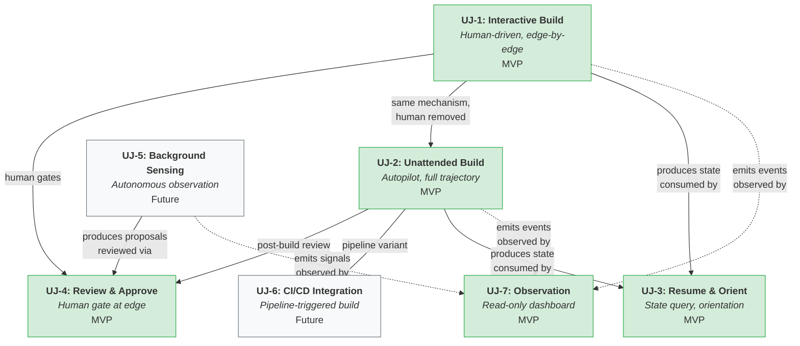
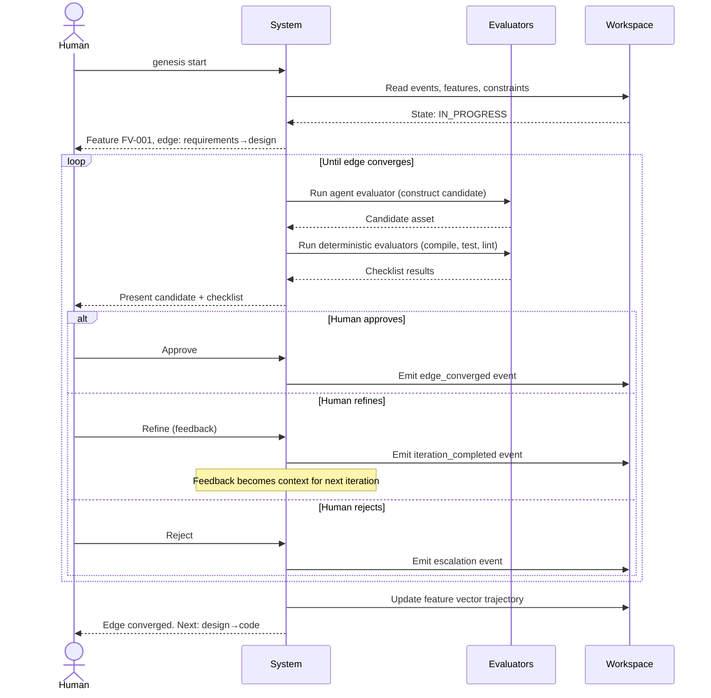
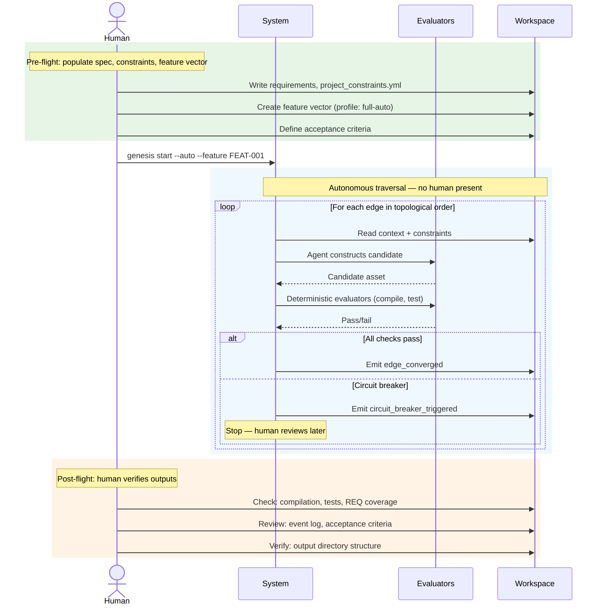
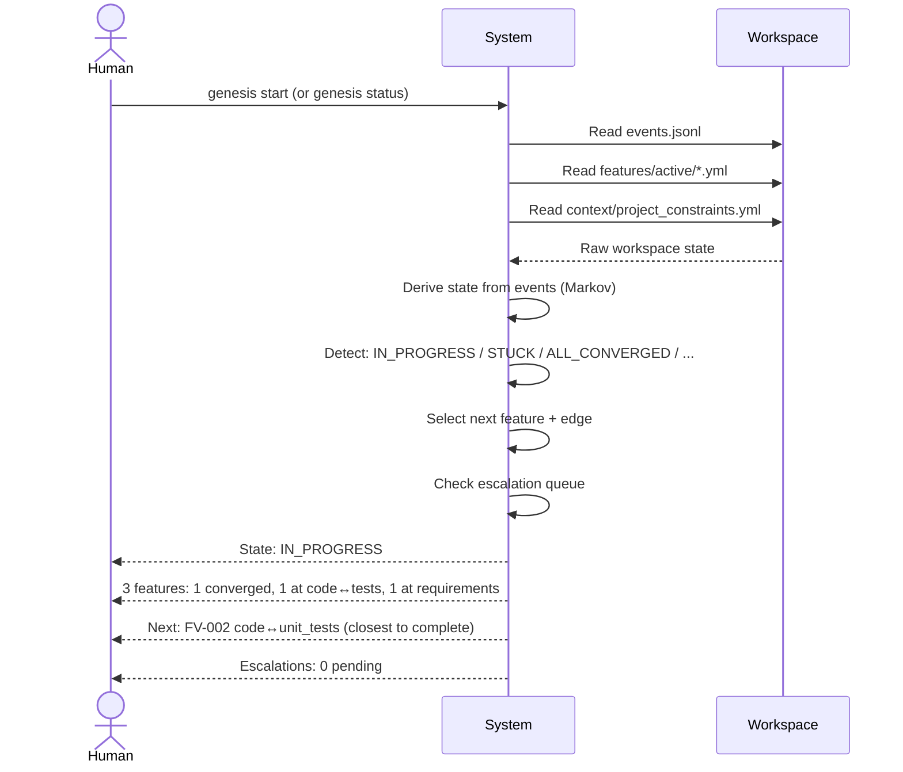
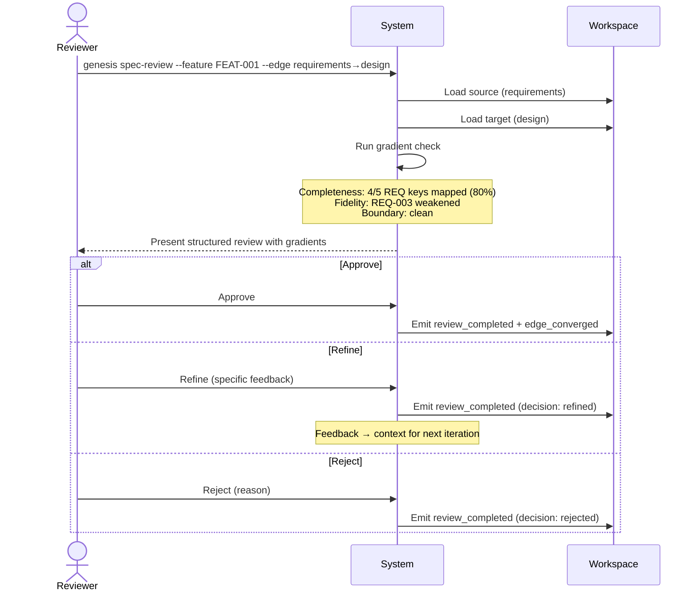
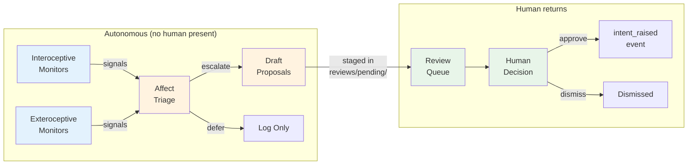
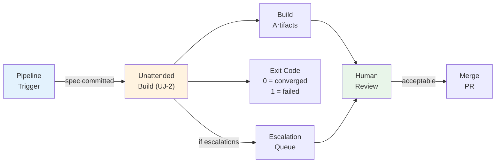
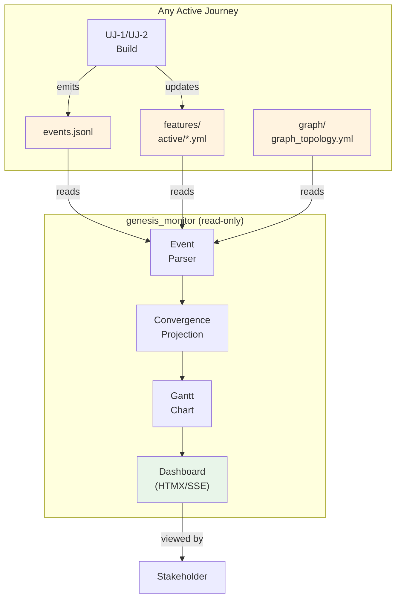
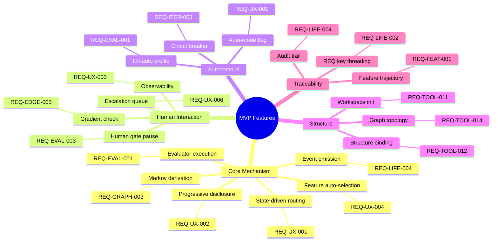
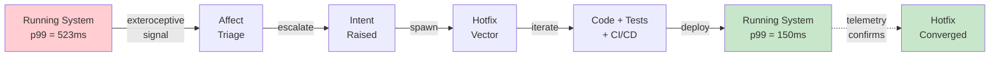

# AI SDLC — User Experience

**Version**: 1.0.0
**Date**: 2026-02-23
**Derived From**: [AI_SDLC_ASSET_GRAPH_MODEL.md](AI_SDLC_ASSET_GRAPH_MODEL.md) (v2.8.0), [AISDLC_IMPLEMENTATION_REQUIREMENTS.md](AISDLC_IMPLEMENTATION_REQUIREMENTS.md) (v3.13.0)

---

## 1. Purpose

This document defines the **user experience** of the AI SDLC methodology. It answers three questions:

1. **What are the fundamentally different ways a human uses this system?** (User Journeys)
2. **Which features are required for minimum viability?** (MVP tagging per journey)
3. **Do the requirements compose into coherent end-to-end paths?** (Validation Scenarios)

### Relationship to Other Spec Documents

| Document | What it specifies | This document's relationship |
|----------|------------------|------------------------------|
| [AI_SDLC_ASSET_GRAPH_MODEL.md](AI_SDLC_ASSET_GRAPH_MODEL.md) | The formal system (constraints, invariants, symmetries) | Journeys must be **satisfiable** within the formal system |
| [AISDLC_IMPLEMENTATION_REQUIREMENTS.md](AISDLC_IMPLEMENTATION_REQUIREMENTS.md) | Platform-agnostic WHAT (including §11 REQ-UX-* requirements) | Journeys exercise requirements end-to-end; gaps drive new REQ keys |
| [UAT_TEST_CASES.md](UAT_TEST_CASES.md) | Exhaustive functional use cases per REQ key | Scenarios here are **cross-cutting** — each touches many REQ keys simultaneously |
| [FEATURE_VECTORS.md](FEATURE_VECTORS.md) | Feature decomposition | Journeys may reveal missing feature vectors |
| [PROJECTIONS_AND_INVARIANTS.md](PROJECTIONS_AND_INVARIANTS.md) | Projection profiles and vector types | Journeys exercise specific profiles end-to-end |

**This document is a gap amplifier.** Where UAT_TEST_CASES.md validates individual requirements in isolation, the scenarios here validate that requirements compose into coherent user journeys. A scenario that cannot be completed exposes integration gaps.

---

## 2. User Journey Map

A user journey is a mode of engagement. It defines who the user is, what they want, how they interact (or don't), and what guarantees the system provides.

### 2.1 Journey Overview

| ID | Journey | Interaction | Actor | Profile(s) | MVP |
|----|---------|-------------|-------|------------|-----|
| UJ-1 | [Interactive Build](#22-uj-1-interactive-build) | Human-driven, edge-by-edge | Developer | standard, full | Yes |
| UJ-2 | [Unattended Build](#23-uj-2-unattended-build-autopilot) | Autonomous, full trajectory | Developer / CI | full-auto, poc, spike | Yes |
| UJ-3 | [Resume & Orient](#24-uj-3-resume--orient) | Human queries state | Returning developer | any | Yes |
| UJ-4 | [Review & Approve](#25-uj-4-review--approve) | Human gate at edge boundary | Tech lead / reviewer | full, standard | Yes |
| UJ-5 | [Background Sensing](#26-uj-5-background-sensing) | Autonomous observation, human reviews proposals | Ops / maintainer | full, standard | No |
| UJ-6 | [CI/CD Integration](#27-uj-6-cicd-integration) | Pipeline-triggered, results to queue | Build system | full-auto, hotfix | No |
| UJ-7 | [Observation & Monitoring](#28-uj-7-observation--monitoring) | Read-only dashboard | Any stakeholder | any | Yes |

### Journey Dependency Map



**UJ-1 and UJ-2 are the two primary build journeys.** Everything else is a supporting journey (UJ-3 orient, UJ-4 review, UJ-7 observe) or a future extension (UJ-5 sensing, UJ-6 CI/CD).

The critical insight: **UJ-2 is not a degraded UJ-1.** It is a distinct journey with stronger pre-conditions, weaker in-flight guarantees, and an explicit post-build verification step. The user makes a deliberate choice to trade in-flight human judgment for velocity, accepting the post-build review responsibility.

---

### 2.2 UJ-1: Interactive Build

**The canonical human-in-the-loop development journey.**



#### Who
Developer working on a feature. May be first-time or experienced.

#### When
- New project, new feature, or resuming existing work
- Developer wants control over each edge transition
- Requirements are still forming — human judgment needed at every stage

#### Key Characteristics

| Aspect | Detail |
|--------|--------|
| Edge traversal | One at a time, human confirms transitions |
| Evaluators | Human + Agent + Deterministic (per profile) |
| Conscious phase | Human decides — approves, refines, rejects |
| Escalations | Inline — displayed in session |
| Feedback loop | Immediate — human sees delta, adjusts |
| State routing | System suggests, human confirms |

#### Invariants (all hold)
- `[MVP]` Evaluator Existence — every edge has evaluators
- `[MVP]` Markov Property — state derived from workspace, not session memory
- `[MVP]` Convergence Monotonicity — delta decreases or stuck detection triggers
- `[MVP]` IntentEngine Composition — observer → evaluator → typed output at every scale
- `[MVP]` Review Boundary — human crosses it explicitly (approve/refine/reject)
- `[MVP]` Event Sourcing — every iteration emits events, state reconstructible

#### Pre-conditions
- `[MVP]` Workspace initialised (`.ai-workspace/` exists)
- `[MVP]` Intent defined (`specification/INTENT.md` or `INT-*` event)
- `[MVP]` At least one feature vector created

#### Post-conditions
- `[MVP]` Feature vector trajectory shows all edges converged
- `[MVP]` Event log contains complete audit trail
- `[MVP]` REQ key traceability: intent → requirements → design → code → tests
- `/gen-gaps` Layer 1 + Layer 2 at target coverage

#### MVP Features
- `[MVP]` State-driven routing (`/gen-start` detects state, routes to action) — REQ-UX-001
- `[MVP]` Progressive disclosure (ask only what's needed now) — REQ-UX-002
- `[MVP]` Human gate pause and review — REQ-UX-006, REQ-EVAL-003
- `[MVP]` Feature and edge auto-selection — REQ-UX-004
- `[MVP]` Event emission at every iteration boundary — REQ-LIFE-004
- `[MVP]` Evaluator checklist execution — REQ-EVAL-001, REQ-EVAL-002
- Spec-boundary review (`/gen-spec-review`) — REQ-EDGE-003
- Edge zoom management — REQ-UX-007

---

### 2.3 UJ-2: Unattended Build (Autopilot)

**Agent traverses the full graph autonomously. No human gates. Human verifies afterward.**

First demonstrated in `data_mapper.test06`: a pre-populated spec + constraints + feature vector, launched with `full-auto` profile, producing a complete Scala/Spark codebase (8 sbt modules, 95 passing tests, 13 events) with zero human interaction.



#### Who
- Developer with a well-defined spec who wants to see what the agent produces end-to-end
- CI/CD pipeline running a build-from-spec job
- Methodology tester validating end-to-end convergence

#### When
- Spec is complete and stable — requirements, constraints, and acceptance criteria defined
- Human review would add latency without proportional value (PoC, spike, re-build, demo)
- User wants to evaluate agent capability on a known-good spec
- CI/CD pipeline builds from spec on commit

#### Key Characteristics

| Aspect | Detail |
|--------|--------|
| Edge traversal | All edges in topological order, no pause |
| Evaluators | Agent + Deterministic only — human evaluator removed |
| Conscious phase | Agent decides — no human judgment during build |
| Escalations | Agent self-resolves or circuit-breaker triggers |
| Feedback loop | Deferred — human reviews after completion |
| State routing | Automatic — system selects next edge, no confirmation |
| Duration | Minutes to hours depending on project complexity |

#### Invariants

**Hold:**
- `[MVP]` Evaluator Existence — every edge still has evaluators (agent + deterministic)
- `[MVP]` Markov Property — state derived from workspace + events
- `[MVP]` Convergence Monotonicity — delta decreases or circuit-breaker stops
- `[MVP]` Event Sourcing — every iteration emits events
- `[MVP]` IntentEngine Composition — observer → evaluator → typed output (agent replaces human at conscious level)
- `[MVP]` REQ key traceability — tags in code, tests, events

**Relaxed:**
- Review Boundary — agent crosses it autonomously (human is not present)
- Human Accountability (REQ-EVAL-003) — deferred to post-build verification
- Escalation delivery (REQ-UX-006) — agent self-resolves; unresolvable items recorded in event log for post-build review

#### Pre-conditions (more demanding than UJ-1)
- `[MVP]` Workspace initialised with graph topology scaffolded
- `[MVP]` Spec complete: requirements document with REQ keys, acceptance criteria, priority
- `[MVP]` Constraints bound: `project_constraints.yml` with mandatory dimensions filled (ecosystem, deployment, security, build)
- `[MVP]` Structure defined: `structure.design_tenants` with output directory binding — REQ-TOOL-012, REQ-TOOL-013
- `[MVP]` Feature vector created with profile set to `full-auto` (or any profile with `human_required_on_all_edges: false`)
- `[MVP]` Acceptance criteria defined in feature vector `constraints.acceptance_criteria`
- Circuit breaker configured (max iterations per edge, stall detection)

#### Post-conditions (human verifies these)
- `[MVP]` **Compilation**: all generated code compiles/parses without error
- `[MVP]` **Tests pass**: unit tests + UAT tests green
- `[MVP]` **REQ coverage**: `grep -r "Implements: REQ-"` covers all REQ keys from spec
- `[MVP]` **Event log complete**: 13+ events (project_initialized, edge_started/converged pairs for each edge, iteration_completed events)
- `[MVP]` **Feature vector converged**: all trajectory edges show `status: converged`
- `[MVP]` **Acceptance criteria met**: each `AC-*` check in the feature vector is satisfiable against the outputs
- **Output directory correct**: code placed in `imp_<name>/` per structure binding, not at project root — REQ-TOOL-012
- **No silent failures**: event log contains no `circuit_breaker_triggered` events (or if it does, user investigates)

#### MVP Features
- `[MVP]` Profile mechanism: `full-auto` profile removes human evaluator from all edges — REQ-EVAL-001
- `[MVP]` Auto-mode (`--auto` flag): iterate without pause — REQ-UX-001
- `[MVP]` State-driven routing drives edge selection automatically — REQ-UX-004
- `[MVP]` Circuit breaker: max iterations per edge, stall detection — REQ-ITER-003
- `[MVP]` Event emission: complete audit trail for post-build review — REQ-LIFE-004
- `[MVP]` Structure binding: output directory resolved from constraints — REQ-TOOL-012, REQ-TOOL-013
- `[MVP]` Graph topology scaffolded by installer — REQ-TOOL-007, REQ-TOOL-014
- Acceptance criteria verification (automated check of AC-* against outputs)
- Post-build report generation (summary of what was built, coverage, gaps)

#### The Autopilot Contract

When a user launches an unattended build, they are asserting:

> "I have provided sufficient constraints (spec, requirements, acceptance criteria, ecosystem binding, structure) that I trust the agent to construct a candidate solution. I will verify the outputs afterward. I accept that the agent may make design choices I would have made differently — the post-build review is where I exercise judgment."

This is analogous to a CI/CD pipeline: the build runs autonomously; the human reviews the results. The quality of the output is bounded by the quality of the input constraints.

**What makes this safe:**
1. All outputs are in a clean directory (`imp_<name>/`) — no existing code modified
2. Event log provides full audit trail — every decision traceable
3. Deterministic evaluators still run — code must compile, tests must pass
4. Circuit breaker prevents infinite loops
5. Post-build verification is explicit — the journey includes the human review step

**What makes this risky if pre-conditions are weak:**
1. Vague requirements → agent fills gaps with assumptions (hallucination vector)
2. Missing constraint dimensions → agent chooses technology stack arbitrarily
3. No acceptance criteria → no way to verify fitness of output
4. No structure binding → code at project root blocks future parallel designs

#### Related Profile Configuration

The `full-auto` profile is the mechanism:

```yaml
evaluators:
  default: [agent, deterministic]     # no human
convergence:
  human_required_on_all_edges: false  # agent crosses review boundary
encoding:
  mode: autopilot                     # agent routes and decides
  decide: F_P                         # probabilistic decisions
iteration:
  escalation: agent                   # self-resolve, don't block
```

---

### 2.4 UJ-3: Resume & Orient

**Returning developer queries project state to understand where they are.**



#### Who
Developer who closed their IDE, lost context, and returns to the project.

#### When
- Start of a new session
- After a break (hours, days, weeks)
- After a context window reset (new conversation)

#### Key Characteristics

| Aspect | Detail |
|--------|--------|
| Read-only | No iteration, no state mutation (until user acts) |
| State derivation | From filesystem + event log — never from stored variable |
| Orientation | "You are here" indicator, blocked features, pending escalations |

#### Invariants (all hold)
- `[MVP]` Markov Property — state derived, not recalled
- `[MVP]` Event Sourcing — workspace rebuildable from events

#### Pre-conditions
- `[MVP]` Workspace exists with at least one event

#### Post-conditions
- User knows: current state, active features, next recommended action, pending escalations

#### MVP Features
- `[MVP]` State detection and routing — REQ-UX-001
- `[MVP]` Project-wide observability (`/gen-status`) — REQ-UX-003
- `[MVP]` Feature and edge auto-selection with reasoning — REQ-UX-004
- `[MVP]` Escalation queue visibility — REQ-UX-006
- Recovery and self-healing guidance — REQ-UX-005

---

### 2.5 UJ-4: Review & Approve

**A human evaluator reviews work at an edge boundary.**



#### Who
- Tech lead reviewing design against requirements
- Product owner reviewing UAT test scenarios
- Security reviewer checking threat model
- Any human evaluator at any edge where `human_required: true`

#### When
- Interactive build (UJ-1) reaches a human gate
- Unattended build (UJ-2) produced outputs that need post-build review
- Escalation queue has pending items

#### Key Characteristics

| Aspect | Detail |
|--------|--------|
| Judgment | Human exercises judgment — approve, refine, reject |
| Gradient check | Completeness (all REQ keys mapped), fidelity (intent preserved), boundary (spec/design clean) |
| Feedback loop | Refinement feedback becomes context for next iteration |

#### Invariants (all hold)
- `[MVP]` Review Boundary — human explicitly crosses it
- `[MVP]` Human Accountability — decision recorded with reasoning

#### Pre-conditions
- `[MVP]` Edge has produced a candidate (source + target assets exist)
- `[MVP]` Evaluator checklist has been run (automated checks done before human reviews)

#### Post-conditions
- `[MVP]` Decision recorded in feature vector + event log
- Edge converges (approve) or iterates with feedback (refine) or blocks (reject)

#### MVP Features
- `[MVP]` Human evaluator gate detection and pause — REQ-EVAL-003, REQ-UX-006
- `[MVP]` Gradient check (completeness, fidelity, boundary) — REQ-EDGE-003
- `[MVP]` Decision recording with event emission — REQ-LIFE-004
- Spec-boundary review command — REQ-EDGE-003
- Feedback-as-context for re-iteration

---

### 2.6 UJ-5: Background Sensing

**Sensory service watches the project continuously. Human reviews proposals when convenient.**



#### Who
- Maintainer of a running system
- Ops engineer monitoring health
- Developer between active work sessions

#### When
- System is deployed and running
- Project is between active development phases
- Long-running maintenance mode

#### Key Characteristics

| Aspect | Detail |
|--------|--------|
| Continuous | Runs on schedule, independent of iterate() |
| Observe-only | Service cannot modify spec, code, or emit intent events |
| Proposals | Draft proposals staged in review queue |
| Asynchronous | Human reviews when convenient, not immediately |

#### Invariants
- Review Boundary — architectural invariant, service cannot cross it
- Sensor autonomy — observations are autonomous, changes are not

#### MVP Features
- This journey is **not MVP**. It requires the sensory service infrastructure.
- Future: REQ-SENSE-001, REQ-SENSE-002, REQ-SUPV-001, REQ-SUPV-002

---

### 2.7 UJ-6: CI/CD Integration

**Pipeline triggers a build or validation from spec, results go to review queue.**



#### Who
- CI/CD pipeline (GitHub Actions, Jenkins, etc.)
- Scheduled cron job
- Git hook on spec change

#### When
- Spec file committed → pipeline triggers regeneration
- Nightly build validates spec-to-code alignment
- Release pipeline runs full gap validation

#### Key Characteristics

| Aspect | Detail |
|--------|--------|
| Triggered | Pipeline event, not human invocation |
| Headless | No interactive session, no TTY |
| Artifacts | Build outputs as pipeline artifacts (code, tests, events) |
| Exit code | Machine-readable success/failure |

#### Invariants
- Same as UJ-2 (Unattended Build)
- Additionally: escalations guaranteed delivery to review queue (never lost in pipeline output)

#### MVP Features
- This journey is **not MVP** in its full form.
- However, `[MVP]` the `--auto` flag and `full-auto` profile (from UJ-2) are the foundation that CI/CD builds on.
- Future: pipeline integration, artifact packaging, exit code semantics

---

### 2.8 UJ-7: Observation & Monitoring

**Stakeholder observes project state through a dashboard. Read-only.**



#### Who
- Project manager checking progress
- Tech lead reviewing convergence across features
- Developer checking if their build completed
- Anyone with dashboard access

#### When
- During active development (monitor build progress)
- During unattended build (watch convergence in real-time)
- During maintenance (check project health)

#### Key Characteristics

| Aspect | Detail |
|--------|--------|
| Read-only | Dashboard reads event stream, never writes |
| Real-time | SSE updates as events arrive |
| Multi-feature | Shows all features, their trajectories, convergence state |
| Integration contract | Requires: events.jsonl, features/active/*.yml, graph/graph_topology.yml |

#### Invariants
- Observer does not disturb the observed system
- Dashboard state derivable from event log (same Markov property)

#### MVP Features
- `[MVP]` Event log as integration contract — REQ-LIFE-004
- `[MVP]` Graph topology scaffolded by installer (monitor requires it) — REQ-TOOL-007, REQ-TOOL-014
- `[MVP]` Feature vector status visible — REQ-UX-003
- Convergence Gantt chart
- Regime classification (reflex/affect/conscious event tagging)
- Multi-project discovery

---

## 3. MVP Feature Summary

Features tagged `[MVP]` across all journeys, deduplicated and grouped by category.

### 3.1 Core Mechanism

| Feature | REQ Keys | Journeys |
|---------|----------|----------|
| State-driven routing | REQ-UX-001 | UJ-1, UJ-2, UJ-3 |
| Progressive disclosure | REQ-UX-002 | UJ-1 |
| Feature and edge auto-selection | REQ-UX-004 | UJ-1, UJ-2, UJ-3 |
| Evaluator checklist execution | REQ-EVAL-001, REQ-EVAL-002 | UJ-1, UJ-2, UJ-4 |
| Event emission at every boundary | REQ-LIFE-004 | All |
| Markov state derivation | REQ-GRAPH-003 | All |

### 3.2 Human Interaction

| Feature | REQ Keys | Journeys |
|---------|----------|----------|
| Human gate detection and pause | REQ-EVAL-003, REQ-UX-006 | UJ-1, UJ-4 |
| Gradient check (completeness, fidelity, boundary) | REQ-EDGE-003 | UJ-1, UJ-4 |
| Escalation queue visibility | REQ-UX-006 | UJ-1, UJ-3 |
| Project-wide observability (`/gen-status`) | REQ-UX-003 | UJ-1, UJ-3, UJ-7 |

### 3.3 Autonomous Operation

| Feature | REQ Keys | Journeys |
|---------|----------|----------|
| `full-auto` profile (no human evaluators) | REQ-EVAL-001 | UJ-2, UJ-6 |
| Auto-mode (`--auto` flag) | REQ-UX-001 | UJ-2, UJ-6 |
| Circuit breaker (stall + max iteration) | REQ-ITER-003 | UJ-2, UJ-6 |

### 3.4 Structure & Scaffolding

| Feature | REQ Keys | Journeys |
|---------|----------|----------|
| Workspace initialisation | REQ-TOOL-011 | All |
| Graph topology scaffolded by installer | REQ-TOOL-007, REQ-TOOL-014 | UJ-2, UJ-7 |
| Structure binding (output directory) | REQ-TOOL-012, REQ-TOOL-013 | UJ-2 |

### 3.5 Traceability

| Feature | REQ Keys | Journeys |
|---------|----------|----------|
| REQ key traceability (intent → telemetry) | REQ-LIFE-002 | UJ-1, UJ-2 |
| Feature vector trajectory tracking | REQ-FEAT-001 | UJ-1, UJ-2, UJ-3 |
| Event-sourced audit trail | REQ-LIFE-004 | All |

### MVP Feature Map



---

## 4. Validation Scenarios

End-to-end scenarios that exercise the user journeys. Each scenario is a gap-analysis driver — mismatches between the scenario and the current implementation surface work items.

### Scenario Format

```
### SC-{NNN}: {Title}

**Journey**: UJ-{N}
**Profile**: {projection profile}
**Actor**: {who is performing the scenario}
**Precondition**: {starting state}
**REQ Keys Exercised**: {list}

#### Steps

| # | User Action | System Response | REQ Keys | Gap Status |

#### Gaps / Invariant Checks
```

---

### SC-001: First-Time Developer — Green Field to Running System

**Journey**: UJ-1 (Interactive Build)
**Profile**: standard
**Actor**: Developer with no prior Genesis experience, has a new project idea
**Precondition**: Empty directory, development environment (Python, git). Genesis installed.
**REQ Keys Exercised**: REQ-INTENT-001, REQ-INTENT-002, REQ-UX-001, REQ-UX-002, REQ-UX-003, REQ-UX-004, REQ-UX-005, REQ-GRAPH-001, REQ-GRAPH-002, REQ-ITER-001, REQ-ITER-002, REQ-EVAL-001, REQ-EVAL-002, REQ-EVAL-003, REQ-CTX-001, REQ-CTX-002, REQ-FEAT-001, REQ-FEAT-002, REQ-EDGE-001, REQ-EDGE-002, REQ-EDGE-003, REQ-EDGE-004, REQ-LIFE-001, REQ-LIFE-002, REQ-LIFE-003, REQ-LIFE-004, REQ-LIFE-005, REQ-TOOL-001, REQ-TOOL-002, REQ-TOOL-003, REQ-TOOL-004, REQ-TOOL-005, REQ-TOOL-006, REQ-TOOL-008, REQ-TOOL-009, REQ-TOOL-010, REQ-SUPV-001, REQ-SUPV-002, REQ-SENSE-001, REQ-SENSE-002

The canonical end-to-end scenario. A developer takes a project from nothing to a running, monitored system using only Genesis tooling. Every edge of the standard profile graph is traversed.

#### Steps

| # | User Action | System Response | REQ Keys | Gap Status |
|---|-------------|-----------------|----------|------------|
| 1 | **Install Genesis** — single command | Tooling available, version verifiable, commands/agents/configs loaded | REQ-TOOL-001 | GAP-001 |
| 2 | **Start in empty directory** — `genesis start` | Progressive init: detect project name, language, test runner. Create `.ai-workspace/`, emit `project_initialized` event. | REQ-UX-001, REQ-UX-002, REQ-TOOL-003 | COVERED |
| 3 | **Describe intent** | Write `specification/INTENT.md`. Emit `intent_raised`. State → `NO_FEATURES`. | REQ-INTENT-001, REQ-INTENT-002, REQ-LIFE-005 | COVERED |
| 4 | **System creates feature vectors** | Parse intent, propose feature decomposition. Create feature vectors. State → `IN_PROGRESS`. | REQ-FEAT-001, REQ-FEAT-002, REQ-TOOL-004 | GAP-002 |
| 5 | **Iterate intent→requirements** | Generate structured requirements. Human reviews via gradient check. Edge converges. | REQ-ITER-001, REQ-EVAL-001, REQ-EVAL-003 | GAP-003 |
| 6 | **Iterate requirements→design** | Prompt for constraint dimensions. Generate ADRs. Human approves. Edge converges. | REQ-CTX-001, REQ-EDGE-003, REQ-EVAL-003 | GAP-003 |
| 7 | **Iterate design→code + code↔unit_tests** | TDD cycle. Deterministic evaluators. Edge converges. | REQ-EDGE-001, REQ-EDGE-004, REQ-EVAL-001 | GAP-003 |
| 8 | **Iterate code→uat_tests** | BDD acceptance tests. Edge converges. | REQ-EDGE-002, REQ-EVAL-002 | GAP-003 |
| 9 | **Iterate uat_tests→cicd** | CI/CD pipeline config. Deterministic evaluator. Edge converges. | REQ-LIFE-001 | GAP-003 |
| 10 | **Iterate cicd→running_system→telemetry** | Deploy. Telemetry tagging. Edge converges. | REQ-LIFE-002, REQ-LIFE-004 | GAP-003 |
| 11 | **Observe** — genesis_monitor dashboard | Feature progress, convergence Gantt, event stream, feedback loop. | REQ-LIFE-003, REQ-SENSE-001 | PARTIAL (GAP-004) |

#### Post-Condition

- All features converged. `events.jsonl` complete. REQ traceability end-to-end. `/gen-status` shows `ALL_CONVERGED`.

#### Gap Analysis Summary

```
Steps: 11 | COVERED: 2 | GAP-001: 1 | GAP-002: 1 | GAP-003: 6 | PARTIAL: 1
Methodology completeness: 18% executable today
```

#### Invariant Checks

- [x] Evaluator Existence — every edge traversal invokes evaluators
- [x] Markov Property — each step depends only on current asset state
- [x] Convergence Monotonicity — delta decreases within each edge
- [x] IntentEngine Composition — step 11 closes the loop

---

### SC-002: Returning Developer — Resume After Context Loss

**Journey**: UJ-3 (Resume & Orient)
**Profile**: standard
**Actor**: Developer who returns with no memory of where they left off
**Precondition**: `.ai-workspace/` with 3 features at various stages. ~50 events. No IDE state.
**REQ Keys Exercised**: REQ-UX-001, REQ-UX-003, REQ-UX-004, REQ-UX-005, REQ-TOOL-002, REQ-TOOL-009, REQ-GRAPH-003, REQ-SUPV-001

#### Steps

| # | User Action | System Response | REQ Keys | Gap Status |
|---|-------------|-----------------|----------|------------|
| 1 | **Open project** — `genesis start` | SessionStart hook: validate events, check consistency, detect staleness. | REQ-UX-005, REQ-TOOL-002 | COVERED |
| 2 | **State detection** | `IN_PROGRESS`. 3 features displayed with "you are here" indicators. | REQ-UX-001, REQ-UX-003 | COVERED |
| 3 | **Check status** — `genesis status` | Feature trajectories, convergence markers, rollup, Gantt. | REQ-TOOL-002, REQ-UX-003 | COVERED |
| 4 | **Resume iteration** | Load context from events. Resume on selected edge. | REQ-UX-004, REQ-GRAPH-003 | GAP-003 |
| 5 | **Check blockers** | Blocked features with reasons and recommended unblocking actions. | REQ-UX-005, REQ-SUPV-001 | COVERED |

#### Invariant Checks

- [x] **Markov Property** — central: state derived from filesystem + events, not from session memory

---

### SC-003: Stuck Feature — Escalation and Recovery

**Journey**: UJ-1 (Interactive Build)
**Profile**: standard
**Actor**: Developer whose feature has been iterating with no progress
**Precondition**: Feature on `code↔unit_tests`. Delta=3 unchanged for 4 iterations. 3 failing checks.
**REQ Keys Exercised**: REQ-UX-005, REQ-SUPV-001, REQ-SUPV-002, REQ-LIFE-005, REQ-LIFE-006, REQ-FEAT-002, REQ-FEAT-003, REQ-ITER-003

#### Steps

| # | User Action | System Response | REQ Keys | Gap Status |
|---|-------------|-----------------|----------|------------|
| 1 | **Start** | State: `STUCK`. Display stuck feature with delta history. | REQ-UX-005, REQ-SUPV-001 | COVERED |
| 2 | **View escalation queue** | 1 stuck feature (critical). Context and recommended actions. | REQ-SUPV-001, REQ-SUPV-002 | COVERED |
| 3 | **Spawn discovery vector** | Create spike child. Emit `spawn_created`. | REQ-FEAT-002, REQ-LIFE-005 | GAP-003 |
| 4 | **Investigate via spike** | Spike iterates, investigates root cause, produces report. | REQ-ITER-003 | GAP-003 |
| 5 | **Fold back findings** | Update parent context. Emit `spawn_folded_back`. Delta decreases. | REQ-FEAT-002, REQ-LIFE-005 | GAP-003 |
| 6 | **Parent unsticks** | Failing checks resolve. Edge converges. | REQ-ITER-001, REQ-ITER-002 | GAP-003 |

#### Invariant Checks

- [x] Evaluator Existence — stuck detection is itself an evaluator (meta-level)
- [x] Markov Property — spike depends on current parent state
- [x] Convergence Monotonicity — delta stuck, then decreases after fold-back
- [x] IntentEngine Composition — stuck → escalate → spawn → fold-back → resume

---

### SC-004: Multi-Feature Coordination — Parallel Work with Dependencies

**Journey**: UJ-1 (Interactive Build)
**Profile**: standard
**Actor**: Developer with 3 features, one blocking another
**Precondition**: 3 features active. REQ-F-API-001 blocked on REQ-F-DB-001. REQ-F-UI-001 independent.
**REQ Keys Exercised**: REQ-FEAT-002, REQ-FEAT-003, REQ-UX-004, REQ-COORD-001 through REQ-COORD-005

#### Steps

| # | User Action | System Response | REQ Keys | Gap Status |
|---|-------------|-----------------|----------|------------|
| 1 | **Start** | Select REQ-F-DB-001 (closest + blocks API). Show dependency graph. | REQ-UX-004, REQ-FEAT-002 | COVERED |
| 2 | **Complete DB schema** | DB feature converges. Emit `edge_converged`. | REQ-ITER-001, REQ-ITER-002 | GAP-003 |
| 3 | **Dependency unblocks** | API feature unblocked. Routing shifts. Explain decision. | REQ-FEAT-002, REQ-FEAT-003 | COVERED |
| 4 | **Status check** | Three features at different positions. Gantt shows parallel tracks. | REQ-TOOL-002, REQ-UX-003 | COVERED |
| 5 | **Multi-agent coordination** | Event-sourced edge assignment. Work isolation. | REQ-COORD-001 through 005 | GAP-006 |

#### Invariant Checks

- [x] Evaluator Existence — each edge has evaluators
- [x] Markov Property — API depends on DB's converged state, not how DB converged

---

### SC-005: Spec-Boundary Review — Human Gate at Requirements→Design

**Journey**: UJ-4 (Review & Approve)
**Profile**: full
**Actor**: Tech lead reviewing design against requirements
**Precondition**: Requirements converged. Design drafted. `human_required: true`.
**REQ Keys Exercised**: REQ-EVAL-003, REQ-EDGE-003, REQ-CTX-001, REQ-CTX-002, REQ-LIFE-005, REQ-UX-006

#### Steps

| # | User Action | System Response | REQ Keys | Gap Status |
|---|-------------|-----------------|----------|------------|
| 1 | **Auto-mode pauses at human gate** | Announce: "Human gate: requirements→design requires spec-boundary review." | REQ-UX-006, REQ-EVAL-003 | COVERED |
| 2 | **Invoke spec review** | Gradient check: completeness (80%), fidelity (REQ-003 weakened), boundary (clean). | REQ-EVAL-003, REQ-EDGE-003 | COVERED |
| 3 | **Reviewer finds gap** | "REQ-F-AUTH-002 has no design binding." | REQ-CTX-001 | COVERED |
| 4 | **Refine** — specific feedback | Record decision. Emit `review_completed`. Edge does NOT converge. | REQ-EVAL-003, REQ-LIFE-005 | GAP-003 |
| 5 | **Design iterates with feedback** | Revised design. Re-run gradients. Delta decreases. | REQ-ITER-001, REQ-ITER-002 | GAP-003 |
| 6 | **Second review — approve** | All gradients pass. Edge converges. | REQ-EVAL-003 | GAP-003 |

#### Invariant Checks

- [x] Evaluator Existence — human evaluator is the focus
- [x] Markov Property — review depends on current design + requirements
- [x] Convergence Monotonicity — delta decreases from iteration 1 to 2

---

### SC-006: Projection Switch — Standard to Spike Mid-Flight

**Journey**: UJ-1 (Interactive Build)
**Profile**: standard → spike
**Actor**: Developer who discovers a requirement needs feasibility investigation
**Precondition**: Feature at `design→code`. ML approach may not work.
**REQ Keys Exercised**: REQ-FEAT-001, REQ-FEAT-002, REQ-FEAT-003, REQ-ITER-003, REQ-TOOL-004, REQ-LIFE-005

#### Steps

| # | User Action | System Response | REQ Keys | Gap Status |
|---|-------------|-----------------|----------|------------|
| 1 | **Spawn spike** | `genesis spawn --type spike --parent FEAT-001 --reason feasibility` | REQ-FEAT-002, REQ-TOOL-004 | COVERED |
| 2 | **Spike created** | Spike profile (code+tests only, time-boxed). Parent paused. | REQ-FEAT-001, REQ-ITER-003 | COVERED |
| 3 | **Spike iterates** | Reduced graph. Evaluate feasibility. Time-box: 4 hours. | REQ-FEAT-003, REQ-ITER-001 | GAP-003 |
| 4 | **Spike concludes** | Feasibility report, prototype, go/no-go recommendation. | REQ-ITER-002 | GAP-003 |
| 5 | **Fold back** | If go: resume with prototype. If no-go: pivot. Emit `spawn_folded_back`. | REQ-FEAT-002, REQ-LIFE-005 | GAP-003 |

#### Invariant Checks

- [x] Evaluator Existence — spike has evaluators (relaxed)
- [x] Markov Property — spike depends on current parent state
- [x] IntentEngine Composition — no-go → intent_raised → design pivot

---

### SC-007: Telemetry Feedback — Production Anomaly Closes the Loop

**Journey**: UJ-5 (Background Sensing) + UJ-1 (Interactive Build)
**Profile**: full
**Actor**: Operations engineer monitoring a running system
**Precondition**: System deployed, emitting feature-keyed telemetry. genesis_monitor watching.
**REQ Keys Exercised**: REQ-LIFE-002, REQ-LIFE-003, REQ-LIFE-004, REQ-SENSE-001, REQ-SENSE-002, REQ-SUPV-001, REQ-SUPV-002, REQ-INTENT-003

#### Steps

| # | User Action | System Response | REQ Keys | Gap Status |
|---|-------------|-----------------|----------|------------|
| 1 | **Anomaly detected** — latency spike | Exteroceptive monitor detects tolerance breach. Emit `exteroceptive_signal`. | REQ-SENSE-001, REQ-SUPV-002 | GAP-008 |
| 2 | **IntentEngine classifies** | `bounded_nonzero` ambiguity. Output: `spec_event_log`. Emit `affect_triage`. | REQ-SUPV-001 | GAP-003 |
| 3 | **Intent raised** | `intent_raised`: trigger=runtime_feedback, severity=high. | REQ-LIFE-005, REQ-INTENT-003 | GAP-003 |
| 4 | **Developer sees intent** | Escalation queue: 1 high-severity item. Recommended: spawn hotfix. | REQ-SUPV-001, REQ-LIFE-003 | COVERED |
| 5 | **Spawn hotfix** | Hotfix vector, profile `hotfix` (code + tests + cicd only). | REQ-FEAT-002, REQ-LIFE-005 | GAP-003 |
| 6 | **Hotfix iterates and deploys** | Minimal edges, fast convergence. Deploy fix. | REQ-ITER-001, REQ-LIFE-001 | GAP-003 |
| 7 | **Loop closes** — telemetry confirms fix | p99 restored. Hotfix converges. | REQ-LIFE-002, REQ-LIFE-003 | GAP-003, GAP-008 |



#### Invariant Checks

- [x] Evaluator Existence — hotfix edges have evaluators
- [x] Markov Property — hotfix depends on current telemetry state
- [x] Convergence Monotonicity — deviation → fix → resolved
- [x] IntentEngine Composition — anomaly → signal → triage → intent → spawn → iterate → deploy → confirm

---

## 5. Gap Registry

Consolidated across all scenarios. Each gap appears once; scenarios reference it.

| Gap ID | Title | Scenarios | Journeys | Severity | Drives |
|--------|-------|-----------|----------|----------|--------|
| GAP-001 | No installability requirement | SC-001 | UJ-1 | **High** | REQ-TOOL-011 (now implemented) |
| GAP-002 | No automated feature decomposition from intent | SC-001 | UJ-1 | Low | REQ-FEAT-001, REQ-UX-001 |
| GAP-003 | No executable orchestration engine | SC-001..007 | All | **Critical** | Phase 2 — see [§5.1](#51-the-fp-question) |
| GAP-004 | genesis_monitor schema drift + single-project discovery | SC-001 | UJ-7 | Medium | genesis_monitor upgrade |
| GAP-005 | No automated root-cause investigation for stuck features | SC-003 | UJ-1 | Low | Spike diagnostic heuristics |
| GAP-006 | Multi-agent coordination is spec-only | SC-004 | UJ-1 | Low | Phase 3 (post-engine) |
| GAP-007 | No fold-back command | SC-006 | UJ-1 | Medium | New `/gen-fold-back` command |
| GAP-008 | No runtime telemetry integration | SC-007 | UJ-5 | Medium | REQ-SENSE-001 scope clarification |

### Gap Impact Matrix

```
              SC-001  SC-002  SC-003  SC-004  SC-005  SC-006  SC-007
GAP-001         X
GAP-002         X
GAP-003         X       X       X       X       X       X       X
GAP-004         X
GAP-005                         X
GAP-006                                 X
GAP-007                                                 X
GAP-008                                                         X
```

**GAP-003 dominates.** It appears in every scenario. This is expected — the methodology is fully specified but not yet executable. The remaining gaps are spec-level and independently addressable.

Note: GAP-001 (installability) has been resolved — REQ-TOOL-011 was added and `gen-setup.py` implements it.

### 5.1 The F_P Question (GAP-003 Commentary)

GAP-003 — "no executable engine" — deserves deeper analysis because it may not be a gap at all. It depends on which encoding is considered primary:

**If F_D (deterministic) is the target encoding**: GAP-003 is a real gap. The specs describe a state machine, and no code implements that state machine. The human must manually drive the loop.

**If F_P (probabilistic) is the target encoding**: GAP-003 is a *feature*. The specs are the program — loaded into an LLM's context, the LLM executes them. The iterate agent markdown IS the code. This is the current de facto architecture.

**If both encodings are valid** (ADR-017 functor model): the question is which edges benefit from F_D and which from F_P. State detection, event emission, and evaluator checklists are good F_D candidates. Asset generation (requirements, design, code) is inherently F_P. The engine is a hybrid — and partially exists today.

This is a design decision that belongs in implementation design docs (per spec/design separation). The scenarios must be satisfiable regardless of encoding choice.

---

## 6. Scenario Backlog

Future scenarios to add as the methodology matures:

| ID | Title | Journey | Profile | Key Focus |
|----|-------|---------|---------|-----------|
| SC-008 | Enterprise Compliance — Audit Trail Generation | UJ-1 | full | REQ-LIFE-004, regulatory traceability |
| SC-009 | Library Release — Full Profile with Versioning | UJ-1 | full | REQ-TOOL-008, semver, changelog |
| SC-010 | Cross-Platform — Same Spec, Claude + Gemini Implementations | UJ-2 | standard | Multi-tenancy, spec/design separation |
| SC-011 | Methodology Self-Application — Genesis Builds Genesis | UJ-2 | full | §0 recursive compliance, dogfooding |
| SC-012 | Time-Boxed Exploration — PoC with Expiry | UJ-1 | poc | Time-box mechanics, fold-back-or-discard |
| SC-013 | Context Window Pressure — Large Project Scaling | UJ-1 | standard | REQ-CTX-002, context selection |
| SC-014 | Ecosystem Shock — Major Dependency Breaks | UJ-5 | standard | REQ-INTENT-003, exteroceptive response |
| SC-015 | CI/CD Pipeline — Build from Spec on Commit | UJ-6 | full-auto | Pipeline integration, exit codes |

---

## Appendix A: test06 as UJ-2 Reference Implementation

The `data_mapper.test06` build (2026-02-23) is the first complete execution of UJ-2. Key facts:

| Aspect | Value |
|--------|-------|
| Spec | CDME (Categorical Data Mapping & Computation Engine) |
| Language | Scala 2.13 + Spark 3.5 |
| Profile | `full-auto` (custom, in `.ai-workspace/profiles/`) |
| Edges traversed | 5 (intent→requirements→design→code↔unit_tests→UAT) |
| Events emitted | 13 |
| Tests passing | 95/95 |
| Compiled artifacts | 352 .class files |
| REQ coverage | 29/30 files tagged |
| Human interaction | Zero during build |
| Post-build verification | Manual: compile check, test run, REQ grep, event log review |

**Gaps discovered during test06 that drove spec changes:**
- GAP-042: Installer missing `graph_topology.yml` → REQ-TOOL-007 strengthened, REQ-TOOL-014 added
- GAP-043: No constraint enforcing folder structure → REQ-TOOL-012 added
- GAP-044: No output directory binding → REQ-TOOL-013 added
- Profile mechanism: `evaluator_overrides` in `project_constraints.yml` is unimplemented; profiles are the actual mechanism for removing human evaluators

These gaps were fed back into the spec and installer — demonstrating the methodology's own feedback loop (telemetry → intent → spec modification).
