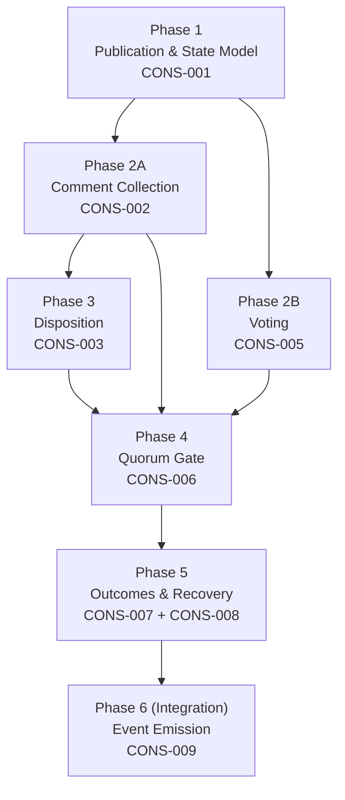

# Design Recommendations: CONSENSUS Functor (ADR-S-025)

**Feature**: REQ-F-CONSENSUS-001
**Source**: `specification/features/CONSENSUS_FEATURE_DECOMPOSITION.md`
**Edge**: feature_decomposition→design_recommendations
**Date**: 2026-03-08
**Status**: Pending human approval (F_H gate)

---

## Design Order

The feature dependency DAG has a clear critical path. CONS-001 is the root; CONS-006→007→008 is the deepest chain. CONS-009 (event emission) threads through all phases as an integration concern.

### Design Phase 1: Foundation — Publication and State Model

**Features**: REQ-F-CONS-001 (Review Publication)

**Rationale**: Everything else depends on the publication record existing. Phase 1 establishes the core state model: what a CONSENSUS instance is, what fields it carries, and what invariants hold at open time. The config invariant (`review_closes_at >= published_at + min_duration`) is enforced here. The `asset_version` type is resolved here (implementation-specific: semver vs content hash — see ADR Areas).

**Blocks**: All subsequent phases. Nothing can be built without a publication record.

---

### Design Phase 2: Participant Interaction — Comments and Votes (parallel)

**Features**: REQ-F-CONS-002 (Comment Collection & Gating), REQ-F-CONS-005 (Voting)

**Rationale**: These two features have no dependency on each other — comments and votes are independent participant actions against the same publication record. They can be designed in parallel. The gating partition rule (comment timestamp ≤ review_closes_at) is designed here. The `non_response` vs `abstain` distinction and vote attachment to `asset_version` are designed here.

**Blocks**: CONS-003 (disposition depends on comments), CONS-006 (quorum gate depends on both).

---

### Design Phase 3: State Transitions — Disposition and Versioning (parallel)

**Features**: REQ-F-CONS-003 (Comment Disposition), and optionally REQ-F-CONS-004 (Asset Versioning — deferred from MVP)

**Rationale**: Disposition is the mechanism that closes the gating comment set. The four disposition values and their state effects are designed here. CONS-004 is deferred but noted: if asset versioning is added in a later iteration, its design belongs in this phase alongside disposition since both are triggered by asset changes during review.

**Blocks**: CONS-006 (quorum gate requires all gating comments dispositioned).

---

### Design Phase 4: Convergence Gate — Quorum Evaluation

**Features**: REQ-F-CONS-006 (Quorum Gate)

**Rationale**: All five deterministic checks are implemented here as a single atomic evaluation. The quorum formulas (neutral vs counts_against abstention models), participation floor check, threshold mapping, and tie semantics are all deterministic — no ambiguity. This is a pure F_D computation over the state accumulated in Phases 1–3.

**Blocks**: CONS-007 (outcomes depend on gate result).

---

### Design Phase 5: Outcomes and Recovery

**Features**: REQ-F-CONS-007 (Convergence Outcomes), REQ-F-CONS-008 (Recovery Paths)

**Rationale**: These are designed together — each `failure_reason` in CONS-007 maps directly to a set of `available_paths` in CONS-008. Designing them separately would require re-visiting the interface. The stuck re-open detection in CONS-008 has a dependency on homeostasis infrastructure; its design must acknowledge that dependency explicitly (see Cross-Cutting Concerns).

**Blocks**: None — terminal in the core CONSENSUS flow.

---

### Design Phase 6 (Integration): Event Emission

**Features**: REQ-F-CONS-009 (Event Emission)

**Rationale**: While CONS-009 emits events at every phase transition, its design is an integration concern — it depends on the final schema of every other feature's state changes. Designing it last avoids rework. The 7 event types and their payloads are fixed by ADR-S-025; the design work is: where in the execution flow does each event fire, and how does the event payload map to the runtime state at that point.

**Blocks**: None — final integration.

---

### Phase Dependency Diagram

**Critical path**: P1 → P2A → P3 → P4 → P5 → P6 (6 hops)
**Parallelism opportunities**: P2A ‖ P2B, and P3 can be designed concurrently with P4 if P2 is complete.

---

## Cross-Cutting Concerns

### Cross-Cutting: Review State Machine

**Appears in**: CONS-001, CONS-002, CONS-003, CONS-005, CONS-006, CONS-007, CONS-008

**Design implication**: CONSENSUS is fundamentally a state machine. Every participant action (comment, vote, disposition) and every phase transition (open, close, decided, recovering) is a state change on the same entity. The state machine must be designed centrally — not per-feature — or the state transitions will be inconsistent across features.

States: `open → closed → decided(reached|failed) → recovering(re_open|narrow_scope|abandon)`

All features operate on this shared state. The design must define: what state transitions are valid, what invariants hold in each state, and what event is emitted on each transition.

---

### Cross-Cutting: Event Emission Contract

**Appears in**: CONS-001 through CONS-009

**Design implication**: All 7 CONSENSUS event types must conform to the OL event schema (event_type, timestamp, project, feature, edge fields). The event payload for each type is specified in ADR-S-025. Design must determine: how payloads are assembled from runtime state, how the event log is accessed, and whether event emission is synchronous or deferred. Implementations that use the existing OL event infrastructure inherit these decisions; new implementations must resolve them.

---

### Cross-Cutting: Timestamp and Duration Arithmetic

**Appears in**: CONS-001 (min_duration config invariant), CONS-002 (gating partition at review_closes_at), CONS-006 (min_duration_elapsed, review_window_closed checks)

**Design implication**: Duration arithmetic appears in at least three places. The design must agree on: timezone handling (UTC everywhere?), precision (second vs millisecond), and how ISO 8601 durations are added to timestamps. A single shared utility is preferable to per-feature implementations. Implementations will inherit their language/platform's date-time library behaviour — this is an ADR-area concern (see §ADR Areas).

---

### Cross-Cutting: Homeostasis Monitor Integration

**Appears in**: CONS-008 (stuck re-open detection)

**Design implication**: CONS-008 specifies that repeated re-opens without roster or asset changes should be surfaced as a stuck-delta pattern by homeostasis monitors. This is not a CONSENSUS internal concern — it is a dependency on the interoception infrastructure (REQ-SENSE-* cluster). The CONSENSUS design must define what signals it emits that allow the homeostasis monitor to detect the pattern; the monitor design is a separate concern. Design must not collapse these into the same component.

---

### Cross-Cutting: Participation and Vote Tallying

**Appears in**: CONS-005 (non-response classification), CONS-006 (quorum formula, participation floor)

**Design implication**: The distinction between `abstain` (deliberate neutral) and `non_response` (absent) must be tracked from Phase 2 (voting) through Phase 4 (quorum gate). This is a shared tally that both features read. The design should place tally computation in one place — not split across the voting and quorum components.

---

## ADR Areas

The following design decisions must be resolved before or during component design. These are named at the spec level; each implementation resolves them in its own implementation ADRs.

| ADR Area | Status | Notes |
|----------|--------|-------|
| **State persistence model** | TBD | How is the CONSENSUS instance state stored? (in-memory, event-sourced from events.jsonl, external store). Event-sourced is the natural choice given the OL event log — reconstruct state from events. Must be decided before Phase 1 design. |
| **asset_version scheme** | TBD | Semver (proposer-assigned) vs content hash (system-derived). Each has trade-offs. Semver: human-readable, requires proposer discipline. Content hash: deterministic, requires hashing infrastructure. Resolve before Phase 1. |
| **Timestamp precision and timezone** | TBD | ISO 8601, UTC, millisecond precision is the recommendation. Must be consistent across all duration checks. Resolve before Phase 1. |
| **Review window enforcement mechanism** | TBD | How does the system enforce `review_closes_at`? Options: (a) eager — a scheduled job closes the window at close time; (b) lazy — the gate is evaluated on-demand and fails if the window is not yet closed. Lazy is simpler and avoids scheduled job infrastructure. Resolve before Phase 4. |
| **Quorum evaluation trigger** | TBD | Who triggers the Phase 4 quorum evaluation? Options: (a) proposer-initiated (explicit call); (b) system-initiated (evaluates on every vote or disposition change). Proposer-initiated is simpler and matches the F_H decision model. Resolve before Phase 4. |
| **Notification channel** | TBD | How are participants notified of a new publication, comment, or vote? ADR-S-025 lists `email | github_discussion | slack | in-person` as options. This is implementation-specific — each tenant resolves independently. |
| **Recovery path execution** | TBD | Who executes the fold-back mechanics for `narrow_scope` and `abandon`? These interact with the broader graph (fold-back to prior node, close feature). Implementation must resolve the interface between CONSENSUS recovery and the iterate() / fold-back protocol. |

---

## Deferred Features

REQ-F-CONS-004 — Asset Versioning During Review — is explicitly **out of scope for this design**.

**What this means for design**: The v1 design adopts a simplified rule: once a publication is open, the asset under review is frozen. Any substantive change to the asset requires a new publication (new CONSENSUS cycle) rather than in-place versioning. This is stricter than ADR-S-025's full model, which allows non-material changes to preserve vote validity — but it is safe: it never produces approval drift.

This simplification must be **documented in the design** so that implementers do not add versioning logic inadvertently, and so that a future CONS-004 implementation knows exactly what it is replacing.

---

## Feature-Implied Constraints

Patterns from the feature set as a whole — signals for the designer, not decisions:

1. **All 9 features share a single CONSENSUS instance state**. This strongly suggests the state machine should be a central entity, not distributed across feature components. An actor model or state object with event-sourced reconstruction would both work.

2. **7 event types across all phases**. Every phase boundary emits an event. The event log is the audit trail for the entire CONSENSUS lifecycle. Designs that do not make event emission a first-class concern will produce incomplete audit trails.

3. **Three of the five quorum gate checks are time-based** (`min_duration_elapsed`, `review_window_closed`, participation evaluated at close). Time is a central concern in CONSENSUS — more so than in most features. The timestamp/duration cross-cutting concern is not incidental.

4. **Recovery paths interact with the parent graph** (`narrow_scope` and `abandon` both fold back). CONSENSUS is not self-contained — it is embedded in a feature vector traversal. Designs that treat CONSENSUS as an isolated subsystem will hit this boundary at recovery time.

5. **Participation floor and quorum formula are both read from the same publication record**. If the publication record is event-sourced, both Phase 2 and Phase 4 need to read the same original quorum config. Event-sourced state reconstruction naturally handles this; mutable state models need explicit care.
