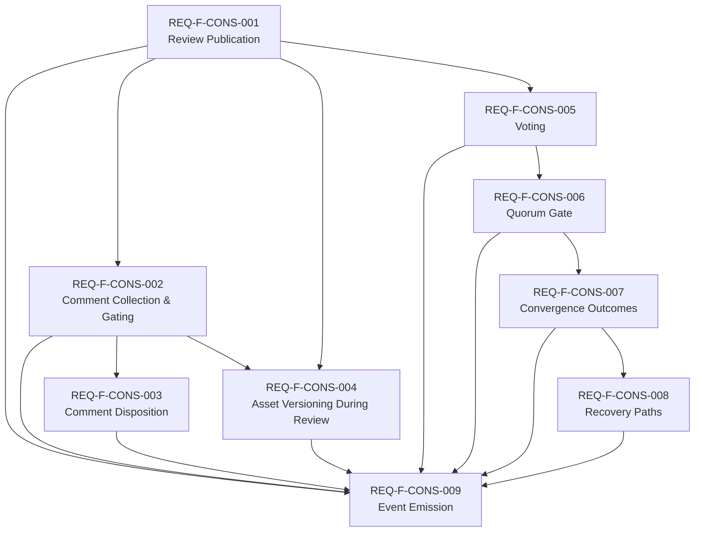

# Feature Decomposition: CONSENSUS Functor (ADR-S-025)

**Feature**: REQ-F-CONSENSUS-001
**Source**: `specification/adrs/ADR-S-025-consensus-functor.md`
**Edge**: requirements→feature_decomposition
**Date**: 2026-03-08
**Status**: Pending human approval (F_H gate)

---

## Feature Inventory

### Feature: REQ-F-CONS-001 — Review Publication

**Satisfies**: Publication lifecycle (ADR-S-025 Phase 1)

**What converges**:
- A proposer can open a CONSENSUS review window for a versioned asset
- The publication schema is validated at open time: roster non-empty, quorum config present, `review_closes_at >= published_at + min_duration` (config invariant)
- Each publication records `asset_version` — the specific version of the asset under review
- A `proposal_published` event is emitted with the full publication record

**Dependencies**: None — foundational

**MVP**: Yes — nothing else can operate without a publication

---

### Feature: REQ-F-CONS-002 — Comment Collection and Gating

**Satisfies**: Comment collection (ADR-S-025 Phase 2) + gating set partition

**What converges**:
- Participants can submit comments during the open review window
- Each comment is partitioned into `gating` (timestamp ≤ review_closes_at) or `late` (timestamp > review_closes_at)
- Gating comments require disposition before convergence; late comments are context only
- Late material comments do not auto-mutate the gate — they raise `re_open_requested` (human decision)
- A `comment_received` event is emitted per comment with `gating: true|false`

**Dependencies**: REQ-F-CONS-001 (publication must be open)

**MVP**: Yes — comment collection is essential to governance legitimacy

---

### Feature: REQ-F-CONS-003 — Comment Disposition

**Satisfies**: Comment disposition rules (ADR-S-025 Phase 2 dispositions)

**What converges**:
- Each gating comment can be dispositioned: `resolved | rejected | acknowledged | scope_change`
- Disposition requires a rationale
- `scope_change` disposition triggers a `spec_modified` event
- The system tracks which gating comments remain undispositioned

**Dependencies**: REQ-F-CONS-002 (comments must exist to be dispositioned)

**MVP**: Yes — required for the `gating_comments_dispositioned` convergence check

---

### Feature: REQ-F-CONS-004 — Asset Versioning During Review

**Satisfies**: Asset versioning during open review (ADR-S-025 Phase 2 + Phase 3)

**What converges**:
- Asset changes during an open review are tracked with `asset_version`
- Changes are classified as material or non-material (F_H decision by proposer)
- Non-material changes: existing votes remain valid
- Material changes: all prior votes are invalidated; the review resets at the new version
- An `asset_version_changed` event is emitted with the materiality classification

**Dependencies**: REQ-F-CONS-001, REQ-F-CONS-002

**MVP**: No — can defer for v1 with a simpler rule: any asset change = new review cycle. Deferral risk: approval drift is a governance failure. Recommend including if implementation cost is low; defer only if it blocks MVP delivery.

---

### Feature: REQ-F-CONS-005 — Voting

**Satisfies**: Voting schema (ADR-S-025 Phase 3)

**What converges**:
- Each rostered participant can cast one vote per open review cycle: `approve | reject | abstain`
- Votes are attached to the `asset_version` at time of casting
- Reject votes require a rationale
- Conditional approvals are supported (`approve if X is resolved before close`); resolve to `approve` if conditions met at close, `abstain` otherwise
- Non-respondents (neither voted nor abstained before close) are classified as `non_response`
- A `vote_cast` event is emitted per vote

**Dependencies**: REQ-F-CONS-001

**MVP**: Yes — voting is the core evaluation mechanism

---

### Feature: REQ-F-CONS-006 — Quorum Gate (Deterministic)

**Satisfies**: Quorum evaluation (ADR-S-025 Phase 4) — the F_D gate

**What converges**:
- Five deterministic checks evaluated at close time:
  1. `min_duration_elapsed`: current_time > published_at + min_duration
  2. `review_window_closed`: current_time > review_closes_at
  3. `participation_threshold_met`: eligible_votes / roster_size ≥ min_participation_ratio
  4. `quorum_reached`: approve_ratio satisfies threshold
  5. `gating_comments_dispositioned`: all gating comments have non-null disposition
- Approve ratio formula applied per abstention_model: `neutral` (default) or `counts_against`
- Threshold mapping: majority (>0.5), supermajority (≥0.66), unanimity (=1.0)
- Tie at exactly 0.5 with majority threshold → `consensus_failed` with reason `tie`
- All term definitions resolved: `eligible_votes`, `votes_received`, `abstain_count`, `non_response_count`, `participation_ratio`

**Dependencies**: REQ-F-CONS-001, REQ-F-CONS-005

**MVP**: Yes — quorum gate is the formal convergence criterion

---

### Feature: REQ-F-CONS-007 — Convergence Outcomes

**Satisfies**: consensus_reached and consensus_failed typed outcomes (ADR-S-025 Convergence Outcomes)

**What converges**:
- `consensus_reached`: all 5 deterministic checks pass → emit full outcome payload with vote tallies, participation ratio, and comment stats
- `consensus_failed`: any deterministic check fails → emit typed failure with `failure_reason` from: `quorum_not_reached | tie | participation_floor_not_met | window_closed_insufficient_votes | material_change_reset`
- Each failure reason maps to a distinct set of `available_paths`
- Outcomes are first-class typed events — not implicit non-convergence

**Dependencies**: REQ-F-CONS-006

**MVP**: Yes — the outcome is what the rest of the system consumes

---

### Feature: REQ-F-CONS-008 — Recovery Paths

**Satisfies**: Three recovery paths (ADR-S-025 Recovery Paths)

**What converges**:
- On `consensus_failed`, the proposer selects a recovery path: `re_open | narrow_scope | abandon`
- `re_open`: extends the review window with new min_duration; same asset_version; new CONSENSUS cycle begins
- `narrow_scope`: fold back; remove contested portions; re-publish reduced proposal at new asset_version
- `abandon`: fold back to intent; close feature with `convergence_type: consensus_failed`
- A `recovery_path_selected` event is emitted with the choice and rationale
- Homeostasis monitors detect stuck re-open patterns (repeated re-opens without roster/asset changes)

**Dependencies**: REQ-F-CONS-007

**MVP**: Yes — without recovery paths, a failed consensus is a dead end

---

### Feature: REQ-F-CONS-009 — Event Emission

**Satisfies**: OL event taxonomy (ADR-S-025 Event Taxonomy)

**What converges**:
- All 7 CONSENSUS event types are emitted correctly to the OL event log:
  - `proposal_published` — Phase 1 open
  - `comment_received` — per comment (gating flag)
  - `vote_cast` — per vote (with asset_version)
  - `asset_version_changed` — on any asset change during review (with materiality)
  - `consensus_reached` — full payload
  - `consensus_failed` — typed with failure_reason
  - `recovery_path_selected` — with path and rationale
- All events are append-only and carry required OL fields (event_type, timestamp, project, feature, edge)

**Dependencies**: REQ-F-CONS-001 through REQ-F-CONS-008 (emit at each phase)

**MVP**: Yes — observability is constitutive; without events, CONSENSUS is unmonitorable

---

## Dependency Graph

---

## Build Order

Topological sort of the dependency DAG:

1. **REQ-F-CONS-001** — Review Publication *(no dependencies — build first)*
2. **REQ-F-CONS-002** — Comment Collection and Gating *(depends on 001)*
3. **REQ-F-CONS-005** — Voting *(depends on 001 — parallel with 002)*
4. **REQ-F-CONS-003** — Comment Disposition *(depends on 002)*
5. **REQ-F-CONS-006** — Quorum Gate *(depends on 001, 005)*
6. **REQ-F-CONS-004** — Asset Versioning During Review *(depends on 001, 002 — can build in parallel with 003 and 006)*
7. **REQ-F-CONS-007** — Convergence Outcomes *(depends on 006)*
8. **REQ-F-CONS-008** — Recovery Paths *(depends on 007)*
9. **REQ-F-CONS-009** — Event Emission *(integrates across all; threads through as each phase is built)*

**Parallel opportunities**:
- CONS-002 and CONS-005 can be built concurrently (both depend only on CONS-001)
- CONS-003 and CONS-006 can be built concurrently (independent of each other)
- CONS-004 can be built in parallel with CONS-003 and CONS-006
- CONS-009 is integrated incrementally as each feature converges — not a final gate

---

## MVP Scope

**SOURCE_GAP flagged**: ADR-S-025 contains no explicit priority ordering. MVP scope determination is an F_H decision.

**Proposed MVP** (for human approval):

MVP = CONS-001 + CONS-002 + CONS-003 + CONS-005 + CONS-006 + CONS-007 + CONS-008 + CONS-009

All features except REQ-F-CONS-004 (Asset Versioning During Review).

**Rationale**:
- CONS-001 through CONS-003: publication + comments + disposition is the minimum viable governance loop
- CONS-005: voting without asset versioning is still valid governance for a v1 where the asset is frozen at publication
- CONS-006 + CONS-007: quorum gate and typed outcomes are non-negotiable — without them CONSENSUS has no convergence semantics
- CONS-008: recovery paths are non-negotiable — without them a failed consensus is a dead end
- CONS-009: event emission is constitutive — unmonitorable CONSENSUS is a spec violation

**Deferred**:

| Feature | Rationale |
|---------|-----------|
| REQ-F-CONS-004 — Asset Versioning During Review | Can be approximated in v1 with a simpler rule: any asset change during an open review requires explicit proposer action (re-publish = new CONS cycle). The full materiality-classification + vote-preservation mechanism is valuable but not required for the governance semantics to be sound. Spike recommended before design to assess implementation cost. |

**MVP risk**: Without CONS-004, a proposer who makes a material change to the asset under review without re-publishing creates approval drift. This is a governance gap. Implementations should document this limitation clearly in v1.

---

## REQ Key Coverage

| REQ Key | Feature |
|---------|---------|
| ADR-S-025 §Phase 1 — Publication schema | REQ-F-CONS-001 |
| ADR-S-025 §Phase 1 — Config invariant | REQ-F-CONS-001 |
| ADR-S-025 §Phase 1 — asset_version | REQ-F-CONS-001, REQ-F-CONS-004 |
| ADR-S-025 §Phase 2 — Gating comment set partition | REQ-F-CONS-002 |
| ADR-S-025 §Phase 2 — Late comment handling | REQ-F-CONS-002 |
| ADR-S-025 §Phase 2 — Comment disposition rules | REQ-F-CONS-003 |
| ADR-S-025 §Phase 2 — Material vs non-material change | REQ-F-CONS-004 |
| ADR-S-025 §Phase 2 — Vote validity across versions | REQ-F-CONS-004 |
| ADR-S-025 §Phase 3 — Vote schema | REQ-F-CONS-005 |
| ADR-S-025 §Phase 3 — Non-response classification | REQ-F-CONS-005 |
| ADR-S-025 §Phase 3 — Conditional approvals | REQ-F-CONS-005 |
| ADR-S-025 §Phase 4 — 5 deterministic checks | REQ-F-CONS-006 |
| ADR-S-025 §Phase 4 — Quorum formula (neutral / counts_against) | REQ-F-CONS-006 |
| ADR-S-025 §Phase 4 — Participation floor | REQ-F-CONS-006 |
| ADR-S-025 §Phase 4 — Tie semantics | REQ-F-CONS-006 |
| ADR-S-025 §Outcomes — consensus_reached payload | REQ-F-CONS-007 |
| ADR-S-025 §Outcomes — consensus_failed typed with failure_reason | REQ-F-CONS-007 |
| ADR-S-025 §Outcomes — available_paths | REQ-F-CONS-007 |
| ADR-S-025 §Recovery — re_open | REQ-F-CONS-008 |
| ADR-S-025 §Recovery — narrow_scope | REQ-F-CONS-008 |
| ADR-S-025 §Recovery — abandon | REQ-F-CONS-008 |
| ADR-S-025 §Recovery — stuck re-open detection | REQ-F-CONS-008 |
| ADR-S-025 §Events — proposal_published | REQ-F-CONS-009 |
| ADR-S-025 §Events — comment_received | REQ-F-CONS-009 |
| ADR-S-025 §Events — vote_cast | REQ-F-CONS-009 |
| ADR-S-025 §Events — asset_version_changed | REQ-F-CONS-009 |
| ADR-S-025 §Events — consensus_reached | REQ-F-CONS-009 |
| ADR-S-025 §Events — consensus_failed | REQ-F-CONS-009 |
| ADR-S-025 §Events — recovery_path_selected | REQ-F-CONS-009 |

---

## Risk Assessment

| Feature | Risk | Mitigation |
|---------|------|-----------|
| REQ-F-CONS-004 — Asset Versioning | Medium — materiality classification is an F_H decision; ambiguous in practice | Spike: define concrete materiality heuristics before design |
| REQ-F-CONS-006 — Quorum Gate | Low — fully deterministic; formulas are explicit in ADR | None needed |
| REQ-F-CONS-008 — Recovery Paths | Low-Medium — re_open stuck-delta detection requires homeostasis monitors to be in place | Ensure homeostasis loop is active before CONSENSUS is deployed at governance edges |
| REQ-F-CONS-002 — Gating Set Partition | Low — clear rule (timestamp ≤ review_closes_at) | Timestamp precision: implementations must agree on timezone handling |

---

## Source Findings

| Finding | Classification | Disposition |
|---------|---------------|-------------|
| ADR-S-025 has no explicit priority ordering for features | SOURCE_GAP | Flagged — MVP scope requires F_H decision (see §MVP Scope above) |
| `asset_version` definition depends on implementation's versioning scheme | SOURCE_AMBIGUITY | Acknowledged — design edge will resolve per tenant (semver vs content hash) |
| Materiality classification of asset changes is an F_H judgment | SOURCE_AMBIGUITY | Acknowledged — design edge will document heuristics; design will propose defaults |
| Stuck re-open detection requires a homeostasis monitor | SOURCE_DEPENDENCY | Acknowledged — dependency on interoception infrastructure (REQ-SENSE-* cluster) |
