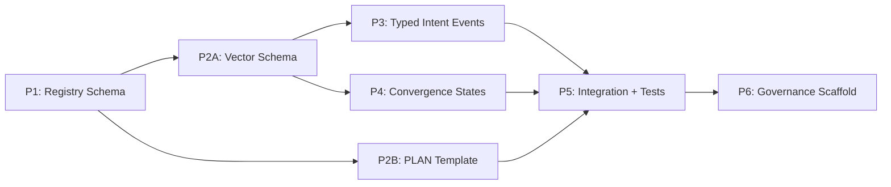

# Design Recommendations: REQ-F-NAMEDCOMP-001
# Named Composition Library and Intent Vector Envelope

**Feature**: REQ-F-NAMEDCOMP-001
**Source**: NAMEDCOMP_FEATURE_DECOMPOSITION.md + ADR-S-026
**Edge**: design_recommendations
**Status**: Converged — iteration 1
**Produced by**: gen-iterate --edge "feature_decomposition→design_recommendations" --feature REQ-F-NAMEDCOMP-001
**F_H gate**: Passed (human reviewed 2026-03-08)

---

## Design Phase Structure

Six phases with two parallel opportunities. Critical path: P1 → P2A → P3 → P4 → P5 → P6.



P2A ‖ P2B (both depend on P1, no inter-dependency).
P3 ‖ P4 (both depend on P2A, no inter-dependency).
P6 is deferred (blocked on REQ-F-CONSENSUS-001 code).

---

## Phase 1: Named Composition Registry (NC-001)

**New file**: `imp_claude/code/.claude-plugin/plugins/genesis/config/named_compositions.yml`

This is the Level 3 macro library. Its schema must be stable before anything else references it.

### Registry schema

```yaml
# named_compositions.yml
version: "1.0"
scope: library  # library | project-local

compositions:
  - name: PLAN
    version: v1
    scope: library
    governance: consensus  # consensus | review
    description: "Work-program planning for planning-heavy asset transitions"
    parameters:
      - name: source_asset
        type: AssetType
        required: true
      - name: unit_type
        type: string
        required: true
        description: "decomposition unit — capability | feature | module | risk_area"
      - name: criteria
        type: "string | string[]"
        required: true
        description: "evaluation criteria — user_value | mvp_value | arch_stability | risk_reduction_value"
    output_type: work_order
    body:
      - functor: BROADCAST
        args: {source: source_asset, decompose_fn: unit_type}
      - functor: iterate
        args: {target: each_unit, evaluators: criteria}
      - functor: FOLD
        args: {items: units, merge_fn: dep_dag_builder}
    internal_events:
      - plan_decomposed
      - plan_evaluated
      - plan_ordered
      - plan_ranked

  - name: POC
    version: v1
    scope: library
    governance: review
    description: "Proof-of-concept: risk-bounded exploration converging on learning not delivery"
    parameters:
      - name: intent
        type: AssetType
        required: true
      - name: risk_areas
        type: "string[]"
        required: true
      - name: time_box
        type: duration
        required: false
        default: "2h"
    output_type: poc_report
    body:
      - functor: PLAN
        args: {source: intent, unit_type: risk_area, criteria: risk_reduction_value}
      - functor: BUILD
        args: {primary: spike_code, secondary: spike_tests}
      - functor: DISCOVERY
        args: {input: findings, convergence: question_answered, time_box: time_box}
    output_schema:
      fields: [question, findings, risk_disposition]
      risk_disposition_values: [resolved, remains, new_risk_identified]

  - name: SCHEMA_DISCOVERY
    version: v1
    scope: library
    governance: review
    description: "Infer a schema document from a raw dataset via stratified sampling"
    parameters:
      - name: dataset
        type: "path | uri"
        required: true
      - name: notebook_env
        type: "uri"
        required: true
        description: "execution environment for exploratory iteration"
      - name: evaluation_criteria
        type: "string[]"
        required: false
        default: [completeness, fitness_for_use]
    output_type: schema_document
    body:
      - functor: BROADCAST
        args: {source: dataset, sample_fn: stratified_sample}
      - functor: iterate
        args: {target: each_sample, evaluators: [structure_detect, type_infer, null_rate, cardinality]}
      - functor: FOLD
        args: {items: sample_schemas, merge_fn: schema_unifier}
      - functor: REVIEW
        args: {input: unified_schema, evaluator: F_H, criteria: evaluation_criteria}

  - name: DATA_DISCOVERY
    version: v1
    scope: library
    governance: consensus
    description: "Map an unknown data domain across multiple sources"
    parameters:
      - name: data_sources
        type: "path[] | uri[]"
        required: true
      - name: question
        type: string
        required: true
      - name: time_box
        type: duration
        required: false
        default: "4h"
    output_type: data_landscape
    body:
      - functor: BROADCAST
        args: {source: data_sources, explore_fn: data_source}
      - functor: SCHEMA_DISCOVERY
        args: {dataset: each_source}
      - functor: FOLD
        args: {items: source_schemas, merge_fn: relationship_mapper}
      - functor: DISCOVERY
        args: {input: relationship_map, convergence: question_answered}
    output_schema:
      fields: [sources, schemas, relationships, gaps, open_questions]

gap_type_dispatch:
  missing_schema:
    macro: SCHEMA_DISCOVERY
    version: v1
    default_bindings: {}
  missing_requirements:
    macro: PLAN
    version: v1
    default_bindings: {unit_type: capability, criteria: user_value}
  missing_design:
    macro: PLAN
    version: v1
    default_bindings: {unit_type: feature, criteria: mvp_value}
  unknown_risk:
    macro: POC
    version: v1
    default_bindings: {}
  unknown_domain:
    macro: DATA_DISCOVERY
    version: v1
    default_bindings: {}
  spec_drift:
    macro: EVOLVE
    version: v1
    default_bindings: {}
  missing_consensus:
    macro: CONSENSUS
    version: v1
    default_bindings: {}
```

### Project-local shadow rule

`.ai-workspace/named_compositions/` directory contains project-local composition files. At load time, the registry merges: project-local entries shadow library entries by `{name, version}`. Shadowing is logged as an `intent_raised` event with `source_kind: gap_observation` and `gap_type: local_composition_shadow` to make overrides auditable.

### Design decisions

| Decision | Choice | Rationale |
|----------|--------|-----------|
| Registry format | YAML | Consistent with graph_topology.yml and edge_params; human-readable; already parsed by config_loader |
| Library location | `config/named_compositions.yml` | Alongside graph_topology.yml — same configuration tier |
| Project-local location | `.ai-workspace/named_compositions/` | Separate from config; workspace state that can evolve per project |
| Body representation | Functor sequence (list of {functor, args}) | Inspectable without expansion; enough for dispatch and documentation; not a full AST |
| Expansion at runtime | Deferred | MVP delivers registry as lookup; compilation contract (OQ-1) is a Phase 2 concern |
| Composition versioning | Semantic string (v1, v2) | Simple; matches ADR-S-026 expression format |

---

## Phase 2A: Intent Vector Schema Extension (NC-002)

**Modified file**: `config/feature_vector_template.yml`

New fields added to the `feature_vector` schema section, all optional with defaults:

```yaml
# New fields in feature_vector_template.yml

# Source of this intent vector (ADR-S-026 §4.2)
source_kind: parent_spawn  # default; abiogenesis for project root vector; gap_observation for gap-generated
trigger_event: null         # event reference or null; always null if source_kind is abiogenesis

# What this vector is trying to produce (ADR-S-026 §4.4)
target_asset_type: null     # AssetType string; populated by gen-spawn or gen-init

# Terminal tracking (ADR-S-026 §4.5)
produced_asset_ref: null    # path | artifact_id; null while iterating; populated on convergence
disposition: null           # null (active) | converged | blocked_accepted | blocked_deferred | abandoned
disposition_rationale: null # required when disposition is non-null and non-converged
```

**Migration behaviour**: The config_loader's `load_feature_vector()` function applies defaults for missing fields at read time. No migration script. Existing vectors parse correctly.

**gen-spawn updates**: New CLI flags:
- `--source-kind {abiogenesis|gap_observation|parent_spawn}` — defaults to `parent_spawn`
- `--trigger-event {event_ref}` — optional; null if omitted
- `--target-asset-type {AssetType}` — optional; derived from edge if omitted

**gen-iterate convergence handler updates**: On `edge_converged` event emission, set:
- `produced_asset_ref` → path of the stable output asset
- `disposition` → `converged`

**gen-status --health new check**: `produced_asset_ref_on_convergence` — any vector with `status: converged` AND `produced_asset_ref: null` is a FAIL with message: "Convergence claimed without produced asset reference — traceability chain broken."

---

## Phase 2B: PLAN Edge Parameter Template (NC-005)

**New file**: `config/named_compositions/plan.yml`

This is the shared edge parameter template that `requirements_feature_decomp.yml` and `feature_decomp_design_rec.yml` extend. It implements the PLAN composition's evaluator sequence at the edge_params level.

```yaml
# config/named_compositions/plan.yml
# Shared PLAN edge parameter template — do not reference directly in graph_topology
# Import via: extends: named_compositions/plan.yml

_template: true
_name: PLAN
_version: v1

description: "Reusable template for planning-heavy asset transitions (decompose → evaluate → order → rank)"

convergence_criteria:
  - check: work_order_produced
    type: deterministic
    description: "Output asset is a work_order with populated units, dep_dag, and build_order"
    required: true
  - check: units_evaluated
    type: deterministic
    description: "Each unit has at least one evaluation result"
    required: true
  - check: dep_dag_acyclic
    type: deterministic
    description: "Dependency DAG contains no cycles"
    required: true
  - check: ranked_units_present
    type: deterministic
    description: "ranked_units list is non-empty and ordered"
    required: true
  - check: deferred_units_documented
    type: deterministic
    description: "Any deferred_units have explicit rationale"
    required: true
  - check: work_order_coherence
    type: agent
    description: "Units are coherent with source asset intent; no scope creep; no missing coverage"
    required: true
  - check: human_approval
    type: human
    description: "Human reviews and approves the work order before CONSTRUCT phase begins"
    required: true

internal_events:
  - event: plan_decomposed
    when: after BROADCAST — units list produced
    payload: {unit_count: int, source_asset_hash: string}
  - event: plan_evaluated
    when: after iterate — each unit has evaluation results
    payload: {units_evaluated: int, units_deferred: int}
  - event: plan_ordered
    when: after dep_dag construction — build order established
    payload: {dep_dag_edges: int, critical_path_length: int}
  - event: plan_ranked
    when: after ranking — work_order finalized
    payload: {ranked_count: int, deferred_count: int}

output_type: work_order
output_schema:
  required_fields: [units, dep_dag, build_order, ranked_units]
  optional_fields: [deferred_units, deferred_rationale]
```

**Using the template** (`requirements_feature_decomp.yml`):

```yaml
# requirements_feature_decomp.yml (updated)
extends: named_compositions/plan.yml
edge: requirements → feature_decomposition
bindings:
  unit_type: capability
  criteria: user_value
  human_approval_prompt: "Review the capability decomposition and dependency DAG. Approve the work order?"

# Edge-specific additional checks (added to base template checks)
additional_checks:
  - check: req_key_coverage
    type: deterministic
    description: "All REQ keys in source requirements appear in at least one unit"
    required: true
  - check: mvp_scope_marked
    type: human
    description: "MVP scope explicitly marked in work_order"
    required: true
```

**Validation contract**: `test_plan_template.py` asserts that after template expansion, both `requirements_feature_decomp.yml` and `feature_decomp_design_rec.yml` share identical base checklist items and differ only in their `bindings` and `additional_checks` sections.

---

## Phase 3: Typed gap.intent Output (NC-003)

**Modified files**:
- `config/intentengine_config.yml` — new `gap_type_dispatch` section (references `named_compositions.yml`)
- `config/affect_triage.yml` — `intent_raised` output schema extended
- `agents/gen-dev-observer.md`, `agents/gen-cicd-observer.md`, `agents/gen-ops-observer.md` — intent_raised emission templates
- `commands/gen-gaps.md` — §6b cluster intents now include composition field
- `commands/gen-iterate.md` — stuck-delta intent path includes composition resolution

### intent_raised event schema (extended)

```json
{
  "event_type": "intent_raised",
  "timestamp": "...",
  "project": "...",
  "data": {
    "intent_id": "INT-*",
    "trigger": "...",
    "delta": "...",
    "signal_source": "gap | test_failure | refactoring | source_finding",
    "gap_type": "missing_schema | missing_requirements | unknown_risk | ...",
    "composition": {
      "macro": "SCHEMA_DISCOVERY",
      "version": "v1",
      "bindings": {
        "dataset": "data/raw/transactions.parquet"
      }
    },
    "composition_resolution": "resolved | unresolvable | no_dispatch_entry",
    "composition_rationale": "human-readable description of what the composition will do",
    "vector_type": "feature | discovery | spike | poc | hotfix",
    "affected_req_keys": ["REQ-*"],
    "severity": "high | medium | low"
  }
}
```

When `gap_type` has no entry in the dispatch table, `composition: null` and `composition_resolution: no_dispatch_entry`. This is observable but not blocking — implementations may have gap types that predate the dispatch table.

### intentengine_config.yml extension

```yaml
# intentengine_config.yml — new section
gap_type_dispatch:
  source: config/named_compositions.yml  # reference to registry
  fallback: null_with_warning             # if gap_type not found: emit null composition + warning
  resolution_event: composition_resolved  # optional observability event on successful resolution
```

### Observer agent update pattern (applied to all three observers)

Each observer's `intent_raised` emission template gains two new lines:
```markdown
- Resolve `gap_type` against `config/named_compositions.yml` gap_type_dispatch table
- Set `composition` field: resolved macro/version/bindings; or null with `composition_resolution: no_dispatch_entry`
```

---

## Phase 4: Project Convergence States (NC-004)

**Modified files**:
- `commands/gen-status.md` — algorithm extended with three-state computation
- `commands/gen-status.md` — STATUS.md output format updated

### Three-state algorithm

```
read all feature vectors from .ai-workspace/features/active/ and completed/

iterating_count   = count(v for v in vectors if v.status == "iterating")
required_vectors  = [v for v in vectors if v.disposition not in ("blocked_deferred", "abandoned")]
converged_count   = count(v for v in required_vectors if v.status == "converged")
blocked_no_disp   = count(v for v in vectors if v.status == "blocked" and v.disposition is null)

if iterating_count > 0:
    project_state = ITERATING
elif converged_count == len(required_vectors):
    project_state = CONVERGED          # all required vectors have converged
elif blocked_no_disp > 0:
    project_state = QUIESCENT          # nothing iterating but blocked vectors lack disposition
else:
    project_state = BOUNDED            # quiescent + all blocked explicitly dispositioned
```

### STATUS.md project state section

```markdown
## Project State

**State**: ITERATING | QUIESCENT | CONVERGED | BOUNDED

| State | Count |
|-------|-------|
| Iterating  | {n} vectors |
| Converged  | {n}/{total_required} required vectors |
| Blocked (with disposition) | {n} vectors |
| Blocked (no disposition) | {n} vectors ← needs explicit disposition for BOUNDED |
```

### Health check additions

Two new checks in gen-status --health:
1. `project_state_consistency` — FAIL if any vector claims `status: converged` with `produced_asset_ref: null`
2. `blocked_disposition_completeness` — WARN if any vector has `status: blocked` with `disposition: null` and project claims BOUNDED state

---

## Phase 5: Integration and Test Layer (all NC sub-features)

### New test files

| File | Tests | What it covers |
|------|-------|----------------|
| `test_named_compositions_registry.py` | ~20 | Schema validation; dispatch table resolution; shadow rule; project-local override |
| `test_intent_vector_schema.py` | ~25 | New fields parse correctly; defaults apply; gen-spawn flag handling; convergence handler sets produced_asset_ref |
| `test_typed_intent_raised.py` | ~20 | intent_raised events include composition field; unresolvable gap types emit null; observer agent output format |
| `test_project_convergence_states.py` | ~18 | Three-state algorithm across all vector combinations; health checks fire correctly |
| `test_plan_template.py` | ~12 | Template expansion; base checklist identical across two edge params; binding override correct |

Total: ~95 new tests.

### Integration surface

The primary integration point is `config_loader.py` — it already handles YAML loading and $variable resolution. The named_compositions.yml extends this:
- `load_named_compositions()` — loads library file + project-local directory; applies shadow rule; returns merged registry
- `resolve_composition(gap_type, bindings={})` — looks up dispatch table; merges caller bindings over defaults; returns composition expression or None
- `validate_feature_vector(vector_dict)` — extended to check new fields; applies defaults for missing optional fields

---

## Phase 6: Composition Governance Scaffold (NC-006 — Deferred)

**Blocked on**: REQ-F-CONSENSUS-001 reaching `|code⟩` convergence.

**Design when unblocked**:
- `gen-init` creates `.ai-workspace/named_compositions/README.md` explaining shadow/governance rules
- New edge in `graph_topology.yml`: `intent → composition_review` (for project-local additions via REVIEW gate)
- New edge: `intent → composition_consensus` (for library-level promotions via CONSENSUS gate — invokes REQ-F-CONSENSUS-001 implementation)
- gen-iterate handles the `composition_review` edge using REVIEW functor; `composition_consensus` edge using CONSENSUS functor
- On consensus_reached: composition entry promoted from `.ai-workspace/named_compositions/` to `config/named_compositions.yml` via a spec_modified event

---

## Cross-Cutting Concerns

### 1. Config loader extension

All new configuration (named_compositions.yml, plan.yml template) goes through `config_loader.py`. The loader needs:
- `load_named_compositions()` — loads + merges library and project-local
- `resolve_composition(gap_type, extra_bindings)` — dispatch table lookup
- `expand_edge_params(edge_file)` — resolves `extends:` references (already partly exists; needs named_compositions/ directory support)
- `validate_feature_vector(v)` — new field defaults and convergence consistency check

### 2. Event schema versioning

The `intent_raised` event gains a `composition` field. Events without this field (pre-ADR-S-026) parse correctly — the field is optional in the schema. `test_integration_uat.py` event normalization handles both formats (with and without `composition`).

### 3. Backward compatibility guarantee

All new feature vector fields are optional. A workspace with pre-ADR-S-026 vectors works without modification. Defaults:
- `source_kind` → `parent_spawn`
- `trigger_event` → null
- `target_asset_type` → null (health check warns but does not fail)
- `produced_asset_ref` → null (health check FAILS only if status is also `converged`)
- `disposition` → null

### 4. Observability

Each new config component emits its own health event on load:
- `named_compositions_loaded` — on `load_named_compositions()` success; includes library_count and project_local_count
- `composition_resolved` — on successful dispatch table lookup (optional, config-gated)
- `composition_resolution_failed` — on dispatch failure; always emitted; includes gap_type and available_macros list

### 5. ADR areas (per-tenant decisions)

| Area | Notes |
|------|-------|
| Body representation format | YAML functor list (as above) vs JSON Schema vs AST — choose YAML list for MVP |
| Compilation strategy | Deferred entirely to NC-006+ — MVP is registry only |
| Project-local storage | `.ai-workspace/named_compositions/` per above; or a single `project_compositions.yml` file |
| Shadow rule auditing | Log as intent_raised (recommended) vs separate audit event vs stderr warning |
| Template `extends` resolution | At load time (recommended — eager) vs at run time (lazy) |

---

## Critical Path Summary

| Phase | NC Sub-features | Deliverable | Gate |
|-------|----------------|-------------|------|
| P1 | NC-001 | `named_compositions.yml` with 4 macros + dispatch table | F_D schema validation |
| P2A ‖ P2B | NC-002 + NC-005 | Extended feature_vector_template + plan.yml template | F_D tests |
| P3 ‖ P4 | NC-003 + NC-004 | Typed intent_raised + convergence states in gen-status | F_D tests + F_H review |
| P5 | Integration | ~95 tests passing | F_D full suite |
| P6 | NC-006 | Governance scaffold | Blocked on CONS-009 |

**Minimum to claim ADR-S-026 implemented**: P1 through P4 converged (NC-001 through NC-005). P5 integration tests passing. NC-006 explicitly deferred with documented dependency.
