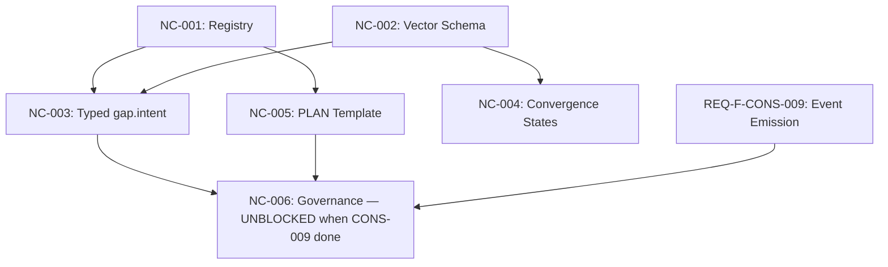

# Feature Decomposition: REQ-F-NAMEDCOMP-001
# Named Composition Library and Intent Vector Envelope

**Feature**: REQ-F-NAMEDCOMP-001
**Source**: ADR-S-026 (Named Compositions and Intent Vectors — ratified 2026-03-08)
**Edge**: feature_decomposition
**Status**: Converged — iteration 1
**Produced by**: gen-iterate --edge "requirements→feature_decomposition" --feature REQ-F-NAMEDCOMP-001
**F_H gate**: Passed (human reviewed 2026-03-08)

---

## Source Findings (Backward Gap Analysis)

ADR-S-026 defines the *what* cleanly. The implementation gaps are:

1. **Registry location and format**: ADR-S-026 says the composition library is "implementation-defined per tenant" — we need a concrete location decision for the Claude implementation before anything else can build against it.
2. **Expansion contract**: ADR-S-026 §OQ-1 defers the Level 3 → Level 5 compilation contract. MVP does not need a full compiler, but needs a registry that at minimum makes macros discoverable and parameterisable.
3. **Migration path for existing feature vectors**: The new tuple fields (source_kind, trigger_event, etc.) must not break existing workspace state.
4. **PLAN template scope**: ADR-S-026 says "introduce a shared `plan.yml` template behind existing nodes; prove the schema before unifying." This is explicitly scoped to shared template, not topology collapse.
5. **Governance sequencing**: ADR-S-026 §2.3 requires CONSENSUS gate for library-level additions. REQ-F-CONSENSUS-001 must be code-complete before this gate is operational. NC-006 is therefore dependent on that feature.

---

## Sub-Feature Decomposition

### REQ-F-NC-001: Named Composition Registry

**What it is**: A YAML-based registry file defining the named composition library — versioned macro entries with parameter schemas, functor-sequence bodies, output types, and a gap_type → macro dispatch table.

**Satisfies**: ADR-S-026 §2 (Named Compositions), §3 (dispatch table), OQ-3 (scope precedence)

**What converges**:
- `config/named_compositions.yml` — library-level registry with versioned entries for PLAN, POC, SCHEMA_DISCOVERY, DATA_DISCOVERY
- Entry schema: `{name, version, scope, parameters[], body: functor_sequence, output_type, governance}`
- Gap type dispatch table: `{gap_type → {macro, version, default_bindings}}`
- Project-local override convention: `.ai-workspace/named_compositions/` directory; local entries shadow library entries (ADR-S-026 §OQ-3: local always shadows library)
- gen-init updated to create `.ai-workspace/named_compositions/` as part of workspace scaffold

**Dependencies**: None — this is the foundation for all other NC sub-features.

**Scope note**: The registry is a lookup table and governance record, not a compiler. Macro expansion (Level 3 → Level 5 graph fragment) is deferred to a future feature (NC-006 or beyond). MVP requires the registry to be queryable and validatable; it does not require runtime expansion.

---

### REQ-F-NC-002: Intent Vector Schema Extension

**What it is**: Extension of the feature vector template and workspace tracking schema to support the full ADR-S-026 intent vector tuple.

**Satisfies**: ADR-S-026 §4 (intent vector tuple), §4.2 (three source_kinds), §4.5 (produced_asset_ref and disposition)

**What converges**:
- `config/feature_vector_template.yml` updated with new optional fields:
  - `source_kind: abiogenesis | gap_observation | parent_spawn` (default: `parent_spawn` for manually created vectors, `abiogenesis` for project root vector)
  - `trigger_event: {event_reference | null}` (null if source_kind is abiogenesis)
  - `target_asset_type: {AssetType}` (the asset this vector is trying to produce)
  - `produced_asset_ref: {path | null}` (null while iterating; populated on convergence)
  - `disposition: {null | converged | blocked_accepted | blocked_deferred | abandoned}` (null while active)
- Migration rule: existing workspace feature vectors without new fields parse without error; defaults applied at read time
- gen-spawn command updated: accepts `--source-kind`, `--trigger-event`, `--target-asset-type` flags; populates new fields when creating child vectors
- gen-iterate convergence handler: sets `produced_asset_ref` and `disposition: converged` in feature vector on convergence
- Validation: a feature vector claiming `status: converged` with `produced_asset_ref: null` is flagged as invalid in gen-status --health

**Dependencies**: None — schema change is standalone, but NC-003 and NC-004 consume the new fields.

---

### REQ-F-NC-003: Typed gap.intent Output

**What it is**: Replace free-text findings in `intent_raised` events with typed composition expressions drawn from the named composition registry. Close the IntentEngine output type contract as specified in ADR-S-026 §3.

**Satisfies**: ADR-S-026 §3 (typed gap.intent), Bootloader §VIII annotation (2026-03-08), AI_SDLC_ASSET_GRAPH_MODEL §4.6.3 annotation

**What converges**:
- `intentengine_config.yml` extended: new `gap_type_dispatch` section references `named_compositions.yml` entries; maps each `gap_type` to `{macro, version, default_bindings}`
- `intent_raised` event schema gains `composition` field: `{macro: string, version: string, bindings: {param: value, ...}}`; prior `description` field becomes `composition_rationale` (preserved for human readability alongside the typed expression)
- gen-gaps §6b: cluster intents emitted now include `composition` field resolved from dispatch table; unresolvable gap types emit `composition: null` with a warning flag
- gen-iterate stuck-delta path: before emitting `intent_raised`, resolves macro from dispatch table; logs `composition_resolution_failed` if gap type has no dispatch entry
- Observer agents (gen-dev-observer, gen-cicd-observer, gen-ops-observer): updated intent_raised emission templates to include `composition` field; each observer maps its signal types to gap_types and then to macros
- Test: `test_intent_raised_composition.py` — for each observer signal type, assert that the emitted intent_raised event carries a non-null `composition` field when a dispatch entry exists

**Dependencies**: NC-001 (registry must exist before dispatch table resolution)

**Scope note**: The ADR's execution contract caveat applies — a typed expression is not zero-interpretation until a runtime macro expander exists. This feature delivers the schema and dispatch resolution; runtime expansion is NC-005+.

---

### REQ-F-NC-004: Project Convergence States

**What it is**: Implement ADR-S-026 §5 convergence vocabulary (quiescent/converged/bounded) in gen-status and STATUS.md. Replace the informal "all converged or blocked" terminal check with three precise, non-interchangeable states.

**Satisfies**: ADR-S-026 §5 (project convergence vocabulary)

**What converges**:
- gen-status algorithm updated with three-state computation:
  - `project_quiescent`: no vector has `status: iterating`
  - `project_converged`: project_quiescent AND all required vectors have `status: converged` (required = not deferred/abandoned)
  - `project_bounded`: project_quiescent AND all blocked vectors have `disposition` in `{blocked_accepted, blocked_deferred, abandoned}` with non-null rationale
- gen-status default view: "Project State" header above the "You Are Here" section shows one of: `ITERATING | QUIESCENT | CONVERGED | BOUNDED` with a one-line explanation
- STATUS.md: new "Project State" section before the Gantt chart, updated on every gen-status --gantt run
- gen-status --health: new check — any vector with `status: blocked` and `disposition: null` triggers a warning: "blocked vector without explicit disposition — project cannot claim bounded state"
- The existing "all features converged" summary count is retained as a detail under the new primary state indicator

**Dependencies**: NC-002 (needs `disposition` field in feature vector schema)

---

### REQ-F-NC-005: PLAN Edge Parameter Template

**What it is**: A shared `plan.yml` edge parameter template implementing the PLAN composition's evaluator sequence, to be referenced by `requirements_feature_decomp.yml` and `feature_decomp_design_rec.yml`. This proves the common schema without collapsing the graph topology (as specified in ADR-S-026 §1 and Codex Finding 6).

**Satisfies**: ADR-S-026 §2.2 (PLAN composition), Codex Finding — "start with a shared plan.yml template behind existing nodes first"

**What converges**:
- `config/named_compositions/plan.yml` — edge parameter template containing the evaluator sequence for PLAN: decompose/evaluate/order/rank phases, internal subphase events (`plan_decomposed`, `plan_evaluated`, `plan_ordered`, `plan_ranked`), convergence criteria (work_order produced with dep_dag, ranked_units, deferred_units), output Markov criteria
- `requirements_feature_decomp.yml` updated to `extends: named_compositions/plan.yml` with its own parameter bindings (`unit_type: capability`, `criteria: user_value`)
- `feature_decomp_design_rec.yml` updated similarly (`unit_type: feature`, `criteria: mvp_value`)
- Validation test: `test_plan_template.py` — assert that after template expansion, both edge param files produce equivalent evaluator checklists (same checks, same structure, different bindings)
- Explicit non-goal: `graph_topology.yml` nodes `feature_decomposition` and `design_recommendations` remain as separate nodes. Topology collapse is deferred until the shared template has been validated across at least two production edge traversals.

**Dependencies**: NC-001 (template lives in named_compositions directory, follows registry conventions)

---

### REQ-F-NC-006: Composition Governance Scaffolding (Deferred)

**What it is**: The operational governance pathway for adding named compositions to the library — project-local via REVIEW gate, library-level via CONSENSUS gate (per ADR-S-026 §2.3).

**Satisfies**: ADR-S-026 §2.3 (governance table)

**Why deferred**: Requires REQ-F-CONSENSUS-001 to be code-complete. The CONSENSUS functor (ADR-S-025) must be operational before the CONSENSUS gate path can be wired into the composition governance workflow. NC-006 unblocks automatically once CONS-007 and CONS-009 converge.

**What converges (when unblocked)**:
- gen-init: creates `.ai-workspace/named_compositions/` with `README.md` explaining shadow/governance rules
- gen-iterate on the `add_named_composition` edge (new): runs REVIEW gate for project-local; invokes CONSENSUS gate (referencing REQ-F-CONSENSUS-001 implementation) for library-level promotions
- Composition versioning: automated version bump on approved changes

**Dependencies**: NC-001, NC-005, REQ-F-CONSENSUS-001.|code⟩

---

## Dependency DAG

---

## Build Order

| Step | Sub-features | Parallelism |
|------|-------------|-------------|
| 1 | NC-001, NC-002 | Parallel — no deps between them |
| 2 | NC-003, NC-004, NC-005 | Parallel — all depend on step 1 results |
| 3 | NC-006 | After NC-003 + NC-005 + REQ-F-CONS-009 |

---

## MVP Scope

| Sub-feature | MVP | Rationale |
|-------------|-----|-----------|
| NC-001 Registry | YES | Foundation — nothing else builds without it |
| NC-002 Schema Extension | YES | Traceability — produced_asset_ref validates convergence claims |
| NC-003 Typed gap.intent | YES | Closes the IntentEngine loop — the primary ADR-S-026 commitment |
| NC-004 Convergence States | YES | Observability — distinguishes quiescent/converged/bounded in STATUS.md |
| NC-005 PLAN Template | YES (scoped) | Proves the shared schema; no topology change |
| NC-006 Governance | DEFERRED | Blocked on REQ-F-CONSENSUS-001 code completion |

---

## REQ Key Coverage

| REQ Key (ADR-S-026) | Sub-feature |
|---------------------|-------------|
| Five-level stack (Level 3 definition) | NC-001 |
| Named composition schema | NC-001 |
| Dispatch table (gap_type → macro) | NC-001, NC-003 |
| Project-local shadow rule | NC-001 |
| Intent vector tuple extension | NC-002 |
| source_kind / trigger_event / target_asset_type | NC-002 |
| produced_asset_ref / disposition | NC-002 |
| gap.intent typed output | NC-003 |
| intent_raised composition field | NC-003 |
| project_quiescent / project_converged / project_bounded | NC-004 |
| blocked vector disposition requirement | NC-004 |
| PLAN as shared edge param template | NC-005 |
| Topology non-collapse constraint | NC-005 |
| Library-level governance (CONSENSUS gate) | NC-006 (deferred) |
| Project-local governance (REVIEW gate) | NC-006 (deferred) |

---

## Source Findings (Resolved)

| Finding | Classification | Disposition |
|---------|---------------|-------------|
| Registry location unspecified in ADR-S-026 | SOURCE_UNDERSPEC | Resolved: `config/named_compositions.yml` for library-level; `.ai-workspace/named_compositions/` for project-local |
| Compilation contract deferred (OQ-1) | SOURCE_GAP | Resolved with assumption: MVP delivers registry + dispatch; no runtime expander required at this milestone |
| Migration path for existing vectors | SOURCE_UNDERSPEC | Resolved: new fields are optional; defaults applied at read time; no migration script needed |
| PLAN template vs topology collapse | SOURCE_AMBIGUITY | Resolved: shared template only; topology nodes preserved (per ADR-S-026 §1 explicit instruction) |
| NC-006 blocked by CONSENSUS | DEPENDENCY_GAP | Resolved: NC-006 deferred; dependency documented; unblocks automatically |
