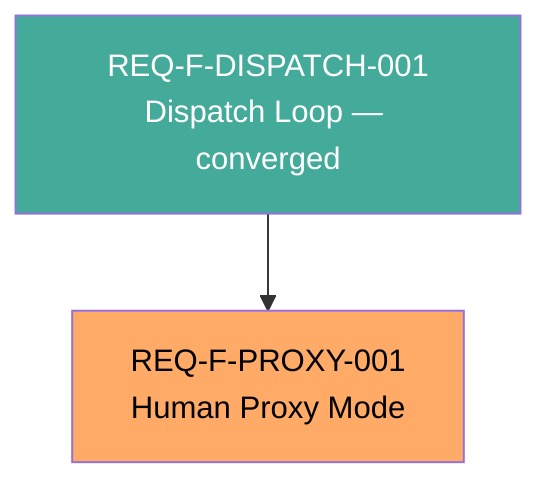

# Feature Decomposition — REQ-F-PROXY-001: Human Proxy Mode

**Version**: 0.1.0
**Date**: 2026-03-13
**Status**: Candidate — awaiting human approval
**Traces To**: INT-AISDLC-001
**Source**: Derived from specification/requirements/REQ-F-PROXY-001-requirements.md (v0.1.0)
**Parent Feature**: REQ-F-DISPATCH-001

---

## Overview

Ten REQ keys covering a single behavioural overlay on the existing auto-loop dispatch path. All keys are cohesive — they describe one capability (LLM-as-human-proxy at F_H gates) and its observability/auditability constraints.

**Decomposition result**: One feature vector. No split warranted.

**Rationale for single-vector decision**:
- REQ-F-HPRX-001..005: runtime path (flag → evaluate → log → emit → continue/halt)
- REQ-F-HPRX-006 + REQ-NFR-HPRX-001..002: observability of the same path
- REQ-BR-HPRX-001..002: constraints on the same path

Splitting observability from runtime would create an artificial dependency and increase coordination cost without benefit. The entire capability ships as one unit.

---

## Feature Inventory

One buildable feature derived from the 10 REQ-F-PROXY-001 keys.

---

### Feature: REQ-F-PROXY-001 — Human Proxy Mode

**Satisfies**: REQ-F-HPRX-001, REQ-F-HPRX-002, REQ-F-HPRX-003, REQ-F-HPRX-004, REQ-F-HPRX-005, REQ-F-HPRX-006, REQ-NFR-HPRX-001, REQ-NFR-HPRX-002, REQ-BR-HPRX-001, REQ-BR-HPRX-002

**What converges**:
- `/gen-start --auto --human-proxy` activates proxy mode; `--human-proxy` alone emits an error
- `[proxy mode active]` label visible in terminal output per loop iteration
- At each F_H gate, the LLM evaluates the artifact against every F_H criterion and records a structured decision (approved/rejected) with evidence cited per criterion
- One `.md` log file per proxy decision written to `.ai-workspace/reviews/proxy-log/{ISO}_{feature}_{edge}.md` before the corresponding `review_approved` event is emitted
- `review_approved` events carry `actor: "human-proxy"` and `proxy_log: "{path}"` fields
- On proxy approval: auto-loop continues as normal
- On proxy rejection: loop halts with feature+edge+criterion report; proxy does not self-correct
- `/gen-status` surfaces proxy decisions pending morning review when proxy-log entries post-date the last attended session
- All F_H checks on all proxy decisions are logged (including any incomplete decisions from interrupted sessions)
- `actor` field on all `review_approved` events is always present and always either `"human"` or `"human-proxy"`

**Dependencies**:
- REQ-F-DISPATCH-001 (auto-loop infrastructure — converged)
- `gen-start.md` (auto-loop command — existing, to be modified)
- `gen-iterate.md` (iterate command — existing, to be modified)
- `gen-status.md` (status command — existing, to be modified)
- `.ai-workspace/events/events.jsonl` (event stream — existing, append-only)

**MVP**: Yes — this is the entire capability. No sub-features.

**Build approach**:
1. Extend `gen-start.md` and `gen-iterate.md` to accept `--human-proxy` flag (REQ-F-HPRX-001)
2. Add proxy evaluation logic at F_H gate branches (REQ-F-HPRX-002)
3. Add proxy-log directory creation + file write (REQ-F-HPRX-003, REQ-NFR-HPRX-001)
4. Extend `review_approved` event schema with `actor` + `proxy_log` fields (REQ-F-HPRX-004, REQ-NFR-HPRX-002)
5. Add loop continuation/halt branching on proxy decision (REQ-F-HPRX-005, REQ-BR-HPRX-001)
6. Add morning review section to `gen-status.md` (REQ-F-HPRX-006)
7. Enforce opt-in-only invariant (REQ-BR-HPRX-002)

---

## REQ Key Coverage

All 10 REQ-F-PROXY-001 keys assigned to exactly one feature:

| REQ Key | Feature Vector | Domain |
|---------|----------------|--------|
| REQ-F-HPRX-001 | REQ-F-PROXY-001 | Flag / activation |
| REQ-F-HPRX-002 | REQ-F-PROXY-001 | Evaluation |
| REQ-F-HPRX-003 | REQ-F-PROXY-001 | Logging |
| REQ-F-HPRX-004 | REQ-F-PROXY-001 | Event emission |
| REQ-F-HPRX-005 | REQ-F-PROXY-001 | Loop control |
| REQ-F-HPRX-006 | REQ-F-PROXY-001 | Morning review / visibility |
| REQ-NFR-HPRX-001 | REQ-F-PROXY-001 | Log completeness |
| REQ-NFR-HPRX-002 | REQ-F-PROXY-001 | Identity traceability |
| REQ-BR-HPRX-001 | REQ-F-PROXY-001 | No self-correction |
| REQ-BR-HPRX-002 | REQ-F-PROXY-001 | Opt-in only |

**Coverage**: 10/10 REQ keys assigned. No gaps. No duplicates.

---

## Dependency Graph

Green = converged. Orange = this feature (to build).

---

## Build Order

Single feature — no ordering decisions required.

| Level | Feature | Depends On |
|-------|---------|-----------|
| 1 | REQ-F-PROXY-001 Human Proxy Mode | REQ-F-DISPATCH-001 (converged) |

---

## Risk Assessment

| Risk | Mitigation |
|------|-----------|
| Proxy evaluation quality (ASS-001): LLM may produce unreliable F_H evaluations | Log all decisions with evidence citations; morning review is the human safety net |
| Vague F_H criteria (ASS-002): edge checklists may have imprecise criteria | No fix at this stage; quality of proxy decisions bounded by quality of edge configs |
| Backward compatibility: existing `review_approved` events lack `actor` field | REQ-NFR-HPRX-002 defines backward compat: treat absent `actor` as `"human"` |
| Self-correction incentive: proxy might rationalise a second attempt | REQ-BR-HPRX-001 and REQ-F-HPRX-005 are explicit; implementation must track rejected feature+edge pairs per session |
